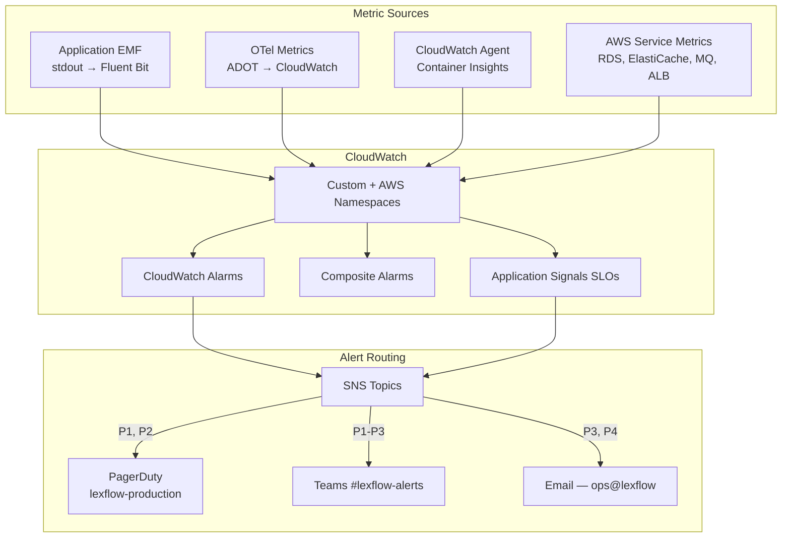
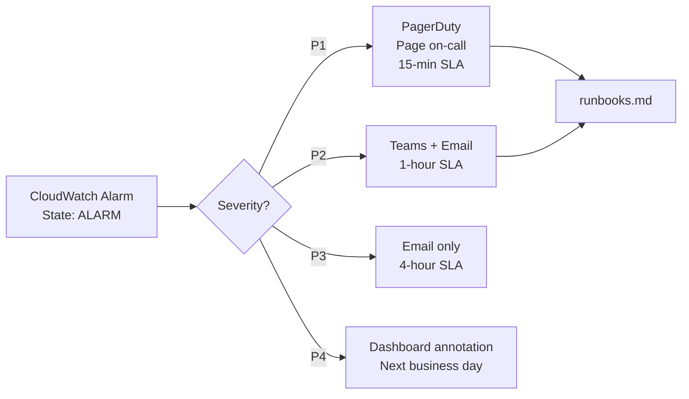
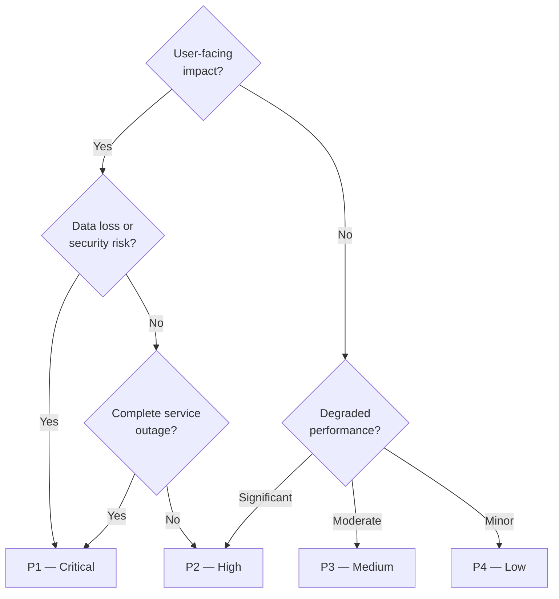
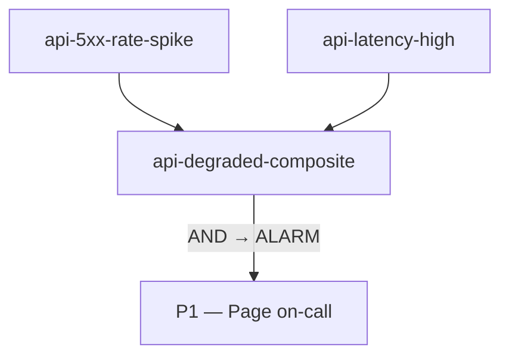
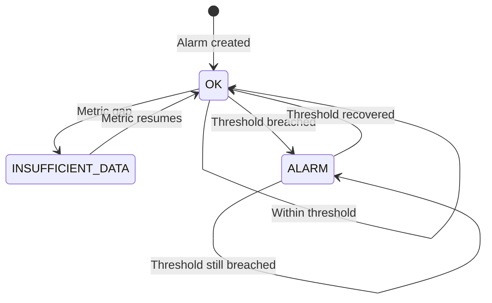

# Metrics & Alerting

**LexFlow AI** — CloudWatch Metrics, Alarms & Severity Model  
**Version:** 1.0  
**Status:** Draft — Pre-Implementation  
**Last Updated:** 2026-07-06

---

## Purpose

Define the **metrics collection and alerting strategy** for LexFlow AI. Application services export custom metrics via CloudWatch EMF (Embedded Metric Format) and OpenTelemetry; infrastructure metrics come from AWS service integrations. CloudWatch Alarms route to PagerDuty and Microsoft Teams based on a **P1–P4 severity model** with defined response SLAs.

Every alert has a corresponding runbook in [runbooks.md](./runbooks.md). No alarm ships to production without an owner, a severity classification, and a tested notification path.

---

## Scope

| In Scope | Out of Scope |
|----------|--------------|
| Application metric catalog (counters, histograms, gauges) | Prometheus/Grafana setup |
| Infrastructure metric sources (ECS, RDS, Redis, MQ, ALB) | CloudWatch alarm Terraform HCL |
| P1–P4 severity model and response SLAs | PagerDuty schedule management |
| CloudWatch alarm definitions and thresholds | Cost allocation for metrics |
| SLO-based burn rate alerts | Business intelligence reporting |
| Alert routing (PagerDuty, Teams, Email) | |

---

## Responsibilities

| Role | Responsibility |
|------|----------------|
| **Backend Engineer** | Emit application metrics via EMF; define metric labels |
| **DevOps / SRE** | Provision CloudWatch alarms, SNS topics, PagerDuty integration |
| **On-Call SRE** | Respond to alerts per severity SLA; execute runbooks |
| **Solution Architect** | Approve SLO targets and alert threshold changes |
| **Security Team** | Own security-specific alert rules and dashboard |

---

## Architecture

### Metrics Pipeline



### Alert Severity Routing



---

## Severity Model

### P1 — Critical

| Attribute | Value |
|-----------|-------|
| **Response SLA** | 15 minutes |
| **Notification** | PagerDuty page + Teams + Email |
| **Escalation** | Auto-escalate to Security Architect if unresolved in 30 min |
| **Examples** | API down, database unreachable, 5xx rate > 5%, auth system failure |

### P2 — High

| Attribute | Value |
|-----------|-------|
| **Response SLA** | 1 hour |
| **Notification** | Teams + Email |
| **Escalation** | Auto-escalate to P1 if unresolved in 4 hours |
| **Examples** | DLQ depth > 0, workflow failure rate > 10%, AI budget 80% consumed |

### P3 — Medium

| Attribute | Value |
|-----------|-------|
| **Response SLA** | 4 hours |
| **Notification** | Email |
| **Escalation** | Review in next standup if recurring |
| **Examples** | p99 latency > 3s, outbox lag > 30s, certificate expiry < 30 days |

### P4 — Low

| Attribute | Value |
|-----------|-------|
| **Response SLA** | Next business day |
| **Notification** | Dashboard annotation only |
| **Escalation** | None — tracked in weekly ops review |
| **Examples** | Disk usage trend, non-prod certificate expiry, capacity planning thresholds |

### Severity Decision Matrix



---

## Application Metrics

### HTTP Metrics (API + Web)

| Metric | Type | Labels | Source |
|--------|------|--------|--------|
| `http_requests_total` | Counter | `method`, `path`, `status`, `service` | EMF |
| `http_request_duration_seconds` | Histogram | `method`, `path`, `service` | EMF |
| `http_request_size_bytes` | Histogram | `method`, `path`, `service` | EMF |
| `http_active_requests` | Gauge | `service` | EMF |

**Histogram buckets (seconds):** `0.05, 0.1, 0.25, 0.5, 1.0, 2.5, 5.0, 10.0`

### Workflow Metrics

| Metric | Type | Labels | Source |
|--------|------|--------|--------|
| `workflow_executions_total` | Counter | `workflow_slug`, `status` | EMF |
| `workflow_execution_duration_seconds` | Histogram | `workflow_slug` | EMF |
| `workflow_step_failures_total` | Counter | `workflow_slug`, `step_id` | EMF |
| `n8n_callback_latency_seconds` | Histogram | `workflow_slug` | EMF |

### AI Metrics

| Metric | Type | Labels | Source |
|--------|------|--------|--------|
| `ai_requests_total` | Counter | `provider`, `model`, `summary_type`, `status` | EMF |
| `ai_tokens_total` | Counter | `provider`, `model`, `direction` | EMF |
| `ai_request_duration_seconds` | Histogram | `provider`, `model` | EMF |
| `ai_cost_usd_total` | Counter | `provider`, `firm_id` | EMF |
| `ai_budget_utilization_ratio` | Gauge | `firm_id` | EMF |

### Queue & Async Metrics

| Metric | Type | Labels | Source |
|--------|------|--------|--------|
| `queue_depth` | Gauge | `queue_name` | CW Agent / RabbitMQ plugin |
| `queue_messages_published_total` | Counter | `queue_name` | EMF |
| `queue_messages_consumed_total` | Counter | `queue_name` | EMF |
| `dlq_depth` | Gauge | `queue_name` | RabbitMQ plugin |
| `celery_task_duration_seconds` | Histogram | `task_name` | EMF |
| `celery_task_failures_total` | Counter | `task_name` | EMF |
| `outbox_pending_events` | Gauge | — | EMF |
| `outbox_publish_lag_seconds` | Gauge | — | EMF |

### Business Metrics

| Metric | Type | Labels | Source |
|--------|------|--------|--------|
| `cases_created_total` | Counter | `firm_id`, `practice_area` | EMF |
| `documents_uploaded_total` | Counter | `firm_id`, `document_type` | EMF |
| `active_users` | Gauge | `firm_id` | EMF |
| `matter_wall_denials_total` | Counter | `firm_id` | EMF |
| `auth_failures_total` | Counter | `reason` | EMF |
| `rate_limit_hits_total` | Counter | `firm_id`, `endpoint` | EMF |

### EMF Log Format Example

```json
{
  "_aws": {
    "Timestamp": 1720252800123,
    "CloudWatchMetrics": [{
      "Namespace": "LexFlow/Application",
      "Dimensions": [["service", "method", "path"]],
      "Metrics": [
        { "Name": "http_requests_total", "Unit": "Count" },
        { "Name": "http_request_duration_seconds", "Unit": "Seconds" }
      ]
    }]
  },
  "service": "api",
  "method": "POST",
  "path": "/api/v1/cases/{caseId}/workflows/trigger",
  "http_requests_total": 1,
  "http_request_duration_seconds": 0.045
}
```

---

## Infrastructure Metrics

### ECS Fargate (Container Insights)

| Metric | Namespace | Alert Threshold |
|--------|-----------|-----------------|
| `CpuUtilized` | ECS/ContainerInsights | > 80% for 5 min → P3 |
| `MemoryUtilized` | ECS/ContainerInsights | > 85% for 5 min → P3 |
| `RunningTaskCount` | ECS/ContainerInsights | < min desired for 2 min → P1 |
| `DeploymentFailed` | ECS/ContainerInsights | Any → P2 |

### RDS PostgreSQL

| Metric | Namespace | Alert Threshold |
|--------|-----------|-----------------|
| `CPUUtilization` | AWS/RDS | > 80% for 10 min → P3 |
| `DatabaseConnections` | AWS/RDS | > 80% of max_connections → P2 |
| `FreeStorageSpace` | AWS/RDS | < 20% of allocated → P2 |
| `ReadLatency` / `WriteLatency` | AWS/RDS | p99 > 50ms for 10 min → P3 |
| `ReplicaLag` | AWS/RDS | > 30 seconds → P2 |

### ElastiCache Redis

| Metric | Namespace | Alert Threshold |
|--------|-----------|-----------------|
| `CPUUtilization` | AWS/ElastiCache | > 80% for 10 min → P3 |
| `DatabaseMemoryUsagePercentage` | AWS/ElastiCache | > 80% → P2 |
| `Evictions` | AWS/ElastiCache | > 100/min → P3 |
| `CurrConnections` | AWS/ElastiCache | > 80% of max → P3 |

### Amazon MQ (RabbitMQ)

| Metric | Namespace | Alert Threshold |
|--------|-----------|-----------------|
| `QueueDepth` | AWS/AmazonMQ | > 1,000 messages for 5 min → P2 |
| `ConsumerCount` | AWS/AmazonMQ | 0 consumers on active queue → P1 |
| `PublishRate` | AWS/AmazonMQ | Drop to 0 for 10 min (during business hours) → P2 |
| `NetworkOut` | AWS/AmazonMQ | Broker unreachable → P1 |

### Application Load Balancer

| Metric | Namespace | Alert Threshold |
|--------|-----------|-----------------|
| `HTTPCode_Target_5XX_Count` | AWS/ApplicationELB | > 10 in 5 min → P1 |
| `HTTPCode_ELB_5XX_Count` | AWS/ApplicationELB | > 5 in 5 min → P1 |
| `TargetResponseTime` | AWS/ApplicationELB | p99 > 2s for 10 min → P3 |
| `UnHealthyHostCount` | AWS/ApplicationELB | > 0 for 2 min → P1 |
| `RejectedConnectionCount` | AWS/ApplicationELB | > 0 → P2 |

---

## Alert Rules Catalog

### P1 — Critical Alerts

| Alert Name | Condition | Evaluation | Runbook |
|------------|-----------|------------|---------|
| `api-health-check-failing` | `/health` returns non-200 | 2 consecutive failures (1 min) | [runbooks.md § API Down](./runbooks.md#api-down) |
| `database-connection-failure` | `database_connection_errors` > 5 | 1 min | [runbooks.md § Database Unreachable](./runbooks.md#database-unreachable) |
| `api-5xx-rate-spike` | 5xx / total > 5% | 5 min | [runbooks.md § Error Rate Spike](./runbooks.md#error-rate-spike) |
| `alb-unhealthy-targets` | `UnHealthyHostCount` > 0 | 2 min | [runbooks.md § API Down](./runbooks.md#api-down) |
| `mq-no-consumers` | `ConsumerCount` = 0 on active queues | 2 min | [runbooks.md § Queue Consumer Failure](./runbooks.md#queue-consumer-failure) |
| `ecs-zero-running-tasks` | `RunningTaskCount` = 0 for api/worker | 2 min | [runbooks.md § Service Task Failure](./runbooks.md#service-task-failure) |
| `auth-system-failure` | `auth_failures_total` spike + JWT validation errors | 5 min | [runbooks.md § Auth Failure](./runbooks.md#auth-system-failure) |
| `slo-availability-burn-rate` | Availability SLO burn rate > 10x | 1 hour window | [runbooks.md § Error Rate Spike](./runbooks.md#error-rate-spike) |

### P2 — High Alerts

| Alert Name | Condition | Evaluation | Runbook |
|------------|-----------|------------|---------|
| `dlq-messages-present` | `dlq_depth` > 0 | 1 min | [runbooks.md § DLQ Messages](./runbooks.md#dlq-messages) |
| `workflow-failure-rate` | Failed / total > 10% | 15 min | [runbooks.md § Workflow Failures](./runbooks.md#workflow-failure-rate) |
| `ai-budget-threshold` | `ai_budget_utilization_ratio` > 0.8 | 1 hour | [runbooks.md § AI Budget](./runbooks.md#ai-budget-threshold) |
| `rds-storage-low` | `FreeStorageSpace` < 20% | 15 min | [runbooks.md § Disk Space](./runbooks.md#disk-space-low) |
| `rds-connection-pool-high` | Connections > 80% max | 10 min | [runbooks.md § DB Connections](./runbooks.md#database-connections-high) |
| `mq-queue-depth-high` | `QueueDepth` > 1,000 | 5 min | [runbooks.md § Queue Depth](./runbooks.md#queue-depth-high) |
| `redis-memory-high` | `DatabaseMemoryUsagePercentage` > 80% | 10 min | [runbooks.md § Redis Memory](./runbooks.md#redis-memory-high) |
| `ecs-deployment-failed` | Deployment circuit breaker triggered | Immediate | [runbooks.md § Deploy Failure](./runbooks.md#deployment-failure) |
| `outbox-publish-failures` | `outbox_publish_failures_total` > 0 | 5 min | [runbooks.md § Outbox Failure](./runbooks.md#outbox-publish-failure) |

### P3 — Medium Alerts

| Alert Name | Condition | Evaluation | Runbook |
|------------|-----------|------------|---------|
| `api-latency-high` | p99 `http_request_duration_seconds` > 3s | 10 min | [runbooks.md § High Latency](./runbooks.md#high-latency) |
| `outbox-lag` | `outbox_publish_lag_seconds` > 30 | 5 min | [runbooks.md § Outbox Lag](./runbooks.md#outbox-lag) |
| `rds-cpu-high` | `CPUUtilization` > 80% | 10 min | [runbooks.md § RDS CPU](./runbooks.md#rds-cpu-high) |
| `redis-evictions` | `Evictions` > 100/min | 10 min | [runbooks.md § Redis Evictions](./runbooks.md#redis-evictions) |
| `certificate-expiry-30d` | SSL cert expires in < 30 days | Daily check | [runbooks.md § Certificate Expiry](./runbooks.md#certificate-expiry) |
| `celery-task-slow` | p95 `celery_task_duration_seconds` > 60s | 15 min | [runbooks.md § Slow Workers](./runbooks.md#slow-worker-tasks) |
| `ai-latency-high` | p95 `ai_request_duration_seconds` > 30s | 15 min | [runbooks.md § AI Latency](./runbooks.md#ai-latency-high) |

### P4 — Low Alerts

| Alert Name | Condition | Evaluation | Runbook |
|------------|-----------|------------|---------|
| `rds-storage-trend` | Storage growth > 5%/week | Weekly | [runbooks.md § Capacity Planning](./runbooks.md#capacity-planning) |
| `ecs-scale-ceiling` | Running tasks at max for 1 hour | 1 hour | [runbooks.md § Capacity Planning](./runbooks.md#capacity-planning) |
| `nonprod-cert-expiry` | Staging/dev cert < 60 days | Weekly | Dashboard annotation |
| `log-volume-spike` | Ingestion > 2x baseline | 1 hour | Review in weekly ops |

---

## Composite Alarms

Composite alarms combine multiple conditions to reduce false positives.

| Composite Name | Logic | Severity | Purpose |
|----------------|-------|----------|---------|
| `api-degraded-composite` | `api-5xx-rate-spike` AND `api-latency-high` | P1 | Confirmed user-facing degradation |
| `database-stress-composite` | `rds-cpu-high` AND `rds-connection-pool-high` | P2 | DB under sustained pressure |
| `async-pipeline-stuck` | `mq-queue-depth-high` AND `celery-task-slow` | P2 | Processing pipeline bottleneck |
| `ai-pipeline-failing` | `ai-latency-high` AND `workflow-failure-rate` | P2 | AI-related workflow degradation |



---

## SLO Burn Rate Alerts

Application Signals SLOs trigger burn rate alarms when error budget consumption accelerates.

| SLO | Target | Burn Rate Window | Alert Severity |
|-----|--------|-----------------|----------------|
| API availability | 99.9% (30-day) | 1-hour burn rate > 10x | P1 |
| API availability | 99.9% (30-day) | 6-hour burn rate > 5x | P2 |
| API latency p95 | < 300ms (7-day) | 1-hour burn rate > 5x | P3 |
| Workflow success | 99% (7-day) | 1-hour burn rate > 5x | P2 |

### Error Budget Calculation

```
Monthly error budget = (1 - SLO target) × total requests
                     = 0.001 × ~10M requests
                     = ~10,000 failed requests/month allowed

Burn rate = current error rate / allowed error rate
```

---

## Notification Configuration

### SNS Topic Structure

| Topic | Subscribers | Alarms |
|-------|-------------|--------|
| `lexflow-alerts-p1` | PagerDuty, Teams, Email | All P1 alarms |
| `lexflow-alerts-p2` | Teams, Email | All P2 alarms |
| `lexflow-alerts-p3` | Email | All P3 alarms |
| `lexflow-alerts-security` | PagerDuty (security service), Teams | Security-specific alarms |

### PagerDuty Integration

| Service | Escalation Policy | On-Call Rotation |
|---------|-------------------|------------------|
| `lexflow-production` | Primary SRE → Lead SRE → Engineering Manager | Weekly rotation |
| `lexflow-security` | Security Architect → CISO | Business hours + on-call |

### Alert Message Format

```
[P1] lexflow-production: api-5xx-rate-spike
State: ALARM
Reason: Threshold Crossed: 5xx rate 7.2% > 5% for 5 minutes
Metric: http_requests_total{status=5xx} / http_requests_total
Runbook: https://docs.lexflow.internal/11-observability/runbooks#error-rate-spike
Dashboard: https://cloudwatch.aws.amazon.com/lexflow-operational
```

---

## Alarm Lifecycle



### Alarm Testing

| Test | Frequency | Environment | Method |
|------|-----------|-------------|--------|
| PagerDuty routing | Monthly | Staging | Synthetic alarm via CLI |
| Teams webhook | Monthly | Staging | Test SNS publish |
| Threshold validation | Per deploy | Staging | Load test to trigger P3 |
| Runbook walkthrough | Quarterly | Production (read-only) | Tabletop exercise |

---

## Best Practices

1. **Every alarm has a runbook** — No exceptions; link in alarm description.
2. **Prefer composite alarms** — Reduce alert fatigue from correlated signals.
3. **Set `TreatMissingData: notBreaching`** — Avoid false alarms during metric gaps (except P1 health checks).
4. **Use anomaly detection for baselines** — Queue depth and request rate use anomaly bands where static thresholds fail.
5. **Review alert noise monthly** — Alarms firing > 3x/week without action get reclassified or removed.
6. **Tag alarms with severity** — `Severity=P1` tag for routing automation.
7. **Document threshold changes** — PR must update this file when alarm thresholds change.

---

## Tradeoffs

| Decision | Benefit | Cost |
|----------|---------|------|
| CloudWatch-native (no Prometheus) | Single AWS stack, IAM integration | Less flexible query language than PromQL |
| EMF via stdout | No separate metrics agent in app | Slightly larger log volume |
| Composite alarms | Fewer false-positive pages | More complex alarm definitions |
| 10% trace sampling vs metric-based alerts | Metrics catch issues traces miss | Two systems to monitor |
| Static thresholds for P1 | Predictable, well-understood | May need tuning after launch — anomaly detection for P3/P4 |

---

## References

| Document | Description |
|----------|-------------|
| [README.md](./README.md) | Observability folder index |
| [runbooks.md](./runbooks.md) | Alert response procedures |
| [dashboards.md](./dashboards.md) | Dashboard specifications linked from alarms |
| [distributed-tracing.md](./distributed-tracing.md) | SLO definitions, Application Signals |
| [../03-architecture/nfr-requirements.md](../03-architecture/nfr-requirements.md) | Availability 99.9%, latency budgets |
| [../03-architecture/cross-cutting-concerns.md](../03-architecture/cross-cutting-concerns.md) | Retry, DLQ, outbox metrics sources |
| [../09-deployment/](../09-deployment/) | Terraform monitoring module (planned) |
| [../deployment-architecture.md](../deployment-architecture.md) | ECS scaling triggers |
| [../14-playbooks/incident-triage.md](../14-playbooks/incident-triage.md) | Multi-team incident escalation (planned) |
| [../08-security/incident-response.md](../08-security/incident-response.md) | Security alert escalation |
