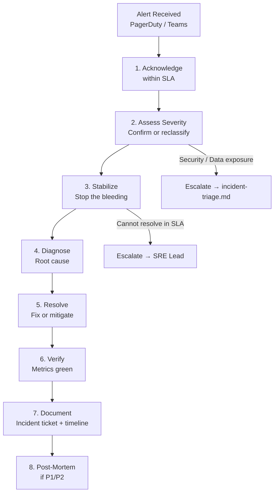
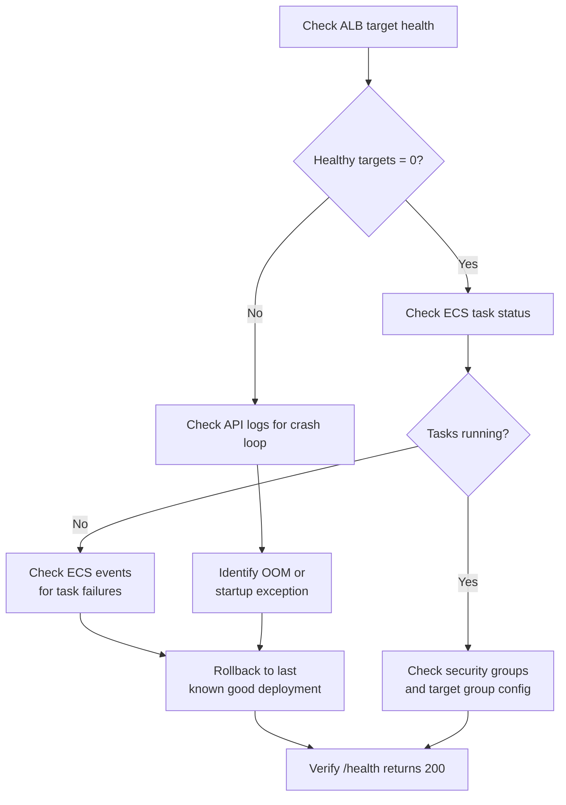
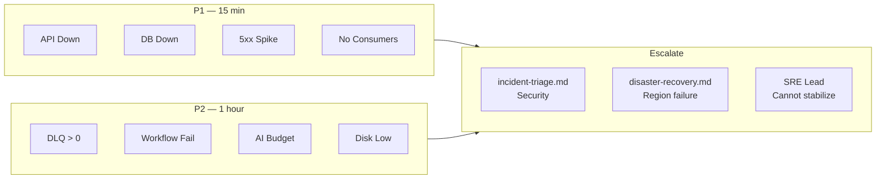

# Runbooks

**LexFlow AI** — Alert Response Procedures  
**Version:** 1.0  
**Status:** Draft — Pre-Implementation  
**Last Updated:** 2026-07-06

---

## Purpose

Define **step-by-step alert response procedures** for on-call SRE engineers. Every CloudWatch alarm in [metrics-alerting.md](./metrics-alerting.md) maps to a runbook section here. Runbooks prioritize **stabilize → diagnose → resolve → document** and include escalation paths to [../14-playbooks/incident-triage.md](../14-playbooks/incident-triage.md) for security events and [../08-security/incident-response.md](../08-security/incident-response.md) for data breach scenarios.

---

## Scope

| In Scope | Out of Scope |
|----------|--------------|
| Operational alert response (P1–P4) | Security incident legal notification |
| Diagnostic commands and dashboard links | Application code fixes |
| Escalation criteria and contacts | Disaster recovery full region failover (see [../disaster-recovery.md](../disaster-recovery.md)) |
| Post-incident documentation requirements | Tabletop exercise scripts |

---

## Responsibilities

| Role | Runbook Responsibility |
|------|----------------------|
| **On-Call SRE** | Execute runbooks for P1/P2; stabilize service |
| **Backend Engineer** | Application-level diagnosis and hotfix (escalated from SRE) |
| **Security Architect** | Security-related alerts; incident commander for P1 security |
| **DevOps / SRE Lead** | Infrastructure remediation; approve production changes during incident |
| **Compliance Officer** | Assess data exposure; regulatory notification decisions |

---

## General Response Protocol

### Response Flow



### Severity Response SLAs

| Severity | Acknowledge | Stabilize | Resolve Target | Escalate If Unresolved |
|----------|-------------|-----------|----------------|----------------------|
| **P1** | 15 min | 30 min | 2 hours | 30 min → Security Architect (if data); 1 hour → SRE Lead |
| **P2** | 1 hour | 2 hours | 8 hours | 4 hours → P1 |
| **P3** | 4 hours | Next business day | 3 business days | Recurring → P2 |
| **P4** | Next business day | — | 1 week | — |

### First Steps (All Alerts)

1. **Acknowledge** the PagerDuty alert or Teams notification.
2. Open the **[Operational Dashboard](../dashboards.md)** — confirm the alert condition visually.
3. Check **recent deployments** — was there a deploy in the last 2 hours? (See [../09-deployment/](../09-deployment/)).
4. Check **CloudWatch Logs Insights** — filter by time range and affected service.
5. Note the **correlationId** or **traceId** from the first error log for investigation.
6. Post status update in **#lexflow-incidents** Slack channel.

### Escalation Matrix

| Condition | Escalate To | Contact Method |
|-----------|-------------|----------------|
| Data exposure suspected | Security Architect + [incident-triage.md](../14-playbooks/incident-triage.md) | PagerDuty `lexflow-security` |
| Privileged data in logs | Security Architect + Compliance Officer | PagerDuty + direct call |
| Cannot stabilize in SLA | SRE Lead → Engineering Manager | PagerDuty escalation |
| Database corruption | SRE Lead + Backend Engineer | PagerDuty + Teams |
| Multi-service outage | Incident Commander (SRE Lead) | `#lexflow-incidents` war room |
| External vendor outage (LLM, M365) | Integration Engineer | Teams |

---

## P1 — Critical Runbooks

### API Down

**Alarm:** `api-health-check-failing`, `alb-unhealthy-targets`, `ecs-zero-running-tasks`  
**Severity:** P1  
**Dashboard:** [Operational → Row 1](./dashboards.md#row-1--service-health)

#### Symptoms

- Health check endpoint `/health` returns non-200 or times out.
- ALB reports zero healthy targets for `api` service.
- Users report complete application unavailability.

#### Stabilization Steps



| Step | Action | Command / Location |
|------|--------|-------------------|
| 1 | Check ALB target health | AWS Console → EC2 → Target Groups → `lexflow-api-tg` |
| 2 | Check ECS service events | AWS Console → ECS → `lexflow-api` → Events tab |
| 3 | Check recent deployments | ECS → Deployments → last 3 deployments |
| 4 | Check API container logs | CloudWatch Logs → `/lexflow/production/api` → filter `level = 'CRITICAL'` |
| 5 | If crash loop from bad deploy | Rollback: `aws ecs update-service --force-new-deployment` with previous task definition |
| 6 | If OOM kill | Scale up memory in task definition (temporary); investigate memory leak post-incident |
| 7 | If dependency failure (DB/Redis) | See [Database Unreachable](#database-unreachable) or [Redis Memory High](#redis-memory-high) |

#### Verification

- [ ] `/health` returns `200` with `{"status": "healthy"}` for 5 consecutive checks.
- [ ] ALB healthy target count = desired task count.
- [ ] Error rate < 1% for 10 minutes.
- [ ] Post all-clear in `#lexflow-incidents`.

---

### Database Unreachable

**Alarm:** `database-connection-failure`  
**Severity:** P1  
**Dashboard:** [Operational → Row 3](./dashboards.md#row-3--infrastructure)

#### Symptoms

- API and worker logs show `database_connection_errors` or `CRITICAL: PostgreSQL connection pool exhausted`.
- All database-dependent endpoints return 503.

#### Stabilization Steps

| Step | Action | Command / Location |
|------|--------|-------------------|
| 1 | Check RDS instance status | AWS Console → RDS → `lexflow-prod` → Status |
| 2 | Check RDS events | RDS → Events → look for failover, maintenance, storage full |
| 3 | Check connection count | CloudWatch → `AWS/RDS DatabaseConnections` vs `max_connections` |
| 4 | If Multi-AZ failover in progress | Wait 60–120 seconds; connections auto-retry via PgBouncer |
| 5 | If storage full | Emergency storage increase: modify RDS instance → increase allocated storage |
| 6 | If connection exhaustion | Identify connection leak: CloudWatch Logs → `pg_stat_activity` query logs |
| 7 | Mitigate connection storm | Reduce ECS task count temporarily to lower connection demand |

#### Escalation

- RDS instance status = `failed` → SRE Lead + open AWS Support case (Severity: Critical).
- Suspected data corruption → Backend Engineer + do NOT restart RDS without backup verification.

#### Verification

- [ ] `DatabaseConnections` metric stable and < 80% of max.
- [ ] API `/health` includes `database: connected`.
- [ ] No `CRITICAL` database errors in logs for 10 minutes.

---

### Error Rate Spike

**Alarm:** `api-5xx-rate-spike`, `slo-availability-burn-rate`  
**Severity:** P1  
**Dashboard:** [Operational → Row 2](./dashboards.md#row-2--request-traffic)

#### Symptoms

- 5xx error rate exceeds 5% for 5 minutes.
- SLO availability burn rate > 10x.
- Users report intermittent or widespread errors.

#### Stabilization Steps

| Step | Action | Command / Location |
|------|--------|-------------------|
| 1 | Identify error endpoints | CloudWatch Logs Insights: `filter level = 'ERROR' \| stats count() by http.path` |
| 2 | Check for recent deploy | ECS → last deployment timestamp vs alert start time |
| 3 | If deploy-correlated | Rollback to previous task definition (see [API Down](#api-down)) |
| 4 | Check dependency health | RDS, Redis, RabbitMQ, S3 — see individual runbooks |
| 5 | Get sample trace | X-Ray → `lexflow-api-errors` group → identify failing span |
| 6 | Get correlationId | Logs Insights: `filter level = 'ERROR' \| limit 5` → note `correlationId` |
| 7 | If single endpoint | Feature flag disable if available; otherwise route traffic away |

#### Diagnostic Queries

```
# Top error endpoints (last 30 min)
fields @timestamp, http.path, error.code, error.message, correlationId
| filter level = 'ERROR' and service = 'api'
| stats count() as errors by http.path, error.code
| sort errors desc
| limit 10
```

#### Verification

- [ ] 5xx rate < 1% for 15 minutes.
- [ ] SLO burn rate returned to normal.
- [ ] Root cause identified (or ticket created for follow-up).

---

### Queue Consumer Failure

**Alarm:** `mq-no-consumers`  
**Severity:** P1  
**Dashboard:** [Operational → Row 4](./dashboards.md#row-4--async-pipeline)

#### Symptoms

- RabbitMQ reports zero consumers on active queues.
- Queue depth growing monotonically.
- Async operations (document processing, workflows, AI) not completing.

#### Stabilization Steps

| Step | Action | Command / Location |
|------|--------|-------------------|
| 1 | Check worker ECS service | ECS → `lexflow-worker` → Running task count |
| 2 | Check worker logs | CloudWatch Logs → `/lexflow/production/worker` → `CRITICAL` or startup errors |
| 3 | Check RabbitMQ broker health | Amazon MQ → Brokers → `lexflow-mq` → Status |
| 4 | If worker tasks = 0 | Check ECS events for task failures; redeploy worker service |
| 5 | If worker running but no consumers | Check Celery connection config; verify RabbitMQ credentials in Secrets Manager |
| 6 | If broker unreachable | Check security groups; verify Amazon MQ instance status |
| 7 | Emergency scale | Force new deployment of worker service; scale to max tasks |

#### Verification

- [ ] Consumer count > 0 on all active queues.
- [ ] Queue depth decreasing or stable.
- [ ] Celery task processing resumes (check `celery_task` log entries).

---

### Service Task Failure

**Alarm:** `ecs-zero-running-tasks`  
**Severity:** P1  
**Dashboard:** [Operational → Row 1](./dashboards.md#row-1--service-health)

#### Symptoms

- ECS service reports zero running tasks for `api`, `worker`, or `web`.
- Service unable to maintain minimum desired count.

#### Stabilization Steps

| Step | Action | Command / Location |
|------|--------|-------------------|
| 1 | Identify affected service | Alert description specifies service name |
| 2 | Check ECS service events | Look for: OOM, image pull failure, health check failure, capacity |
| 3 | Check ECR image availability | ECR → repository → verify latest image tag exists |
| 4 | Check task definition | Verify CPU/memory limits, environment variables, secrets references |
| 5 | If image pull failure | Verify ECR permissions; check if image was deleted |
| 6 | If OOM | Increase memory limit; redeploy |
| 7 | Force redeploy | `aws ecs update-service --cluster lexflow --service {name} --force-new-deployment` |
| 8 | If persistent failure | Rollback to previous task definition revision |

#### Verification

- [ ] Running task count ≥ minimum desired count.
- [ ] No task failures in ECS events for 10 minutes.
- [ ] Service health checks passing.

---

### Auth System Failure

**Alarm:** `auth-system-failure`  
**Severity:** P1  
**Dashboard:** [Security → Row 2](./dashboards.md#row-2--authentication)

#### Symptoms

- Spike in `auth_failures_total` with JWT validation errors.
- All authenticated endpoints returning 401.
- Users unable to log in.

#### Stabilization Steps

| Step | Action | Command / Location |
|------|--------|-------------------|
| 1 | Check JWT signing key | Secrets Manager → `lexflow/jwt/signing-key` → verify not rotated unexpectedly |
| 2 | Check Redis (session store) | ElastiCache → verify Redis reachable; check connection errors in API logs |
| 3 | Check for clock skew | Verify ECS task NTP sync; JWT `exp` validation sensitive to time |
| 4 | Check recent deploy | Auth middleware changes in recent deployment? |
| 5 | If key rotation issue | Revert to previous signing key version in Secrets Manager |
| 6 | If Redis down | API degrades to stateless JWT validation; restore Redis (see [Redis Memory High](#redis-memory-high)) |

#### Security Escalation

If auth failures correlate with unusual IP addresses or brute-force patterns → escalate to [incident-triage.md](../14-playbooks/incident-triage.md).

#### Verification

- [ ] Login flow succeeds (test with service account).
- [ ] `auth_failures_total` rate returned to baseline.
- [ ] Token refresh working.

---

## P2 — High Runbooks

### DLQ Messages

**Alarm:** `dlq-messages-present`  
**Severity:** P2  
**Dashboard:** [Operational → Row 4](./dashboards.md#row-4--async-pipeline)

#### Symptoms

- Dead letter queue depth > 0.
- Failed messages that exhausted all retry attempts.

#### Response Steps

| Step | Action | Details |
|------|--------|---------|
| 1 | Identify source queue | Check which DLQ has messages: `document.processing.dlq`, `workflow.trigger.dlq`, `ai.inference.dlq` |
| 2 | Inspect DLQ messages | RabbitMQ Management UI → DLQ → Get messages (without ack) → note `event.type`, `correlationId` |
| 3 | Find original error | CloudWatch Logs → filter by `correlationId` from DLQ message → find `ERROR` entries |
| 4 | Classify failure | Transient (retry safe) vs permanent (data/logic issue) |
| 5 | If transient (e.g., S3 timeout during outage) | Requeue messages: move from DLQ back to source queue via management UI |
| 6 | If permanent (e.g., invalid payload) | Do NOT requeue; create bug ticket with `correlationId` and message payload (redacted) |
| 7 | Monitor requeued messages | Watch source queue depth and processing rate |

#### Verification

- [ ] DLQ depth = 0 (or messages acknowledged and ticketed).
- [ ] Requeued messages processed successfully.
- [ ] Root cause documented in incident ticket.

---

### Workflow Failure Rate

**Alarm:** `workflow-failure-rate`  
**Severity:** P2  
**Dashboard:** [Operational → Row 5](./dashboards.md#row-5--workflow--ai)

#### Symptoms

- Workflow execution failure rate > 10% over 15 minutes.
- Users report automation not completing.

#### Response Steps

| Step | Action | Details |
|------|--------|---------|
| 1 | Identify failing workflows | CloudWatch → `workflow_executions_total{status=failed}` by `workflow_slug` |
| 2 | Check n8n health | n8n health endpoint; ECS service status for `lexflow-n8n` |
| 3 | Check n8n logs | `/lexflow/production/n8n` → filter `workflow.status = 'failed'` |
| 4 | Check external dependencies | M365, court APIs, billing — are external systems down? |
| 5 | Get trace | X-Ray → `lexflow-workflow` group → identify failing step |
| 6 | If n8n down | See [Service Task Failure](#service-task-failure) for n8n service |
| 7 | If external API down | Enable circuit breaker; notify affected firms via status page |
| 8 | If n8n workflow bug | Disable workflow via feature flag; escalate to Integration Engineer |

#### Verification

- [ ] Workflow success rate > 95% for 30 minutes.
- [ ] Failing workflow identified and ticketed or disabled.

---

### AI Budget Threshold

**Alarm:** `ai-budget-threshold`  
**Severity:** P2  
**Dashboard:** [Business → Row 4](./dashboards.md#row-4--ai-usage--cost)

#### Symptoms

- Firm AI budget utilization exceeds 80% of monthly allocation.
- Risk of AI feature shutdown before month end.

#### Response Steps

| Step | Action | Details |
|------|--------|---------|
| 1 | Identify firm | Alert includes `firm_id` label |
| 2 | Check usage breakdown | Business dashboard → filter by `firmId` → AI token usage by model |
| 3 | Check for anomalous usage | Unusual spike vs historical baseline? Possible runaway workflow or abuse |
| 4 | Notify firm admin | Email firm IT admin with usage summary and projected month-end cost |
| 5 | If legitimate high usage | No action; monitor for 100% threshold |
| 6 | If anomalous | Check for runaway AI workflow; disable if necessary; investigate with `correlationId` |
| 7 | At 100% | AI endpoints return `402 Payment Required` for firm; firm admin must increase budget |

#### Verification

- [ ] Firm admin notified.
- [ ] Usage trend understood (legitimate vs anomalous).
- [ ] No runaway AI jobs active.

---

### Disk Space Low

**Alarm:** `rds-storage-low`  
**Severity:** P2  
**Dashboard:** [Operational → Row 3](./dashboards.md#row-3--infrastructure)

#### Symptoms

- RDS free storage below 20% of allocated capacity.
- Risk of database write failures.

#### Response Steps

| Step | Action | Details |
|------|--------|---------|
| 1 | Check current usage | RDS → `lexflow-prod` → Storage → Free storage vs allocated |
| 2 | Check growth rate | CloudWatch → `FreeStorageSpace` over 7 days → project days until full |
| 3 | Identify growth source | Check audit log partition size, workflow execution history, document metadata |
| 4 | Immediate mitigation | Increase allocated storage (RDS supports online storage increase) |
| 5 | Check retention jobs | Verify partition pruning and data retention jobs are running (see [../05-database/retention-backup.md](../05-database/retention-backup.md)) |
| 6 | Plan cleanup | If audit/log growth: verify retention policy enforcement |

#### Verification

- [ ] Free storage > 30% after increase.
- [ ] Growth rate documented.
- [ ] Retention jobs verified running.

---

### Database Connections High

**Alarm:** `rds-connection-pool-high`  
**Severity:** P2  
**Dashboard:** [Operational → Row 3](./dashboards.md#row-3--infrastructure)

#### Symptoms

- RDS connection count > 80% of `max_connections`.
- Risk of connection rejection for new requests.

#### Response Steps

| Step | Action | Details |
|------|--------|---------|
| 1 | Check connection count | CloudWatch → `DatabaseConnections` vs max (default: formula-based on instance class) |
| 2 | Check per-service connections | PgBouncer stats or `pg_stat_activity` grouped by `application_name` |
| 3 | Check for connection leak | Growing monotonically without traffic increase? Likely leak in recent deploy |
| 4 | If leak suspected | Rollback recent deploy; compare connection count before/after |
| 5 | If legitimate high traffic | Scale PgBouncer pool; consider RDS read replica for read-heavy queries |
| 6 | Emergency | Reduce ECS task count for API/worker to lower connection demand |

#### Verification

- [ ] Connection count < 70% of max.
- [ ] Connection count stable (not growing unbounded).

---

### Queue Depth High

**Alarm:** `mq-queue-depth-high`  
**Severity:** P2  
**Dashboard:** [Operational → Row 4](./dashboards.md#row-4--async-pipeline)

#### Symptoms

- Queue depth > 1,000 messages for 5 minutes.
- Processing lag increasing.

#### Response Steps

| Step | Action | Details |
|------|--------|---------|
| 1 | Identify queue | Alert specifies `queue_name` |
| 2 | Check consumer count | Amazon MQ → Consumers on affected queue |
| 3 | Check worker throughput | `celery_task` processing rate in logs |
| 4 | Check worker task duration | p95 `celery_task_duration_seconds` — are tasks slow? |
| 5 | If consumers healthy but slow | Scale worker ECS service (increase max tasks) |
| 6 | If consumers missing | See [Queue Consumer Failure](#queue-consumer-failure) |
| 7 | If traffic spike (legitimate) | Scale workers; monitor until depth < 200 |
| 8 | If stuck messages | Check for poison messages blocking queue; inspect head message |

#### Verification

- [ ] Queue depth < 200 and decreasing.
- [ ] Worker throughput matches publish rate.
- [ ] No poison messages identified (or removed to DLQ).

---

### Redis Memory High

**Alarm:** `redis-memory-high`  
**Severity:** P2  
**Dashboard:** [Operational → Row 3](./dashboards.md#row-3--infrastructure)

#### Symptoms

- Redis memory usage > 80%.
- Risk of evictions affecting cache, rate limits, and sessions.

#### Response Steps

| Step | Action | Details |
|------|--------|---------|
| 1 | Check memory usage | ElastiCache → `DatabaseMemoryUsagePercentage` |
| 2 | Check eviction rate | `Evictions` metric — are keys being evicted? |
| 3 | Identify large key patterns | Redis `MEMORY USAGE` on key patterns: `perms:*`, `case:*:summary`, `firm:*:config` |
| 4 | If permission cache bloat | Verify TTL enforcement (5 min); check for cache invalidation failures |
| 5 | If session accumulation | Verify session TTL; check for logout cleanup |
| 6 | Immediate mitigation | Scale up ElastiCache node type (requires maintenance window for cluster) |
| 7 | Application impact | Redis outage degrades to direct DB reads (no availability impact per [cross-cutting-concerns](../03-architecture/cross-cutting-concerns.md)) |

#### Verification

- [ ] Memory usage < 70%.
- [ ] Eviction rate returned to zero or baseline.
- [ ] API and worker functioning normally (cache miss degradation acceptable).

---

### Deployment Failure

**Alarm:** `ecs-deployment-failed`  
**Severity:** P2  
**Dashboard:** [Deployment Dashboard](./dashboards.md#deployment-dashboard)

#### Symptoms

- ECS deployment circuit breaker triggered.
- New task definition failing health checks; automatic rollback may be in progress.

#### Response Steps

| Step | Action | Details |
|------|--------|---------|
| 1 | Check deployment status | ECS → Service → Deployments → FAILED status |
| 2 | Check circuit breaker | Was automatic rollback triggered? |
| 3 | If auto-rollback succeeded | Verify service healthy on previous task definition |
| 4 | If auto-rollback failed | Manual rollback: update service to previous task definition revision |
| 5 | Check failed task logs | CloudWatch Logs → startup errors, OOM, missing env vars |
| 6 | Identify root cause | Image issue, config change, dependency version, migration failure |
| 7 | Block re-deploy | Add hold on CI/CD pipeline until root cause fixed |

#### Verification

- [ ] Service running on known-good task definition.
- [ ] Health checks passing.
- [ ] CI/CD pipeline blocked with ticket reference.

---

### Outbox Publish Failure

**Alarm:** `outbox-publish-failures`  
**Severity:** P2  
**Dashboard:** [Operational → Row 4](./dashboards.md#row-4--async-pipeline)

#### Symptoms

- Outbox publisher reporting failed publish attempts.
- Domain events not reaching RabbitMQ; downstream processing stalled.

#### Response Steps

| Step | Action | Details |
|------|--------|---------|
| 1 | Check outbox publisher logs | `/lexflow/production/outbox` → `ERROR` entries |
| 2 | Check pending event count | `outbox_pending_events` metric |
| 3 | Check RabbitMQ connectivity | Amazon MQ broker status; publisher connection errors |
| 4 | If broker issue | See queue/broker runbooks |
| 5 | If publisher crash | Restart outbox-publisher ECS service |
| 6 | Check for poison events | Inspect `outbox_events` table for events with repeated failures |
| 7 | If poison event | Mark as `status=failed`; create bug ticket; do not block other events |

#### Verification

- [ ] `outbox_pending_events` decreasing.
- [ ] No new publish failures for 15 minutes.
- [ ] Downstream consumers processing events.

---

## P3 — Medium Runbooks

### High Latency

**Alarm:** `api-latency-high`  
**Severity:** P3  
**Dashboard:** [Operational → Row 2](./dashboards.md#row-2--request-traffic)

#### Symptoms

- API p99 response time > 3 seconds for 10 minutes.
- Users report slow page loads.

#### Response Steps

| Step | Action | Details |
|------|--------|---------|
| 1 | Identify slow endpoints | Logs Insights: `filter duration_ms > 3000 \| stats avg(duration_ms) by http.path` |
| 2 | Check infrastructure | RDS CPU/latency, Redis latency, ECS CPU — any infra bottleneck? |
| 3 | Get traces | X-Ray → slow traces > 3s → identify slowest span (DB? external API?) |
| 4 | Check for N+1 queries | DB spans with high count per request |
| 5 | Check cache hit rate | Redis evictions or cache miss spike? |
| 6 | If DB-bound | Check slow query log; verify indexes (see [../05-database/indexing-strategy.md](../05-database/indexing-strategy.md)) |
| 7 | If external API-bound | Check LLM/M365 provider status pages |
| 8 | Create performance ticket | If not infra-related; assign to Backend Engineer |

#### Verification

- [ ] p99 latency < 2 seconds for 30 minutes.
- [ ] Slow endpoint identified and ticketed.

---

### Outbox Lag

**Alarm:** `outbox-lag`  
**Severity:** P3  
**Dashboard:** [Operational → Row 4](./dashboards.md#row-4--async-pipeline)

#### Symptoms

- Outbox events pending for > 30 seconds.
- Eventual consistency delay between write and downstream processing.

#### Response Steps

| Step | Action | Details |
|------|--------|---------|
| 1 | Check `outbox_publish_lag_seconds` | Current lag value and trend |
| 2 | Check publisher health | Outbox publisher ECS task running? |
| 3 | Check publish rate vs write rate | Is the publisher keeping up with event creation? |
| 4 | Check for batch failures | Publisher logs → intermittent errors? |
| 5 | If publisher slow | Increase publish batch size or frequency |
| 6 | If high write volume | Temporary spike (bulk import?) — monitor; will self-resolve |

#### Verification

- [ ] `outbox_publish_lag_seconds` < 10 seconds.
- [ ] Pending events processing normally.

---

### RDS CPU High

**Alarm:** `rds-cpu-high`  
**Severity:** P3

#### Response Steps

| Step | Action | Details |
|------|--------|---------|
| 1 | Check CPU utilization trend | Sudden spike vs gradual increase |
| 2 | Check active queries | `pg_stat_activity` — long-running queries? |
| 3 | Check connection count | High connections + high CPU = query load |
| 4 | Identify expensive queries | RDS Performance Insights → top SQL |
| 5 | If specific query | Create ticket for Backend Engineer with query plan |
| 6 | If general load | Consider scaling RDS instance class |
| 7 | If vacuum/maintenance | Check for autovacuum or pending maintenance window |

#### Verification

- [ ] CPU < 70% for 30 minutes.
- [ ] Top queries identified.

---

### Redis Evictions

**Alarm:** `redis-evictions`  
**Severity:** P3

#### Response Steps

| Step | Action | Details |
|------|--------|---------|
| 1 | Check eviction rate and trend | Sudden vs sustained |
| 2 | Check memory usage | Approaching limit? See [Redis Memory High](#redis-memory-high) |
| 3 | Check affected cache patterns | Permission cache misses → increased DB load |
| 4 | Monitor API latency | Evictions may cause latency increase via cache misses |
| 5 | If sustained | Plan ElastiCache scale-up; review cache TTLs |

#### Verification

- [ ] Eviction rate returned to baseline.
- [ ] API latency unaffected.

---

### Certificate Expiry

**Alarm:** `certificate-expiry-30d`  
**Severity:** P3

#### Response Steps

| Step | Action | Details |
|------|--------|---------|
| 1 | Identify certificate | Alert specifies domain/ARN |
| 2 | Check ACM status | AWS Certificate Manager → certificate → expiry date |
| 3 | If ACM-managed | Verify auto-renewal DNS validation records intact |
| 4 | If auto-renewal failed | Re-validate domain ownership; request new certificate |
| 5 | If external certificate | Coordinate with firm IT for renewal |
| 6 | Schedule replacement | Before 14-day mark; test in staging first |

#### Verification

- [ ] Certificate expiry > 60 days out.
- [ ] Auto-renewal confirmed or manual renewal scheduled.

---

### Slow Worker Tasks

**Alarm:** `celery-task-slow`  
**Severity:** P3

#### Response Steps

| Step | Action | Details |
|------|--------|---------|
| 1 | Identify slow tasks | `celery_task_duration_seconds` p95 by `task_name` |
| 2 | Check task logs | Filter by slow `task.name` → find `duration_ms` outliers |
| 3 | Check external dependencies | S3 read speed, LLM latency, n8n response time |
| 4 | Check resource constraints | Worker CPU/memory utilization |
| 5 | If specific task regression | Compare with pre-deploy baseline; rollback if deploy-correlated |
| 6 | Create ticket | Assign to Backend Engineer with `correlationId` examples |

#### Verification

- [ ] p95 task duration within baseline.
- [ ] Slow task identified and ticketed.

---

### AI Latency High

**Alarm:** `ai-latency-high`  
**Severity:** P3

#### Response Steps

| Step | Action | Details |
|------|--------|---------|
| 1 | Check provider status | OpenAI/Azure/Anthropic status pages |
| 2 | Check latency by provider/model | `ai_request_duration_seconds` p95 breakdown |
| 3 | Check token volumes | Large input documents → high token count → slow inference |
| 4 | If provider outage | Enable fallback provider if configured; notify users of degraded AI |
| 5 | If model-specific | Switch to faster model for non-critical summaries |
| 6 | If LexFlow-side | Check worker resource constraints; S3 document read latency |

#### Verification

- [ ] p95 AI latency < 30 seconds.
- [ ] Provider status normal or fallback active.

---

## P4 — Low Runbooks

### Capacity Planning

**Alarms:** `rds-storage-trend`, `ecs-scale-ceiling`  
**Severity:** P4

#### Response Steps

| Step | Action | Details |
|------|--------|---------|
| 1 | Review metric trend | 7-day or 30-day growth pattern |
| 2 | Project capacity needs | Linear extrapolation to 90-day horizon |
| 3 | Document in capacity plan | Update infra sizing recommendations |
| 4 | Schedule scaling | Plan RDS/ECS/ElastiCache scale during maintenance window |
| 5 | Discuss in ops review | Weekly ops meeting agenda item |

No immediate action required. Track and plan.

---

## Post-Incident Requirements

### P1 / P2 Incidents

| Requirement | Deadline | Owner |
|-------------|----------|-------|
| Incident ticket with timeline | Within 24 hours | On-Call SRE |
| Stakeholder notification (internal) | Within 4 hours | SRE Lead |
| Post-mortem document | Within 5 business days | Incident Commander |
| Post-mortem review meeting | Within 10 business days | Engineering Manager |
| Action items tracked | Jira tickets with owners | Assigned engineers |

### Post-Mortem Template

```markdown
# Incident Post-Mortem: [Title]
**Date:** YYYY-MM-DD
**Duration:** HH:MM (detection → resolution)
**Severity:** P1/P2
**Incident Commander:** [Name]

## Summary
[1-2 sentence description]

## Timeline (UTC)
| Time | Event |
|------|-------|
| HH:MM | Alert fired: [alarm name] |
| HH:MM | On-call acknowledged |
| HH:MM | Root cause identified |
| HH:MM | Mitigation applied |
| HH:MM | All-clear declared |

## Root Cause
[Technical root cause]

## Impact
- Users affected: [count/scope]
- Duration: [minutes]
- Data exposure: [yes/no — if yes, link to security incident]

## What Went Well
- [Item]

## What Went Poorly
- [Item]

## Action Items
| Action | Owner | Due Date |
|--------|-------|----------|
| [Action] | [Name] | YYYY-MM-DD |
```

---

## Quick Reference Card



| Dashboard | URL Suffix | First Check |
|-----------|-----------|-------------|
| Operational | `lexflow-operational` | Row 1 — Service Health |
| Security | `lexflow-security` | Row 1 — Security Posture |
| Business | `lexflow-business` | Row 1 — Daily Key Metrics |
| Logs | CloudWatch Logs Insights | `filter level = 'ERROR' \| sort @timestamp desc \| limit 20` |
| Traces | X-Ray Service Map | Red/yellow nodes |

---

## References

| Document | Description |
|----------|-------------|
| [README.md](./README.md) | Observability folder index |
| [metrics-alerting.md](./metrics-alerting.md) | Alert definitions and severity model |
| [dashboards.md](./dashboards.md) | Dashboard links referenced in runbooks |
| [structured-logging.md](./structured-logging.md) | Log query patterns for diagnosis |
| [distributed-tracing.md](./distributed-tracing.md) | Trace investigation workflow |
| [../03-architecture/cross-cutting-concerns.md](../03-architecture/cross-cutting-concerns.md) | Retry, DLQ, cache degradation behavior |
| [../09-deployment/](../09-deployment/) | Deployment and rollback procedures (planned) |
| [../deployment-architecture.md](../deployment-architecture.md) | ECS services and rollback |
| [../14-playbooks/incident-triage.md](../14-playbooks/incident-triage.md) | Security and multi-team incident triage (planned) |
| [../08-security/incident-response.md](../08-security/incident-response.md) | Security incident lifecycle |
| [../disaster-recovery.md](../disaster-recovery.md) | Region-level failover procedures |
