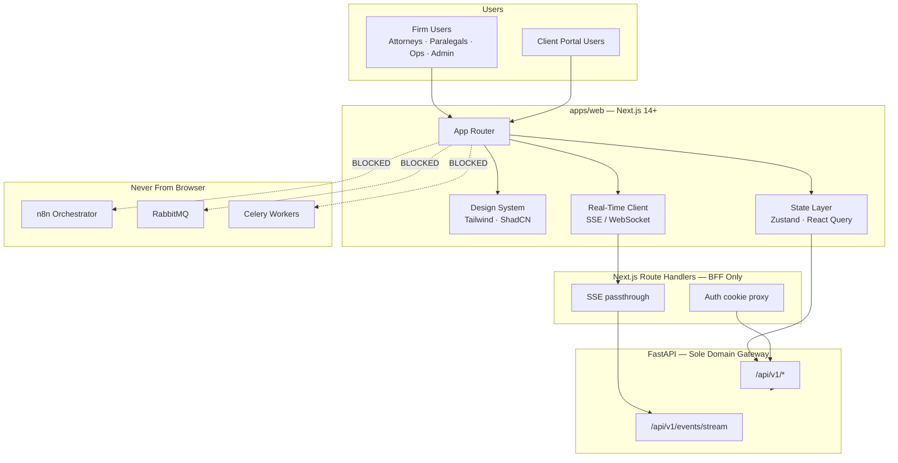
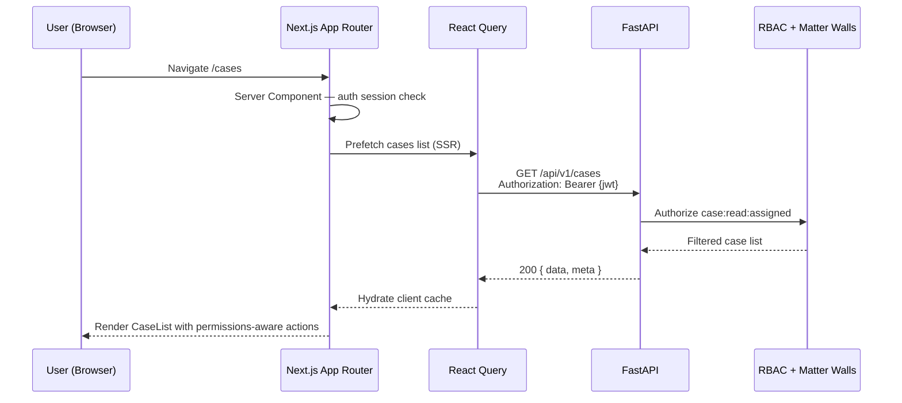
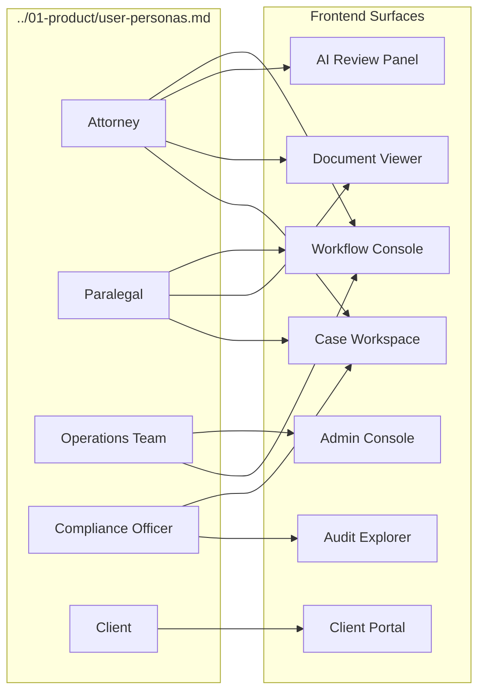

# LexFlow AI — Frontend & UI Documentation

**LexFlow AI** — Next.js Frontend Architecture Index  
**Version:** 1.0  
**Status:** Draft — Pre-Implementation  
**Last Updated:** 2026-07-06

---

## Purpose

This directory is the **authoritative reference** for LexFlow AI's Next.js frontend — design system, App Router structure, state boundaries, real-time UX, accessibility, and the client portal. Engineers, designers, and security reviewers use these documents to implement a consistent, compliant legal enterprise UI without embedding business logic or bypassing API authorization.

**Core invariant:** The frontend **never calls n8n directly**. All domain data flows through the FastAPI REST API defined in [../04-api/](../04-api/). Authorization is enforced exclusively on the backend; UI reflects permissions for UX only.

---

## Scope

| In Scope | Out of Scope |
|----------|--------------|
| Next.js 14+ App Router layout and route groups | Backend FastAPI route implementation |
| Tailwind CSS, ShadCN UI, typography, color tokens | n8n workflow node configuration |
| Zustand vs TanStack Query boundaries | Database schema DDL |
| SSE/WebSocket real-time patterns via FastAPI | Direct browser-to-n8n connections |
| WCAG 2.1 AA accessibility requirements | Mobile native app (Phase 4) |
| Client portal UX and visibility rules | Email template HTML design |

---

## Responsibilities

| Stakeholder | Responsibility |
|-------------|----------------|
| **Frontend engineers** | Implement pages and components per these specs; consume OpenAPI-generated client |
| **Design / UX** | Maintain design tokens, component patterns, and persona-driven flows |
| **Backend engineers** | Provide API contracts, SSE endpoints, and permission metadata for UI gating |
| **Security reviewers** | Validate client portal isolation, token handling, and no security logic in UI |
| **QA** | Accessibility audits, persona-based UAT, cross-browser testing |
| **Product / legal ops** | Validate client portal visibility and approval UX against firm policy |

---

## Architecture

### Frontend in Platform Context

### Document Map

| Document | Description |
|----------|-------------|
| [design-system.md](./design-system.md) | Tailwind config, ShadCN primitives, typography, legal enterprise color palette |
| [page-architecture.md](./page-architecture.md) | App Router structure, route groups, layouts, loading and error boundaries |
| [state-management.md](./state-management.md) | Zustand vs React Query boundaries, cache invalidation, optimistic updates |
| [real-time-updates.md](./real-time-updates.md) | SSE/WebSocket for notifications, workflow status, async job completion |
| [accessibility.md](./accessibility.md) | WCAG 2.1 AA, legal industry requirements, keyboard and screen reader patterns |
| [client-portal.md](./client-portal.md) | Client-facing UI, limited visibility, matter wall UX implications |

---

## Flow Diagrams

### Typical Page Load — Firm Dashboard

### Persona → UI Surface Map

Cross-reference: [../01-product/user-personas.md](../01-product/user-personas.md)

---

## Platform Invariants

These constraints apply across every document in this directory:

1. **API-only data access** — Typed client generated from OpenAPI; no hand-crafted fetch to domain resources.
2. **No n8n from browser** — Workflow triggers go to `POST /api/v1/cases/{id}/workflows/trigger`; status via API polling or SSE.
3. **Security in backend** — UI hides disabled actions; never relies on hidden routes for authorization.
4. **404 = not found or not accessible** — Case detail pages show generic not-found UX; no enumeration hints. See [../08-security/matter-walls.md](../08-security/matter-walls.md).
5. **Async UX for AI and workflows** — Submit returns `202 Accepted`; UI tracks job status via React Query + SSE. See [../04-api/endpoints-ai.md](../04-api/endpoints-ai.md).
6. **Client portal isolation** — Separate route group, theme variant, and API scope. See [client-portal.md](./client-portal.md).

---

## Technology Stack

| Layer | Technology | Notes |
|-------|------------|-------|
| Framework | Next.js 14+ (App Router) | React Server Components default; client components explicit |
| Language | TypeScript 5+ | Strict mode; no `any` in domain types |
| Styling | Tailwind CSS 3.4+ | Design tokens in `tailwind.config.ts` |
| Components | ShadCN UI (Radix primitives) | Copy-paste ownership; no black-box component library |
| Server state | TanStack Query v5 | All API reads and mutations |
| Client state | Zustand | UI-only ephemeral state |
| Forms | React Hook Form + Zod | Schema aligned with API request DTOs |
| Icons | Lucide React | Consistent stroke width |
| Testing | Vitest + Testing Library + Playwright | A11y checks in CI |
| API client | OpenAPI-generated TypeScript | Regenerated on API spec change |

---

## Best Practices

1. **Server Components first** — Fetch read-heavy data on the server; hydrate React Query cache for interactivity.
2. **Permission-aware rendering** — Use API-returned capability flags (`canApprove`, `canTriggerWorkflow`) rather than duplicating RBAC matrix in UI.
3. **Correlation IDs** — Propagate `X-Correlation-Id` on all API calls for support debugging.
4. **Optimistic updates sparingly** — Only for low-risk UI (mark notification read); never for legal document mutations.
5. **Design system compliance** — No ad-hoc hex colors; use semantic tokens from [design-system.md](./design-system.md).
6. **Accessibility by default** — Every interactive component must pass axe-core in CI; see [accessibility.md](./accessibility.md).
7. **Document changes with code** — Update this directory in the same PR as frontend changes.

---

## Tradeoffs

| Decision | Benefit | Cost |
|----------|---------|------|
| **ShadCN copy-paste vs full component library** | Full control; no version lock-in | Manual upstream merge for security patches |
| **React Query for all server state** | Cache, retry, dedup built-in | Learning curve; careful invalidation design |
| **SSE over WebSocket default** | Simpler infra; HTTP/2 friendly | Bidirectional chat needs WebSocket (Phase 2) |
| **Separate client portal route group** | Clear security boundary | Some component duplication |
| **404 UX for matter walls** | Prevents enumeration | Users may need contextual help text |
| **No GraphQL in Phase 1** | Simpler client; REST-only | Dashboard aggregations may need multiple requests |

---

## Future Improvements

| Phase | Enhancement |
|-------|-------------|
| Phase 2 | WebSocket channel for AI chat streaming |
| Phase 2 | Microsoft Entra ID SSO login UI |
| Phase 3 | Mobile-responsive client portal PWA |
| Phase 3 | Dark mode (firm-configurable) |
| Phase 4 | Native mobile shell (React Native) |
| Phase 4 | Offline document queue for field intake |

---

## References

### Within LexFlow Docs

| Document | Path |
|----------|------|
| User personas | [../01-product/user-personas.md](../01-product/user-personas.md) |
| Product capabilities | [../01-product/capabilities.md](../01-product/capabilities.md) |
| REST API index | [../04-api/README.md](../04-api/README.md) |
| Authentication | [../04-api/authentication.md](../04-api/authentication.md) |
| Authorization & RBAC | [../04-api/authorization-rbac.md](../04-api/authorization-rbac.md) |
| Matter walls | [../08-security/matter-walls.md](../08-security/matter-walls.md) |
| Folder structure | [../folder-structure.md](../folder-structure.md) |
| NFR requirements | [../03-architecture/nfr-requirements.md](../03-architecture/nfr-requirements.md) |
| Testing strategy | [../testing-strategy.md](../testing-strategy.md) |

### Architecture Decision Records

| ADR | Topic |
|-----|-------|
| [ADR-002](../13-decisions/002-n8n-orchestration-only.md) | n8n as orchestrator — frontend never calls n8n |
| [ADR-004](../13-decisions/004-async-ai-processing.md) | Async AI — frontend job status UX |
| [ADR-005](../13-decisions/005-jwt-authentication.md) | JWT + refresh — token storage patterns |

### External Standards

- [Next.js App Router](https://nextjs.org/docs/app)
- [WCAG 2.1 AA](https://www.w3.org/TR/WCAG21/)
- [TanStack Query](https://tanstack.com/query/latest)
- [ShadCN UI](https://ui.shadcn.com/)
