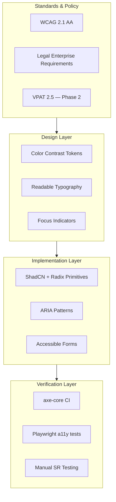
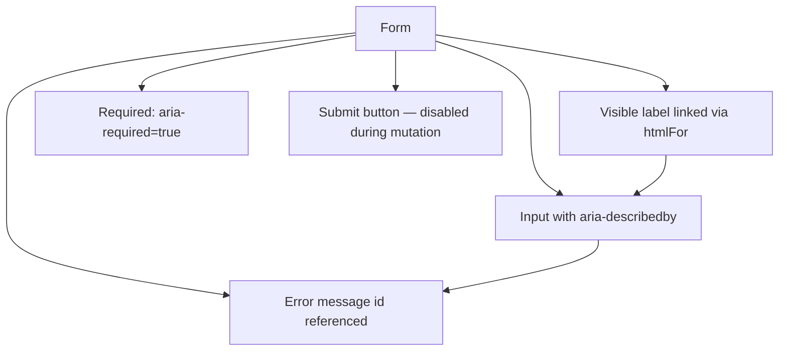
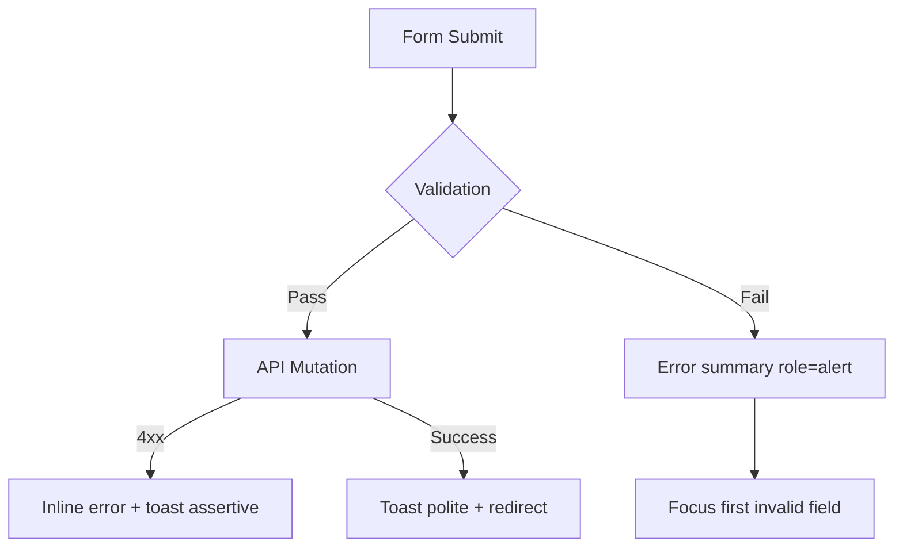

# Accessibility — WCAG 2.1 AA & Legal Industry Requirements

**LexFlow AI** — Inclusive Design for Legal Enterprise Users  
**Version:** 1.0  
**Status:** Draft — Pre-Implementation  
**Last Updated:** 2026-07-06

---

## Purpose

Define **accessibility requirements** for the LexFlow AI Next.js frontend — targeting **WCAG 2.1 Level AA** compliance with additional constraints relevant to **legal enterprise** environments: long-session usability, keyboard-first workflows, screen reader support for dense data interfaces, and accessibility expectations from firm clients and procurement.

Accessibility is a **non-functional requirement**, not a post-launch audit item.

---

## Scope

| In Scope | Out of Scope |
|----------|--------------|
| WCAG 2.1 AA success criteria applicable to web app UI | PDF/Word document accessibility (generated outputs) |
| Keyboard navigation and focus management | Court filing system accessibility |
| Screen reader patterns for legal workflows | Third-party embedded widgets (Phase 2 review) |
| Color contrast and motion preferences | ADA legal compliance interpretation |
| Accessibility testing in CI | Assistive technology vendor certification |
| Client portal accessibility baseline | Physical kiosk deployments |

Cross-reference: Design tokens in [design-system.md](./design-system.md), client portal in [client-portal.md](./client-portal.md), personas in [../01-product/user-personas.md](../01-product/user-personas.md).

---

## Responsibilities

| Role | Responsibility |
|------|----------------|
| **Frontend engineers** | Implement accessible components; fix axe violations before merge |
| **Design / UX** | Provide accessible designs; approve focus order and labels |
| **QA** | Manual screen reader testing per release; keyboard-only walkthroughs |
| **Accessibility champion** | Review new patterns; maintain this document |
| **Legal / procurement** | Validate VPAT / ACR documentation (Phase 2) |

---

## Architecture

### Accessibility Compliance Layers



### Assistive Technology Support Matrix

| Technology | Priority | Test Frequency |
|------------|----------|----------------|
| **NVDA** (Windows) | P0 | Every release |
| **JAWS** (Windows) | P0 | Major releases |
| **VoiceOver** (macOS/iOS) | P0 | Every release |
| **TalkBack** (Android) | P1 | Major releases (portal) |
| **Keyboard only** | P0 | Every PR (CI) |
| **Windows High Contrast Mode** | P1 | Major releases |
| **Zoom 200%** | P0 | Every release |

---

## WCAG 2.1 AA — Applicable Criteria

### Perceivable

| Criterion | Requirement | LexFlow Implementation |
|-----------|-------------|------------------------|
| **1.1.1 Non-text Content** | Alt text for images | Meaningful `alt` on icons with semantic meaning; decorative icons `aria-hidden="true"` |
| **1.3.1 Info and Relationships** | Semantic structure | Native HTML landmarks; `role="table"` for DataTable; heading hierarchy per page |
| **1.3.2 Meaningful Sequence** | Logical reading order | DOM order matches visual order; CSS grid reorder avoided |
| **1.3.4 Orientation** | No orientation lock | Responsive layouts support portrait and landscape |
| **1.4.1 Use of Color** | Color not sole indicator | Status badges: color + icon + text label |
| **1.4.3 Contrast (Minimum)** | 4.5:1 text, 3:1 UI | Enforced via design tokens — see [design-system.md](./design-system.md) |
| **1.4.4 Resize Text** | 200% zoom without loss | Relative units; no fixed-height containers clipping content |
| **1.4.10 Reflow** | No horizontal scroll at 320px | Responsive breakpoints; table horizontal scroll with focus trap awareness |
| **1.4.11 Non-text Contrast** | 3:1 UI component contrast | Focus rings, input borders, button boundaries |
| **1.4.12 Text Spacing** | Adjustable spacing | Tailwind defaults compatible; no `!important` overrides blocking user styles |
| **1.4.13 Content on Hover/Focus** | Dismissible, hoverable, persistent | Tooltips: ESC dismiss; popovers remain on hover |

### Operable

| Criterion | Requirement | LexFlow Implementation |
|-----------|-------------|------------------------|
| **2.1.1 Keyboard** | All functionality keyboard accessible | Radix primitives; custom widgets follow WAI-ARIA patterns |
| **2.1.2 No Keyboard Trap** | Focus can leave all components | Modals: focus trap with ESC close; no trap in tables |
| **2.1.4 Character Key Shortcuts** | Disable or remap single-key shortcuts | ⌘K command palette requires modifier; no bare letter shortcuts |
| **2.4.1 Bypass Blocks** | Skip navigation link | "Skip to main content" link as first focusable element |
| **2.4.2 Page Titled** | Descriptive `<title>` | `generateMetadata()` — "Case: {title} — LexFlow AI" |
| **2.4.3 Focus Order** | Logical focus sequence | Tab order: skip link → nav → main → panels |
| **2.4.4 Link Purpose** | Link text describes destination | No "click here"; "View document: {filename}" |
| **2.4.6 Headings and Labels** | Descriptive headings/labels | Form labels always visible; no placeholder-only labels |
| **2.4.7 Focus Visible** | Visible focus indicator | `ring-2 ring-ring ring-offset-2` on `:focus-visible` |
| **2.5.1 Pointer Gestures** | Single-pointer alternative | No multi-finger or path-based gestures |
| **2.5.3 Label in Name** | Accessible name matches visible label | Button text matches `aria-label` when both present |

### Understandable

| Criterion | Requirement | LexFlow Implementation |
|-----------|-------------|------------------------|
| **3.1.1 Language of Page** | `lang` attribute | `<html lang="en">` on root layout |
| **3.2.1 On Focus** | No context change on focus | Focus never triggers navigation or submit |
| **3.2.2 On Input** | No unexpected change on input | Filters debounced; no auto-submit on select |
| **3.3.1 Error Identification** | Errors clearly identified | Inline field errors with `aria-describedby`; form summary at top |
| **3.3.2 Labels or Instructions** | Labels for all inputs | RHF + visible labels; required fields marked |
| **3.3.3 Error Suggestion** | Suggest corrections | Zod error messages are actionable ("Email must be valid format") |
| **3.3.4 Error Prevention (Legal)** | Confirm before legal/financial submission | Confirmation dialog for: delete participant, cancel workflow, approve AI output |

### Robust

| Criterion | Requirement | LexFlow Implementation |
|-----------|-------------|------------------------|
| **4.1.1 Parsing** | Valid HTML | React/Next.js JSX; no duplicate IDs |
| **4.1.2 Name, Role, Value** | ARIA for custom widgets | ShadCN/Radix provides roles; verify on custom DataTable |
| **4.1.3 Status Messages** | Announce dynamic updates | `aria-live="polite"` for toasts; `aria-live="assertive"` for errors |

---

## Legal Industry Requirements

Beyond WCAG, law firm procurement and professional responsibility impose additional UX constraints:

### Long-Session Usability

Attorneys and paralegals use case management tools for **6–10 hour sessions**.

| Requirement | Implementation |
|-------------|----------------|
| Reduce eye strain | Off-white background (`#FAFAFA`); no pure white/black |
| Readable at distance | Minimum 14px body (firm UI); 16px portal |
| Dense data without clutter | Compact mode option; consistent column alignment |
| Minimize motion fatigue | `prefers-reduced-motion` disables animations except essential spinners |

### Keyboard-First Workflows

Legal professionals often navigate without a mouse during document review:

| Workflow | Keyboard Pattern |
|----------|-----------------|
| Global search | `⌘K` / `Ctrl+K` — Command palette |
| Case list navigation | Arrow keys in DataTable; Enter to open |
| Case tab switching | Arrow keys on tab list (Radix Tabs) |
| Document list | Arrow keys; Space to select; Enter to preview |
| Approval inbox | `j`/`k` or arrow keys to navigate items; `a` approve with confirmation |
| Modal dialogs | Tab trapped; ESC closes; Enter submits primary action |
| Notification dropdown | Arrow keys; Enter to navigate to resource |

### Screen Reader — Dense Data Patterns

| Component | Pattern |
|-----------|---------|
| **Case list table** | `<table>` with `<caption>`; sortable headers with `aria-sort` |
| **Status badges** | Text content readable; not icon-only |
| **Timeline** | `<ol>` ordered list; each entry has datetime in accessible format |
| **Workflow progress** | `role="progressbar"` with `aria-valuenow`, `aria-valuemin`, `aria-valuemax` |
| **AI output panel** | Landmark `role="region"` with `aria-label="AI generated summary — requires attorney review"` |
| **Notification count** | `aria-label="Notifications, 3 unread"` on bell button |
| **Loading states** | `aria-busy="true"` on container; `aria-live="polite"` when loaded |

### Legal-Specific Error Prevention (WCAG 3.3.4)

Confirmation required before:

| Action | Dialog Content |
|--------|---------------|
| Approve AI summary | "You are approving this AI-generated content for use on {caseName}. This action is logged." |
| Cancel running workflow | "Cancel {workflowName}? Steps completed so far will be preserved." |
| Remove case participant | "Remove {name} from {caseName}? They will lose access immediately." |
| Delete document version | "Permanently delete version {n}? This cannot be undone." |
| Client portal document upload | "Upload {filename} to {caseName}? This will be shared with the firm." |

### Privilege and Confidentiality UX

Accessibility must not compromise security UX:

| Scenario | Accessible Pattern |
|----------|-------------------|
| Privileged document indicator | `aria-label="Attorney-client privileged document"` on lock icon |
| Matter wall 404 | Not-found page with clear text — not silent redirect |
| AI disclaimer | Persistent `role="alert"` on first AI panel view per session |
| Client vs internal content | `aria-label` distinguishes "Shared with client" vs "Internal only" |

Cross-reference: [../08-security/matter-walls.md](../08-security/matter-walls.md) — MW-007 client isolation.

---

## Component Accessibility Standards

### Forms (React Hook Form + ShadCN)



- Error summary at form top with `role="alert"` on submit failure
- Focus first invalid field on submit
- Do not clear user input on validation error

### Data Tables

| Feature | Accessibility |
|---------|--------------|
| Sort | `aria-sort="ascending|descending|none"` on active column |
| Filter | Filter inputs labeled; announce result count change via `aria-live` |
| Pagination | "Page 2 of 15" text; buttons labeled "Go to next page" |
| Row selection | Checkbox first column; `aria-label="Select case {title}"` |
| Row actions | Actions menu: `aria-label="Actions for case {title}"` |

### Modals and Sheets

- Focus trapped within dialog while open
- Return focus to trigger element on close
- `aria-modal="true"` and `role="dialog"`
- Dialog title via `DialogTitle` (required by Radix)

### Toasts (Sonner)

| Toast Type | `aria-live` | Duration |
|------------|-------------|----------|
| Success | `polite` | 5s auto-dismiss |
| Error | `assertive` | Persistent until dismissed |
| Info | `polite` | 5s |
| AI completion | `polite` | 8s — longer read time |

Critical legal confirmations use **Dialog**, not toast.

### Dynamic Content (SSE Updates)

Cross-reference: [real-time-updates.md](./real-time-updates.md)

| Event | Announcement |
|-------|-------------|
| Workflow completed | `aria-live="polite"`: "{workflowName} completed" |
| AI job ready for review | `aria-live="polite"`: "AI summary ready for review on {caseName}" |
| Access revoked | `aria-live="assertive"`: "Your access to this case has been removed" + redirect |
| New approval request | `aria-live="polite"`: "New approval request" |

---

## Client Portal Accessibility

The client portal serves external users who may have **less technical familiarity** and **diverse abilities**:

| Requirement | Portal Implementation |
|-------------|----------------------|
| Larger base font | 16px minimum |
| Simplified navigation | 3–4 nav items maximum |
| Plain language | Avoid legal jargon in UI chrome |
| Upload accessibility | File input labeled; drag-drop has keyboard alternative |
| Mobile-first | Touch targets ≥ 44×44px |
| High contrast option | Phase 3 — system preference respected |

See [client-portal.md](./client-portal.md).

---

## Testing Strategy

### Automated (CI — Every PR)

| Tool | Scope | Threshold |
|------|-------|-----------|
| **axe-core** (via `@axe-core/playwright`) | Changed pages in PR | 0 violations (critical, serious) |
| **eslint-plugin-jsx-a11y** | All TSX files | 0 errors |
| **Playwright** | Keyboard navigation smoke tests | Pass |

### Manual (Every Release)

| Test | Procedure |
|------|-----------|
| Screen reader walkthrough | VoiceOver + NVDA: login → case list → case detail → document upload |
| Keyboard-only | Complete approval workflow without mouse |
| Zoom 200% | All primary flows usable |
| Color contrast spot check | New components verified against tokens |

### Persona-Based Accessibility Scenarios

Cross-reference: [../01-product/user-personas.md](../01-product/user-personas.md)

| Persona | Scenario |
|---------|----------|
| **Paralegal** | Keyboard-only: intake form → case create → document upload |
| **Attorney** | Screen reader: review AI summary → approve with confirmation |
| **Legal Assistant** | Zoom 200%: case list filter and sort |
| **Client** | VoiceOver mobile: portal login → upload document |
| **Compliance Officer** | Keyboard: audit log search and pagination |

---

## Flow Diagrams

### Focus Management — Modal Open/Close

```mermaid
sequenceDiagram
    participant U as User (Keyboard)
    participant BTN as Trigger Button
    participant MOD as Dialog
    participant APP as Application

    U->>BTN: Enter — open dialog
    BTN->>MOD: Open; focus first focusable
    U->>MOD: Tab through fields
    U->>MOD: ESC — close
    MOD->>BTN: Return focus to trigger
    U->>APP: Continue navigation
```

### Error Announcement Flow



---

## Best Practices

1. **Radix/ShadCN first** — Use primitive accessibility; don't rebuild widgets.
2. **Test with real assistive tech** — axe alone is insufficient for legal enterprise procurement.
3. **Visible focus always** — Never `outline: none` without replacement.
4. **Labels never placeholder-only** — Placeholders are supplementary.
5. **Announce async changes** — SSE updates need `aria-live` regions.
6. **Confirm destructive legal actions** — WCAG 3.3.4 is mandatory for this domain.
7. **Document accessibility in PRs** — Note keyboard/screen reader testing performed.

---

## Tradeoffs

| Decision | Benefit | Cost |
|----------|---------|------|
| **WCAG 2.1 AA (not AAA)** | Achievable for dense data UI | Some contrast requirements relaxed for large text |
| **Confirmation dialogs for legal actions** | Error prevention compliance | Extra click for power users |
| **aria-live for SSE vs page refresh** | Non-disruptive updates | Screen reader verbosity during busy periods |
| **14px firm body text** | Information density | Borderline for low vision — compact mode + zoom mitigates |
| **Automated axe in CI** | Catch regressions early | False positives on complex widgets need manual review |

---

## Future Improvements

| Phase | Enhancement |
|-------|-------------|
| Phase 2 | VPAT 2.5 / ACR documentation for procurement |
| Phase 2 | Accessibility statement page (public) |
| Phase 3 | High-contrast theme toggle |
| Phase 3 | User-configurable font size (portal + firm) |
| Phase 4 | WCAG 2.2 criteria adoption |
| Phase 4 | Localized UI (`lang` per user preference) |

---

## References

| Document | Path |
|----------|------|
| UI index | [README.md](./README.md) |
| Design system | [design-system.md](./design-system.md) |
| Client portal | [client-portal.md](./client-portal.md) |
| Real-time updates | [real-time-updates.md](./real-time-updates.md) |
| User personas | [../01-product/user-personas.md](../01-product/user-personas.md) |
| Matter walls | [../08-security/matter-walls.md](../08-security/matter-walls.md) |
| NFR requirements | [../03-architecture/nfr-requirements.md](../03-architecture/nfr-requirements.md) |
| Testing strategy | [../testing-strategy.md](../testing-strategy.md) |

### External Standards

- [WCAG 2.1](https://www.w3.org/TR/WCAG21/)
- [WAI-ARIA Authoring Practices 1.2](https://www.w3.org/WAI/ARIA/apg/)
- [Section 508 (US Federal)](https://www.section508.gov/)
- [VPAT 2.5 INT](https://www.itic.org/policy/accessibility/vpat)
- [Radix UI Accessibility](https://www.radix-ui.com/primitives/docs/overview/accessibility)
