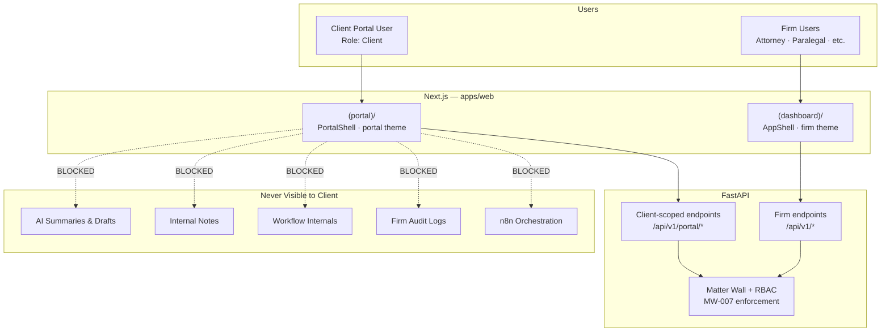
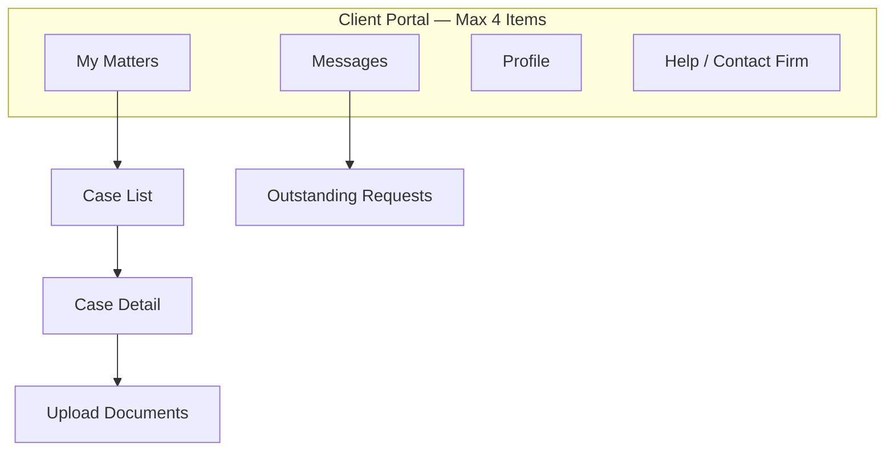
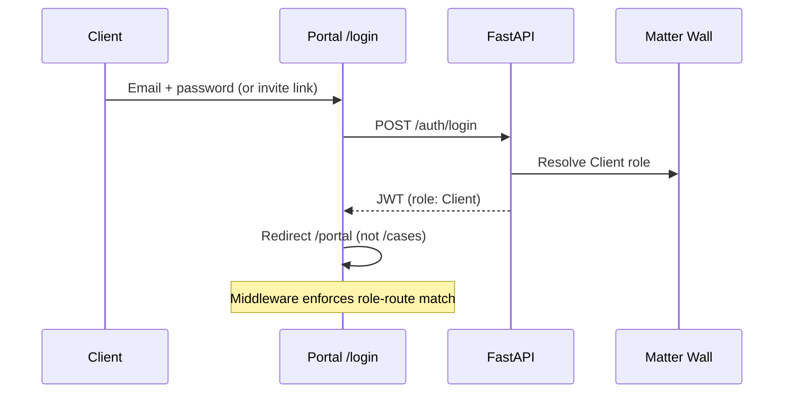
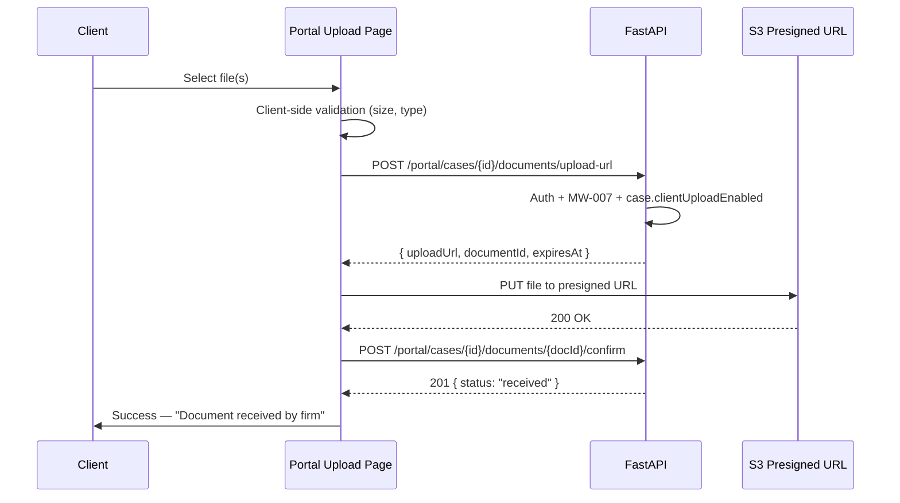
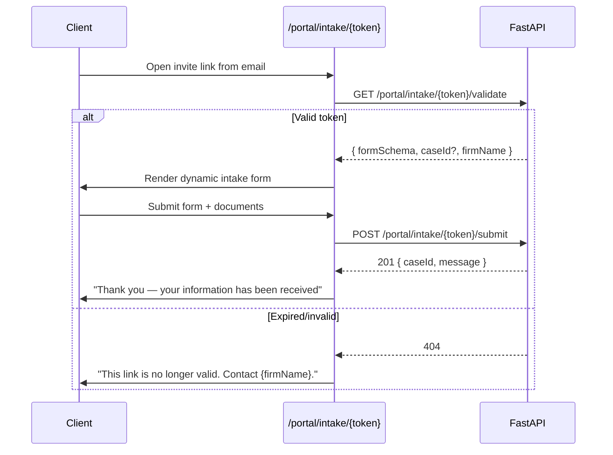
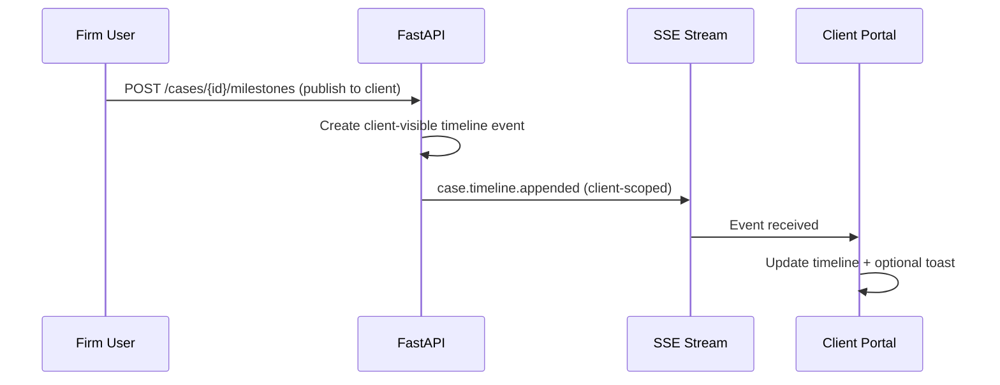
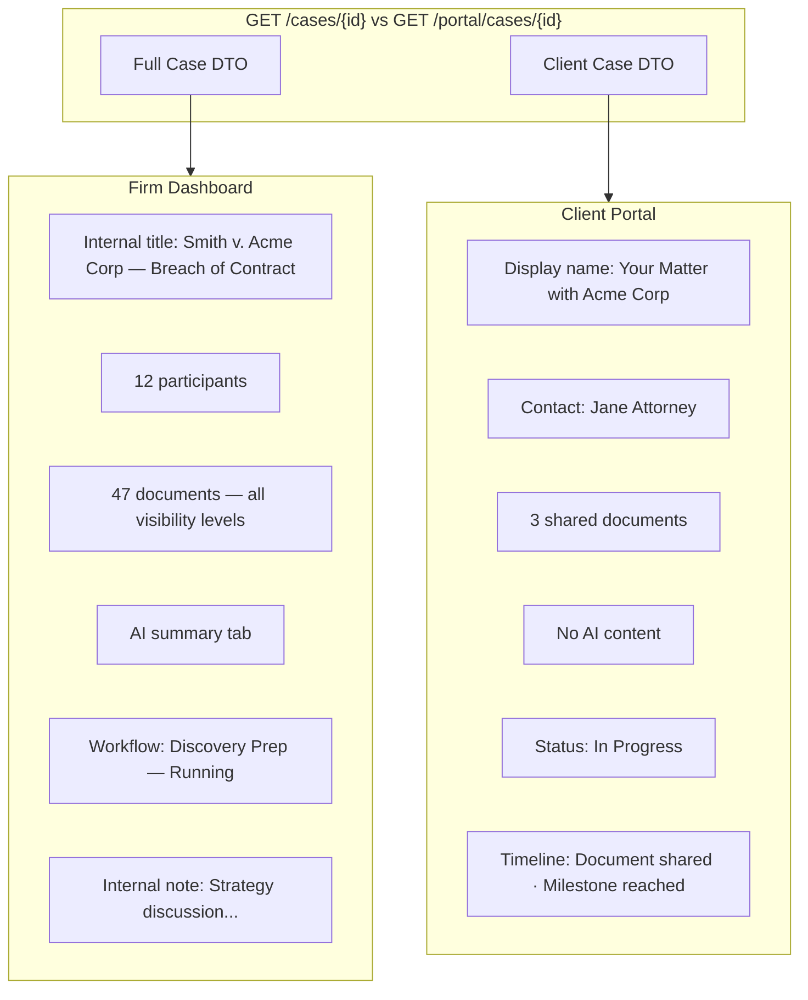
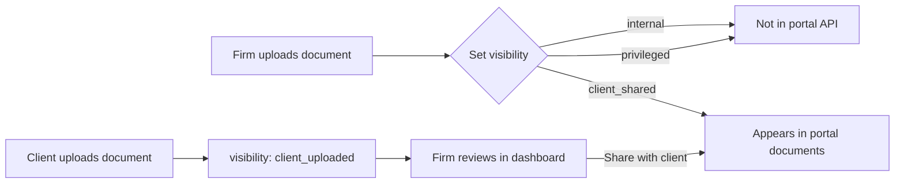

# Client Portal — External User Interface & Limited Visibility

**LexFlow AI** — Client-Facing UI, Scoped Access & Matter Wall UX  
**Version:** 1.0  
**Status:** Draft — Pre-Implementation  
**Last Updated:** 2026-07-06

---

## Purpose

Define the **client portal** frontend — the authenticated external interface where clients and corporate representatives interact with LexFlow AI. The portal provides secure intake, document exchange, and milestone visibility while **strictly limiting** what external users can see, do, or infer about firm-internal operations.

The portal is a **separate route group** with distinct layout, theme, and API scope. It enforces the same backend matter walls as the firm dashboard — the UI reflects API responses and never expands visibility client-side.

Cross-reference: Client persona in [../01-product/user-personas.md](../01-product/user-personas.md), matter walls in [../08-security/matter-walls.md](../08-security/matter-walls.md), API auth in [../04-api/authentication.md](../04-api/authentication.md).

---

## Scope

| In Scope | Out of Scope |
|----------|--------------|
| Portal route group, layout, and navigation | Client billing or payment UI |
| Visibility rules — what clients see vs hidden | CRM/marketing lead capture |
| Intake forms and secure document upload | E-signature integration (Phase 3) |
| Portal-specific API consumption patterns | Client account provisioning backend |
| Portal notifications and milestone display | Anonymous/unauthenticated upload |
| Mobile-responsive portal UX | Native mobile app |

---

## Responsibilities

| Role | Responsibility |
|------|----------------|
| **Frontend engineers** | Implement portal route group; never render fields absent from API |
| **Backend engineers** | Return client-scoped DTOs; enforce MW-007 on all portal endpoints |
| **Design / UX** | Simplified, approachable portal theme per [design-system.md](./design-system.md) |
| **Security** | Validate portal isolation; no internal route leakage |
| **Product / legal ops** | Define firm-configurable visibility fields |
| **Attorneys** | Configure per-case client visibility settings |

---

## Architecture

### Portal vs Firm Application



### Data Boundary Model

```mermaid
flowchart LR
    subgraph CaseAggregate["Case — Full Firm View"]
        TITLE[Title · Status · Practice Area]
        PARTS[All Participants]
        DOCS[All Documents]
        AI_OUT[AI Summaries]
        NOTES2[Internal Notes]
        TIMELINE[Full Timeline]
        WF2[Workflow Executions]
    end

    subgraph ClientDTO["Client Portal DTO"]
        CTITLE[Title — firm-approved display name]
        CSTATUS[Milestone Status Only]
        CDOCS[Firm-shared Documents]
        CTIME[Client-visible Timeline Events]
        CREQS[Outstanding Requests]
    end

    CaseAggregate -->|API projection| ClientDTO
```



The API returns **client-scoped DTOs** — fields not included in the response do not exist in the portal UI.

---

## Route Structure

```
apps/web/src/app/(portal)/
├── layout.tsx                 # PortalShell — simplified nav, portal theme
├── page.tsx                   # My Matters — client case list
├── cases/
│   └── [caseId]/
│       ├── page.tsx           # Case status + shared documents + timeline
│       └── upload/
│           └── page.tsx       # Document upload to case
├── messages/
│   └── page.tsx               # Firm requests (document requests, questions)
├── intake/
│   └── [token]/
│       └── page.tsx           # Pre-authentication intake (invite token)
└── profile/
    └── page.tsx               # Client profile, password, notification prefs
```

Cross-reference: Full route map in [page-architecture.md](./page-architecture.md).

---

## Portal Navigation



No access to: Cases (firm view), Workflows, AI, Approvals, Admin, Audit, Reports.

---

## Visibility Rules

### What Clients CAN See

| Data | Source | Notes |
|------|--------|-------|
| **Own matters only** | `GET /api/v1/portal/cases` | Never other clients' cases |
| **Case display name** | Firm-configured — may differ from internal title | e.g., "Smith v. Acme — Your Matter" |
| **Milestone status** | Simplified status enum | `Intake`, `In Progress`, `Review`, `Complete` — not internal workflow states |
| **Firm-shared documents** | `visibility: client_shared` | Documents explicitly shared by firm |
| **Client-visible timeline** | Filtered events | Milestones, document shared, request completed |
| **Outstanding requests** | Document requests, information requests | Actionable items for client |
| **Assigned firm contact** | Name, email, phone | Primary attorney or paralegal |
| **Own upload history** | Documents client uploaded | Status: received, under review |

### What Clients CANNOT See

| Data | Matter Wall Rule | UI Behavior |
|------|------------------|-------------|
| Internal case notes | MW-007 | Field absent from API — no empty placeholder |
| AI summaries and drafts | MW-007 | No AI tab, no AI indicators |
| Workflow execution details | MW-007 | Milestone shown instead of workflow name |
| Other case participants (internal) | MW-007 | Only firm contact shown |
| Internal document versions | MW-007 | Latest shared version only |
| Privileged/work-product documents | MW-007 | Not in document list |
| Audit logs | MW-007 | No audit access |
| Case financials / billing | Firm policy | Phase 3 — separate billing portal |
| n8n or automation references | Platform invariant | No workflow terminology in client UI |

Cross-reference: [../08-security/matter-walls.md](../08-security/matter-walls.md) — MW-007.

### Firm-Configurable Visibility

System administrators configure per firm:

| Setting | Options | Default |
|---------|---------|---------|
| `portal.caseStatusDetail` | `milestones` / `minimal` | `milestones` |
| `portal.showAssignedContact` | true / false | true |
| `portal.allowClientUpload` | true / false | true |
| `portal.uploadMaxSizeMb` | 1–500 | 100 |
| `portal.allowedUploadTypes` | MIME list | PDF, DOCX, JPG, PNG, XLSX |
| `portal.intakeEnabled` | true / false | true |

Attorneys configure per case:

| Setting | Options |
|---------|---------|
| `case.clientDisplayName` | Custom title for portal |
| `case.clientVisibleMilestones[]` | Which milestones to expose |
| `case.clientUploadEnabled` | Override firm default |

---

## Key User Flows

### Client Login



Clients attempting to access `/cases` or `/admin` receive redirect to `/portal`.

### Secure Document Upload



Cross-reference: Presigned upload pattern in [../04-api/endpoints-documents.md](../04-api/endpoints-documents.md).

**Portal upload rules:**
- Uploaded documents default to `visibility: client_uploaded` — not auto-shared back
- Firm must explicitly share documents with client
- Upload progress bar with accessible labels
- Confirmation before upload starts

### Intake Form (Invite Token)



Intake may create a new case (firm-configured) or append to existing matter.

### Milestone Notification



Clients receive SSE events only for their own cases — filtered server-side.

---

## API Endpoints (Portal Scope)

Portal frontend consumes dedicated endpoints where client DTOs differ from firm endpoints:

| Method | Path | Purpose |
|--------|------|---------|
| `GET` | `/api/v1/portal/cases` | Client's matter list |
| `GET` | `/api/v1/portal/cases/{id}` | Case detail — client DTO |
| `GET` | `/api/v1/portal/cases/{id}/documents` | Shared + own uploads |
| `GET` | `/api/v1/portal/cases/{id}/timeline` | Client-visible events only |
| `POST` | `/api/v1/portal/cases/{id}/documents/upload-url` | Initiate upload |
| `POST` | `/api/v1/portal/cases/{id}/documents/{docId}/confirm` | Confirm upload |
| `GET` | `/api/v1/portal/cases/{id}/documents/{docId}/download-url` | Download shared doc |
| `GET` | `/api/v1/portal/messages` | Outstanding requests |
| `POST` | `/api/v1/portal/messages/{id}/respond` | Respond to firm request |
| `GET` | `/api/v1/portal/intake/{token}/validate` | Validate intake invite |
| `POST` | `/api/v1/portal/intake/{token}/submit` | Submit intake form |
| `GET` | `/api/v1/portal/profile` | Client profile |
| `PATCH` | `/api/v1/portal/profile` | Update profile |

Firm endpoints (`/api/v1/cases/*`) return 403 for `Client` role unless explicitly allowed.

Cross-reference: [../04-api/authorization-rbac.md](../04-api/authorization-rbac.md).

---

## Portal UI Design

### Theme Differences

Cross-reference: [design-system.md](./design-system.md) — Client Portal Theme Variant

| Aspect | Firm Dashboard | Client Portal |
|--------|---------------|---------------|
| Base font size | 14px | 16px |
| Information density | High | Low — spacious |
| Primary color | Deep legal blue `#1E3A5F` | Brighter blue `#2563EB` |
| Navigation | Full sidebar (role-filtered) | 4 items max |
| Terminology | Legal/operational | Plain language |
| AI indicators | Visible | **Absent** |
| Status display | Full workflow states | Milestone labels |

### Page Templates

| Page | Layout | Key Components |
|------|--------|----------------|
| **My Matters** | Card list | Case card: name, milestone, last update, outstanding requests badge |
| **Case Detail** | Single column | Status banner, firm contact, document list, timeline, upload CTA |
| **Upload** | Centered form | Drag-drop zone, file list, progress, confirmation |
| **Messages** | Inbox list | Request type, due date, respond action |
| **Profile** | Form | Name, email, password change, notification preferences |

### Empty States

| State | Message | CTA |
|-------|---------|-----|
| No matters | "You don't have any active matters yet." | "Contact your firm" link |
| No shared documents | "No documents have been shared yet." | "Upload a document" if enabled |
| No messages | "You're all caught up — no outstanding requests." | None |

---

## Security Requirements

| Requirement | Implementation |
|-------------|----------------|
| Role-route isolation | Middleware: `Client` role → `(portal)/` only |
| API enforcement | All portal endpoints check `Client` role + case ownership |
| No internal data leakage | Client DTOs exclude internal fields at serialization |
| 404 on unauthorized case | Same as firm — no enumeration (MW-004) |
| Upload validation | Client + server MIME and size validation |
| Session timeout | 30-minute idle timeout (configurable per firm) |
| MFA | Phase 2 — optional per firm for client accounts |
| Audit | All client actions logged with `actorType: client` |
| No n8n exposure | Portal never triggers workflows directly — intake submits to API |

Cross-reference: [../08-security/matter-walls.md](../08-security/matter-walls.md), [../04-api/authentication.md](../04-api/authentication.md).

---

## State Management (Portal)

Cross-reference: [state-management.md](./state-management.md)

| Concern | Approach |
|---------|----------|
| Case list / detail | React Query — `['portal', 'cases']` keys |
| Upload progress | Component `useState` — not cached |
| Auth | Shared `authStore` — role determines route group |
| Notifications | SSE + React Query invalidation |
| Intake form | React Hook Form + Zod — schema from API |

On logout: `queryClient.clear()` purges all portal case data.

---

## Accessibility (Portal)

Cross-reference: [accessibility.md](./accessibility.md)

| Requirement | Portal Implementation |
|-------------|----------------------|
| Touch targets | Minimum 44×44px |
| Font size | 16px base |
| Plain language | Grade 8 reading level for UI chrome |
| Upload | Keyboard-accessible file picker + drag-drop |
| Mobile | Responsive — portal primary use case includes mobile |
| Error messages | Plain language — no HTTP status codes shown |

---

## Persona Alignment

From [../01-product/user-personas.md](../01-product/user-personas.md) — Client (Portal User):

| Goal | Portal Feature |
|------|---------------|
| Submit intake information | Intake form with invite token |
| Secure document upload | Presigned S3 upload — no email attachment |
| View case status | Milestone timeline |
| Receive notifications | SSE + optional email (backend) |
| Avoid repeated information requests | Messages/inbox for firm requests |

| Pain Point | Portal Solution |
|------------|----------------|
| Opaque matter status | Milestone timeline with plain labels |
| Insecure document exchange | Encrypted upload via presigned URLs |
| Repeated information requests | Structured intake + message responses |

**Success criteria:** Secure upload without email; status visibility within firm-configured bounds.

---

## Flow Diagrams

### Client vs Firm — Same Case, Different Views



### Document Visibility Flow



---

## Best Practices

1. **API is the visibility gate** — Never conditionally hide UI elements that API returned; omit at API level.
2. **Plain language** — Portal copy reviewed for non-legal audience.
3. **Separate theme** — Visual distinction reinforces internal vs external context.
4. **Mobile-first portal** — Clients often access from phones.
5. **Confirm uploads** — Prevent accidental submission of wrong files.
6. **No workflow jargon** — Use milestones, not workflow execution names.
7. **Graceful token expiry** — Intake links show helpful message with firm contact.

---

## Tradeoffs

| Decision | Benefit | Cost |
|----------|---------|------|
| **Separate route group vs subdomain** | Shared auth infra; single deploy | Must enforce middleware isolation |
| **Dedicated portal API namespace** | Clean client DTOs | Duplicate endpoint maintenance |
| **Milestone abstraction vs real status** | Simple client UX | Firm must publish milestones manually (Phase 1) |
| **16px portal font** | Accessibility for external users | Visual inconsistency with firm UI |
| **No client AI access** | Privilege protection | Clients cannot self-serve FAQ (Phase 3?) |
| **404 on unauthorized** | Security (MW-004) | Client confusion — mitigate with copy |

---

## Future Improvements

| Phase | Enhancement |
|-------|-------------|
| Phase 2 | Client MFA (SMS/TOTP) |
| Phase 2 | Automated milestone publishing on workflow completion |
| Phase 3 | E-signature integration (DocuSign) |
| Phase 3 | Client FAQ chatbot (non-case-scoped, no privilege) |
| Phase 3 | Billing visibility (separate tab, firm-configured) |
| Phase 4 | White-label portal (firm branding) |
| Phase 4 | Multi-language portal UI |

---

## References

| Document | Path |
|----------|------|
| UI index | [README.md](./README.md) |
| Design system | [design-system.md](./design-system.md) |
| Page architecture | [page-architecture.md](./page-architecture.md) |
| State management | [state-management.md](./state-management.md) |
| Real-time updates | [real-time-updates.md](./real-time-updates.md) |
| Accessibility | [accessibility.md](./accessibility.md) |
| User personas | [../01-product/user-personas.md](../01-product/user-personas.md) |
| Matter walls | [../08-security/matter-walls.md](../08-security/matter-walls.md) |
| Authorization RBAC | [../04-api/authorization-rbac.md](../04-api/authorization-rbac.md) |
| Authentication | [../04-api/authentication.md](../04-api/authentication.md) |
| Endpoints — Documents | [../04-api/endpoints-documents.md](../04-api/endpoints-documents.md) |
| Endpoints — Cases | [../04-api/endpoints-cases.md](../04-api/endpoints-cases.md) |
| Compliance & data governance | [../compliance-data-governance.md](../compliance-data-governance.md) |
