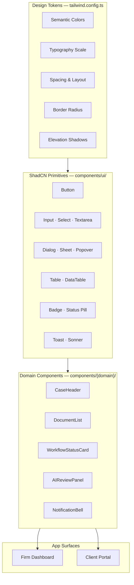
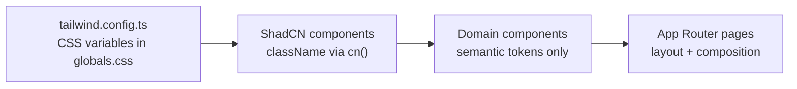
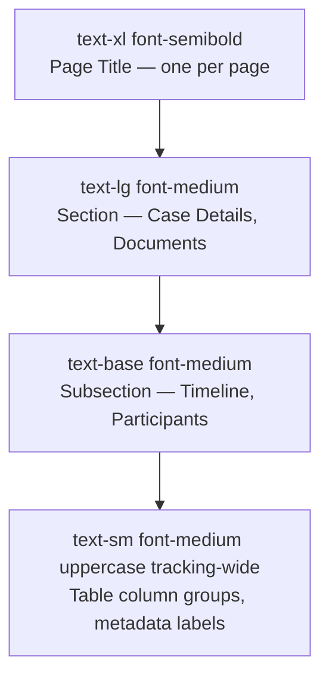
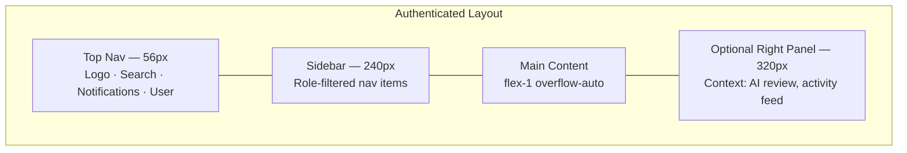
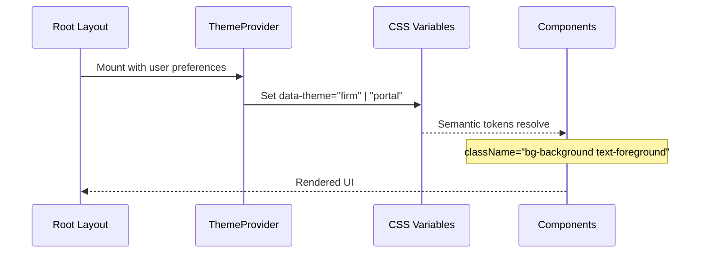

# Design System — Tailwind, ShadCN & Legal Enterprise Visual Language

**LexFlow AI** — Frontend Design Tokens & Component Standards  
**Version:** 1.0  
**Status:** Draft — Pre-Implementation  
**Last Updated:** 2026-07-06

---

## Purpose

Define LexFlow AI's **visual design system** for the Next.js frontend — Tailwind CSS configuration, ShadCN UI component standards, typography scale, and a color palette suited to **legal enterprise** environments. The system prioritizes clarity, trust, accessibility, and long-session readability for attorneys and paralegals.

---

## Scope

| In Scope | Out of Scope |
|----------|--------------|
| Design tokens (color, typography, spacing, radius, shadow) | Marketing website branding |
| ShadCN component usage conventions | Custom illustration library |
| Firm dashboard and client portal theme variants | Print/PDF stylesheet design |
| Dark mode token definitions (Phase 3 enablement) | PowerPoint or slide templates |
| Iconography and data density guidelines | Figma file maintenance process |

Cross-reference: Full design system in [../16-design-system/](../16-design-system/README.md). Accessibility requirements in [accessibility.md](./accessibility.md). Client portal theme variant in [client-portal.md](./client-portal.md).

---

## Responsibilities

| Role | Responsibility |
|------|----------------|
| **Frontend engineers** | Implement tokens in `tailwind.config.ts`; use semantic classes only |
| **Design / UX** | Maintain token values; approve new ShadCN component additions |
| **Accessibility champion** | Validate contrast ratios and focus states |
| **Product** | Approve client portal visual differentiation |

---

## Architecture

### Design System Layer Model

### Token Consumption Flow

---

## Color System

### Design Principles for Legal Enterprise

Legal professionals spend **6–10 hours daily** in case management tools. The palette must:

- Convey **trust and professionalism** — no neon accents or consumer-app aesthetics
- Maintain **WCAG 2.1 AA contrast** (4.5:1 body text, 3:1 large text and UI components)
- Use **semantic color** for status — never color alone for critical state (pair with icon + text)
- Support **dense data tables** without visual fatigue
- Differentiate **privileged / confidential** content subtly (not alarm-red by default)

### Semantic Color Tokens

Defined as CSS custom properties in `globals.css`, consumed via Tailwind:

| Token | Light Mode | Usage |
|-------|------------|-------|
| `--background` | `#FAFAFA` (warm off-white) | Page background |
| `--foreground` | `#1A1A2E` (navy-charcoal) | Primary text |
| `--card` | `#FFFFFF` | Card and panel surfaces |
| `--card-foreground` | `#1A1A2E` | Card text |
| `--primary` | `#1E3A5F` (deep legal blue) | Primary actions, nav active state |
| `--primary-foreground` | `#FFFFFF` | Text on primary |
| `--secondary` | `#F1F5F9` (slate-100) | Secondary buttons, subtle backgrounds |
| `--secondary-foreground` | `#334155` | Secondary text |
| `--muted` | `#F4F4F5` | Disabled backgrounds, table stripes |
| `--muted-foreground` | `#64748B` | Placeholder, metadata, timestamps |
| `--accent` | `#E8F0FE` (light blue wash) | Hover states, selected rows |
| `--accent-foreground` | `#1E3A5F` | Text on accent |
| `--destructive` | `#B91C1C` (red-700) | Delete, irreversible actions |
| `--destructive-foreground` | `#FFFFFF` | Text on destructive |
| `--border` | `#E2E8F0` | Borders, dividers |
| `--input` | `#E2E8F0` | Input borders |
| `--ring` | `#1E3A5F` | Focus ring |

### Status Colors (Workflow, AI, Case)

| Status | Token | Background | Foreground | Icon |
|--------|-------|------------|------------|------|
| Success / Completed | `status-success` | `#ECFDF5` | `#047857` | CheckCircle |
| In Progress / Running | `status-info` | `#EFF6FF` | `#1D4ED8` | Loader2 (animated) |
| Pending / Queued | `status-warning` | `#FFFBEB` | `#B45309` | Clock |
| Failed / Error | `status-error` | `#FEF2F2` | `#B91C1C` | AlertCircle |
| Cancelled | `status-neutral` | `#F4F4F5` | `#71717A` | XCircle |
| Awaiting Approval | `status-approval` | `#F5F3FF` | `#6D28D9` | ShieldCheck |

### Confidentiality Indicators

| Level | Visual Treatment |
|-------|------------------|
| **Attorney-client privileged** | Subtle left border `border-l-4 border-l-primary` + lock icon |
| **Work product** | Muted badge `Work Product` |
| **Client-visible** | Green-tint badge `Shared with Client` |
| **Internal only** | Default — no badge (internal is the default assumption) |

Cross-reference: Matter wall visibility rules in [../08-security/matter-walls.md](../08-security/matter-walls.md) — UI reflects API `visibility` field; never infers.

### Client Portal Theme Variant

The client portal uses a **warmer, simplified palette** — same primary blue, reduced information density, larger touch targets:

| Token Override | Value | Rationale |
|----------------|-------|-----------|
| `--background` | `#FFFFFF` | Clean, approachable |
| `--primary` | `#2563EB` (slightly brighter blue) | Consumer-friendly trust signal |
| `--radius` | `0.75rem` | Softer corners |
| Base font size | `16px` (vs 14px firm UI) | External user readability |

See [client-portal.md](./client-portal.md).

---

## Typography

### Font Stack

| Role | Font | Fallback | Notes |
|------|------|----------|-------|
| **Sans (UI)** | Inter | system-ui, sans-serif | Variable font; `font-feature-settings: "cv02", "cv03", "cv04", "cv11"` |
| **Serif (legal documents)** | Source Serif 4 | Georgia, serif | Document preview pane only |
| **Monospace (IDs, codes)** | JetBrains Mono | ui-monospace, monospace | Case numbers, correlation IDs, API job IDs |

Fonts loaded via `next/font` for zero layout shift.

### Type Scale

| Token | Size | Line Height | Weight | Usage |
|-------|------|-------------|--------|-------|
| `text-xs` | 12px / 0.75rem | 16px | 400 | Timestamps, footnotes, table metadata |
| `text-sm` | 14px / 0.875rem | 20px | 400 | **Default body** — firm dashboard |
| `text-base` | 16px / 1rem | 24px | 400 | Client portal body; form labels |
| `text-lg` | 18px / 1.125rem | 28px | 500 | Section headings |
| `text-xl` | 20px / 1.25rem | 28px | 600 | Page titles (H1) |
| `text-2xl` | 24px / 1.5rem | 32px | 600 | Dashboard hero metrics |
| `text-3xl` | 30px / 1.875rem | 36px | 700 | Login / marketing splash (auth pages only) |

### Heading Hierarchy

**Rule:** Never skip heading levels for visual styling — use utility classes instead.

---

## Spacing & Layout

### Spacing Scale

Use Tailwind default scale (`4px` base). Common patterns:

| Pattern | Classes | Usage |
|---------|---------|-------|
| Page padding | `px-6 py-4 lg:px-8` | Main content area |
| Card padding | `p-4 md:p-6` | ShadCN Card |
| Stack gap | `space-y-4` | Form fields |
| Inline gap | `gap-2` | Button groups, badge rows |
| Table cell | `px-4 py-3` | DataTable rows |

### Layout Grid

| Breakpoint | Width | Layout |
|------------|-------|--------|
| `sm` (640px) | Mobile | Single column; collapsible sidebar |
| `md` (768px) | Tablet | Sidebar + content |
| `lg` (1024px) | Desktop | Sidebar (240px) + content + optional right panel (320px) |
| `xl` (1280px) | Wide | Full case workspace — timeline + documents side-by side |
| `2xl` (1536px) | Ultra-wide | Max content width `1400px` centered |

### Application Shell

---

## ShadCN UI Standards

### Approved Primitives

All primitives live in `apps/web/src/components/ui/` — copied from ShadCN, customized with LexFlow tokens.

| Component | Usage in LexFlow |
|-----------|------------------|
| `Button` | Primary actions; `variant="destructive"` for irreversible ops |
| `Input`, `Textarea`, `Select`, `Combobox` | Forms aligned with API DTOs |
| `Dialog` | Confirmations, create/edit modals |
| `Sheet` | Mobile navigation; document metadata drawer |
| `DropdownMenu` | Row actions, user menu |
| `Table` + custom `DataTable` | Case lists, audit logs, workflow executions |
| `Tabs` | Case workspace sections |
| `Badge` | Status pills, role indicators |
| `Toast` (Sonner) | Success/error feedback — never for critical legal confirmations |
| `Alert` | Inline warnings (AI disclaimer, privilege notice) |
| `Skeleton` | Loading placeholders matching content shape |
| `Tooltip` | Icon-only button labels |
| `Command` | Global search (⌘K) |
| `Calendar` + `DatePicker` | Deadlines, hearing dates |
| `Checkbox`, `RadioGroup`, `Switch` | Form controls and settings |
| `Avatar` | User and participant display |
| `Separator` | Section dividers |
| `ScrollArea` | Document lists, long timelines |

### Component Conventions

1. **Use `cn()` utility** — Merge Tailwind classes; never string concatenation.
2. **Forward refs** — All interactive primitives support ref forwarding per ShadCN pattern.
3. **Compound components** — Prefer ShadCN composition (`DialogHeader`, `DialogFooter`) over monolithic props.
4. **No inline styles** — Exception: dynamic chart colors from API data (use CSS variables).
5. **Loading states** — Every async action button shows `disabled` + spinner during mutation.
6. **Empty states** — Dedicated empty state component with illustration placeholder, title, and CTA.

### Button Hierarchy

| Variant | When to Use |
|---------|-------------|
| `default` (primary) | Single primary action per view section |
| `secondary` | Alternative actions (Export, Filter) |
| `outline` | Tertiary actions in toolbars |
| `ghost` | Icon buttons, table row actions |
| `destructive` | Delete case participant, cancel workflow — always with confirmation dialog |
| `link` | Navigate to related resource inline |

---

## Elevation & Borders

| Level | Shadow Token | Usage |
|-------|--------------|-------|
| 0 | none | Flat content on background |
| 1 | `shadow-sm` | Cards, table containers |
| 2 | `shadow-md` | Dropdowns, popovers |
| 3 | `shadow-lg` | Dialogs, sheets |
| 4 | `shadow-xl` | Command palette |

Border radius: `--radius: 0.5rem` (8px) default. Cards and inputs use `rounded-md`. Buttons use `rounded-md`. Avatars use `rounded-full`.

---

## Iconography

- **Library:** Lucide React — `size={16}` inline, `size={20}` standalone, `size={24}` empty states
- **Stroke width:** Default 2; `strokeWidth={1.5}` for dense tables only
- **Semantic icons:**
  - Cases: `Briefcase`
  - Documents: `FileText`
  - AI: `Sparkles` (with disclaimer tooltip)
  - Workflows: `GitBranch`
  - Approvals: `ShieldCheck`
  - Notifications: `Bell`
  - Audit: `ScrollText`
  - Client portal: `Users`

---

## Data Density Modes

Attorneys prefer information-dense views; legal assistants and client portal users prefer spacious layouts.

| Mode | Trigger | Adjustments |
|------|---------|-------------|
| **Comfortable** (default) | User preference in settings | Standard spacing |
| **Compact** | User preference or `OperationsTeam` default | `text-xs` tables, `py-2` rows, smaller avatars |
| **Portal** | Client route group | Larger fonts, more whitespace — not user-configurable |

---

## Flow Diagrams

### Theming Application at Runtime

---

## Best Practices

1. **Semantic tokens only** — Never use `bg-blue-600` in domain components; use `bg-primary`.
2. **Status = color + icon + text** — Required for WCAG and color-blind users.
3. **Privilege indicators** — Always show confidentiality badge when API returns `visibility: privileged`.
4. **Consistent table patterns** — Use shared `DataTable` with sort, filter, pagination from API meta.
5. **AI disclaimer** — Every AI output panel includes persistent `Alert` with firm-configured disclaimer text.
6. **Focus visible** — All interactive elements use `ring-2 ring-ring ring-offset-2` on focus-visible.
7. **Motion restraint** — Respect `prefers-reduced-motion`; limit animations to status spinners and skeleton pulse.

---

## Tradeoffs

| Decision | Benefit | Cost |
|----------|---------|------|
| **Inter over custom legal font** | Performance, readability, open source | Less brand differentiation |
| **ShadCN copy-paste vs MUI/Ant** | Full ownership; Tailwind-native | Manual security patch tracking |
| **14px default body (firm UI)** | Higher information density | May feel small to some users — compact mode helps |
| **Separate portal theme** | Clear external/internal boundary | Two theme maintenance paths |
| **CSS variables over Tailwind-only** | Runtime theme switching ready | Slightly more indirection |

---

## Future Improvements

| Phase | Enhancement |
|-------|-------------|
| Phase 2 | Firm-configurable primary color (white-label) |
| Phase 3 | Dark mode for firm dashboard |
| Phase 3 | Figma token sync pipeline |
| Phase 4 | High-contrast theme for accessibility mode |
| Phase 4 | Print stylesheet for case summaries |

---

## References

| Document | Path |
|----------|------|
| UI index | [README.md](./README.md) |
| Accessibility | [accessibility.md](./accessibility.md) |
| Client portal | [client-portal.md](./client-portal.md) |
| User personas | [../01-product/user-personas.md](../01-product/user-personas.md) |
| Matter walls | [../08-security/matter-walls.md](../08-security/matter-walls.md) |
| Folder structure | [../folder-structure.md](../folder-structure.md) |

### External

- [ShadCN UI Theming](https://ui.shadcn.com/docs/theming)
- [Tailwind CSS Custom Properties](https://tailwindcss.com/docs/customizing-colors#using-css-variables)
- [Inter Font Features](https://rsms.me/inter/)
