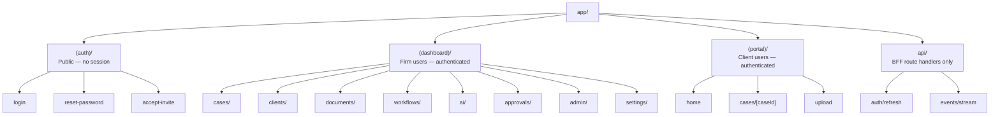
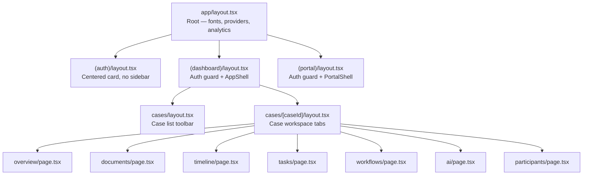
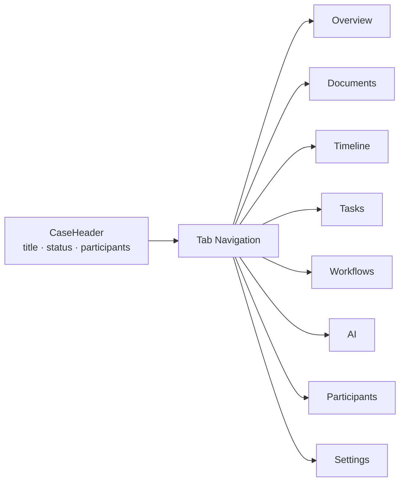
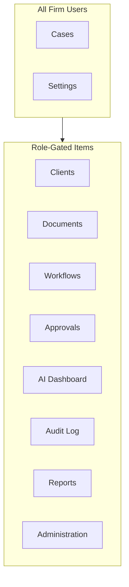
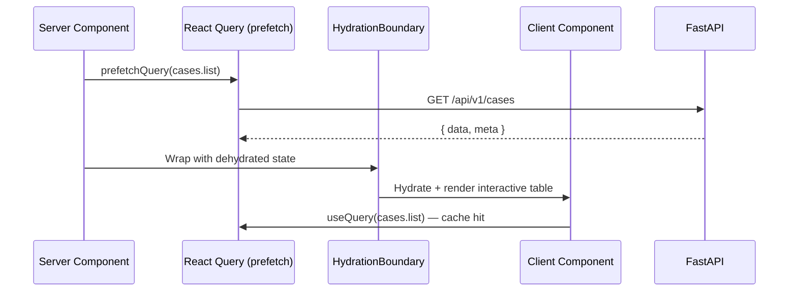
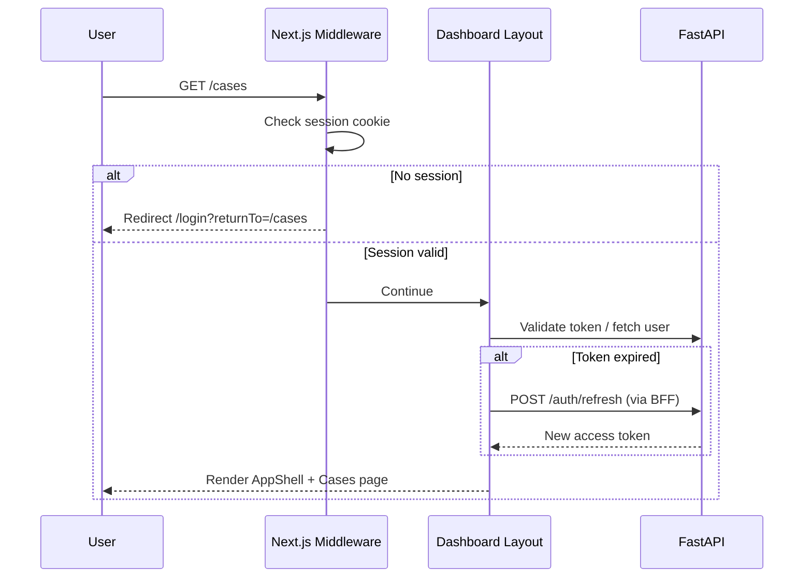

# Page Architecture — Next.js App Router & Route Groups

**LexFlow AI** — Frontend Routing, Layouts & Navigation  
**Version:** 1.0  
**Status:** Draft — Pre-Implementation  
**Last Updated:** 2026-07-06

---

## Purpose

Define the **Next.js 14+ App Router** structure for LexFlow AI — route groups, nested layouts, loading and error boundaries, and navigation patterns aligned with user personas and RBAC scopes. This document is the canonical map of every frontend URL surface.

**Invariant:** Pages fetch data exclusively via the FastAPI REST API ([../04-api/](../04-api/)). Next.js route handlers under `app/api/` are **BFF-only** (auth cookie proxy, SSE passthrough) — never business logic.

---

## Scope

| In Scope | Out of Scope |
|----------|--------------|
| App Router directory structure and route groups | FastAPI route implementation |
| Layout hierarchy and shared shells | n8n workflow configuration |
| Loading, error, and not-found boundaries | Middleware implementation code |
| Navigation model and role-filtered menus | SEO/marketing pages |
| Parallel and intercepting routes (modals) | E2E test implementation |

Cross-reference: [../01-product/user-personas.md](../01-product/user-personas.md), [../04-api/authorization-rbac.md](../04-api/authorization-rbac.md), [../08-security/matter-walls.md](../08-security/matter-walls.md).

---

## Responsibilities

| Role | Responsibility |
|------|----------------|
| **Frontend engineers** | Implement routes per this map; colocate route-specific components |
| **Backend engineers** | Ensure API endpoints match page data requirements |
| **Design / UX** | Validate navigation IA against persona workflows |
| **Security** | Review client portal route isolation |

---

## Architecture

### Route Group Topology



### Layout Hierarchy



---

## Directory Structure

```
apps/web/src/app/
├── layout.tsx                      # Root layout — providers, fonts, metadata
├── globals.css                     # Design tokens
├── not-found.tsx                   # Global 404
├── error.tsx                       # Global error boundary
│
├── (auth)/                         # Route group — unauthenticated
│   ├── layout.tsx                  # Centered auth card layout
│   ├── login/page.tsx
│   ├── reset-password/page.tsx
│   └── accept-invite/page.tsx
│
├── (dashboard)/                    # Route group — firm users
│   ├── layout.tsx                  # Auth guard + AppShell (sidebar + top nav)
│   ├── page.tsx                    # Redirect → /cases or role-based home
│   │
│   ├── cases/
│   │   ├── page.tsx                # Case list (assigned or firm-wide per role)
│   │   ├── loading.tsx
│   │   ├── error.tsx
│   │   ├── new/page.tsx            # Create case (Paralegal+)
│   │   └── [caseId]/
│   │       ├── layout.tsx          # Case workspace — tab nav, case header
│   │       ├── page.tsx            # Redirect → overview
│   │       ├── overview/page.tsx
│   │       ├── documents/
│   │       │   ├── page.tsx
│   │       │   └── [documentId]/page.tsx
│   │       ├── timeline/page.tsx
│   │       ├── tasks/page.tsx
│   │       ├── workflows/page.tsx
│   │       ├── ai/
│   │       │   ├── page.tsx        # AI job list
│   │       │   └── [jobId]/page.tsx
│   │       ├── participants/page.tsx
│   │       └── settings/page.tsx   # Case-level settings (lead only)
│   │
│   ├── clients/
│   │   ├── page.tsx
│   │   └── [clientId]/page.tsx
│   │
│   ├── documents/
│   │   └── page.tsx                # Firm-wide document search (role-gated)
│   │
│   ├── workflows/
│   │   ├── page.tsx                # Execution history
│   │   ├── templates/page.tsx      # OperationsTeam — template management
│   │   └── executions/[executionId]/page.tsx
│   │
│   ├── approvals/
│   │   └── page.tsx                # Pending approvals inbox (Attorney+)
│   │
│   ├── ai/
│   │   └── page.tsx                # Firm AI usage dashboard (ManagingPartner, Compliance)
│   │
│   ├── admin/
│   │   ├── layout.tsx              # Admin sub-nav
│   │   ├── users/page.tsx
│   │   ├── roles/page.tsx
│   │   ├── integrations/page.tsx
│   │   └── config/page.tsx
│   │
│   ├── audit/
│   │   └── page.tsx                # ComplianceOfficer — audit log explorer
│   │
│   ├── reports/
│   │   └── page.tsx                # ManagingPartner, OperationsTeam
│   │
│   └── settings/
│       ├── page.tsx                # User preferences
│       └── profile/page.tsx
│
├── (portal)/                       # Route group — client users
│   ├── layout.tsx                  # PortalShell — simplified nav
│   ├── page.tsx                    # Client home — my matters
│   ├── cases/
│   │   └── [caseId]/
│   │       ├── page.tsx            # Status + shared documents
│   │       └── upload/page.tsx
│   ├── messages/page.tsx           # Firm-to-client requests
│   └── profile/page.tsx
│
└── api/                            # BFF route handlers ONLY
    ├── auth/
    │   └── refresh/route.ts        # Proxy refresh token cookie → FastAPI
    └── events/
        └── stream/route.ts         # SSE passthrough with auth
```

---

## Route Groups Explained

### `(auth)` — Public Authentication

| Route | Purpose | API Dependency |
|-------|---------|----------------|
| `/login` | Email + password login | `POST /api/v1/auth/login` |
| `/reset-password` | Password reset flow | `POST /api/v1/auth/reset-password` |
| `/accept-invite` | Client or user invitation acceptance | `POST /api/v1/auth/accept-invite` |

No sidebar. Minimal layout. Redirect to role-appropriate home on success.

### `(dashboard)` — Firm Application

Authenticated shell with role-filtered sidebar navigation. Default landing:

| Role | Default Route |
|------|---------------|
| `Attorney`, `AssociateAttorney`, `Paralegal`, `LegalAssistant` | `/cases` |
| `ManagingPartner` | `/reports` |
| `OperationsTeam` | `/workflows/templates` |
| `ComplianceOfficer` | `/audit` |
| `SystemAdministrator`, `ITAdministrator` | `/admin/users` |

### `(portal)` — Client Portal

Separate route group with distinct layout, theme, and navigation. Clients never see firm sidebar items. See [client-portal.md](./client-portal.md).

### `api/` — BFF Route Handlers

Thin proxies only:

| Handler | Purpose | Must NOT |
|---------|---------|----------|
| `auth/refresh` | Exchange httpOnly refresh cookie for new access token | Store business logic |
| `events/stream` | Authenticated SSE passthrough to FastAPI | Call n8n |

---

## Case Workspace — Tab Model

The case detail route `[caseId]` uses a **shared layout** with tab navigation. Tabs render based on API-returned capabilities:



| Tab | Visible When | Primary Personas |
|-----|--------------|------------------|
| Overview | Always (if case accessible) | All assigned roles |
| Documents | `canReadDocuments` | Attorney, Paralegal, Legal Assistant |
| Timeline | `canReadTimeline` | All assigned roles |
| Tasks | `canReadTasks` | Paralegal, Associate, Legal Assistant |
| Workflows | `canTriggerWorkflow` or `canViewExecutions` | Paralegal, Operations |
| AI | `canRequestAI` or `canApproveAI` | Attorney, Associate, Paralegal |
| Participants | `canReadParticipants` | Attorney (lead), Paralegal |
| Settings | `canManageCase` (lead) | Attorney |

Capabilities come from `GET /api/v1/cases/{id}` response — not computed in UI from role alone.

---

## Navigation Model

### Sidebar Structure (Firm Dashboard)



Navigation items filtered server-side in layout based on JWT permissions from session. Hidden items are **not rendered** — routes still return 403/404 from API if accessed directly.

Cross-reference: Permission matrix in [../04-api/authorization-rbac.md](../04-api/authorization-rbac.md).

---

## Server vs Client Components

### Default Strategy

| Pattern | Component Type | Example |
|---------|---------------|---------|
| Page shell, initial data fetch | Server Component | `cases/page.tsx` |
| Interactive tables, forms | Client Component | `CaseListTable.tsx` |
| Auth session check | Server Component (layout) | `(dashboard)/layout.tsx` |
| Real-time subscriptions | Client Component | `WorkflowStatusLive.tsx` |
| Static metadata | Server Component | `generateMetadata()` |

### Data Fetching Pattern



---

## Loading, Error & Not-Found Boundaries

| Boundary | File | Behavior |
|----------|------|----------|
| **Loading** | `loading.tsx` | Skeleton matching page layout — never spinners alone |
| **Error** | `error.tsx` | Retry button; log to observability; no stack traces to user |
| **Not Found** | `not-found.tsx` | Generic message — especially for case routes (matter wall 404) |

### Matter Wall 404 UX

When `GET /api/v1/cases/{id}` returns 404 (blocked by matter wall or nonexistent):

- Render `not-found.tsx` with message: **"This case could not be found or you may not have access."**
- Do **not** distinguish between "doesn't exist" and "no permission"
- Do **not** redirect to case list with error toast revealing wall existence

Cross-reference: [../08-security/matter-walls.md](../08-security/matter-walls.md) — MW-004.

---

## Parallel & Intercepting Routes

### Modal Patterns (Phase 1)

| Pattern | Route | Use Case |
|---------|-------|----------|
| Intercepting | `(dashboard)/cases/@modal/(..)cases/new` | Create case modal over case list |
| Parallel slot | `@modal` | Quick-view document preview |

### Deep Linking

All modals must support direct URL access — intercepting route falls back to full page when loaded directly.

---

## Middleware

Next.js middleware (`middleware.ts`) handles:

| Concern | Action |
|---------|--------|
| Session presence | Redirect unauthenticated users to `/login` |
| Role-based route prefix | `/portal/*` requires `Client` role; `/admin/*` requires admin permissions |
| CSRF | Validate origin on mutating BFF routes |
| Correlation ID | Inject `X-Correlation-Id` if absent |

Middleware performs **coarse routing guards only**. Fine-grained authorization remains in FastAPI.

---

## Metadata & SEO

| Route Group | Indexing |
|-------------|----------|
| `(auth)` | `noindex, nofollow` |
| `(dashboard)` | `noindex, nofollow` — authenticated app |
| `(portal)` | `noindex, nofollow` |

All pages set `<meta name="robots" content="noindex, nofollow">`. Legal SaaS is not public-facing.

---

## Flow Diagrams

### Authentication Redirect Flow



### Role-Based Landing

```mermaid
flowchart TD
    LOGIN[Login Success] --> RESOLVE[Resolve role from JWT]
    RESOLVE --> ATTY{Attorney / Associate / Paralegal / LA?}
    RESOLVE --> MP{Managing Partner?}
    RESOLVE --> OPS{Operations Team?}
    RESOLVE --> COMP{Compliance Officer?}
    RESOLVE --> ADMIN{System / IT Admin?}
    RESOLVE --> CLIENT{Client?}

    ATTY --> CASES[/cases]
    MP --> REPORTS[/reports]
    OPS --> TEMPLATES[/workflows/templates]
    COMP --> AUDIT[/audit]
    ADMIN --> USERS[/admin/users]
    CLIENT --> PORTAL[/portal]
```

---

## Best Practices

1. **Colocate route-specific components** — `cases/[caseId]/components/` not global unless reused.
2. **One layout per concern** — Auth, shell, case workspace — avoid mega-layouts.
3. **Prefetch on hover** — Sidebar links prefetch case detail on hover via React Query.
4. **Stable URLs** — Case routes use UUID slugs; never expose sequential IDs.
5. **Return URLs** — Preserve `returnTo` query param through login flow.
6. **Suspense boundaries** — Wrap slow Server Components in Suspense with skeleton fallback.
7. **No business logic in layouts** — Layouts fetch user session and permissions only.

---

## Tradeoffs

| Decision | Benefit | Cost |
|----------|---------|------|
| **Route groups over separate apps** | Shared components; single deploy | Must enforce portal isolation carefully |
| **Tab-based case workspace vs nested routes** | Deep linking per tab; browser history | More layout complexity |
| **Server Component default** | Faster initial load; less client JS | Split mental model for data fetching |
| **BFF for auth/SSE only** | Thin layer; no logic drift | Extra hop for refresh and SSE |
| **404 for matter walls** | Security per MW-004 | UX ambiguity for users |

---

## Future Improvements

| Phase | Enhancement |
|-------|-------------|
| Phase 2 | Global command palette (⌘K) with route-aware search |
| Phase 2 | Intercepting routes for document preview modal |
| Phase 3 | Entra ID SSO callback route |
| Phase 3 | Customizable firm home dashboard widgets |
| Phase 4 | Mobile-optimized case workspace layout |

---

## References

| Document | Path |
|----------|------|
| UI index | [README.md](./README.md) |
| Design system | [design-system.md](./design-system.md) |
| State management | [state-management.md](./state-management.md) |
| Client portal | [client-portal.md](./client-portal.md) |
| User personas | [../01-product/user-personas.md](../01-product/user-personas.md) |
| Authorization RBAC | [../04-api/authorization-rbac.md](../04-api/authorization-rbac.md) |
| Matter walls | [../08-security/matter-walls.md](../08-security/matter-walls.md) |
| Authentication | [../04-api/authentication.md](../04-api/authentication.md) |
| Folder structure | [../folder-structure.md](../folder-structure.md) |
