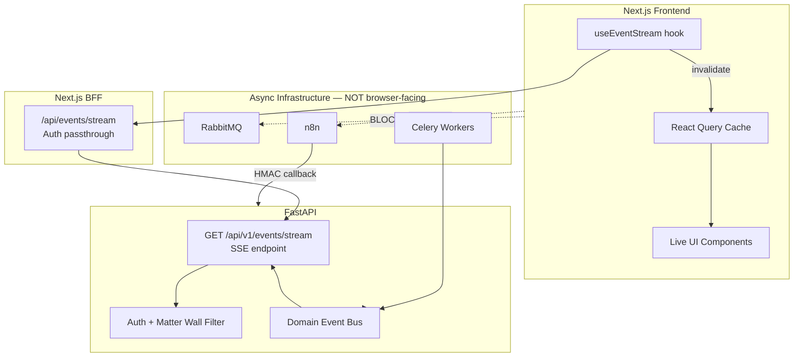
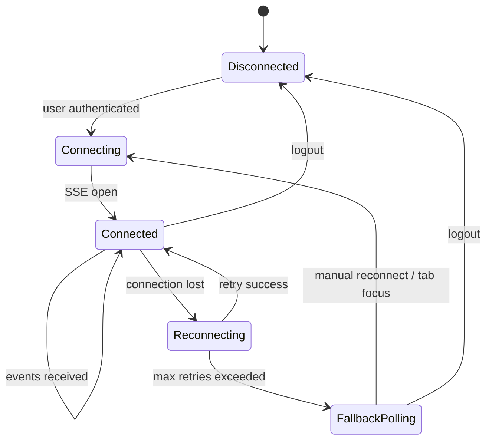
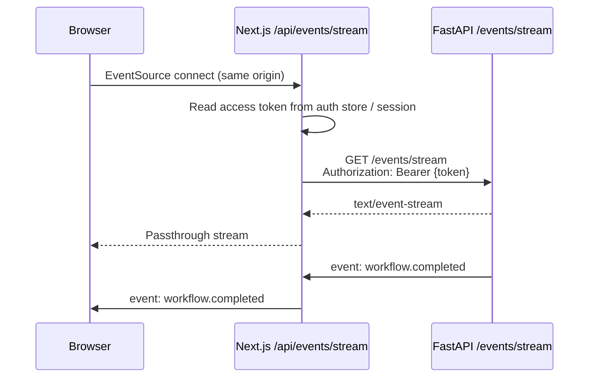
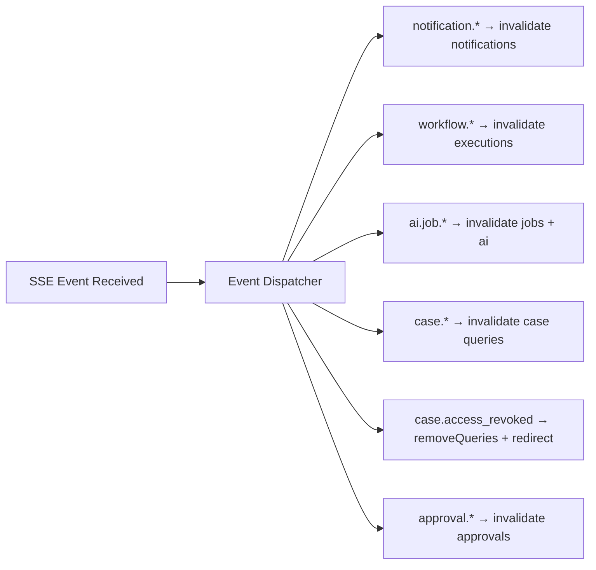
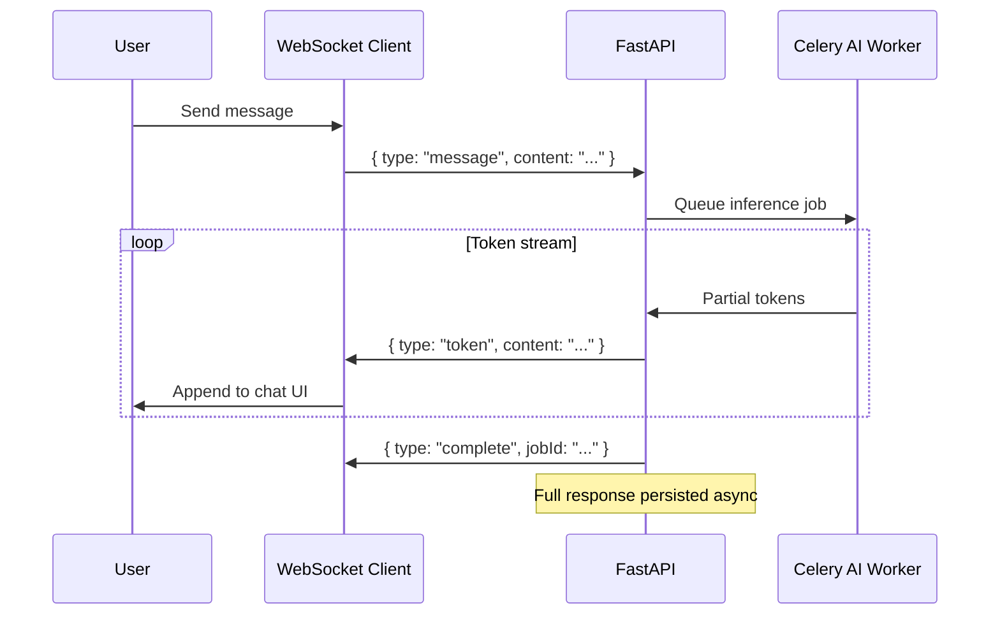
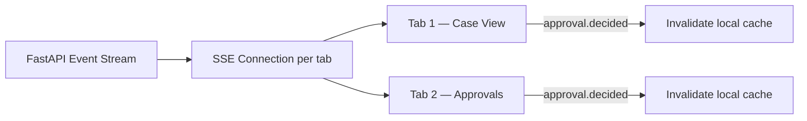

# Real-Time Updates — SSE & WebSocket Patterns

**LexFlow AI** — Live Notifications, Workflow Status & Async Job Completion  
**Version:** 1.0  
**Status:** Draft — Pre-Implementation  
**Last Updated:** 2026-07-06

---

## Purpose

Define how the LexFlow AI frontend receives **real-time updates** for notifications, workflow execution status, async AI job completion, and case activity — using **Server-Sent Events (SSE)** as the default transport and **WebSocket** for bidirectional channels where required.

All real-time connections terminate at **FastAPI**, never at n8n. The browser has no direct path to orchestration infrastructure.

---

## Scope

| In Scope | Out of Scope |
|----------|--------------|
| SSE connection lifecycle and event types | n8n webhook callback implementation |
| WebSocket roadmap for AI chat streaming | Email and Teams notification delivery |
| BFF passthrough pattern in Next.js | RabbitMQ consumer configuration |
| React Query invalidation on events | Push notification mobile (Phase 4) |
| Reconnection, backoff, and fallback polling | Server-side event sourcing internals |

Cross-reference: [../04-api/endpoints-workflows.md](../04-api/endpoints-workflows.md), [../04-api/endpoints-ai.md](../04-api/endpoints-ai.md), [state-management.md](./state-management.md).

---

## Responsibilities

| Role | Responsibility |
|------|----------------|
| **Frontend engineers** | Implement SSE client hook; invalidate React Query on events |
| **Backend engineers** | Publish scoped events from domain services; enforce matter walls on stream |
| **DevOps / SRE** | Configure ALB idle timeout, sticky sessions if needed |
| **Security** | Validate JWT on stream connect; audit subscription attempts |

---

## Architecture

### Real-Time Data Path



### Transport Selection

| Use Case | Transport | Phase | Rationale |
|----------|-----------|-------|-----------|
| Notifications (new, read) | SSE | 1 | Unidirectional; HTTP-friendly |
| Workflow status changes | SSE | 1 | Status push to subscribed clients |
| AI job completion | SSE | 1 | Replace polling on terminal states |
| Case timeline append | SSE | 1 | Live activity feed |
| Approval requests | SSE | 1 | Attorney inbox updates |
| Access revocation | SSE | 1 | Immediate cache purge |
| AI chat token streaming | WebSocket | 2 | Bidirectional; low-latency tokens |
| Collaborative presence | WebSocket | 4 | Future — who is viewing case |

**Default: SSE.** WebSocket introduced only when bidirectional streaming is required.

---

## SSE Endpoint Contract

### Connection

```
GET /api/v1/events/stream
Authorization: Bearer {accessToken}
Accept: text/event-stream
Last-Event-ID: {optional — for reconnect resume}
```

FastAPI authenticates JWT, resolves user, and opens a **user-scoped event stream**. Events are filtered server-side by matter wall — clients never receive events for unauthorized cases.

### Event Format

```
id: 550e8400-e29b-41d4-a716-446655440001
event: workflow.completed
data: {"caseId":"...","executionId":"...","status":"completed","correlationId":"..."}

```

| Field | Required | Description |
|-------|----------|-------------|
| `id` | Yes | Monotonic event ID for `Last-Event-ID` resume |
| `event` | Yes | Event type enum (see catalog below) |
| `data` | Yes | JSON payload — camelCase, minimal fields |
| `retry` | No | Server-suggested reconnect ms (default 3000) |

Cross-reference: Response envelope conventions in [../04-api/rest-standards.md](../04-api/rest-standards.md).

---

## Event Catalog

### Notification Events

| Event Type | Payload Fields | UI Action |
|------------|---------------|-----------|
| `notification.created` | `notificationId`, `title`, `body`, `caseId?`, `priority` | Increment unread badge; toast if high priority |
| `notification.read` | `notificationId` | Update badge count (multi-tab sync) |

### Workflow Events

| Event Type | Payload Fields | UI Action |
|------------|---------------|-----------|
| `workflow.started` | `caseId`, `executionId`, `workflowName` | Update execution list; show in-progress badge |
| `workflow.step_completed` | `executionId`, `stepName`, `stepIndex`, `totalSteps` | Progress bar update |
| `workflow.completed` | `caseId`, `executionId`, `resultSummary` | Toast success; invalidate workflow queries |
| `workflow.failed` | `caseId`, `executionId`, `errorCode`, `errorMessage` | Toast error; show retry CTA |
| `workflow.cancelled` | `caseId`, `executionId` | Update status pill |

Cross-reference: Workflow lifecycle in [../04-api/endpoints-workflows.md](../04-api/endpoints-workflows.md).

### AI Job Events

| Event Type | Payload Fields | UI Action |
|------------|---------------|-----------|
| `ai.job.started` | `jobId`, `caseId`, `jobType` | Show running indicator |
| `ai.job.completed` | `jobId`, `caseId`, `jobType`, `requiresApproval` | Invalidate AI queries; route to review if approval needed |
| `ai.job.failed` | `jobId`, `caseId`, `errorCode` | Show error state |
| `ai.approval.requested` | `jobId`, `caseId`, `requestedBy` | Notify assigned attorneys |

Cross-reference: Async AI pattern in [../04-api/endpoints-ai.md](../04-api/endpoints-ai.md), [../13-decisions/004-async-ai-processing.md](../13-decisions/004-async-ai-processing.md).

### Case Events

| Event Type | Payload Fields | UI Action |
|------------|---------------|-----------|
| `case.updated` | `caseId`, `changedFields[]` | Invalidate case detail |
| `case.timeline.appended` | `caseId`, `timelineEntryId`, `entryType` | Prepend to timeline if tab active |
| `case.access_revoked` | `caseId` | **Purge cache**; redirect if viewing |
| `case.participant.added` | `caseId`, `userId`, `role` | Invalidate participants |

Cross-reference: Matter wall enforcement in [../08-security/matter-walls.md](../08-security/matter-walls.md).

### Approval Events

| Event Type | Payload Fields | UI Action |
|------------|---------------|-----------|
| `approval.requested` | `approvalId`, `caseId`, `type`, `requestedBy` | Badge on approvals nav |
| `approval.decided` | `approvalId`, `caseId`, `decision`, `decidedBy` | Toast; invalidate approvals + related resource |

---

## Frontend Implementation Pattern

### Connection Lifecycle



### Reconnection Strategy

| Parameter | Value |
|-----------|-------|
| Initial retry delay | 1s |
| Max retry delay | 30s (exponential backoff × 2) |
| Max consecutive failures | 10 → fallback to polling |
| Resume | Send `Last-Event-ID` header on reconnect |
| Tab visibility | Reconnect immediately on `document.visibilitychange` → visible |

### Fallback Polling

When SSE unavailable (corporate proxy, network failure):

| Resource | Poll Interval | Endpoint |
|----------|---------------|----------|
| Unread notifications | 60s | `GET /api/v1/notifications?unread=true` |
| Active workflow executions | 5s | `GET /api/v1/jobs/{id}` or execution status |
| Active AI jobs | 5s | `GET /api/v1/jobs/{id}` |

Show subtle banner: "Live updates unavailable — refreshing periodically."

---

## BFF Passthrough

Next.js route handler proxies SSE to avoid CORS and attach cookies:



**BFF rules:**
- Passthrough only — no event transformation or buffering
- Close upstream when client disconnects
- Do not log event payloads (may contain privileged content)

---

## React Query Integration

### Event Handler Registry

Central dispatcher maps event types to cache invalidations:



See invalidation matrix in [state-management.md](./state-management.md).

### Live UI Components

| Component | Event Subscription | Behavior |
|-----------|-------------------|----------|
| `NotificationBell` | `notification.*` | Badge count; dropdown prepend |
| `WorkflowStatusCard` | `workflow.*` for `executionId` | Progress bar; status pill |
| `AIJobTracker` | `ai.job.*` for `jobId` | Spinner → result link |
| `CaseTimeline` | `case.timeline.appended` | Animate new entry if tab active |
| `ApprovalInbox` | `approval.*` | Live queue update |
| `ConnectionIndicator` | connection state | Green dot / "Reconnecting..." |

---

## WebSocket — Phase 2 (AI Chat Streaming)

### When SSE Is Insufficient

AI chat requires **bidirectional** communication — user sends message, server streams tokens. Phase 2 introduces:

```
WSS /api/v1/ai/chat/{sessionId}/stream
```



Full chat response still persisted via async path per ADR-004. WebSocket is transport only.

---

## Security Requirements

| Requirement | Implementation |
|-------------|----------------|
| Authentication | JWT validated on stream connect; close on 401 |
| Authorization | Server filters events by matter wall — no client-side filter reliance |
| No enumeration | Stream never emits case IDs user cannot access |
| Rate limiting | Max 3 concurrent SSE connections per user |
| Audit | Log connect, disconnect, and auth failures |
| TLS | WSS and HTTPS only in production |
| Token refresh | Close and reconnect SSE after token refresh |

Cross-reference: [../08-security/matter-walls.md](../08-security/matter-walls.md), [../04-api/authentication.md](../04-api/authentication.md).

---

## Flow Diagrams

### Workflow Completion — End to End

```mermaid
sequenceDiagram
    participant U as Paralegal (Browser)
    participant API as FastAPI
    participant MQ as RabbitMQ
    participant W as Celery Worker
    participant N8N as n8n
    participant SSE as SSE Stream

    U->>API: POST /cases/{id}/workflows/trigger
    API-->>U: 202 { executionId }
    API->>MQ: WorkflowTriggered event
    MQ->>W: Consume
    W->>N8N: Invoke webhook
    N8N->>N8N: Execute steps
    N8N->>API: HMAC callback — completed
    API->>API: Update execution status
    API->>SSE: Emit workflow.completed
    SSE->>U: Event received
    U->>U: Invalidate queries; toast "Discovery prep complete"
```

Note: n8n communicates with FastAPI only. Browser receives events via SSE from FastAPI.

### Multi-Tab Synchronization



Each tab maintains its own SSE connection (up to rate limit). Shared auth session.

---

## Persona-Specific Real-Time Needs

Cross-reference: [../01-product/user-personas.md](../01-product/user-personas.md)

| Persona | Priority Events | UX Expectation |
|---------|----------------|----------------|
| **Attorney** | Approval requests, AI job completed, deadline approaching | High-priority toast; never miss approval |
| **Paralegal** | Workflow completed/failed, task assigned | Status updates on workflow tab |
| **Associate** | AI job completed (needs review) | Clear "ready for review" indicator |
| **Managing Partner** | Firm-wide workflow metrics (Phase 2) | Dashboard refresh — not individual case SSE |
| **Compliance Officer** | Audit-critical events (Phase 2) | Optional audit stream |
| **Client** | Milestone updates, document requests | Portal notifications — simplified |

---

## Best Practices

1. **SSE first** — Do not introduce WebSocket until bidirectional need is proven.
2. **Invalidate, don't merge** — Push events trigger React Query invalidation, not manual cache surgery.
3. **Scope events minimally** — Payloads contain IDs only; detail fetched via query invalidation.
4. **Handle revocation immediately** — `case.access_revoked` purges cache and redirects.
5. **Graceful degradation** — Always have polling fallback; never block UX on SSE.
6. **No n8n in browser** — All events originate from FastAPI domain layer.
7. **Connection indicator** — Show subtle status when SSE disconnected.

---

## Tradeoffs

| Decision | Benefit | Cost |
|----------|---------|------|
| **SSE over WebSocket (Phase 1)** | Simpler; works through most proxies | One-directional only |
| **BFF passthrough** | Same-origin; cookie access | Extra network hop |
| **Invalidate vs push full state** | Smaller payloads; always fresh | Extra API call on event |
| **Per-tab connections** | Simpler than SharedWorker | 3-connection rate limit |
| **Fallback polling** | Resilient UX | Increased API load during outages |

---

## Future Improvements

| Phase | Enhancement |
|-------|-------------|
| Phase 2 | WebSocket AI chat streaming |
| Phase 2 | Server-sent heartbeat for connection health |
| Phase 3 | Redis pub/sub fan-out for horizontal SSE scaling |
| Phase 3 | Client portal push notifications (web push API) |
| Phase 4 | Collaborative presence indicators |

---

## References

| Document | Path |
|----------|------|
| UI index | [README.md](./README.md) |
| State management | [state-management.md](./state-management.md) |
| Page architecture | [page-architecture.md](./page-architecture.md) |
| Endpoints — Workflows | [../04-api/endpoints-workflows.md](../04-api/endpoints-workflows.md) |
| Endpoints — AI | [../04-api/endpoints-ai.md](../04-api/endpoints-ai.md) |
| REST standards | [../04-api/rest-standards.md](../04-api/rest-standards.md) |
| Matter walls | [../08-security/matter-walls.md](../08-security/matter-walls.md) |
| User personas | [../01-product/user-personas.md](../01-product/user-personas.md) |
| ADR-002 n8n orchestration | [../13-decisions/002-n8n-orchestration-only.md](../13-decisions/002-n8n-orchestration-only.md) |
| ADR-004 Async AI | [../13-decisions/004-async-ai-processing.md](../13-decisions/004-async-ai-processing.md) |
