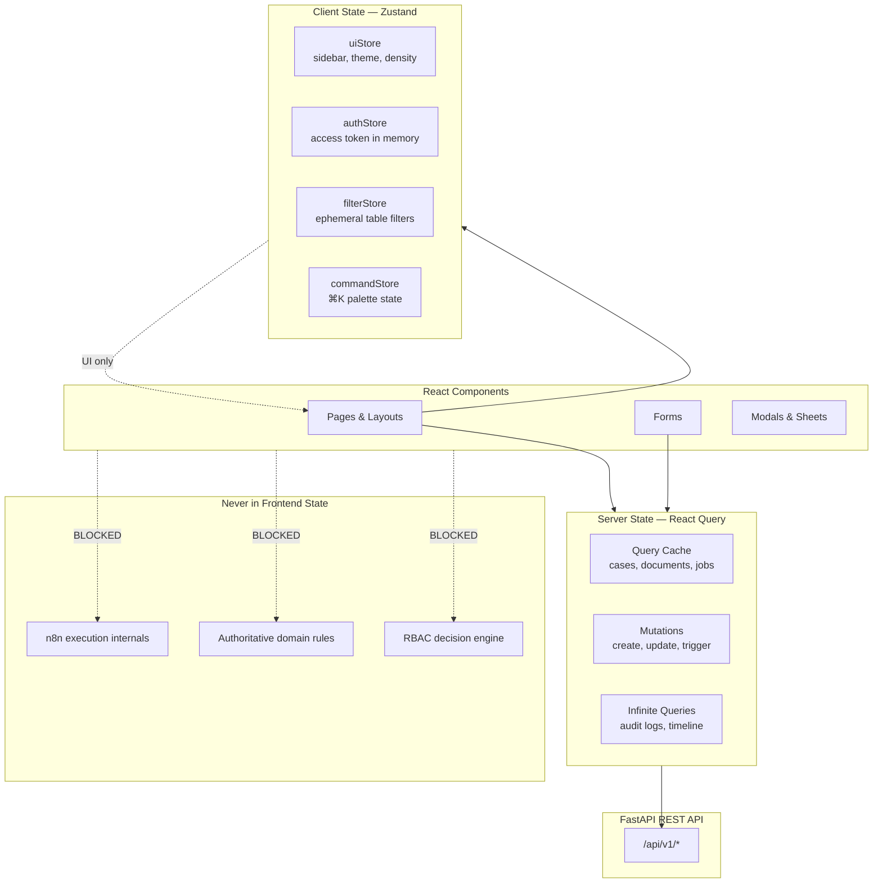
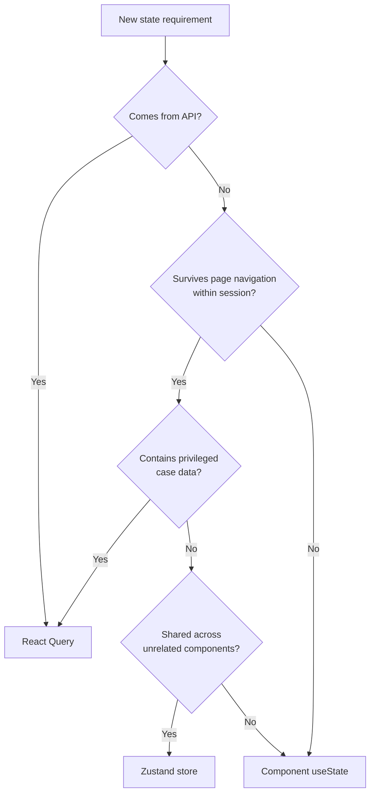
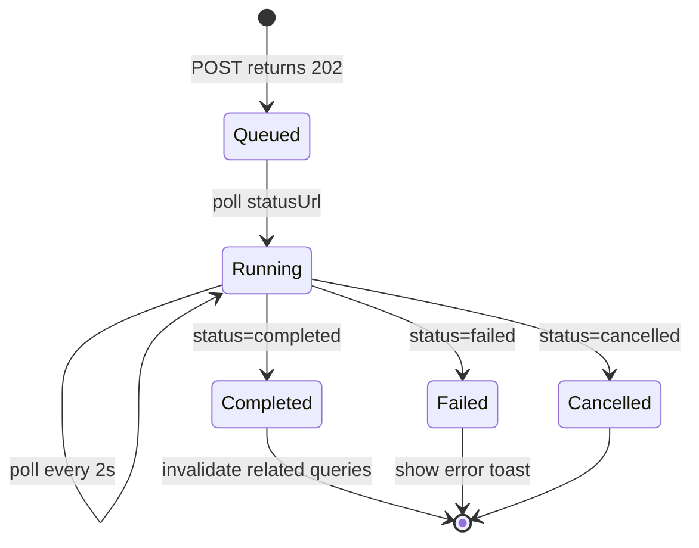
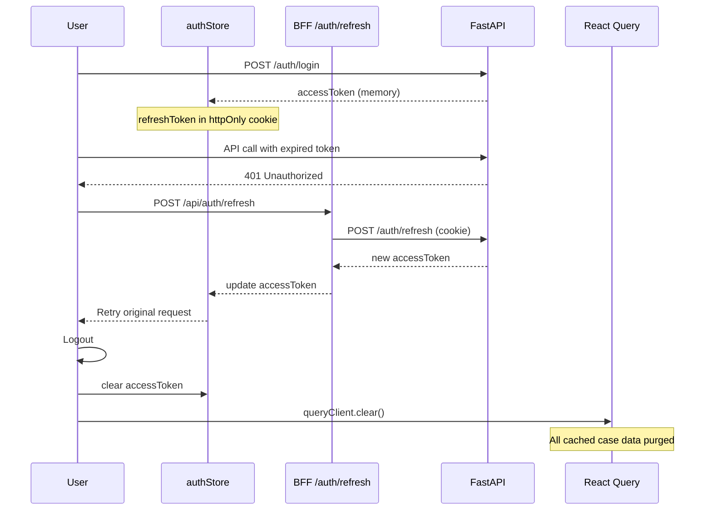
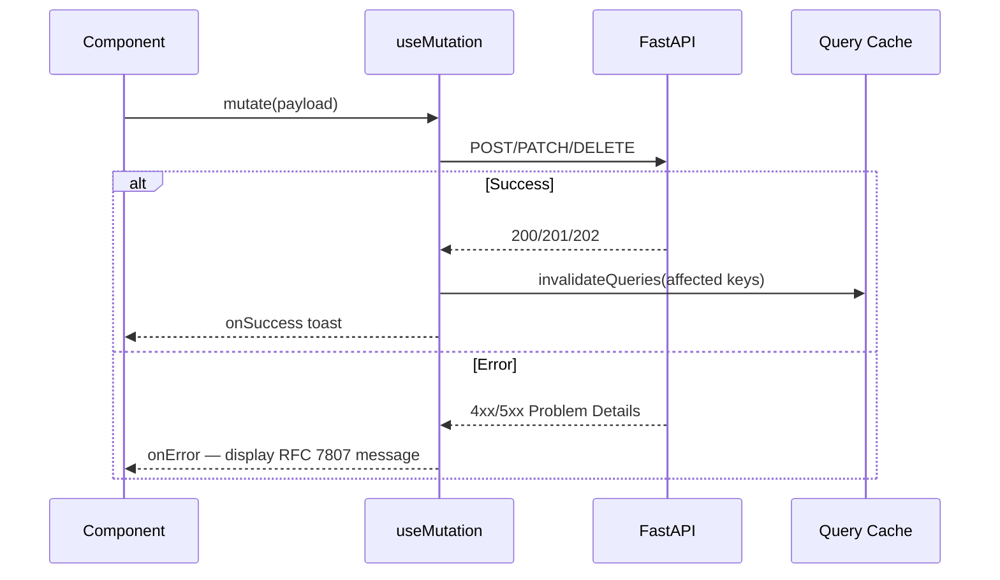
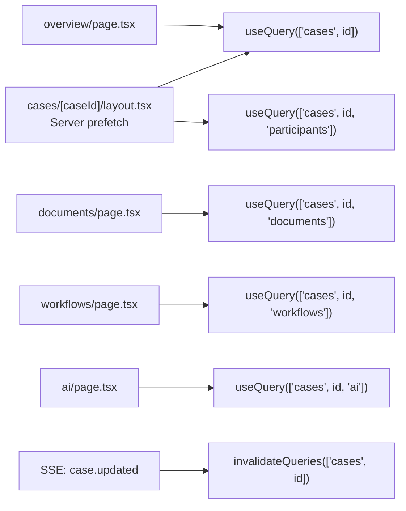
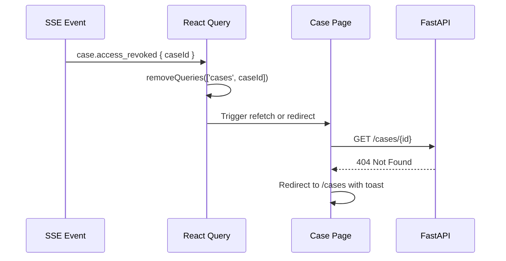

# State Management — Zustand vs React Query Boundaries

**LexFlow AI** — Client State, Server Cache & Data Flow  
**Version:** 1.0  
**Status:** Draft — Pre-Implementation  
**Last Updated:** 2026-07-06

---

## Purpose

Define **clear boundaries** between client-side UI state (Zustand) and server-side data cache (TanStack React Query) in the LexFlow AI Next.js frontend. This document prevents state duplication, cache inconsistency, and unauthorized data retention patterns in a legal enterprise context.

All server data originates from the FastAPI REST API ([../04-api/](../04-api/)). The frontend never maintains an authoritative copy of domain entities.

---

## Scope

| In Scope | Out of Scope |
|----------|--------------|
| Zustand store definitions and allowed state | FastAPI service layer state |
| React Query cache keys, invalidation, and mutations | PostgreSQL transaction management |
| Optimistic update policy | n8n execution state machine |
| Auth session token handling in memory | Redis server-side cache |
| Form state and URL state conventions | WebSocket protocol design (see real-time-updates.md) |

Cross-reference: [../04-api/rest-standards.md](../04-api/rest-standards.md), [../04-api/error-handling.md](../04-api/error-handling.md), [../08-security/matter-walls.md](../08-security/matter-walls.md).

---

## Responsibilities

| Role | Responsibility |
|------|----------------|
| **Frontend engineers** | Implement stores and query hooks per boundaries below |
| **Backend engineers** | Provide stable API contracts and `ETag`/`version` for concurrency |
| **Security** | Ensure no privileged data in localStorage or Zustand persistence |

---

## Architecture

### State Layer Model

### Decision Flow — Where Does State Live?

---

## React Query — Server State

### Principles

1. **Single source of truth** — API response is authoritative; cache is a read-through copy.
2. **Stale-while-revalidate** — Default `staleTime: 30_000` (30s) for lists; `staleTime: 0` for detail views on focus.
3. **No persistence** — React Query cache is in-memory only; cleared on logout.
4. **Typed hooks** — Generated from OpenAPI + thin wrapper hooks in `hooks/api/`.
5. **Invalidation over manual merge** — After mutations, invalidate affected query keys.

### Query Key Factory

Centralized in `lib/query-keys.ts`:

| Key Pattern | Example | Used By |
|-------------|---------|---------|
| `['cases', 'list', filters]` | Case list with pagination | `/cases` page |
| `['cases', caseId]` | Case detail + capabilities | Case workspace layout |
| `['cases', caseId, 'documents']` | Document list | Documents tab |
| `['cases', caseId, 'timeline']` | Timeline events | Timeline tab |
| `['cases', caseId, 'workflows', 'executions']` | Workflow executions | Workflows tab |
| `['cases', caseId, 'ai', 'jobs']` | AI job list | AI tab |
| `['jobs', jobId]` | Single async job status | AI/workflow polling |
| `['workflows', 'definitions']` | Available workflow templates | Trigger modal |
| `['workflows', 'executions', executionId]` | Execution detail | Execution page |
| `['approvals', 'pending']` | Approval inbox | `/approvals` |
| `['notifications', 'unread']` | Unread count | Notification bell |
| `['audit', 'logs', filters]` | Audit log (infinite) | `/audit` |
| `['admin', 'users']` | User list | Admin pages |
| `['portal', 'cases']` | Client portal matters | Portal home |

### Default Query Options

| Option | Value | Rationale |
|--------|-------|-----------|
| `staleTime` | 30s (lists), 0 (detail on mount) | Balance freshness vs API load |
| `gcTime` | 5 min | Memory cleanup after unmount |
| `retry` | 3 (GET), 0 (mutations) | Avoid duplicate side effects |
| `refetchOnWindowFocus` | true (detail), false (lists) | Attorney switching tabs |
| `refetchInterval` | false (default) | Use SSE for live updates |

### Async Job Polling

AI and workflow jobs return `202 Accepted`. Polling strategy:

| Phase | Poll Interval | Max Duration | Fallback |
|-------|---------------|--------------|----------|
| `queued` | 2s | — | SSE event if connected |
| `running` | 2s → 5s (backoff) | Job timeout from API | Manual refresh button |
| Terminal | Stop polling | — | Invalidate case + job queries |

Cross-reference: [../04-api/endpoints-ai.md](../04-api/endpoints-ai.md), [../04-api/endpoints-workflows.md](../04-api/endpoints-workflows.md).

Prefer SSE push over polling when connection active — see [real-time-updates.md](./real-time-updates.md).

---

## Zustand — Client State

### Approved Stores

| Store | File | State | Persisted? |
|-------|------|-------|------------|
| `useAuthStore` | `stores/auth-store.ts` | Access token (memory), user display name | **No** — memory only |
| `useUiStore` | `stores/ui-store.ts` | Sidebar collapsed, density mode, active modal ID | localStorage (non-sensitive) |
| `useFilterStore` | `stores/filter-store.ts` | Table column visibility, sort preferences | localStorage (non-sensitive) |
| `useCommandStore` | `stores/command-store.ts` | Command palette open, search query | No |

### Prohibited in Zustand

| Data | Why | Use Instead |
|------|-----|-------------|
| Case list / detail | Authoritative data from API | React Query |
| Document content or metadata | Privileged; matter-scoped | React Query |
| AI summaries or outputs | Legal work product | React Query |
| User permissions / RBAC matrix | Security decision in backend | API capability flags per resource |
| Workflow execution state | Async lifecycle owned by API | React Query + SSE |
| Refresh token | XSS risk | httpOnly cookie via BFF |

Cross-reference: Token storage in [../04-api/authentication.md](../04-api/authentication.md).

### Auth Store Lifecycle

**Critical:** On logout, call `queryClient.clear()` to purge all cached matter data from memory.

---

## Mutations

### Standard Mutation Pattern

### Optimistic Update Policy

| Operation | Optimistic? | Rationale |
|-----------|-------------|-----------|
| Mark notification read | **Yes** | Low risk; reversible |
| Toggle sidebar | **Yes** | UI-only |
| Update case title | **No** | Optimistic concurrency via `If-Match` |
| Upload document | **No** | Multi-step presigned flow |
| Trigger workflow | **No** | 202 async; show pending state |
| Request AI summary | **No** | Legal output; await server |
| Approve AI output | **No** | Legal gate; server authoritative |
| Add case participant | **No** | Matter wall side effects |

### Idempotency

Mutations that trigger side effects include `Idempotency-Key` header per [../04-api/rest-standards.md](../04-api/rest-standards.md):

- Case create
- Workflow trigger
- Document confirm upload

Generate key with `crypto.randomUUID()` at mutation call time; store in mutation context for retry.

### Concurrency Control

Updates to mutable resources send `If-Match: {version}` from cached entity. On `412 Precondition Failed`:

1. Invalidate entity query
2. Show conflict dialog: "This case was updated by another user. Refresh to see changes."
3. Never silently overwrite

---

## Cache Invalidation Matrix

| Mutation | Invalidated Query Keys |
|----------|------------------------|
| Create case | `['cases', 'list']` |
| Update case | `['cases', caseId]`, `['cases', 'list']` |
| Upload document | `['cases', caseId, 'documents']`, `['cases', caseId, 'timeline']` |
| Trigger workflow | `['cases', caseId, 'workflows']`, `['workflows', 'executions']` |
| AI job completed (SSE) | `['jobs', jobId]`, `['cases', caseId, 'ai']` |
| Approve AI output | `['approvals', 'pending']`, `['cases', caseId, 'ai']` |
| Add participant | `['cases', caseId, 'participants']`, `['cases', caseId]` |

---

## Form State

| Pattern | Tool | When |
|---------|------|------|
| Simple forms | React Hook Form + Zod | Create case, settings |
| Multi-step wizard | RHF + Zustand wizard store | Client intake (portal) |
| Search/filter | URL search params (`nuqs`) | Case list filters — shareable URLs |
| Draft persistence | **None in Phase 1** | Future: server-side draft API |

Form validation schemas in `lib/schemas/` mirror API request DTOs — single source derived from OpenAPI where possible.

---

## Flow Diagrams

### Case Detail Page Data Flow

Layout prefetches shared data; tabs fetch tab-specific data on mount (lazy).

### Matter Wall — Cache Safety

When user loses access to a case (participant removed while viewing):

Never retain case data in cache after access revocation event.

Cross-reference: [../08-security/matter-walls.md](../08-security/matter-walls.md).

---

## Best Practices

1. **Never duplicate API data in Zustand** — If it came from the server, it lives in React Query.
2. **Clear cache on logout** — Mandatory purge of all query data.
3. **Use capability flags from API** — `case.capabilities.canApproveAI`, not client-side role checks alone.
4. **Centralize query keys** — Prevent typos and enable consistent invalidation.
5. **Handle 404 uniformly** — Remove stale cache entry; show not-found UI.
6. **Debounce search** — 300ms debounce on filter inputs before query key change.
7. **SSR prefetch + hydrate** — Server Components prefetch; pass to `HydrationBoundary`.

---

## Tradeoffs

| Decision | Benefit | Cost |
|----------|---------|------|
| **React Query over Redux for server state** | Built-in cache, retry, dedup | Team must learn invalidation patterns |
| **Zustand over Context for UI state** | Minimal boilerplate; no provider nesting | Another dependency |
| **No cache persistence** | No privileged data at rest in browser | Full refetch on page reload |
| **Memory-only access token** | XSS mitigation | Lost on hard refresh — refresh via cookie |
| **URL state for filters** | Shareable links | Slightly more complex routing |
| **No optimistic updates for legal ops** | Prevents false "approved" UI | Slightly slower perceived UX |

---

## Future Improvements

| Phase | Enhancement |
|-------|-------------|
| Phase 2 | Server-side form draft API with React Query persistence |
| Phase 2 | Optimistic timeline entries with rollback |
| Phase 3 | Offline queue for document upload (portal) |
| Phase 3 | Query cache persistence encrypted (IndexedDB) for mobile |
| Phase 4 | Real-time collaborative editing state (WebSocket CRDT) |

---

## References

| Document | Path |
|----------|------|
| UI index | [README.md](./README.md) |
| Page architecture | [page-architecture.md](./page-architecture.md) |
| Real-time updates | [real-time-updates.md](./real-time-updates.md) |
| REST standards | [../04-api/rest-standards.md](../04-api/rest-standards.md) |
| Error handling | [../04-api/error-handling.md](../04-api/error-handling.md) |
| Authentication | [../04-api/authentication.md](../04-api/authentication.md) |
| Endpoints — AI | [../04-api/endpoints-ai.md](../04-api/endpoints-ai.md) |
| Endpoints — Workflows | [../04-api/endpoints-workflows.md](../04-api/endpoints-workflows.md) |
| Matter walls | [../08-security/matter-walls.md](../08-security/matter-walls.md) |
| ADR-004 Async AI | [../13-decisions/004-async-ai-processing.md](../13-decisions/004-async-ai-processing.md) |
