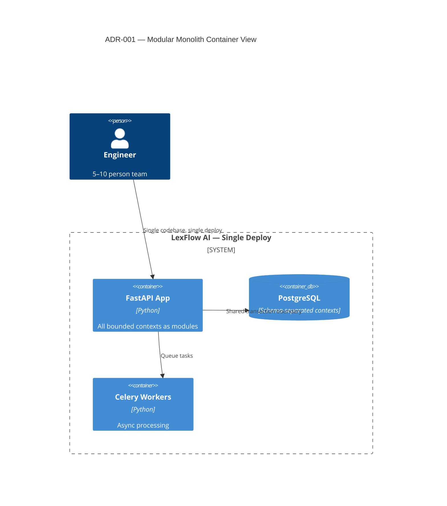
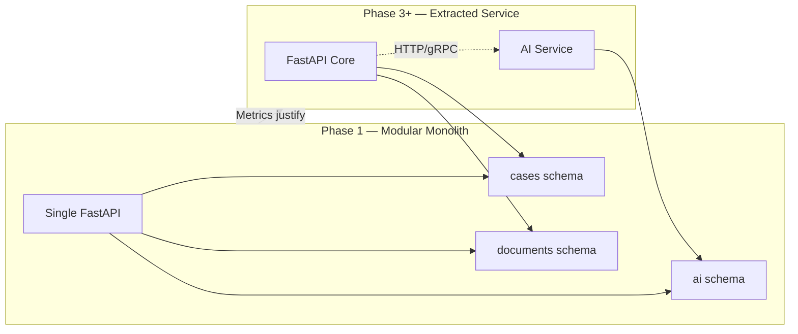

# ADR-001: Start with Modular Monolith

**Status:** Accepted  
**Date:** 2026-07-06  
**Deciders:** Architecture Team

---

## Purpose

Establish the **deployment and codebase topology** for LexFlow AI Phase 1–2. This decision balances delivery speed for a pre-production team against a clear extraction path when scale or organizational boundaries justify microservices.

---

## Scope

### In Scope

- Single deployable FastAPI application with bounded context modules
- PostgreSQL schema separation per context (see [ADR-003](./003-postgresql-single-database.md))
- Extraction criteria and migration path to independent services
- Team size and operational complexity assumptions

### Out of Scope

- Multi-tenant SaaS deployment model (future)
- Kubernetes vs ECS Fargate runtime choice (see [../09-deployment/aws-topology.md](../09-deployment/aws-topology.md))
- Per-service CI/CD pipelines

---

## Context

LexFlow AI has multiple bounded contexts — Case Management, Document Management, AI & Knowledge, Workflow Orchestration, Audit & Compliance, and others — that *could* be deployed as separate microservices. However:

- The team is **pre-implementation** with no production traffic patterns to justify distributed operations complexity.
- The target deployment is a **single large US law firm** (not multi-tenant SaaS initially).
- Expected Phase 1 team size is **5–10 engineers**.
- [Vision](../01-product/vision.md) prioritizes case-centric delivery and operational excellence over premature distribution.

Cross-reference: [bounded contexts](../02-domain/bounded-contexts.md), [component architecture](../03-architecture/component-architecture.md), [capabilities](../01-product/capabilities.md).

---

## Options

### 1. Microservices from Day One

Independent deployable services per bounded context with separate databases.

| Pros | Cons |
|------|------|
| Independent scaling per context | Service mesh, distributed tracing, multiple deploy pipelines |
| Team autonomy per service | Premature optimization without traffic data |
| Technology flexibility per service | Slower initial development; higher ops burden |

### 2. Modular Monolith (Selected)

Single FastAPI application organized into bounded context modules (`services/{context}/`), shared PostgreSQL with schema separation.

| Pros | Cons |
|------|------|
| Simple deployment; fast feature development | All modules deploy together |
| Single transaction boundary | Cannot scale individual contexts independently in Phase 1 |
| Clean module boundaries preserved for extraction | All engineers must understand full codebase initially |
| Easy refactoring within monolith | Shared runtime failure domain |

### 3. Monolith Without Boundaries

Single codebase with no module separation.

| Pros | Cons |
|------|------|
| Simplest initial structure | Becomes unmaintainable quickly |
| Fastest first commit | No extraction path; tangled dependencies |

---

## Decision

Start with a **modular monolith**: a single FastAPI application organized into bounded context modules under `services/{context}/`, with PostgreSQL schema separation per context ([ADR-003](./003-postgresql-single-database.md)).

**Extract to independent services only when metrics justify the operational cost:**

- Sustained CPU/memory pressure isolated to one context
- Deployment frequency conflicts between teams
- Organizational boundaries requiring independent release cadence

---

## Consequences

### Positive

- **Single deploy** simplifies Phase 1 operations and debugging.
- **Shared transactions** enable consistency without distributed sagas for most flows.
- **Faster feature development** — no cross-service contract negotiation for every change.
- **Clean module boundaries** preserved: each context has its own schema, repository interfaces, and event contracts.

### Negative

- Cannot scale individual contexts independently in Phase 1.
- All engineers must understand the full codebase initially.
- A runtime failure in one module affects the entire API process.

### Migration Path

Each bounded context module maintains:

- Dedicated PostgreSQL schema
- Repository interfaces behind domain services
- Published domain event contracts

Extraction requires: add HTTP/gRPC adapter, move schema to separate database, deploy as independent container — business logic remains largely unchanged.

---

## Best Practices

1. **Enforce module boundaries in code review** — No direct imports across `services/{context}/` except via published interfaces or domain events.
2. **One schema per context** — Never add cross-context foreign keys; use application-level references.
3. **Publish events, don't call across modules** — Use [ADR-006](./006-transactional-outbox.md) for cross-context communication.
4. **Track extraction candidates** — Log CPU/memory per module in observability dashboards.
5. **Align folder structure** — See [folder-structure.md](../folder-structure.md) for `services/` layout.

---

## Tradeoffs

| Decision | Benefit | Cost |
|----------|---------|------|
| Modular monolith over microservices | 3–6 month faster MVP; simpler ops | Vertical scaling ceiling per context |
| Schema separation over shared tables | Extraction-ready; clear ownership | Explicit schema prefixes in SQL |
| Single deploy over independent services | One rollback; one health check | Blast radius of bad deploy |
| Deferred extraction | Avoid premature complexity | Must maintain discipline as codebase grows |

---

## Future Improvements

| Trigger | Action |
|---------|--------|
| AI worker CPU > 70% sustained | Extract AI context to dedicated worker fleet first (already partially isolated) |
| Workflow deploy conflicts weekly | Evaluate Workflow Orchestration extraction |
| Second firm deployment (multi-tenant) | Revisit tenancy model; may require Identity context extraction |
| Phase 3+ | ADR supersession if microservices topology adopted |

---

## References

| Document | Relationship |
|----------|--------------|
| [../01-product/vision.md](../01-product/vision.md) | Strategic pillars — case-centric, enterprise deployment |
| [../01-product/capabilities.md](../01-product/capabilities.md) | Thirteen capabilities mapped to bounded contexts |
| [../01-product/roadmap.md](../01-product/roadmap.md) | Phase 1 team size and delivery timeline |
| [../03-architecture/component-architecture.md](../03-architecture/component-architecture.md) | FastAPI module layout |
| [../03-architecture/container-architecture.md](../03-architecture/container-architecture.md) | ECS Fargate deployment topology |
| [../02-domain/bounded-contexts.md](../02-domain/bounded-contexts.md) | Context boundaries and ownership |
| [003-postgresql-single-database.md](./003-postgresql-single-database.md) | Database organization within monolith |
| [006-transactional-outbox.md](./006-transactional-outbox.md) | Cross-context event communication |
