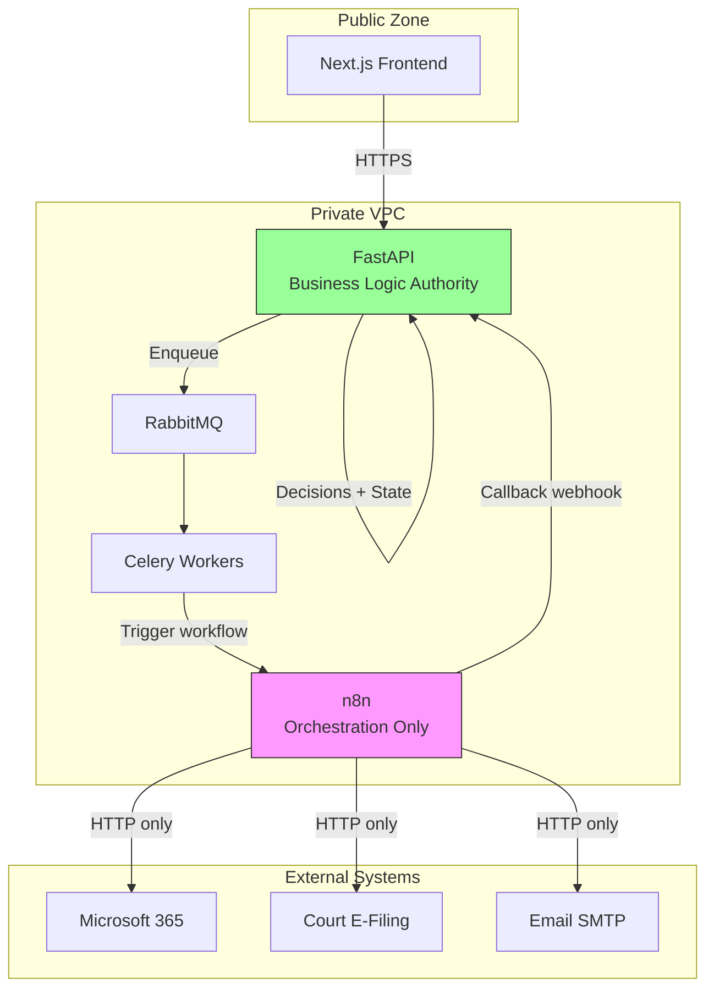

# ADR-002: n8n as Orchestration Engine Only

**Status:** Accepted  
**Date:** 2026-07-06  
**Deciders:** Architecture Team

---

## Purpose

Define the **role and authority boundary** of n8n within LexFlow AI. n8n connects external systems and executes integration workflows; it does not own business rules, authorization, or audit obligations required for legal automation.

---

## Scope

### In Scope

- n8n responsibilities: HTTP calls, retries, routing, external API integration
- Prohibited n8n usage: business logic, authorization, direct PostgreSQL access
- Network placement: private, not publicly accessible
- Replacement strategy — n8n is swappable infrastructure

### Out of Scope

- Individual n8n workflow JSON definitions (see [../06-workflows/workflow-catalog.md](../06-workflows/workflow-catalog.md))
- Microsoft 365 OAuth configuration
- n8n hosting vendor selection

---

## Context

LexFlow AI requires workflow automation to integrate with external systems — Microsoft 365, court e-filing, email, billing/ERP. n8n is selected as the orchestration engine for its connector library and visual workflow authoring.

There is a strong temptation to put business logic in n8n workflows because it is visual and fast to prototype. However, legal automation requires:

- **Immutable audit trails** for every decision
- **Authorization checks** including matter walls ([ADR-007](./007-matter-walls-404-deny.md))
- **Deterministic business rules** version-controlled and testable with pytest
- **Human-in-the-loop gates** for AI output approval

None of these are native n8n capabilities.

Cross-reference: [vision](../01-product/vision.md) pillar "Enterprise security — private n8n", [workflow capability](../01-product/capabilities.md), [orchestration model](../06-workflows/orchestration-model.md).

---

## Options

### 1. Business Logic in n8n

Use n8n Code nodes and PostgreSQL nodes for decisions, branching, and state.

| Pros | Cons |
|------|------|
| Fast prototyping; visual debugging | No audit trail for decisions |
| Low-code accessible to ops | No authorization or matter wall enforcement |
| Quick connector setup | Logic not version-controlled in Python |
| | Not testable with pytest |
| | Vendor lock-in on business rules |

### 2. n8n as Orchestration Only (Selected)

FastAPI owns all decisions; n8n calls external APIs and returns results via internal webhooks.

| Pros | Cons |
|------|------|
| Testable, auditable business logic in Python | More FastAPI code for workflow state |
| Full authorization in one place | Slightly higher latency for simple flows |
| n8n replaceable without logic migration | Developers must resist Code node temptation |
| Simpler security review — n8n has no decision authority | |

### 3. Replace n8n with Custom Orchestrator

Build workflow engine in FastAPI/Celery.

| Pros | Cons |
|------|------|
| Full control; no external dependency | Significant development effort |
| Unified codebase | Reinventing 400+ integration connectors |

---

## Decision

n8n is an **orchestration engine only**. It:

- Connects external systems via HTTP/API nodes
- Retries failed HTTP calls with configured backoff
- Routes data between integration steps
- Returns results to FastAPI via **internal webhooks** ([../04-api/webhooks-internal.md](../04-api/webhooks-internal.md))

FastAPI owns:

- All business logic, validation, and state transitions
- Authorization, RBAC, and matter wall enforcement
- Audit logging for every mutation and sensitive read
- Workflow instance lifecycle (created, running, completed, failed)

**n8n is not publicly accessible.** It runs in a private subnet with no inbound traffic from the internet.

---

## Consequences

### Positive

- Business logic is testable, auditable, and version-controlled in Python.
- n8n can be replaced (Temporal, custom engine) without migrating business rules.
- Security review is simpler — n8n has no decision authority.
- Matter walls and RBAC enforced uniformly at the FastAPI boundary.

### Negative

- More FastAPI code for workflow state management.
- Developers must resist putting logic in n8n Code nodes.
- Integration engineers need both n8n and Python skills.

### Enforcement

| Rule | Mechanism |
|------|-----------|
| No business logic in n8n | Code review checklist item |
| No n8n PostgreSQL nodes | CI workflow lint; prohibited in [n8n-integration.md](../06-workflows/n8n-integration.md) |
| No public n8n URL | Network security group; WAF does not route to n8n |
| Callbacks authenticated | Internal webhook HMAC + matter wall on job context |

---

## Best Practices

1. **Start every workflow design in FastAPI** — Define the state machine and events before opening n8n.
2. **Use n8n for I/O, not decisions** — If/else in n8n should only branch on HTTP status codes, not business rules.
3. **Version-control workflow JSON** — Export to `workflows/` in repo; promote via [promotion pipeline](../06-workflows/promotion-pipeline.md).
4. **Test callbacks with pytest** — Mock n8n responses; test FastAPI handler logic independently.
5. **Document webhook contracts** — See [webhook-contracts.md](../06-workflows/webhook-contracts.md).

---

## Tradeoffs

| Decision | Benefit | Cost |
|----------|---------|------|
| n8n orchestration only | Legal-grade audit and auth | More Python workflow code |
| Private n8n | Reduced attack surface | VPN/bastion required for n8n UI access |
| Visual workflows for integrations | Faster connector prototyping | Two tools to maintain |
| Internal webhooks over n8n polling | FastAPI stays authoritative | Webhook reliability requires retry/DLQ |

---

## Future Improvements

| Phase | Enhancement |
|-------|-------------|
| Phase 1 | Workflow lint CI — detect Code nodes with business logic patterns |
| Phase 2 | n8n execution metrics in observability dashboards |
| Phase 3 | Evaluate Temporal for long-running sagas if n8n limits hit |
| Phase 4 | Self-service workflow templates — still FastAPI-owned state |

---

## References

| Document | Relationship |
|----------|--------------|
| [../01-product/vision.md](../01-product/vision.md) | "Private n8n" strategic pillar |
| [../01-product/capabilities.md](../01-product/capabilities.md) | Workflow Automation capability ownership |
| [../01-product/non-goals.md](../01-product/non-goals.md) | No public automation surface |
| [../03-architecture/integration-patterns.md](../03-architecture/integration-patterns.md) | Adapter pattern for external systems |
| [../03-architecture/data-flow.md](../03-architecture/data-flow.md) | Async automation path |
| [../06-workflows/orchestration-model.md](../06-workflows/orchestration-model.md) | FastAPI ↔ n8n interaction model |
| [../06-workflows/n8n-integration.md](../06-workflows/n8n-integration.md) | Prohibited nodes and patterns |
| [../08-security/network-security.md](../08-security/network-security.md) | Private subnet placement |
| [001-modular-monolith.md](./001-modular-monolith.md) | Workflow Orchestration as bounded context module |
