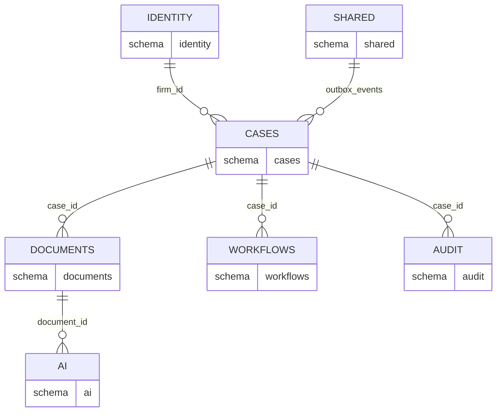

# ADR-003: Single PostgreSQL with Schema Separation

**Status:** Accepted  
**Date:** 2026-07-06  
**Deciders:** Architecture Team

---

## Purpose

Define **data organization within the modular monolith** ([ADR-001](./001-modular-monolith.md)). This decision establishes schema ownership per bounded context while preserving a single transaction boundary and operational simplicity.

---

## Scope

### In Scope

- Single PostgreSQL database instance with schema-per-bounded-context
- Schema naming, ownership, and cross-schema access rules
- pgvector and full-text search placement
- Extraction path to separate databases

### Out of Scope

- Column-level table definitions (see [../05-database/schema-overview.md](../05-database/schema-overview.md))
- Read replica topology (see [../09-deployment/aws-topology.md](../09-deployment/aws-topology.md))
- Backup retention policy (see [../05-database/retention-backup.md](../05-database/retention-backup.md))

---

## Context

LexFlow AI has multiple bounded contexts that each own data: Identity, Cases, Documents, Workflows, AI, Audit, and Shared infrastructure tables. The modular monolith decision allows a single database, but internal organization must:

- Enforce **clear ownership** for extraction readiness
- Support **ACID transactions** across related writes in Phase 1
- Enable **pgvector semantic search** across document embeddings in one query
- Avoid premature operational complexity of multiple database instances

Cross-reference: [database architecture](../database-architecture.md), [bounded contexts](../02-domain/bounded-contexts.md), [case-centric capabilities](../01-product/capabilities.md).

---

## Options

### 1. Single Schema, Shared Tables

All tables in `public` schema.

| Pros | Cons |
|------|------|
| Simplest SQL | No boundary enforcement |
| No schema prefix needed | Naming collisions across contexts |
| | Hard to extract; tangled ownership |

### 2. Schema per Bounded Context (Selected)

Dedicated schemas: `identity`, `cases`, `documents`, `workflows`, `ai`, `audit`, `shared`.

| Pros | Cons |
|------|------|
| Clear ownership per context | Cross-schema joins require explicit prefix |
| Extraction-ready — move schema to new DB | Must discipline teams on boundaries |
| Permission isolation possible at DB level | Slightly more verbose migrations |

### 3. Database per Bounded Context

Separate PostgreSQL databases per context.

| Pros | Cons |
|------|------|
| Full isolation | No shared transactions |
| Independent scaling | Complex ops for 5–10 engineer team |
| | Premature for modular monolith |

---

## Decision

Use a **single PostgreSQL database** with **schema separation per bounded context**:

| Schema | Owner Context | Primary Aggregates |
|--------|---------------|-------------------|
| `identity` | Identity & Access | User, Role, Firm |
| `cases` | Case Management | Case, Participant, Task |
| `documents` | Document Management | Document, DocumentVersion |
| `workflows` | Workflow Orchestration | WorkflowInstance, WorkflowStep |
| `ai` | AI & Knowledge | AISummary, PromptTemplate, Embedding |
| `audit` | Audit & Compliance | AuditEvent |
| `shared` | Platform | OutboxEvent, IdempotencyKey |

**Cross-context queries go through application services**, not direct cross-schema joins — except read-only reporting views approved by architecture review.

---

## Consequences

### Positive

- **Single transaction boundary** — Case creation + outbox event + audit log in one commit.
- **Simple backup/restore** — One database; one RPO/RTO target.
- **pgvector and full-text search** — Cross-document queries in `documents` + `ai` schemas without federation.
- **Extraction path** — `pg_dump --schema=ai` moves cleanly to dedicated database.

### Negative

- Teams must discipline against direct cross-schema joins in application code.
- All contexts share connection pool and I/O ceiling.
- Schema migration conflicts require coordination in single Alembic pipeline.

---

## Best Practices

1. **Prefix all table references** — `cases.cases`, `documents.documents` in SQL and ORM models.
2. **No cross-schema foreign keys** — Use UUID references validated in application layer.
3. **Migrations per schema directory** — `alembic/versions/{schema}/` for ownership clarity.
4. **Reporting views only** — Cross-schema SQL allowed in `reporting` views, not in handlers.
5. **Search path discipline** — Set `search_path` per connection to single schema in repository layer.

---

## Tradeoffs

| Decision | Benefit | Cost |
|----------|---------|------|
| Single DB over multi-DB | ACID; simple ops | Shared scaling ceiling |
| Schema separation over `public` | Extraction-ready | Verbose SQL prefixes |
| App-level cross-context refs | Clean boundaries | No DB-enforced referential integrity across schemas |
| pgvector in same DB | Unified semantic search | AI schema growth affects shared instance |

---

## Future Improvements

| Trigger | Action |
|---------|--------|
| AI embedding storage > 500 GB | Evaluate dedicated vector store (pgvector partition or Pinecone) |
| Context extraction (ADR-001) | `pg_dump --schema=X` to new RDS instance |
| Read-heavy reporting | Read replica with reporting views only |
| Multi-firm SaaS | Revisit row-level tenancy vs schema-per-firm |

---

## References

| Document | Relationship |
|----------|--------------|
| [../01-product/capabilities.md](../01-product/capabilities.md) | Capability-to-schema mapping |
| [../03-architecture/component-architecture.md](../03-architecture/component-architecture.md) | Repository layer per context |
| [../05-database/schema-overview.md](../05-database/schema-overview.md) | Full schema catalog |
| [../05-database/migrations.md](../05-database/migrations.md) | Alembic conventions |
| [../05-database/indexing-strategy.md](../05-database/indexing-strategy.md) | Cross-schema query performance |
| [001-modular-monolith.md](./001-modular-monolith.md) | Parent topology decision |
| [006-transactional-outbox.md](./006-transactional-outbox.md) | `shared.outbox_events` table |
