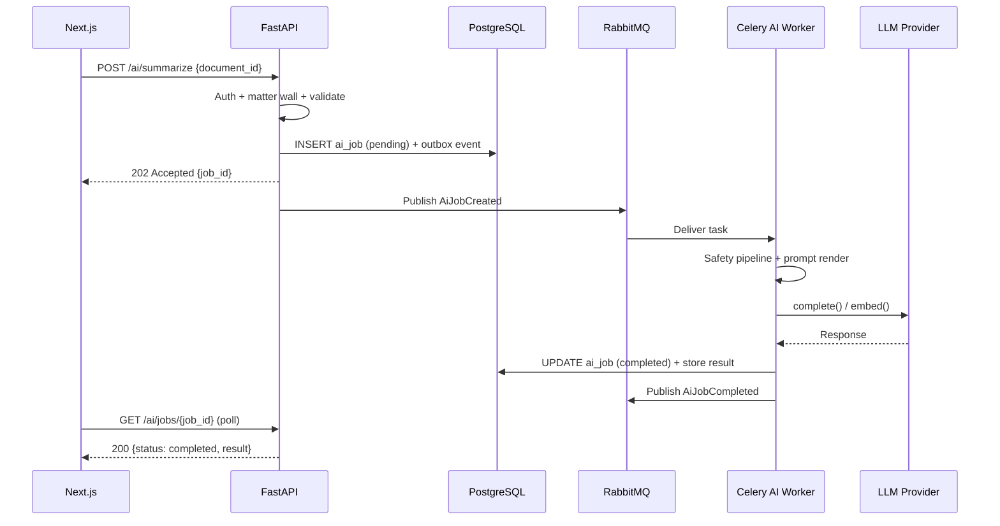

# ADR-004: All AI Processing via Async Worker Path

**Status:** Accepted  
**Date:** 2026-07-06  
**Deciders:** Architecture Team

---

## Purpose

Define the **execution model for all LLM and embedding operations** in LexFlow AI. AI inference is inherently slow, variable, and failure-prone — it must not block HTTP request threads or degrade API availability.

---

## Scope

### In Scope

- Async job lifecycle: submit → queue → worker → persist → notify
- API response pattern (`202 Accepted` + job ID)
- Frontend polling and SSE update patterns
- Retry, rate limiting, cost metering, and audit on worker path
- Phase 2 streaming enhancement rules

### Out of Scope

- LLM provider selection (see [ADR-008](./008-azure-openai-primary.md))
- Prompt template management (see [../07-ai/prompt-management.md](../07-ai/prompt-management.md))
- RAG retrieval architecture (see [../07-ai/rag-architecture.md](../07-ai/rag-architecture.md))
- Human-in-the-loop approval UI (see [../07-ai/human-in-the-loop.md](../07-ai/human-in-the-loop.md))

---

## Context

LexFlow AI integrates with LLM providers (Azure OpenAI, OpenAI, Anthropic) for:

- Document summarization
- Legal research assistance
- Contract review
- Case-scoped chat assistant
- Embedding generation for semantic search

LLM API calls have **variable latency (2–60 seconds)** and can fail, rate-limit, or return content requiring safety filtering. Exposing synchronous AI in the HTTP request path causes:

- Gateway and load balancer **timeouts**
- **Blocked UI** — attorneys waiting on spinner
- No graceful **retry** without client resubmission
- **Poor scalability** — API workers tied up on I/O-bound LLM calls

Cross-reference: [AI capabilities](../01-product/capabilities.md), [vision](../01-product/vision.md) async-first pillar, [data flow](../03-architecture/data-flow.md).



---

## Options

### 1. Synchronous AI in Request Path

Frontend calls API; API calls LLM; waits; returns result.

| Pros | Cons |
|------|------|
| Simplest implementation | Timeouts at 30–60s |
| Immediate result | Blocked UI |
| | No retry without client action |
| | API availability tied to LLM SLA |

### 2. Async via Queue (Selected)

API accepts request (`202`), worker calls LLM, result stored, frontend polls or receives SSE.

| Pros | Cons |
|------|------|
| Resilient; retryable; scalable | Job status management |
| Non-blocking UX | Frontend async state handling |
| Independent worker scaling | Higher perceived latency for simple tasks |
| Full audit of complete response | |

### 3. Streaming via SSE Only

API streams LLM tokens to frontend in real-time without persistence.

| Pros | Cons |
|------|------|
| Good UX for chat | Blocks server connection |
| Perceived low latency | Harder to audit complete response |
| | No retry of partial streams |

---

## Decision

All AI processing goes through the **async worker path**:

```
Frontend → FastAPI (202) → RabbitMQ → Celery AI Worker → LLM Provider → PostgreSQL
```

- API returns **`202 Accepted`** with `job_id` and `status_url`.
- Frontend **polls** `GET /api/v1/ai/jobs/{job_id}` or receives **SSE** job status updates.
- Worker handles retry, rate limiting, safety guardrails, usage metering, and audit persistence.

**Phase 2 enhancement:** Case-scoped chat assistant may add **streaming SSE** for token display — but the **full response is still persisted asynchronously** for audit and approval workflows.

---

## Consequences

### Positive

- Retry, rate limiting, cost metering, and audit logging in one path.
- LLM provider failures do not affect API availability.
- Horizontal scaling of AI workers independently of API containers.
- Consistent pattern for all AI capabilities (summaries, research, embeddings, chat).

### Negative

- Frontend must handle async status (polling/SSE/WebSocket).
- Slightly higher perceived latency for simple one-paragraph summaries.
- Job table growth requires retention policy.

---

## Best Practices

1. **Never call LLM from API handlers** — Enforced in code review and lint rules.
2. **Return job ID immediately** — Include `Retry-After` header for polling guidance.
3. **Idempotent job submission** — Use idempotency key on `POST` to prevent duplicate LLM spend.
4. **Matter wall before enqueue** — Validate case access at submission, not just at result read.
5. **Persist before notify** — Write result to `ai` schema before publishing `AiJobCompleted` event.

---

## Tradeoffs

| Decision | Benefit | Cost |
|----------|---------|------|
| Async over sync | API stability; retry | UX complexity |
| Poll over WebSocket default | Simpler Phase 1 | Higher request volume |
| Persist full response | Audit compliance | Storage growth |
| Phase 2 SSE streaming | Better chat UX | Dual code paths |

---

## Future Improvements

| Phase | Enhancement |
|-------|-------------|
| Phase 2 | SSE token streaming for chat — full response still async-persisted |
| Phase 2 | WebSocket job notifications replacing poll for active sessions |
| Phase 3 | Priority queues — urgent summaries ahead of batch embedding jobs |
| Phase 4 | GPU worker pool for on-prem model inference option |

---

## References

| Document | Relationship |
|----------|--------------|
| [../01-product/capabilities.md](../01-product/capabilities.md) | AI Summaries, Research, Contract Review, Assistants |
| [../01-product/vision.md](../01-product/vision.md) | Async-first strategic pillar |
| [../03-architecture/data-flow.md](../03-architecture/data-flow.md) | Async path topology |
| [../03-architecture/nfr-requirements.md](../03-architecture/nfr-requirements.md) | Worker scaling targets |
| [../04-api/endpoints-ai.md](../04-api/endpoints-ai.md) | Job API contract |
| [../05-database/ai-schema.md](../05-database/ai-schema.md) | `ai_jobs` table |
| [../07-ai/llm-providers.md](../07-ai/llm-providers.md) | Provider adapter layer |
| [../07-ai/safety-guardrails.md](../07-ai/safety-guardrails.md) | Pre-LLM safety pipeline |
| [008-azure-openai-primary.md](./008-azure-openai-primary.md) | Production LLM provider |
| [006-transactional-outbox.md](./006-transactional-outbox.md) | AiJobCreated event publishing |
