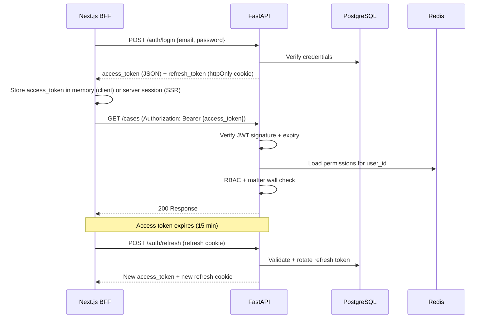

# ADR-005: JWT + Refresh Token Authentication

**Status:** Accepted  
**Date:** 2026-07-06  
**Deciders:** Architecture Team

---

## Purpose

Define the **authentication mechanism** for LexFlow AI web and API clients. The model must support multiple user roles, horizontal API scaling, Next.js SSR/BFF patterns, and a future path to Microsoft Entra ID enterprise SSO.

---

## Scope

### In Scope

- Access token format, lifetime, and verification
- Refresh token storage, rotation, and revocation
- SSR/BFF cookie handling for Next.js
- Phase 3 Entra ID OIDC integration as additive login
- Server-side permission resolution (not JWT claims)

### Out of Scope

- RBAC permission matrix (see [../04-api/authorization-rbac.md](../04-api/authorization-rbac.md))
- Matter wall ABAC rules (see [ADR-007](./007-matter-walls-404-deny.md))
- API key authentication for machine clients (Phase 3)
- Password hashing algorithm selection

---

## Context

LexFlow AI serves a Next.js web application with multiple user roles — Attorney, Paralegal, Managing Partner, Client, System Administrator — plus future SSO via Microsoft Entra ID (common in large US law firms).

Requirements:

- **Stateless enough** for horizontal API scaling on ECS Fargate
- **SSR compatible** — server components need authenticated session without client-side token exposure
- **RBAC support** — permissions resolved per request, not baked into long-lived tokens
- **Mobile-ready** — same token model for future native clients

Cross-reference: [user personas](../01-product/user-personas.md), [authentication API](../04-api/authentication.md), [security architecture](../08-security/README.md).

---

## Options

### 1. Server-Side Sessions (Redis)

Session ID in cookie; session data in Redis.

| Pros | Cons |
|------|------|
| Easy revocation | Redis required for every request |
| Familiar pattern | Harder SSR/hydration token handoff |
| | Sticky session concerns at scale |

### 2. JWT Access + Refresh Tokens (Selected)

Short-lived JWT access token; long-lived refresh token in httpOnly cookie with rotation.

| Pros | Cons |
|------|------|
| Stateless verification | Revocation requires blocklist or rotation |
| Works with SSR and API | Refresh rotation logic complexity |
| Standard OAuth 2.0 pattern | Token theft detection via rotation |
| Entra ID additive in Phase 3 | |

### 3. OAuth 2.0 Only (Entra ID from Day One)

No local auth; Entra ID exclusively.

| Pros | Cons |
|------|------|
| Enterprise SSO immediately | Blocks Phase 1 before Entra integration |
| No password management | Not all firms ready on day one |
| | Client portal needs separate auth path |

---

## Decision

**JWT access tokens (15 min) + refresh tokens (7 days, rotated, httpOnly cookie)** for Phase 1–2.

| Token | Storage | Lifetime | Contents |
|-------|---------|----------|----------|
| Access token | Memory (SPA) / server session (SSR) | 15 minutes | `sub`, `firm_id`, `session_id` — **no permissions** |
| Refresh token | httpOnly, Secure, SameSite=Strict cookie | 7 days | Opaque ID referencing `identity.refresh_tokens` |

**Microsoft Entra ID OIDC** added as alternative login in Phase 3 — local auth remains for client portal and break-glass admin.

**Permissions are resolved server-side on each request** from Redis-cached role matrix — not embedded in JWT claims. Role changes take effect on next request without token reissue.

---

## Consequences

### Positive

- Stateless API scaling — no session store lookup for JWT verification.
- Standard pattern understood by frontend and mobile engineers.
- Entra ID integration is additive — does not replace token model.
- Short access token lifetime limits exposure window.

### Negative

- Refresh token rotation logic and theft detection required.
- Token revocation on password change requires refresh token invalidation.
- Redis still needed for permission cache (not eliminated).

### Security Controls

| Control | Implementation |
|---------|----------------|
| Refresh rotation | New refresh token on every refresh; old token invalidated |
| Theft detection | Reuse of rotated refresh token revokes entire token family |
| Password change | Invalidate all refresh tokens for user |
| Access token | RS256 signed; public key in JWKS endpoint |

---

## Best Practices

1. **Never embed permissions in JWT** — Roles change; tokens should not stale-authorize.
2. **httpOnly refresh only** — JavaScript must never access refresh token.
3. **BFF pattern for SSR** — Next.js server routes attach access token; never expose refresh to client bundle.
4. **Rotate on every refresh** — Detect parallel refresh as compromise signal.
5. **Audit auth events** — Login, refresh, logout, failed attempts to `audit` schema.

---

## Tradeoffs

| Decision | Benefit | Cost |
|----------|---------|------|
| JWT over server sessions | Horizontal scale | Revocation complexity |
| 15-min access token | Limited exposure | More refresh traffic |
| Server-side permissions | Immediate role changes | Redis cache dependency |
| Local auth Phase 1 | Unblocks development | Dual auth paths until Entra |
| httpOnly refresh cookie | XSS protection | CSRF requires SameSite + BFF |

---

## Future Improvements

| Phase | Enhancement |
|-------|-------------|
| Phase 2 | Step-up authentication for sensitive operations (export, participant removal) |
| Phase 3 | Microsoft Entra ID OIDC — federated login for firm users |
| Phase 3 | API keys for machine-to-machine integrations |
| Phase 4 | WebAuthn/passkey support for passwordless |

---

## References

| Document | Relationship |
|----------|--------------|
| [../01-product/user-personas.md](../01-product/user-personas.md) | Role definitions |
| [../01-product/roadmap.md](../01-product/roadmap.md) | Entra ID Phase 3 timeline |
| [../03-architecture/cross-cutting-concerns.md](../03-architecture/cross-cutting-concerns.md) | Auth middleware, rate limiting |
| [../04-api/authentication.md](../04-api/authentication.md) | Endpoint specifications |
| [../04-api/authorization-rbac.md](../04-api/authorization-rbac.md) | Permission resolution |
| [../05-database/identity-schema.md](../05-database/identity-schema.md) | `refresh_tokens` table |
| [../08-security/secrets-management.md](../08-security/secrets-management.md) | JWT signing key in Secrets Manager |
| [007-matter-walls-404-deny.md](./007-matter-walls-404-deny.md) | Post-auth ABAC enforcement |
