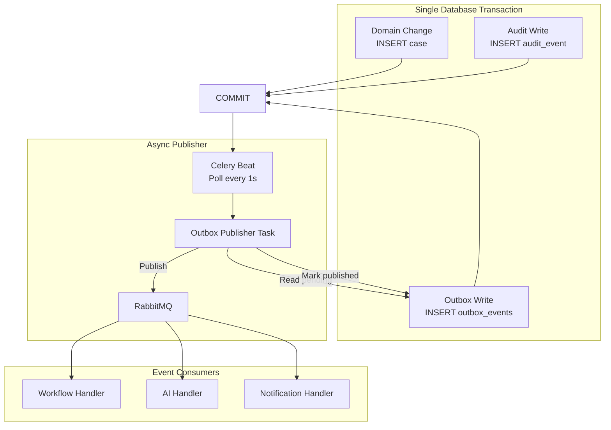

# ADR-006: Transactional Outbox for Event Publishing

**Status:** Accepted  
**Date:** 2026-07-06  
**Deciders:** Architecture Team

---

## Purpose

Guarantee **reliable domain event publishing** aligned with database state. When a case is created or a document is processed, downstream workflows and AI pipelines must receive the event — even if the publishing process crashes immediately after commit.

---

## Scope

### In Scope

- Outbox table schema and write semantics
- Publisher mechanism (Celery beat polling)
- At-least-once delivery guarantee
- Consumer idempotency requirements
- Event types for cross-context communication

### Out of Scope

- RabbitMQ exchange topology detail (see [../03-architecture/event-driven-design.md](../03-architecture/event-driven-design.md))
- Individual domain event payloads (see [../02-domain/domain-events.md](../02-domain/domain-events.md))
- CDC/Debezium infrastructure
- Saga compensation patterns

---

## Context

LexFlow AI uses domain events for cross-context communication within the modular monolith:

| Event | Publisher | Consumer |
|-------|-----------|----------|
| `CaseCreated` | Case Management | Workflow Orchestration |
| `DocumentUploaded` | Document Management | AI & Knowledge |
| `DocumentProcessed` | Document Management | AI (embeddings) |
| `AiJobCompleted` | AI & Knowledge | Notifications |
| `WorkflowStepCompleted` | Workflow Orchestration | Case Management |

The **dual-write problem** arises if the application writes to PostgreSQL and then publishes to RabbitMQ in separate steps: a crash between commit and publish **loses the event**, leaving workflows never triggered and embeddings never generated.

Cross-reference: [event-driven design](../03-architecture/event-driven-design.md), [capabilities](../01-product/capabilities.md) cross-context dependencies.

---

## Options

### 1. Direct Publish After Commit

Write to DB, then publish to RabbitMQ in application code.

| Pros | Cons |
|------|------|
| Simplest code | Crash between steps loses event |
| Lowest latency | Dual-write problem |
| | No inspectable failed events |

### 2. Transactional Outbox (Selected)

Write event to outbox table in same transaction; background publisher reads and publishes.

| Pros | Cons |
|------|------|
| Guaranteed at-least-once delivery | ~1s publisher lag |
| No dual-write problem | Outbox table to manage |
| Events inspectable in DB | Consumers must be idempotent |
| No additional infrastructure | |

### 3. Change Data Capture (CDC)

Debezium reads PostgreSQL WAL, publishes changes to Kafka.

| Pros | Cons |
|------|------|
| No application publish code | Kafka + Debezium infrastructure |
| Captures all changes | Operational complexity |
| | Overkill for modular monolith |

---

## Decision

Use the **transactional outbox pattern**:

1. Domain events written to `shared.outbox_events` in the **same database transaction** as the domain change.
2. A **Celery beat task** polls pending events every **1 second** and publishes to RabbitMQ.
3. On successful publish, outbox row marked `published_at` with `message_id` correlation.
4. Failed publishes retry with exponential backoff; dead-letter after 10 attempts.

### Outbox Table (Summary)

| Column | Purpose |
|--------|---------|
| `id` | UUID primary key |
| `aggregate_type` | e.g., `Case`, `Document` |
| `aggregate_id` | Entity UUID |
| `event_type` | e.g., `CaseCreated` |
| `payload` | JSONB event body |
| `created_at` | Insert timestamp |
| `published_at` | NULL until published |
| `retry_count` | Failed publish attempts |

---

## Consequences

### Positive

- Guaranteed event delivery aligned with database state.
- No additional infrastructure (CDC/Kafka).
- Events inspectable in database for debugging and replay.
- Supports manual replay from outbox for incident recovery.

### Negative

- Consumers must be **idempotent** (at-least-once delivery).
- Publisher lag of ~1 second — acceptable for all current use cases.
- Outbox table requires retention and archival policy.

---

## Best Practices

1. **Same transaction always** — Outbox insert in repository method, not separate service call.
2. **Idempotency keys on consumers** — Dedup table in `shared` schema keyed by `event_id`.
3. **Payload versioning** — Include `schema_version` in event JSON for evolution.
4. **Monitor outbox lag** — Alert if unpublished events > 100 or oldest > 30 seconds.
5. **Never publish from handlers** — Only outbox publisher task touches RabbitMQ for domain events.

---

## Tradeoffs

| Decision | Benefit | Cost |
|----------|---------|------|
| Outbox over direct publish | Consistency guarantee | 1s latency |
| Poll over LISTEN/NOTIFY | Simple; works with RDS | Not instant |
| At-least-once over exactly-once | Simpler consumers | Idempotency required |
| Celery beat over separate process | Reuses worker infra | Beat single-point (mitigated by K8s/ECS) |

---

## Future Improvements

| Phase | Enhancement |
|-------|-------------|
| Phase 2 | PostgreSQL LISTEN/NOTIFY for sub-second publish latency |
| Phase 3 | Outbox archival to S3 after 30 days |
| Phase 3 | Event replay CLI for incident recovery |
| Phase 4 | Evaluate CDC if context extracted to separate DB |

---

## References

| Document | Relationship |
|----------|--------------|
| [../01-product/capabilities.md](../01-product/capabilities.md) | Cross-capability event dependencies |
| [../02-domain/domain-events.md](../02-domain/domain-events.md) | Event catalog and payloads |
| [../03-architecture/event-driven-design.md](../03-architecture/event-driven-design.md) | RabbitMQ topology, routing keys |
| [../03-architecture/cross-cutting-concerns.md](../03-architecture/cross-cutting-concerns.md) | Consumer idempotency pattern |
| [../05-database/schema-overview.md](../05-database/schema-overview.md) | `shared.outbox_events` DDL |
| [../11-observability/metrics-alerting.md](../11-observability/metrics-alerting.md) | Outbox lag alerts |
| [001-modular-monolith.md](./001-modular-monolith.md) | In-process event handlers Phase 1 |
| [003-postgresql-single-database.md](./003-postgresql-single-database.md) | `shared` schema placement |
| [004-async-ai-processing.md](./004-async-ai-processing.md) | AiJobCreated event flow |
