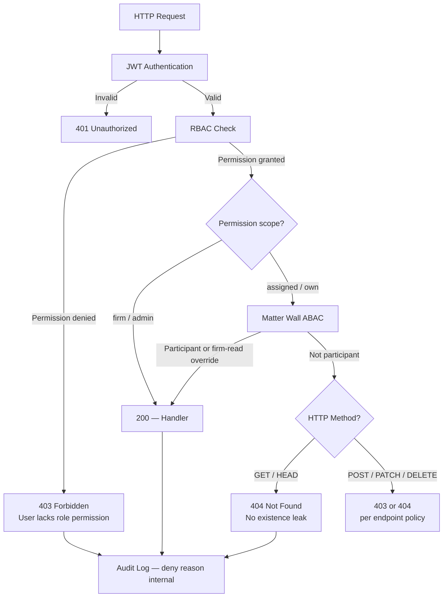

# ADR-007: Return 404 Not 403 for Unauthorized Case Access

**Status:** Accepted  
**Date:** 2026-07-06  
**Deciders:** Architecture Team, Security Champion

---

## Purpose

Define the **HTTP denial semantics** when a user attempts to access a case they are not authorized to view. Returning `404 Not Found` instead of `403 Forbidden` prevents **case ID enumeration** — a critical security requirement for law firms handling attorney-client privileged information under ethical walls.

---

## Scope

### In Scope

- GET requests to case-scoped resources when matter wall denies access
- Response body content rules (no metadata leakage)
- Distinction between RBAC deny (403) and matter wall deny (404)
- Mutating methods (PATCH, DELETE) denial behavior
- Client portal and firm dashboard consistency
- Audit logging for all deny paths

### Out of Scope

- RBAC permission matrix definition (see [../04-api/authorization-rbac.md](../04-api/authorization-rbac.md))
- Matter wall participant model (see [../08-security/matter-walls.md](../08-security/matter-walls.md))
- UI copy for not-found pages (see [../12-ui/page-architecture.md](../12-ui/page-architecture.md))
- Rate limiting on enumeration attempts

---

## Context

LexFlow AI implements **matter walls** — Attribute-Based Access Control (ABAC) at the case level. A user may hold the `Attorney` role with `case:read:assigned` permission but still be blocked from cases where they are not a participant.

**The security threat:** If the API returns `403 Forbidden` when a case exists but the user lacks access, an attacker can **enumerate valid case UUIDs** by probing the API. In a law firm context, confirming a case exists — even without reading its contents — may reveal:

- Client identity through case metadata in error responses
- Existence of confidential matters (M&A, litigation)
- Ethical wall violations if conflict information is inferable

Large US law firms require **need-to-know access** where unauthorized users should not learn whether a matter exists.

Cross-reference: [vision](../01-product/vision.md) "Enterprise security — matter walls", [MW-004](../08-security/matter-walls.md), [integration testing matter wall matrix](../10-testing/integration-testing.md).



---

## Options

### 1. Return 403 Forbidden for All Authorization Failures

Standard REST pattern — forbidden when authenticated but not authorized.

| Pros | Cons |
|------|------|
| Semantically correct per RFC 7231 | Reveals case existence to unauthorized users |
| Easier debugging for developers | Enumeration attack vector |
| Common in generic APIs | Unacceptable for legal ethics context |

### 2. Return 404 for Matter Wall Deny on GET (Selected)

Distinguish RBAC deny (403) from matter wall deny (404) on read operations.

| Pros | Cons |
|------|------|
| Prevents case ID enumeration | UX ambiguity — user cannot distinguish "not found" from "no access" |
| Aligns with legal industry practice | Harder to debug without audit logs |
| Consistent with conflict wall requirements | Tests must assert 404 body has no metadata |

### 3. Return 404 for All Authorization Failures

Mask all auth failures as not found.

| Pros | Cons |
|------|------|
| Maximum obscurity | RBAC misconfiguration invisible to legitimate users |
| | Admin operations cannot distinguish missing vs denied |
| | Breaks standard API client error handling |

---

## Decision

**Return `404 Not Found` (not `403 Forbidden`) when matter wall denies access to case-scoped GET/HEAD requests.**

### Denial Matrix

| Condition | HTTP Method | Status | Response Body |
|-----------|-------------|--------|---------------|
| Not authenticated | Any | `401` | Standard auth error |
| RBAC permission denied | Any | `403` | `"Insufficient permissions"` — no case metadata |
| Matter wall deny | `GET`, `HEAD` | `404` | Generic `"Case not found"` — **no title, client, or participant hints** |
| Matter wall deny | `PATCH`, `DELETE` | `403` or `404` | Per [error-handling.md](../04-api/error-handling.md) endpoint policy |
| Case UUID does not exist | `GET` | `404` | Same body as matter wall deny — **indistinguishable** |
| Client accesses other client's case | `GET` | `404` | Same generic body (MW-007) |

### Response Body Rules (MW-004)

```json
{
  "error": "not_found",
  "message": "Case not found",
  "correlation_id": "uuid"
}
```

**Prohibited in 404 body:** case title, client name, matter number, participant list, created date, or any field that confirms existence.

### Internal Audit

All deny decisions log **full internal reason** to `audit.audit_events` — including whether case existed and which wall rule applied. Audit is never exposed in HTTP response.

---

## Consequences

### Positive

- Case ID enumeration attacks are ineffective.
- Ethical wall compliance aligned with large firm security requirements.
- Client portal and firm API share consistent anti-enumeration semantics.
- Integration test matrix provides authoritative enforcement proof.

### Negative

- Users with legitimate access mistakes see "not found" instead of "access denied" — mitigated by support workflow checking audit logs.
- Developers must consult audit logs to debug authorization issues.
- Frontend cannot distinguish deleted case from walled case without admin tooling.

---

## Best Practices

1. **Enforce in authorization middleware** — 404 mapping happens after matter wall check, before route handler.
2. **Uniform 404 body** — Same JSON for nonexistent and unwalled cases; tested in CI.
3. **Never leak in logs to client** — Structured logs may include `deny_reason`; HTTP response may not.
4. **Test every case-scoped route** — Matter wall matrix in [integration-testing.md](../10-testing/integration-testing.md) is a PR gate.
5. **UI shows generic not-found** — No "you don't have access" messaging on case detail routes.

---

## Tradeoffs

| Decision | Benefit | Cost |
|----------|---------|------|
| 404 over 403 on GET deny | Anti-enumeration | UX ambiguity |
| Same body for missing vs denied | No existence oracle | Support debugging harder |
| 403 preserved for RBAC | Legitimate users know role issue | Two denial semantics to learn |
| Internal audit detail | Compliance evidence | Audit storage growth |

---

## Future Improvements

| Phase | Enhancement |
|-------|-------------|
| Phase 2 | Admin "access checker" tool — shows deny reason without exposing to unauthorized users |
| Phase 3 | Rate limit + alert on enumeration patterns (>20 404s/min per user) |
| Phase 4 | Time-bound access override with explicit audit trail |

---

## References

| Document | Relationship |
|----------|--------------|
| [../01-product/vision.md](../01-product/vision.md) | Enterprise security pillar |
| [../01-product/non-goals.md](../01-product/non-goals.md) | Cross-matter visibility non-goal |
| [../01-product/user-personas.md](../01-product/user-personas.md) | Attorney, Client portal personas |
| [../03-architecture/cross-cutting-concerns.md](../03-architecture/cross-cutting-concerns.md) | Authorization middleware |
| [../04-api/error-handling.md](../04-api/error-handling.md) | HTTP status code catalog |
| [../04-api/authorization-rbac.md](../04-api/authorization-rbac.md) | RBAC vs ABAC layers |
| [../08-security/matter-walls.md](../08-security/matter-walls.md) | MW-004 rule definition |
| [../08-security/threat-model.md](../08-security/threat-model.md) | Enumeration threat |
| [../10-testing/integration-testing.md](../10-testing/integration-testing.md) | Matter wall test matrix |
| [../12-ui/page-architecture.md](../12-ui/page-architecture.md) | Matter wall 404 UX |
| [005-jwt-authentication.md](./005-jwt-authentication.md) | Authentication preceding wall check |
