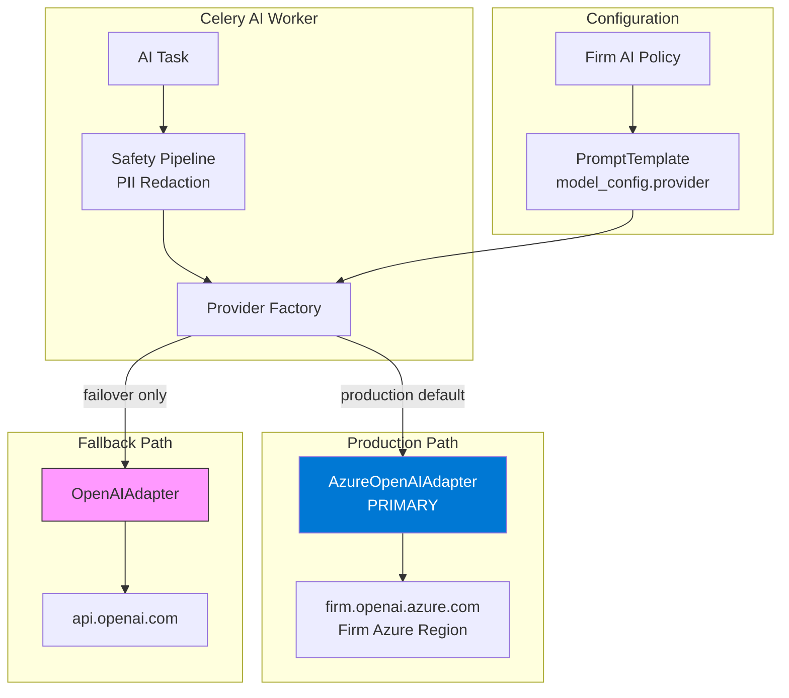

# ADR-008: Azure OpenAI as Production Default

**Status:** Accepted  
**Date:** 2026-07-06  
**Deciders:** Architecture Team, Compliance Officer

---

## Purpose

Establish **Azure OpenAI as the production-default LLM provider** for LexFlow AI. This decision prioritizes **data residency**, **enterprise DPA coverage**, and **no-training guarantees** required by large US law firms processing attorney-client privileged content.

---

## Scope

### In Scope

- Production default provider for completions and embeddings
- Provider selection via `PromptTemplate.model_config`
- Fallback to direct OpenAI API when Azure unavailable
- Data residency and compliance requirements
- Per-firm Azure subscription deployment model

### Out of Scope

- Anthropic Claude usage for contract review (complementary, not default)
- Ollama local development setup
- Model fine-tuning or custom training
- LLM cost optimization and routing algorithms
- Azure OpenAI Terraform provisioning (see [../09-deployment/terraform.md](../09-deployment/terraform.md))

---

## Context

LexFlow AI sends document text, case context, and user prompts to external LLM providers for summarization, research, contract review, chat, and embedding generation ([ADR-004](./004-async-ai-processing.md)). Law firms require:

- **Data residency** — Inference in firm-controlled or contractually specified regions
- **No training on customer data** — Privileged content must not improve vendor models
- **Enterprise DPA** — Processor agreement covering GDPR, CCPA, and state bar ethics
- **Audit trail** — Every LLM call logged with provider, model, token count, and redaction status

Direct OpenAI API (`api.openai.com`) routes data through US infrastructure with a separate DPA. Many large firms already have **Microsoft Enterprise Agreements** with Azure OpenAI deployed in their tenant — making Azure the natural production default.

Cross-reference: [vision](../01-product/vision.md) trust pillar, [compliance mapping](../08-security/compliance-mapping.md), [llm-providers](../07-ai/llm-providers.md).

---

## Options

### 1. Direct OpenAI API as Production Default

All production inference via `api.openai.com`.

| Pros | Cons |
|------|------|
| Simplest integration | US data residency only |
| Latest models immediately | Separate DPA from M365 agreement |
| Widest model selection | Firms may prohibit non-Azure AI |
| | Harder to meet state bar ethics inquiries |

### 2. Azure OpenAI as Production Default (Selected)

Production inference via firm's Azure OpenAI deployment; direct OpenAI as staging/failover.

| Pros | Cons |
|------|------|
| Data in firm Azure region | Requires firm Azure subscription setup |
| Microsoft enterprise DPA | Slight model availability lag vs OpenAI |
| No training on customer data (enterprise policy) | Dual adapter maintenance |
| Aligns with M365 identity strategy | Private endpoint setup in Phase 2 |
| Firm controls network path | |

### 3. Self-Hosted Open-Source Models Only

No external LLM API calls; on-prem Llama/Mistral.

| Pros | Cons |
|------|------|
| Full data control | Significant GPU infrastructure |
| No vendor dependency | Lower quality for legal tasks |
| | 6–12 month capability gap vs GPT-4o |

### 4. Multi-Provider Load Balancing

Route by cost/latency across OpenAI, Azure, Anthropic dynamically.

| Pros | Cons |
|------|------|
| Cost optimization | Inconsistent data residency |
| Resilience | Compliance audit complexity |
| | Firms cannot approve all providers |

---

## Decision

**Azure OpenAI is the production-default LLM provider** for all completions and embeddings unless a firm's AI policy explicitly overrides via `PromptTemplate.model_config`.

### Provider Matrix

| Provider | Environment | Role | Data Residency |
|----------|-------------|------|----------------|
| **Azure OpenAI** | Production | Primary — summaries, research, embeddings, chat | Firm Azure subscription region |
| **OpenAI** | Staging / failover | Secondary when Azure unavailable | US (OpenAI enterprise DPA required for prod fallback) |
| **Anthropic** | Production | Complementary — contract review (128K context) | Anthropic API — per template only |
| **Ollama** | Local dev | Developer workstation; CI smoke tests | Never leaves developer machine |

### Configuration Rules

1. **Default `provider`:** `azure_openai` in all production `PromptTemplate` records.
2. **Not hardcoded in worker** — Provider resolved from `ai.prompt_templates.model_config` at runtime.
3. **Fallback enabled** — OpenAI adapter used only when Azure returns 5xx or timeout after 3 retries.
4. **Fallback audited** — `LLMUsage` records `fallback_used: true` for compliance review.
5. **Firm override** — Firm admin may disable OpenAI fallback; jobs fail closed if Azure unavailable.

### Data Handling Prerequisites

All text sent to any provider passes through the **safety pipeline** ([safety-guardrails.md](../07-ai/safety-guardrails.md)):

- PII redaction per firm policy
- Prompt injection detection
- Content classification gate

---

## Consequences

### Positive

- Meets data residency requirements for firm compliance reviews.
- Leverages existing Microsoft Enterprise Agreements and DPAs.
- Azure OpenAI enterprise policy: customer data not used for model training.
- Consistent with Phase 3 Entra ID SSO strategy ([ADR-005](./005-jwt-authentication.md)).
- Provider abstraction allows per-template overrides without code changes.

### Negative

- Each firm deployment requires Azure OpenAI resource provisioning.
- Fallback path needs separate OpenAI enterprise agreement for production use.
- Two adapters to test and maintain (Azure + OpenAI).
- Azure Private Link setup deferred to Phase 2 — traffic via public endpoint initially.

---

## Best Practices

1. **Redact before send** — Never transmit unredacted PII to any external LLM provider.
2. **Configure per template** — Contract review may use Anthropic; embeddings always Azure.
3. **Monitor fallback rate** — Alert if OpenAI fallback > 1% of production calls.
4. **Log every call** — Provider, model, tokens, latency, redaction status to `ai.llm_usage`.
5. **Test both adapters in CI** — Mock responses; staging validates live Azure connectivity.
6. **Secrets in AWS Secrets Manager** — Azure endpoint and API key per [secrets-management.md](../08-security/secrets-management.md).

---

## Tradeoffs

| Decision | Benefit | Cost |
|----------|---------|------|
| Azure primary over OpenAI | Data residency; M365 DPA alignment | Per-firm Azure setup |
| Template-based selection | Flexibility without code deploy | Configuration management |
| OpenAI fallback | Resilience during Azure outages | Second DPA required |
| Fail-closed option | Firm policy compliance | Jobs fail if Azure down and fallback disabled |
| Anthropic for contract review | 128K context window | Third provider in compliance scope |

---

## Future Improvements

| Phase | Enhancement |
|-------|-------------|
| Phase 2 | AWS PrivateLink / Azure Private Link for LLM traffic |
| Phase 2 | Per-firm model deployment selection in admin UI |
| Phase 3 | EU data residency option — `eu-west-1` LexFlow + EU Azure region |
| Phase 3 | EU-only provider routing for GDPR matters |
| Phase 4 | Evaluate self-hosted models for air-gapped firm deployments |

---

## References

| Document | Relationship |
|----------|--------------|
| [../01-product/vision.md](../01-product/vision.md) | Trust through transparency pillar |
| [../01-product/capabilities.md](../01-product/capabilities.md) | AI capabilities requiring LLM |
| [../01-product/success-metrics.md](../01-product/success-metrics.md) | AI quality and adoption metrics |
| [../03-architecture/nfr-requirements.md](../03-architecture/nfr-requirements.md) | AI worker scaling |
| [../07-ai/llm-providers.md](../07-ai/llm-providers.md) | Adapter implementation detail |
| [../07-ai/safety-guardrails.md](../07-ai/safety-guardrails.md) | Pre-LLM redaction pipeline |
| [../07-ai/rag-architecture.md](../07-ai/rag-architecture.md) | Embedding model on Azure |
| [../08-security/compliance-mapping.md](../08-security/compliance-mapping.md) | DPA and GDPR mapping |
| [../08-security/encryption.md](../08-security/encryption.md) | TLS to LLM providers |
| [../08-security/secrets-management.md](../08-security/secrets-management.md) | Azure API key storage |
| [../09-deployment/environment-strategy.md](../09-deployment/environment-strategy.md) | Staging vs production providers |
| [004-async-ai-processing.md](./004-async-ai-processing.md) | Worker execution path |
