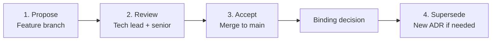
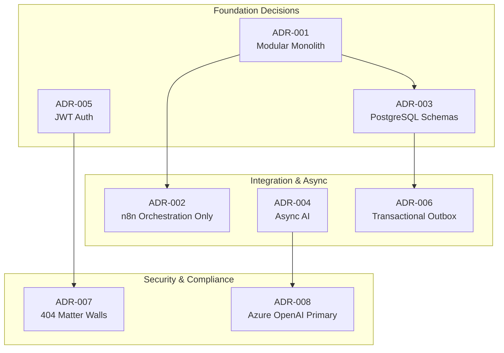

# Architecture Decision Records

**LexFlow AI** — ADR Index, Process & Governance  
**Version:** 1.0  
**Status:** Accepted  
**Last Updated:** 2026-07-06

---

## Purpose

This folder is the **canonical record of significant architectural decisions** for LexFlow AI. Each ADR captures the context, options evaluated, binding decision, and consequences so engineers, architects, security reviewers, and product stakeholders can understand *why* the system is built the way it is — not just *what* was built.

ADRs are **immutable once accepted**. Supersession creates a new ADR that references the prior record.

---

## Scope

| In Scope | Out of Scope |
|----------|--------------|
| Binding architectural decisions with cross-team impact | Sprint-level implementation tasks |
| ADR process, template, and index | Detailed API endpoint specifications |
| Supersession and deprecation rules | Code-level design patterns (see [development-standards.md](../development-standards.md)) |
| Links to architecture and product context | Vendor contract negotiations |

---

## ADR Process



### Lifecycle

| Step | Actor | Action |
|------|-------|--------|
| **1. Propose** | Engineer | Draft ADR on feature branch using template below |
| **2. Review** | Tech lead + one senior engineer | Validate context, options, and alignment with [vision](../01-product/vision.md) and [NFRs](../03-architecture/nfr-requirements.md) |
| **3. Accept** | Engineering leadership | Merge to `main` — ADR becomes binding for all new work |
| **4. Supersede** | Architect | Create new ADR referencing old number with reason for change |

### When to Write an ADR

Write an ADR when a decision:

- Affects multiple bounded contexts or deployment topology
- Is difficult or expensive to reverse
- Has security, compliance, or data residency implications
- Establishes a pattern other teams must follow
- Rejects a tempting shortcut (e.g., business logic in n8n)

**Do not** write ADRs for routine library choices, single-endpoint behavior, or formatting conventions.

---

## ADR Template

Every ADR in this folder follows this structure:

```markdown
# ADR-{NNN}: {Title}

**Status:** Proposed | Accepted | Deprecated | Superseded by ADR-{MMM}
**Date:** YYYY-MM-DD
**Deciders:** {names}

## Purpose
Why this decision exists and what problem it solves.

## Scope
What is and is not covered by this decision.

## Context
Background, constraints, and motivating forces.

## Options
Alternatives considered with pros and cons.

## Decision
The binding choice.

## Consequences
What becomes easier or harder.

## Best Practices
How to implement and enforce the decision.

## Tradeoffs
Explicit benefit vs cost table.

## Future Improvements
Evolution path and supersession triggers.

## References
Cross-links to related docs.
```

---

## ADR Index

| ADR | Title | Status | Key Impact |
|-----|-------|--------|------------|
| [001](./001-modular-monolith.md) | Start with Modular Monolith | Accepted | Deployment topology, team structure |
| [002](./002-n8n-orchestration-only.md) | n8n as Orchestration Engine Only | Accepted | Workflow integration, security boundary |
| [003](./003-postgresql-single-database.md) | Single PostgreSQL with Schema Separation | Accepted | Data ownership, transaction boundaries |
| [004](./004-async-ai-processing.md) | All AI Processing via Async Worker Path | Accepted | AI UX, worker scaling, audit |
| [005](./005-jwt-authentication.md) | JWT + Refresh Token Authentication | Accepted | Auth model, SSR compatibility |
| [006](./006-transactional-outbox.md) | Transactional Outbox for Event Publishing | Accepted | Event reliability, consistency |
| [007](./007-matter-walls-404-deny.md) | Return 404 Not 403 for Unauthorized Case Access | Accepted | Anti-enumeration, matter wall UX |
| [008](./008-azure-openai-primary.md) | Azure OpenAI as Production Default | Accepted | Data residency, LLM provider strategy |

### Decision Map



---

## Best Practices

1. **Read ADRs before proposing alternatives** — Understand the original constraints before reopening a decision.
2. **Reference ADRs in PRs** — Link the relevant ADR when implementing or extending a pattern.
3. **Supersede, don't edit** — Accepted ADRs are immutable; create ADR-009 to change ADR-003.
4. **Align with product vision** — Decisions must not contradict [vision](../01-product/vision.md) or [non-goals](../01-product/non-goals.md).
5. **Update the index** — New ADRs require a row in this README and cross-links from affected architecture docs.

---

## Tradeoffs

| Approach | Benefit | Cost |
|----------|---------|------|
| Formal ADR process | Institutional memory; onboarding clarity | Overhead for trivial decisions |
| Immutable accepted ADRs | Audit trail; no silent drift | Requires supersession discipline |
| Centralized `13-decisions/` folder | Single source of truth | Legacy `adr/` folder deprecated (see migration note) |

---

## Migration Note

ADRs were migrated from `docs/adr/` to `docs/13-decisions/` with expanded enterprise sections. The legacy `docs/adr/` folder remains for backward compatibility during transition; **new ADRs are authored only in this folder**.

---

## Future Improvements

| Phase | Enhancement |
|-------|-------------|
| Phase 1 | ADR lint check in CI — required sections present |
| Phase 2 | Backstage / ADR portal with decision dependency graph |
| Phase 3 | Quarterly ADR review — flag decisions ready for supersession |
| Phase 4 | Per-bounded-context extraction ADRs as services split |

---

## References

| Document | Relationship |
|----------|--------------|
| [../01-product/vision.md](../01-product/vision.md) | Strategic pillars constraining decisions |
| [../01-product/capabilities.md](../01-product/capabilities.md) | Capability-to-architecture mapping |
| [../01-product/non-goals.md](../01-product/non-goals.md) | Explicit exclusions |
| [../03-architecture/README.md](../03-architecture/README.md) | Canonical C4 architecture |
| [../03-architecture/component-architecture.md](../03-architecture/component-architecture.md) | Bounded context layout (ADR-001) |
| [../03-architecture/event-driven-design.md](../03-architecture/event-driven-design.md) | Outbox pattern detail (ADR-006) |
| [../03-architecture/data-flow.md](../03-architecture/data-flow.md) | Sync vs async paths (ADR-004) |
| [../development-standards.md](../development-standards.md) | Code review and PR process |
