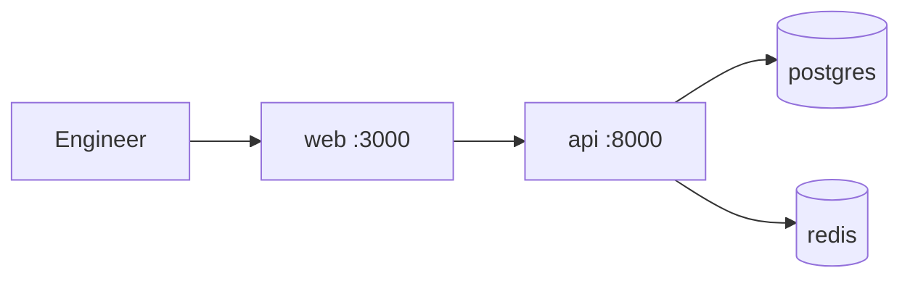

# 10-Minute Quickstart

**LexFlow AI** — Clone to Developing in Under 10 Minutes  
**Version:** 1.0  
**Status:** Sprint 0 Target  
**Last Updated:** 2026-07-06

---

## Purpose

This is the **Sprint 0 north-star playbook**. Every engineer must be able to clone the repository, run two commands, and have a working local dev environment — **without business code**, **without AWS credentials**, and **without manual service installation**.

Full stack (RabbitMQ, n8n, MinIO, Celery, Grafana) arrives in Sprint 1. Sprint 0 delivers the **core four**: API, Web, PostgreSQL, Redis.

---

## Prerequisites (one-time, ~5 min)

| Tool | Verify | Notes |
|------|--------|-------|
| Git | `git --version` | SSH key for GitHub |
| Docker Desktop | `docker info` | ≥ 4 GB RAM allocated |
| Make | `make --version` | Pre-installed on macOS |

**Not required for Sprint 0:** Node.js or Python on host — apps run in containers.

---

## Quickstart (target: under 10 minutes)

### Step 1 — Clone (~1 min)

```bash
git clone git@github.com:abhishekthatguy/luxflow-ai.git
cd luxflow-ai
```

### Step 2 — Environment (~30 sec)

```bash
cp .env.example .env
# Defaults work for local Compose — no edits required for first run
```

### Step 3 — Setup (~2–4 min)

```bash
make setup
```

| Action | What happens |
|--------|--------------|
| Validates Docker is running | Fails fast if not |
| Creates `.env` if missing | Copies from example |
| Installs pre-commit hooks | Optional local lint |
| Pulls base images (first run) | postgres, redis, api, web |

### Step 4 — Start (~2–4 min)

```bash
make dev
```

Wait until all services healthy:

```bash
make ps
# api, web, postgres, redis — running/healthy
```

### Step 5 — Verify (~30 sec)

```bash
make verify-quickstart
```

Or manually:

```bash
curl -s http://localhost:8000/health | jq .
# { "status": "ok", "service": "api" }

open http://localhost:3000
# Status page shows API connection: green
```

**Done.** You are developing. Total target: **< 10 minutes** (repeat runs with cached images: ~3 min).

---

## Expected Timings

| Step | First run | Repeat run |
|------|-----------|------------|
| Clone | 1 min | 1 min |
| Setup | 3–4 min | 1 min |
| Dev (compose up) | 2–4 min | 1–2 min |
| Verify | 30 sec | 30 sec |
| **Total** | **7–10 min** | **3–4 min** |

Record your timing in Sprint 0 sign-off: [`quickstart-timings.md`](../17-sprint-planning/sprint-0-deliverables/quickstart-timings.md)

---

## Makefile Reference (Sprint 0)

| Command | Description |
|---------|-------------|
| `make setup` | One-time / occasional setup |
| `make dev` | Start core stack (api, web, postgres, redis) |
| `make down` | Stop and remove containers |
| `make ps` | Service status |
| `make logs api` | Tail API logs |
| `make logs web` | Tail web logs |
| `make lint` | Ruff + ESLint on scaffold |
| `make test` | Scaffold smoke tests only |
| `make verify-quickstart` | Health check script — exits 0 if ready |

---

## What You Get (Sprint 0)



| Service | URL | Purpose |
|---------|-----|---------|
| Web | http://localhost:3000 | Status page — proves frontend scaffold |
| API | http://localhost:8000/health | Health only — no business routes |
| PostgreSQL | internal `:5432` | Ready for Sprint 1 migrations |
| Redis | internal `:6379` | Ready for Sprint 1 cache/session |

---

## What Is NOT in Sprint 0

| Item | Sprint |
|------|--------|
| Auth / JWT / login | Sprint 2 (after Platform Readiness + RFC-002) |
| Case, client, document APIs | Sprint 3+ |
| RabbitMQ, Celery, n8n, MinIO | Sprint 1 |
| Grafana / OpenTelemetry | Sprint 1 |
| Alembic business migrations | Sprint 1 baseline |

---

## Troubleshooting

### Docker not running

```
Error: Cannot connect to the Docker daemon
```

Start Docker Desktop and retry `make setup`.

### Port already in use

```bash
# Find process on 8000 or 3000
lsof -i :8000
lsof -i :3000
# Stop conflicting service or change ports in docker-compose.yml / .env
```

### `make setup` slow on first run

Normal — Docker pulls images. Subsequent runs use cache. Pre-pull:

```bash
docker compose pull
```

### Web shows API unreachable

```bash
docker compose logs api
curl http://localhost:8000/health
# Check NEXT_PUBLIC_API_URL in .env matches api container URL from browser perspective
```

### ARM Mac (Apple Silicon)

Use Docker Desktop with Rosetta if build fails. Report persistent issues in `#lexflow-dev`.

---

## Sprint 0 Sign-Off Checklist

Engineer completes once:

- [ ] Cloned repo
- [ ] `make setup && make dev` succeeded
- [ ] `make verify-quickstart` exits 0
- [ ] Opened `:3000` — status page green
- [ ] Elapsed time recorded: \_\_ minutes

---

## References

- [Sprint 0 — Engineering Setup](../17-sprint-planning/sprint-00-documentation.md)
- [Local Dev Setup](./local-dev-setup.md) — full stack after Sprint 1
- [Platform Readiness Gate](./platform-readiness-gate.md) — before auth/business logic
- [Folder Structure](../folder-structure.md)
