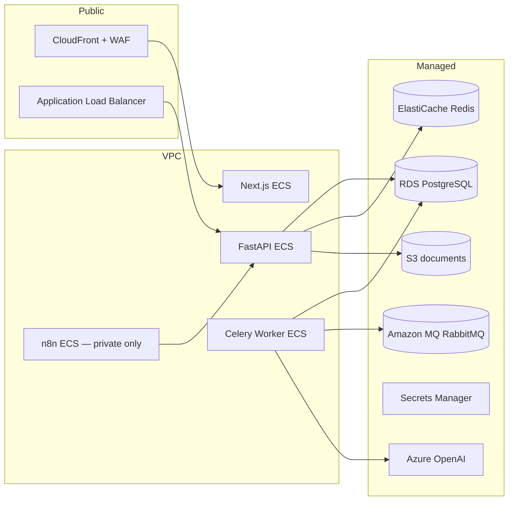

# Production Deployment Checklist

**LexFlow AI** — everything required to deploy to AWS production  
**Last updated:** 2026-07-07  
**Related:** [deploy-production.md](./deploy-production.md) · [go-live-checklist.md](./go-live-checklist.md) · [RUNBOOK.md](../operations/RUNBOOK.md)

---

## Overview

LexFlow runs as containerized services on **AWS ECS Fargate** with managed data stores. Local Docker Compose is **not** production topology. This checklist is the operator-facing gate before first production cutover and every major release.



---

## 1. AWS Infrastructure (must exist before deploy)

| Resource | Purpose | Status in repo |
|----------|---------|----------------|
| **VPC** | Private subnets for ECS, RDS, MQ; public subnets for ALB | Terraform stub — `infra/terraform/staging/README.md` |
| **ECS Fargate cluster** | Run `api`, `web`, `worker`, `n8n` task definitions | Not yet in Terraform |
| **ECR** | `lexflow-api`, `lexflow-web`, `lexflow-worker` images | CI builds images; push to ECR required |
| **ALB + ACM cert** | HTTPS for `api.{domain}` | Manual / Terraform |
| **CloudFront + ACM** | HTTPS for `app.{domain}` (Next.js static + SSR) | Manual / Terraform |
| **RDS PostgreSQL 16** | Primary database; Multi-AZ for prod | Manual / Terraform |
| **ElastiCache Redis** | Sessions, rate limits, Celery result backend | Manual / Terraform |
| **Amazon MQ (RabbitMQ)** | Celery broker | Manual / Terraform |
| **S3 bucket** | Document storage (`lexflow-prod-documents`) | IAM role on ECS tasks |
| **AWS Secrets Manager** | JWT, DB password, Azure OpenAI key, n8n encryption key | Required |
| **Route 53** | DNS for app, api, grafana (internal) | Per firm |
| **WAF** | Rate limiting + OWASP rules on ALB/CloudFront | Required for auth endpoints |
| **CloudWatch** | Logs, metrics, alarms | Required |
| **Optional: Grafana/Tempo** | Traces — OTel collector sidecar or managed | Local only today |

**Action:** Implement Terraform modules or provision manually and record ARNs in your runbook. Until Terraform lands, treat `infra/terraform/staging/README.md` as the placeholder and track resources in `docs/operations/RUNBOOK.md`.

---

## 2. Azure OpenAI (production AI)

| Step | Detail |
|------|--------|
| Create Azure OpenAI resource | Enterprise subscription; data not used for training |
| Deploy model | **`gpt-4o`** deployment (name may differ — set `AZURE_OPENAI_DEPLOYMENT`) |
| Store secrets | `AZURE_OPENAI_ENDPOINT`, `AZURE_OPENAI_API_KEY` in Secrets Manager |
| Set env on worker | Worker runs AI tasks — **worker task definition must have LLM secrets** |
| Update prompt template | Set `ai.prompt_templates.llm_config` → `{"provider":"azure_openai","model":"gpt-4o",...}` |
| Disable stub | `LLM_PROVIDER=azure_openai`, `LLM_ALLOW_STUB=false` |

Code path: `apps/api/src/lexflow_api/services/llm/` — factory reads template `llm_config.provider` first, then `LLM_PROVIDER` env. Production **blocks stub** unless `LLM_ALLOW_STUB=true` (emergency rollback only).

**Verify after deploy:**

```bash
# Trigger AI summary on a case with uploaded document; check worker logs and ai.prompt_history
curl -H "Authorization: Bearer $TOKEN" \
  -X POST https://api.lexflow.{domain}/api/v1/ai/summaries \
  -d '{"caseId":"...","summaryType":"brief"}'
```

---

## 3. Secrets & Environment Variables

Store in **AWS Secrets Manager** (or SSM Parameter Store). Inject into ECS task definitions — never bake into images or commit to git.

### API + Worker (required)

| Variable | Example / notes |
|----------|-----------------|
| `ENVIRONMENT` | `production` |
| `DATABASE_URL` | `postgresql+asyncpg://...@rds-endpoint:5432/lexflow` |
| `REDIS_URL` | `rediss://...elasticache...:6379/0` |
| `CELERY_BROKER_URL` | `amqps://...@mq-endpoint:5671/` |
| `CELERY_RESULT_BACKEND` | Same Redis as above, db `1` |
| `S3_BUCKET` | `lexflow-prod-documents` |
| `S3_ACCESS_KEY` / `S3_SECRET_KEY` | Prefer IAM task role — omit keys if using IRSA/task role |
| `JWT_SECRET` | Strong random; rotate via playbook |
| `CORS_ORIGINS` | `https://app.lexflow.{domain}` |
| `N8N_INTERNAL_URL` | `http://n8n.lexflow.internal:5678` (VPC private) |
| `N8N_WEBHOOK_SECRET` | Shared secret for n8n → API callbacks |
| `LLM_PROVIDER` | `azure_openai` |
| `AZURE_OPENAI_*` | Endpoint, key, deployment, api-version |
| `OTEL_EXPORTER_OTLP_ENDPOINT` | Optional — CloudWatch/X-Ray adapter |

### Web (required)

| Variable | Example |
|----------|---------|
| `NEXT_PUBLIC_API_URL` | `https://api.lexflow.{domain}` |
| `API_INTERNAL_URL` | `http://api.lexflow.internal:8000` (SSR server-side) |

### n8n (required — private subnet only)

| Variable | Notes |
|----------|-------|
| `N8N_ENCRYPTION_KEY` | Stable across restarts |
| `DB_TYPE=postgresdb` | Shared RDS or dedicated schema |
| **No public port 5678** | Security scan must fail external n8n access |

Reference templates: `config/environments/production.env`, `.env.example`

---

## 4. Database

- [ ] RDS PostgreSQL 16 provisioned; SSL enforced
- [ ] Automated backups enabled (≥ 7 day retention; PITR for prod)
- [ ] Security group: ECS tasks only → 5432
- [ ] Run migrations: `alembic upgrade head` (one-off ECS task or CI job)
- [ ] Seed **not** run in production (`seed_dev.py` is dev-only)
- [ ] Firm + admin users created via secure onboarding script (not example passwords)
- [ ] Update prompt template provider to `azure_openai` for production firm

Current migrations through: `004_sprint5_notifications.py`

---

## 5. Container Images & CI/CD

| Step | Command / workflow |
|------|-------------------|
| CI on every PR | `.github/workflows/ci.yml` — lint, unit tests, build |
| E2E nightly | `.github/workflows/e2e-nightly.yml` |
| Build & push to ECR | Tag with `{git-sha}`; scan with Trivy (CRITICAL = 0) |
| Staging deploy | `.github/workflows/deploy-staging.yml` — **skeleton**; wire ECS rollout |
| Production deploy | Manual gate per [deploy-production.md](./deploy-production.md) |

**Images to build:**

- `apps/api/Dockerfile` → `lexflow-api`
- `apps/web/Dockerfile` → `lexflow-web`
- `workers/Dockerfile` → `lexflow-worker`

---

## 6. n8n Workflows

- [ ] n8n runs in **private subnet** — no internet-facing 5678
- [ ] Import workflows from `n8n/workflows/` via ops script or UI
- [ ] Credentials configured in n8n UI (not in repo)
- [ ] Webhook URLs point at `N8N_INTERNAL_URL`
- [ ] Document-upload-notify workflow active and tested end-to-end

---

## 7. Security Hardening

| Item | Status | Production requirement |
|------|--------|------------------------|
| JWT secret in Secrets Manager | Required | Not default `change-me` |
| Auth rate limiting (Redis) | Implemented | Validate on staging |
| PII redaction in logs | Implemented | Confirm JSON log format in CloudWatch |
| WAF on auth routes | Documented | Enable before go-live |
| ClamAV virus scan | **Stub** | Replace with ClamAV sidecar or defer with sign-off |
| n8n not public | Required | VPC + SG |
| Audit log (ManagingPartner) | Implemented | Confirm role assignments |
| HTTPS everywhere | Required | ACM certs on ALB + CloudFront |
| IAM least privilege | Required | Task roles for S3, Secrets Manager read |

---

## 8. Observability

| Component | Local | Production target |
|-----------|-------|-------------------|
| Health | `/health` | ALB target group check |
| Logs | Docker stdout | CloudWatch log groups per service |
| Traces | OTel → Tempo | ADOT / X-Ray (not wired — LEX-501–503) |
| Metrics | Grafana local | CloudWatch dashboards + alarms |
| Alerts | — | P1: API 5xx, worker queue depth, RDS CPU |

**Alarms to configure:**

- API 5xx rate > 1% for 5 min
- Celery queue depth > 100 for 10 min
- RDS storage < 20% free
- Azure OpenAI 429 spike (log metric filter)

---

## 9. Pre-Deploy Verification (same `{git-sha}` as production)

Run on **staging** before production promotion:

```bash
make verify-sprint5                    # API + worker smoke
LEXFLOW_ENV=staging make verify-health # Public health endpoints
k6 run tests/load/cases-read.js        # p95 < 500ms, errors < 1%
# Playwright E2E — nightly workflow or local against staging URL
```

Checklist from [go-live-checklist.md](./go-live-checklist.md):

- [ ] `make verify-sprint5` passes on staging
- [ ] Playwright E2E green
- [ ] k6 baseline acceptable
- [ ] Trivy CRITICAL = 0 on API image
- [ ] Alembic at head; backup verified within 24h
- [ ] Secrets in AWS Secrets Manager
- [ ] n8n not publicly reachable
- [ ] WAF + rate limiting validated
- [ ] Rollback task definition id documented

---

## 10. Production Deploy Steps (summary)

1. **Announce** deploy window (Tue–Thu, 10:00–16:00 US/Eastern) — see [deploy-production.md](./deploy-production.md)
2. **Freeze** merges to `main` except hotfix
3. **Backup** RDS snapshot
4. **Run migrations** (`alembic upgrade head`) via one-off ECS task
5. **Deploy worker** first (backward compatible)
6. **Deploy API** (rolling update, min healthy 100%)
7. **Deploy web** (CloudFront invalidation if static assets changed)
8. **Deploy n8n** if workflow JSON changed
9. **Smoke tests** (15 min monitoring window):

```bash
LEXFLOW_ENV=production make verify-health
curl -sf https://api.lexflow.{domain}/health
# Login → create case → upload doc → trigger AI summary → check notification
```

10. **Sign-off** — Tech Lead, Product Owner, Security (table in go-live-checklist)

---

## 11. Rollback

| Scenario | Action |
|----------|--------|
| App regression | ECS → previous task definition revision |
| Bad migration | Restore RDS snapshot + revert app (see deploy-production.md) |
| Azure OpenAI outage | Set `LLM_ALLOW_STUB=true` **temporarily** — attorney review mandatory; fix Azure |
| n8n workflow bug | Deactivate workflow in n8n UI; revert JSON in repo |

---

## 12. Known Gaps (do not block staging; track for prod)

| Gap | Ticket / location | Mitigation |
|-----|-------------------|------------|
| Terraform not implemented | `infra/terraform/staging/` | Manual AWS provisioning + document ARNs |
| Deploy CI skeleton | `deploy-staging.yml` | Manual ECS deploy until wired |
| ClamAV stub | `virus_scan` service | Security sign-off or enable ClamAV |
| pgvector RAG | Deferred | AI summaries use case/doc text only |
| CloudWatch/X-Ray | LEX-501–503 | CloudWatch logs minimum for v1 |
| Entra ID SSO | RFC deferred | JWT local auth for Phase 1 |

---

## 13. Quick Reference URLs (replace `{domain}`)

| Service | Production URL |
|---------|----------------|
| Web app | `https://app.lexflow.{domain}` |
| API + Swagger | `https://api.lexflow.{domain}/docs` |
| Health | `https://api.lexflow.{domain}/health` |
| Grafana (ops) | `https://grafana.lexflow.{domain}` (VPN or SSO) |
| n8n | **Internal only** — never public |

---

## 14. First-Time Production Bootstrap Order

1. Provision AWS infrastructure (Section 1)
2. Create Secrets Manager entries (Section 3)
3. Create RDS + run `alembic upgrade head`
4. Onboard firm + admin users (secure passwords, Entra when ready)
5. Configure Azure OpenAI + update prompt template (Section 2)
6. Push container images to ECR; create ECS services
7. Import n8n workflows; test document upload flow
8. Run staging verification (Section 9)
9. Production deploy (Section 10) with sign-off (Section 9 checklist)
10. 15-minute monitoring + handoff to on-call

---

**Questions?** See `docs/interview/ARCHITECTURE_WALKTHROUGH.md` and `docs/operations/RUNBOOK.md`.
