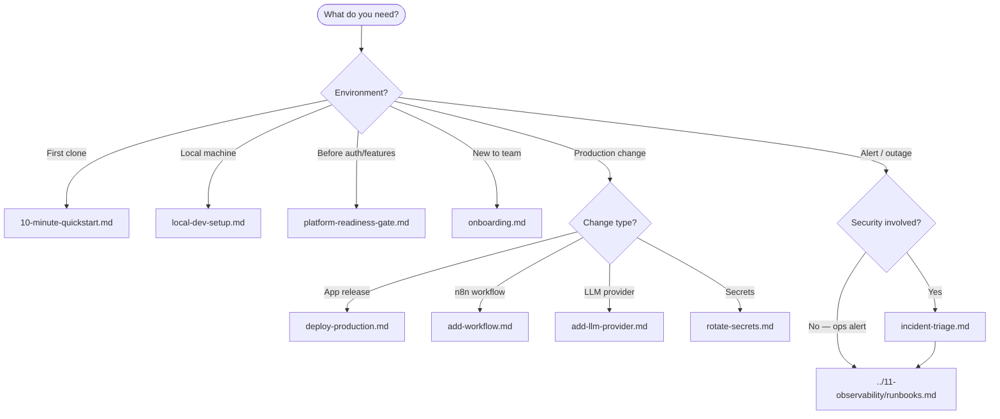

# Operational Playbooks

**LexFlow AI** — Engineer Runbook Index  
**Version:** 1.0  
**Status:** Draft — Pre-Implementation  
**Last Updated:** 2026-07-06

---

## Purpose

This folder contains **step-by-step operational runbooks** for LexFlow AI engineers. Playbooks are procedural — they tell you what to run, in what order, with checklists and escalation paths. Architecture and design rationale live in other doc folders; playbooks focus on **doing the work safely**.

Use playbooks during onboarding, local setup, deployments, incidents, secret rotation, and when extending workflows or LLM providers.

---

## Scope

| In Scope | Out of Scope |
|----------|--------------|
| Engineer-facing operational procedures | Product requirements and domain modeling |
| Checklists, commands, escalation paths | Application source code |
| Cross-references to architecture docs | Firm legal/compliance policy authoring |
| Mermaid flowcharts for decision trees | Automated playbook execution (future) |

---

## Responsibilities

| Role | Playbook Responsibility |
|------|-------------------------|
| **All Engineers** | Follow playbooks for standard operations; propose updates via PR |
| **DevOps / SRE** | Own deploy, incident, and rotation playbooks; keep commands current |
| **Integration Engineer** | Own workflow and n8n playbooks |
| **AI / ML Engineer** | Own LLM provider playbook |
| **Engineering Manager** | Ensure onboarding playbook is part of new-hire checklist |

---

## Playbook Index

| Playbook | When to Use | Primary Owner |
|----------|-------------|---------------|
| [local-dev-setup.md](./local-dev-setup.md) | First machine setup; stack won't start; dependency issues | All Engineers |
| [10-minute-quickstart.md](./10-minute-quickstart.md) | **Sprint 0** — clone to dev in under 10 minutes | All Engineers |
| [platform-readiness-gate.md](./platform-readiness-gate.md) | **Before Sprint 2 / auth** — verify all 10 infra checks | Tech Lead |
| [onboarding.md](./onboarding.md) | New engineer first week; doc reading order | Engineering Manager |
| [incident-triage.md](./incident-triage.md) | PagerDuty alert; outage; security suspicion | On-Call SRE |
| [deploy-production.md](./deploy-production.md) | Production release; hotfix deploy | Release Manager / SRE |
| [rotate-secrets.md](./rotate-secrets.md) | Quarterly rotation ceremony; emergency rotation | Security Architect / SRE |
| [add-workflow.md](./add-workflow.md) | New n8n workflow end-to-end | Integration Engineer |
| [add-llm-provider.md](./add-llm-provider.md) | New LLM or embedding provider adapter | AI / ML Engineer |

---

## Playbook Selection Flow

---

## Related Documentation

| Folder | Relationship |
|--------|--------------|
| [../09-deployment/](../09-deployment/) | Deploy architecture, CI/CD, zero-downtime mechanics |
| [../11-observability/runbooks.md](../11-observability/runbooks.md) | Alert-specific diagnostic procedures (P1–P4) |
| [../06-workflows/](../06-workflows/) | n8n integration, promotion pipeline, webhook contracts |
| [../07-ai/](../07-ai/) | LLM providers, prompts, RAG, safety guardrails |
| [../08-security/](../08-security/) | Secrets management, incident response lifecycle |
| [../10-testing/](../10-testing/) | Test execution referenced in deploy and workflow playbooks |

---

## Conventions

1. **Checklists are mandatory** — Do not skip steps marked with `- [ ]` unless documented exception approved by SRE Lead.
2. **Shell commands are examples** — Run from repo root unless noted. Replace `{placeholders}` with environment-specific values.
3. **Pre-implementation status** — Some commands reference tooling not yet in the repo; paths match [folder-structure.md](../folder-structure.md).
4. **Update playbooks with code** — Any PR that changes deploy steps, Makefile targets, or rotation procedures must update the corresponding playbook in the same PR.
5. **Severity alignment** — P1–P4 definitions match [metrics-alerting.md](../11-observability/metrics-alerting.md) and [incident-triage.md](./incident-triage.md).

---

## Quick Reference

| Situation | First Document | Slack Channel |
|-----------|----------------|---------------|
| Stack won't start locally | local-dev-setup.md | `#lexflow-dev` |
| Production deploy today | deploy-production.md | `#lexflow-releases` |
| PagerDuty fired | incident-triage.md → runbooks.md | `#lexflow-incidents` |
| Suspected credential leak | rotate-secrets.md (emergency section) | `#lexflow-security` |
| New n8n automation | add-workflow.md | `#lexflow-integrations` |
| New AI model vendor | add-llm-provider.md | `#lexflow-ai` |

---

## References

| Document | Description |
|----------|-------------|
| [../README.md](../README.md) | Documentation index |
| [../development-standards.md](../development-standards.md) | Engineering conventions |
| [../folder-structure.md](../folder-structure.md) | Monorepo layout |
| [../09-deployment/README.md](../09-deployment/README.md) | Deployment doc index |
| [../11-observability/README.md](../11-observability/README.md) | Observability doc index |
