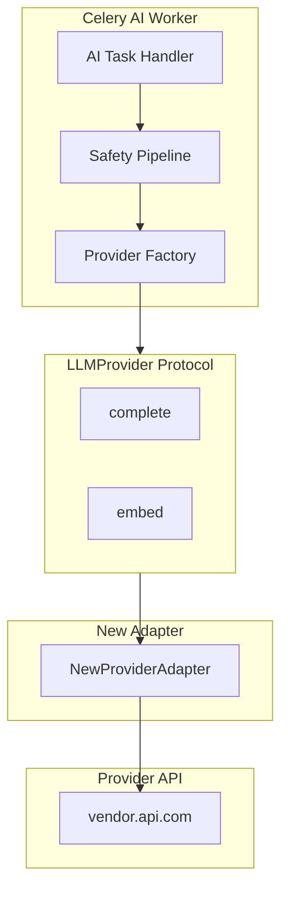
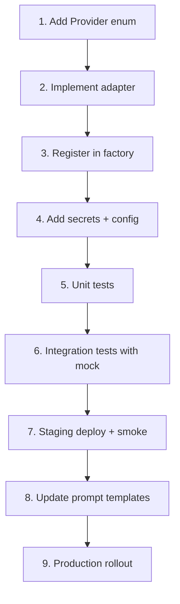
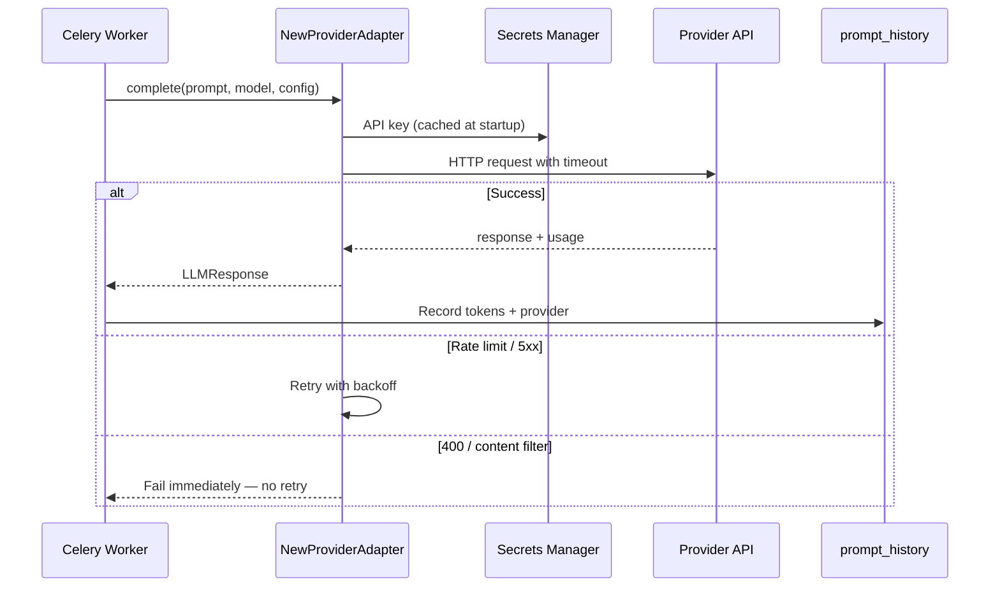
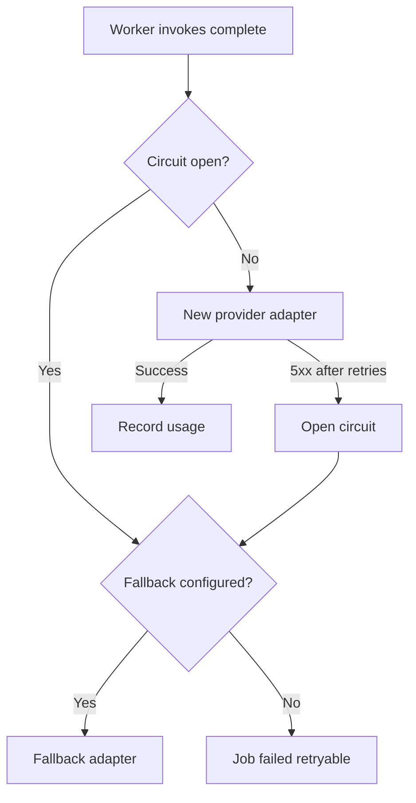

# Add LLM Provider

**LexFlow AI** — New Provider Adapter End-to-End  
**Version:** 1.0  
**Status:** Draft — Pre-Implementation  
**Last Updated:** 2026-07-06

---

## Purpose

This playbook describes how to add a **new LLM or embedding provider** to LexFlow AI — adapter implementation, factory registration, secrets configuration, prompt template updates, testing, staging validation, and production rollout. All provider calls remain on the **async Celery worker path** only.

Architecture: [../07-ai/llm-providers.md](../07-ai/llm-providers.md), [ADR-004](../13-decisions/004-async-ai-processing.md).

---

## Scope

| In Scope | Out of Scope |
|----------|--------------|
| `LLMProvider` protocol adapter implementation | Model fine-tuning |
| Factory registration and config | Frontend model picker UI |
| Secrets Manager setup | Provider billing portal |
| Prompt template `model_config` updates | n8n LLM nodes (prohibited) |
| Failover and circuit breaker config | Real-time streaming (Phase 2) |

---

## Responsibilities

| Role | Responsibility |
|------|----------------|
| **AI / ML Engineer** | Implement adapter; unit + integration tests |
| **Backend Engineer** | Review factory integration; worker task changes |
| **Security Architect** | Approve secrets path; data residency review |
| **DevOps / SRE** | Provision secrets; deploy worker service |
| **Compliance Officer** | Firm policy sign-off for new vendor (production) |

---

## Prerequisites Checklist

Before starting implementation:

- [ ] Firm legal/compliance approved new provider for production data (if applicable)
- [ ] Data residency requirements documented
- [ ] Provider enterprise agreement or DPA in place
- [ ] ADR not required if adapter fits existing protocol — ADR required for new **architectural** constraints
- [ ] Provider **not** used in n8n workflows (ADR-002, ADR-004)

---

## Architecture Overview



---

## End-to-End Procedure



---

## Step 1 — Extend Domain Model

Add provider to `Provider` enum in domain layer.

| Location | Change |
|----------|--------|
| `services/ai_management/domain/enums.py` | Add enum value, e.g. `bedrock = "bedrock"` |
| `docs/07-ai/llm-providers.md` | Update provider matrix |
| `docs/05-database/ai-schema.md` | Confirm `prompt_history.provider` accepts value |

- [ ] Enum added
- [ ] Alembic migration if DB constraint change required

---

## Step 2 — Implement Adapter

Create adapter implementing `LLMProvider` protocol.

| Location | Purpose |
|----------|---------|
| `services/ai_management/infrastructure/llm/{provider}_adapter.py` | Adapter implementation |
| `services/ai_management/domain/ports/llm_provider.py` | Protocol (unchanged unless new capability) |

### Adapter Requirements

| Method | Contract |
|--------|----------|
| `complete(prompt, model, config)` | Returns `LLMResponse` with token counts |
| `embed(texts, model)` | Returns `list[list[float]]` |

### Required Behavior

| Concern | Implementation |
|---------|----------------|
| Auth | Load API key from Secrets Manager at startup |
| Timeout | Respect `config.timeout_seconds` (default 120s) |
| Retry | 429 → exponential backoff with `Retry-After`; 5xx → 3 retries |
| Rate limits | Respect provider headers |
| Errors | Map to domain exceptions — never expose raw provider errors to clients |
| Logging | Log provider, model, latency — **never** log prompt content at INFO |
| Metering | Return accurate `input_tokens` / `output_tokens` |
| Production guard | Block dev-only providers (e.g., Ollama) when `ENV=production` |



- [ ] Adapter implements both `complete` and `embed` (or `NotImplementedError` for embed-only providers with clear docs)
- [ ] Environment guard for production

---

## Step 3 — Register in Factory

| Location | Change |
|----------|--------|
| `services/ai_management/infrastructure/llm/factory.py` | Add case to `get_provider()` |
| `apps/api/src/config.py` | Add settings for endpoint, deployment names |

```python
# Conceptual factory registration
def get_provider(provider: Provider) -> LLMProvider:
    match provider:
        case Provider.azure_openai:
            return AzureOpenAIAdapter(settings)
        case Provider.new_provider:
            return NewProviderAdapter(settings)
        # ...
```

- [ ] Factory returns new adapter for enum value
- [ ] Unknown provider raises clear error at startup in production

---

## Step 4 — Secrets & Configuration

### Secrets Manager

Add secret following hierarchy in [secrets-management.md](../08-security/secrets-management.md):

```
{env}/new-provider/api-key
{env}/new-provider/endpoint      # if applicable
```

| Environment | Action |
|-------------|--------|
| Local | Add dummy key to `.env.example` (name only) + local `.env` |
| Staging | Create secret via Terraform; populate with staging key |
| Production | Security Architect creates; Compliance sign-off |

### Terraform

| Location | Change |
|----------|--------|
| `infra/terraform/modules/secrets/` | Add secret resource |
| `infra/terraform/modules/ecs/` | Add secret ARN to worker task definition |

- [ ] IAM task role grants worker read access to new secret path only
- [ ] Secret not in git, Terraform state encrypted

### Environment Variables

| Variable | Service | Example |
|----------|---------|---------|
| `NEW_PROVIDER_API_KEY` | worker | From Secrets Manager |
| `NEW_PROVIDER_ENDPOINT` | worker | Task definition env |

---

## Step 5 — Unit Tests

| Test File | Coverage |
|-----------|----------|
| `services/ai_management/tests/unit/test_{provider}_adapter.py` | Success, timeout, 429 retry, 400 no-retry, token parsing |
| `services/ai_management/tests/unit/test_factory.py` | Factory resolves new provider |

Use `httpx` mock or `pytest-httpx` — no live API calls in unit tests.

- [ ] All unit tests pass
- [ ] Coverage ≥ 80% for new adapter module

---

## Step 6 — Integration Tests

| Test | Approach |
|------|----------|
| Staging live call | Optional — gated behind `@pytest.mark.integration` |
| Local mock | Required — mock provider HTTP |
| Failover | Test primary failure → fallback provider if configured |

```bash
pytest services/ai_management/tests/integration/test_llm_providers.py -m integration --env staging
```

- [ ] Integration tests pass in CI (mock path)
- [ ] Staging smoke call successful (manual or CI nightly)

---

## Step 7 — Failover & Circuit Breaker

If provider is primary or fallback:

| Config | Location |
|--------|----------|
| Primary provider | `PromptTemplate.model_config.provider` |
| Fallback provider | Firm config or template-level override |
| Circuit breaker thresholds | Match [llm-providers.md](../07-ai/llm-providers.md) — 5 consecutive failures → open |



- [ ] Circuit breaker registered for new provider
- [ ] Alert configured: `ai-provider-error-rate` in [metrics-alerting.md](../11-observability/metrics-alerting.md)

---

## Step 8 — Prompt Template Updates

Assign provider to templates via database seed or admin API — **never hardcode in worker tasks**.

| Step | Action |
|------|--------|
| 1 | Identify templates using new provider (e.g., contract review → Anthropic) |
| 2 | Update `ai.prompt_templates.model_config` JSON |
| 3 | Seed/migration for new templates |
| 4 | Verify in staging admin UI |

Example `model_config`:

```json
{
  "provider": "new_provider",
  "model": "model-id-v1",
  "temperature": 0.2,
  "max_tokens": 4096,
  "timeout_seconds": 120
}
```

- [ ] Templates updated
- [ ] Usage metering records correct provider in `llm_usage`

See [prompt-management.md](../07-ai/prompt-management.md), [usage-metering.md](../07-ai/usage-metering.md).

---

## Step 9 — Staging Deploy

| Step | Action |
|------|--------|
| 1 | Merge adapter PR to `main` |
| 2 | Staging auto-deploy (worker service) |
| 3 | Verify secret loaded: worker logs show provider init (no key value) |
| 4 | Trigger test AI job: document summary or chat |
| 5 | Verify `prompt_history` row with new provider |
| 6 | Verify token metering in business dashboard |

```bash
# Trigger test job via API (staging)
curl -X POST "https://staging-api.lexflow.{domain}/api/v1/ai/summarize" \
  -H "Authorization: Bearer ${STAGING_TOKEN}" \
  -H "Content-Type: application/json" \
  -d '{"caseId":"{test-case-id}","documentId":"{test-doc-id}"}'
```

- [ ] Job completes with `status=completed`
- [ ] No PII in logs at INFO level

---

## Step 10 — Production Rollout

Follow [deploy-production.md](./deploy-production.md).

| Additional Check | Owner |
|------------------|-------|
| Compliance sign-off for firm data to new vendor | Compliance Officer |
| Production secret created and verified | Security Architect |
| Rollback plan: revert templates to previous provider | AI Engineer |
| Monitor `ai_request_duration_seconds` and error rate 24h | On-Call SRE |

### Rollback

| Step | Action |
|------|--------|
| 1 | Update prompt templates to previous provider |
| 2 | Deploy template change (no code rollback if adapter additive) |
| 3 | Or: full worker rollback to previous `{git-sha}` |
| 4 | Verify AI jobs complete |

---

## Provider-Specific Notes

### Adding AWS Bedrock (Example — Phase 3)

| Aspect | Detail |
|--------|--------|
| Auth | IAM task role — no API key in Secrets Manager |
| Models | Claude via Bedrock, Titan embeddings |
| Data residency | AWS region-bound — configure `us-east-1` |
| Factory enum | `Provider.bedrock` |

### Adding Ollama (Local Dev Only)

| Aspect | Detail |
|--------|--------|
| Block in production | `if settings.environment == "production": raise ConfigurationError` |
| Base URL | `http://host.docker.internal:11434` from Compose |
| Use case | Offline dev, CI smoke with mock models |

---

## Verification Checklist

| Check | Expected |
|-------|----------|
| `make test` | Pass |
| Worker startup | Adapter initializes without error |
| `complete()` smoke | Returns `LLMResponse` with tokens |
| `embed()` smoke | Returns vectors of expected dimension |
| Failover | Fallback works when primary circuit open |
| `prompt_history` | Provider enum stored correctly |
| `llm_usage` | Token counts and cost estimated |
| Client API | Errors map to generic `llm_provider_error` |
| Production guard | Ollama-like providers rejected in prod |

---

## Prohibited Patterns

| Anti-Pattern | Correct Approach |
|--------------|------------------|
| LLM call in FastAPI route handler | Celery worker only (ADR-004) |
| LLM node in n8n workflow | FastAPI async path |
| Hardcoded provider in task code | Read from `PromptTemplate.model_config` |
| API key in source code | Secrets Manager |
| Raw provider error to client | Map to domain error codes |

---

## References

| Document | Description |
|----------|-------------|
| [../07-ai/llm-providers.md](../07-ai/llm-providers.md) | Provider matrix and adapter specs |
| [../07-ai/prompt-management.md](../07-ai/prompt-management.md) | Template-driven provider selection |
| [../07-ai/usage-metering.md](../07-ai/usage-metering.md) | Token recording |
| [../07-ai/safety-guardrails.md](../07-ai/safety-guardrails.md) | Pre-send PII pipeline |
| [../07-ai/rag-architecture.md](../07-ai/rag-architecture.md) | Embedding provider usage |
| [../04-api/endpoints-ai.md](../04-api/endpoints-ai.md) | Async API error codes |
| [../05-database/ai-schema.md](../05-database/ai-schema.md) | `prompt_history`, `llm_usage` |
| [../08-security/secrets-management.md](../08-security/secrets-management.md) | Secret paths and rotation |
| [../13-decisions/004-async-ai-processing.md](../13-decisions/004-async-ai-processing.md) | Async-only constraint |
| [rotate-secrets.md](./rotate-secrets.md) | API key rotation |
| [deploy-production.md](./deploy-production.md) | Production deploy |
