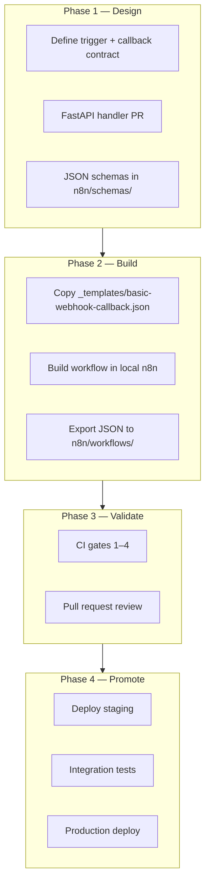
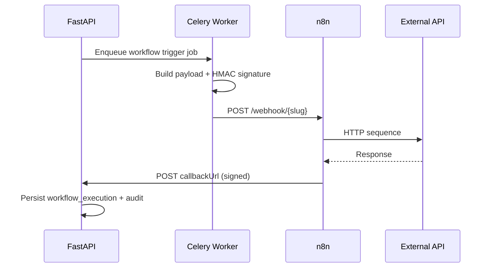
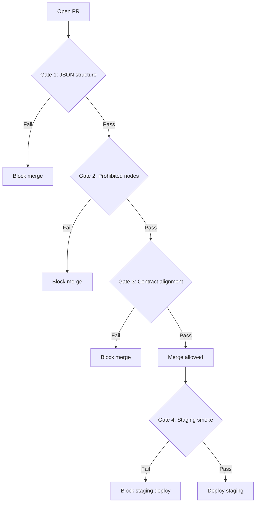
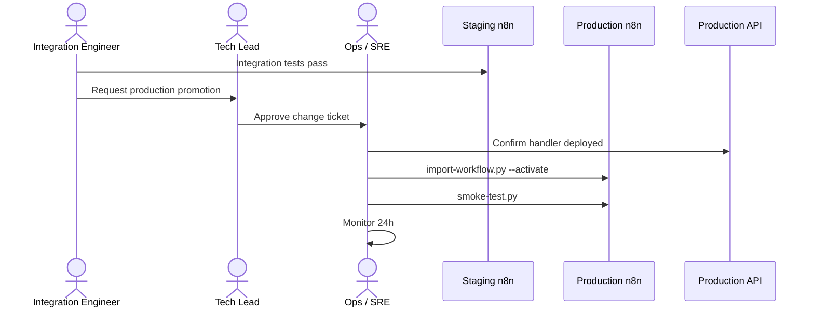

# Add n8n Workflow

**LexFlow AI** — End-to-End New Workflow Procedure  
**Version:** 1.0  
**Status:** Draft — Pre-Implementation  
**Last Updated:** 2026-07-06

---

## Purpose

This playbook walks an integration engineer through **adding a new n8n workflow** to LexFlow AI — from FastAPI contract definition through local development, CI validation, staging promotion, and production deployment. Business logic stays in FastAPI; n8n orchestrates external HTTP calls only.

Architecture: [../06-workflows/n8n-integration.md](../06-workflows/n8n-integration.md), [../06-workflows/promotion-pipeline.md](../06-workflows/promotion-pipeline.md).

---

## Scope

| In Scope | Out of Scope |
|----------|--------------|
| New workflow authoring and repo layout | Modifying n8n platform version |
| JSON schema, catalog, and contract alignment | FastAPI business logic implementation (separate PR) |
| CI gates and environment promotion | n8n Enterprise license |
| Rollback of workflow deployments | Building custom n8n nodes |

---

## Responsibilities

| Role | Responsibility |
|------|----------------|
| **Integration Engineer** | Author workflow JSON, schemas, tests |
| **Backend Engineer** | Implement trigger handler + callback endpoint in FastAPI |
| **Tech Lead** | Approve production promotion |
| **Ops / SRE** | Execute production import; monitor 24h |
| **Security Reviewer** | Verify no prohibited nodes or inline secrets |

---

## End-to-End Flow



---

## Phase 1 — Design & Contract

### Step 1.1 — Define Workflow Slug

| Rule | Example |
|------|---------|
| kebab-case + version suffix | `deadline-reminder-v1` |
| Matches filename | `n8n/workflows/notifications/deadline-reminder-v1.json` |
| Registered in catalog | [../06-workflows/workflow-catalog.md](../06-workflows/workflow-catalog.md) |

- [ ] Slug unique in catalog
- [ ] Purpose documented in catalog table

### Step 1.2 — Define Trigger Payload (FastAPI → n8n)

Create JSON schema: `n8n/schemas/trigger/{slug}.json`

Required fields in every trigger:

| Field | Type | Source |
|-------|------|--------|
| `correlationId` | UUID | FastAPI generates |
| `callbackUrl` | string | FastAPI internal callback URL |
| `firmId` | UUID | From case context |
| `caseId` | UUID | From case context |
| `flags.*` | boolean | Pre-computed by FastAPI — n8n routes on these only |

See [../06-workflows/webhook-contracts.md](../06-workflows/webhook-contracts.md).

- [ ] Trigger schema created
- [ ] Backend Engineer confirms handler will populate all fields

### Step 1.3 — Define Callback Payload (n8n → FastAPI)

Create JSON schema: `n8n/schemas/output/{slug}.json`

- [ ] Output schema created
- [ ] Callback endpoint specified in [../04-api/webhooks-internal.md](../04-api/webhooks-internal.md)

### Step 1.4 — FastAPI Implementation (Parallel PR)

Backend Engineer implements:

| Component | Location |
|-----------|----------|
| Trigger use case | `services/workflow_management/application/` |
| n8n client (signed trigger) | `services/workflow_management/infrastructure/n8n_client.py` |
| Callback handler | `apps/api/src/api/v1/internal/webhooks.py` |
| Workflow definition seed | `workflow_definitions` table migration/seed |



- [ ] FastAPI PR merged or ready before production workflow deploy
- [ ] **Rule:** Never import workflow that calls API endpoints not yet deployed

---

## Phase 2 — Build Workflow

### Step 2.1 — Start from Template

```bash
cp n8n/workflows/_templates/basic-webhook-callback.json \
   n8n/workflows/{category}/{slug}.json
```

Categories: `intake/`, `documents/`, `notifications/`, `cases/`, `discovery/`, `compliance/`

### Step 2.2 — Local n8n Setup

```bash
make dev                    # Ensure n8n running
make n8n-import WF=n8n/workflows/{category}/{slug}.json
```

Access n8n UI: http://localhost:5678 (credentials from `.env`)

### Step 2.3 — Workflow Node Checklist

| Node | Required | Notes |
|------|----------|-------|
| Webhook trigger | Yes | Path = `{slug}` |
| HMAC verification | Yes | Verify `X-LexFlow-Signature` |
| HTTP Request (callback) | Yes | Set `X-N8N-Signature` header |
| External HTTP nodes | As needed | Timeout ≤ 60s; retry ≤ 3 |
| IF / Switch | Optional | Route on `flags.*` from trigger only |
| Code node | Optional | ≤ 20 lines; data transform only |

**Prohibited:** PostgreSQL, Redis, Execute Command, AI/LLM nodes. See [n8n-integration.md](../06-workflows/n8n-integration.md).

- [ ] All HTTP nodes named descriptively (`create-sharepoint-folder`, not `HTTP Request 3`)
- [ ] No inline credentials in JSON
- [ ] Callback URL uses `{{$json.callbackUrl}}` from trigger

### Step 2.4 — Validate Locally

```bash
python n8n/scripts/validate-workflow.py \
  --workflow n8n/workflows/{category}/{slug}.json

python n8n/scripts/smoke-test.py \
  --target local \
  --slug {slug}
```

- [ ] Validator passes
- [ ] Local smoke test passes

---

## Phase 3 — CI Validation & PR

### CI Gates



| Gate | Checks |
|------|--------|
| **1 — JSON structure** | Valid n8n format; required nodes; no inline secrets; slug matches catalog |
| **2 — Node scan** | No prohibited nodes; Code ≤ 20 lines |
| **3 — Contract** | Payload matches schemas; HMAC nodes present |
| **4 — Smoke** | Activates on staging; signed trigger works; callback reaches API |

### PR Checklist

- [ ] Workflow JSON in `n8n/workflows/{category}/{slug}.json`
- [ ] Trigger schema: `n8n/schemas/trigger/{slug}.json`
- [ ] Output schema: `n8n/schemas/output/{slug}.json`
- [ ] Catalog entry in [workflow-catalog.md](../06-workflows/workflow-catalog.md)
- [ ] Integration test: `tests/integration/workflows/test_{slug_underscore}.py`
- [ ] No credentials in exported JSON
- [ ] Backend PR for FastAPI handler merged (or linked)
- [ ] 2 approvals including Backend Engineer review for contract

---

## Phase 4 — Staging Promotion

Staging deploys **automatically** on merge to `main`.

```bash
# Triggered by GitHub Actions — deploy-n8n-workflows.yml (staging)
# Manual verification:
python n8n/scripts/import-workflow.py \
  --target staging \
  --workflow n8n/workflows/{category}/{slug}.json \
  --activate

python n8n/scripts/update-definition-mapping.py \
  --env staging \
  --slug {slug} \
  --n8n-workflow-id {returned_id}

pytest tests/integration/workflows/test_{slug_underscore}.py --env staging
```

- [ ] Workflow active on staging n8n
- [ ] `workflow_definitions` mapping updated
- [ ] Integration tests pass
- [ ] Manual test with anonymized staging data (if applicable)

---

## Phase 5 — Production Deployment

Requires **manual approval** and change ticket.

| Step | Action | Owner |
|------|--------|-------|
| 1 | Confirm staging integration tests passed | Integration Engineer |
| 2 | Confirm FastAPI handler deployed to production | Backend Engineer |
| 3 | Create change ticket with slug and version | Integration Engineer |
| 4 | Tech Lead approves | Tech Lead |
| 5 | Run production import | Ops / SRE |
| 6 | Update `workflow_definitions` mapping | Ops / SRE |
| 7 | Post-deploy smoke test | Ops / SRE |
| 8 | Monitor execution metrics 24 hours | Ops / SRE |

```bash
python n8n/scripts/import-workflow.py \
  --target production \
  --workflow n8n/workflows/{category}/{slug}.json \
  --activate \
  --approval-token ${DEPLOY_APPROVAL_TOKEN}

python n8n/scripts/smoke-test.py \
  --target production \
  --slug {slug} \
  --dry-run
```



- [ ] Production smoke test pass
- [ ] No spike in `workflow_executions{status=failed}`
- [ ] Change ticket closed

---

## Hotfix Path (Expedited)

For production workflow failure requiring immediate fix:

1. Hotfix branch with corrected JSON
2. CI validation **required** (no bypass)
3. Deploy to staging → targeted smoke test only
4. Deploy to production
5. Retroactive PR within 24 hours

See [promotion-pipeline.md — Hotfix Promotion](../06-workflows/promotion-pipeline.md).

---

## Rollback

| Step | Action |
|------|--------|
| 1 | Import previous workflow JSON from Git tag |
| 2 | Deactivate broken version in n8n admin |
| 3 | Activate previous version |
| 4 | Update `workflow_definitions.n8n_workflow_id` |
| 5 | Run smoke test on rolled-back version |
| 6 | Create rollback PR documenting incident |

```bash
git show v{previous-release}:n8n/workflows/{category}/{slug}.json > /tmp/{slug}-rollback.json

python n8n/scripts/import-workflow.py \
  --target production \
  --workflow /tmp/{slug}-rollback.json \
  --activate
```

---

## Manual Smoke Workflows

**Never activate** manual-trigger smoke workflows (WF-98, WF-99) for scheduled or webhook traffic. Run from n8n UI only.

---

## Completion Checklist

- [ ] Contract schemas defined
- [ ] FastAPI handler deployed
- [ ] Workflow JSON validated and merged
- [ ] Staging integration tests pass
- [ ] Production deployed with approval
- [ ] 24-hour monitoring complete
- [ ] Catalog and docs updated

---

## References

| Document | Description |
|----------|-------------|
| [../06-workflows/n8n-integration.md](../06-workflows/n8n-integration.md) | Node restrictions and security |
| [../06-workflows/promotion-pipeline.md](../06-workflows/promotion-pipeline.md) | Promotion stages and CI gates |
| [../06-workflows/webhook-contracts.md](../06-workflows/webhook-contracts.md) | HMAC signing specification |
| [../06-workflows/workflow-catalog.md](../06-workflows/workflow-catalog.md) | Workflow registry |
| [../06-workflows/orchestration-model.md](../06-workflows/orchestration-model.md) | Responsibility split |
| [../13-decisions/002-n8n-orchestration-only.md](../13-decisions/002-n8n-orchestration-only.md) | ADR — no business logic in n8n |
| [deploy-production.md](./deploy-production.md) | App deploy coordination |
| [../09-deployment/cicd-pipeline.md](../09-deployment/cicd-pipeline.md) | deploy-n8n-workflows.yml |
