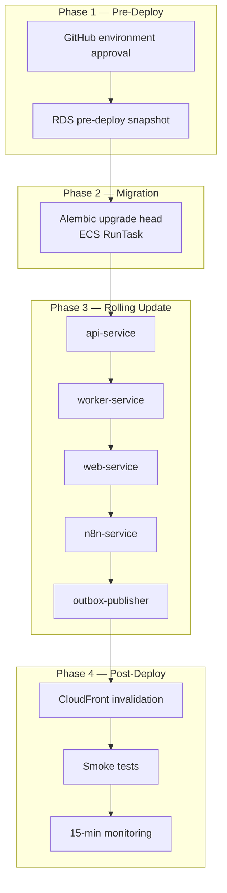
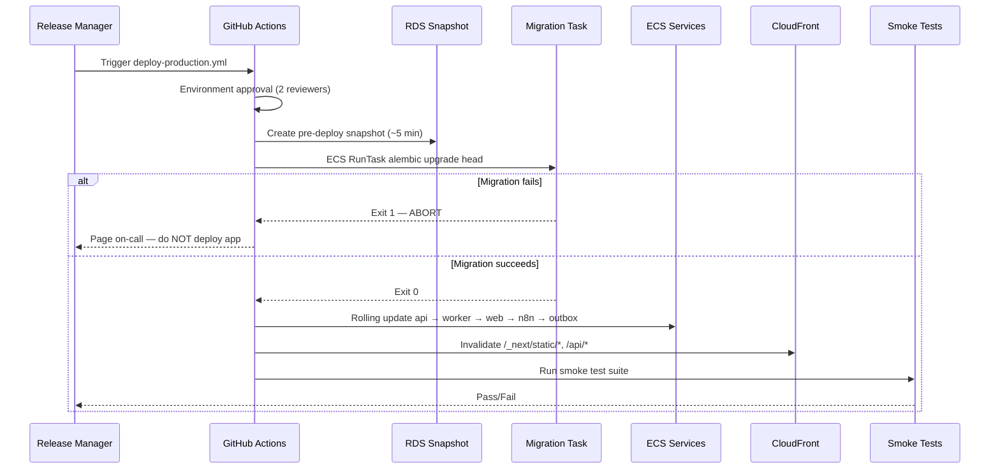
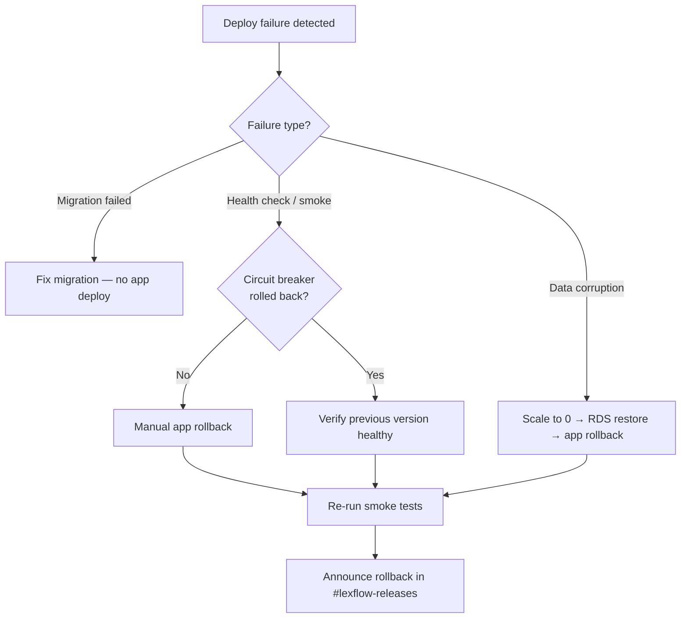

# Deploy Production

**LexFlow AI** — Pre-Deploy Checklist, Deploy Steps, Smoke Tests & Rollback  
**Version:** 1.0  
**Status:** Draft — Pre-Implementation  
**Last Updated:** 2026-07-06

---

## Purpose

This playbook is the **operator's guide for production releases** — approval gates, pre-deploy checklist, step-by-step deploy execution, post-deploy smoke tests, monitoring window, and rollback. It implements procedures defined in [../09-deployment/cicd-pipeline.md](../09-deployment/cicd-pipeline.md) and [../09-deployment/zero-downtime-deploy.md](../09-deployment/zero-downtime-deploy.md).

**Who runs this:** Release Manager triggers deploy; On-Call SRE monitors; Backend Engineer on standby for migration issues.

---

## Scope

| In Scope | Out of Scope |
|----------|--------------|
| Application container deploy to production ECS | n8n workflow-only deploy (see [add-workflow.md](./add-workflow.md)) |
| Database migration orchestration | Terraform infra apply (separate workflow) |
| Smoke tests and 15-minute monitoring | Firm change advisory board process |
| Rollback — app and database | Writing Alembic migrations |

---

## Responsibilities

| Role | Responsibility |
|------|----------------|
| **Release Manager** | Trigger deploy; verify approval criteria; authorize rollback |
| **On-Call SRE** | Monitor 15-minute window; execute rollback if needed |
| **Backend Engineer** | Standby for migration failures; hotfix if required |
| **QA Engineer** | Confirm staging E2E passed for same `{git-sha}` |
| **DBA / SRE** | Review destructive migrations before approval |

---

## Deploy Window Policy

| Rule | Value |
|------|-------|
| Allowed days | Tuesday – Thursday |
| Allowed hours | 10:00 – 16:00 US/Eastern |
| Blackout | Fridays, Mondays, US federal holidays |
| On-call | Must be available for full deploy + 15 min monitoring |
| Concurrent deploys | One production deploy at a time |

---

## Pre-Deploy Checklist

Complete **all** items before triggering `deploy-production.yml`.

### Release Readiness

- [ ] Staging deploy completed successfully with target `{git-sha}`
- [ ] Staging integration tests passed (0 failures)
- [ ] Staging E2E tests passed (critical paths: login, case create, document upload, workflow trigger)
- [ ] No open **P1** or **P2** incidents ([incident-triage.md](./incident-triage.md))
- [ ] PR merged to `main` with 2 approvals
- [ ] Container scan: no new CRITICAL/HIGH vulnerabilities
- [ ] Rollback plan documented in PR description
- [ ] Release Manager and On-Call SRE confirmed available

### Database Migration Review (if schema change)

- [ ] Migration is **backward-compatible** with currently running production code
- [ ] Destructive changes use expand-contract pattern (3-deploy minimum)
- [ ] DBA reviewed migration SQL
- [ ] Downgrade migration tested in staging
- [ ] See [../05-database/migrations.md](../05-database/migrations.md)

### Coordinated Changes

| Change Type | Additional Check |
|-------------|------------------|
| API contract change | Frontend deployed in same release or backward compatible |
| n8n workflow change | App deploy **first**, then workflow import ([add-workflow.md](./add-workflow.md)) |
| Secret rotation | Complete **before** deploy if new secret version required |
| Feature flag | Flag default safe for production |

---

## Deploy Architecture



---

## Deploy Procedure

### Step 1 — Announce Release

Post in `#lexflow-releases`:

```
📦 PRODUCTION DEPLOY starting
SHA: {git-sha}
Release manager: @{name}
On-call: @{name}
Migration: {yes/no}
Expected duration: ~45 min
```

- [ ] Thread opened

### Step 2 — Trigger GitHub Actions Workflow

```bash
# From repo — or use GitHub UI: Actions → Deploy Production → Run workflow
gh workflow run deploy-production.yml \
  -f git_sha={git-sha} \
  -f skip_migration=false
```

- [ ] Two production environment reviewers approved in GitHub
- [ ] Workflow run URL captured in `#lexflow-releases` thread

### Step 3 — Monitor Pipeline Stages



| Stage | Expected Duration | Abort If |
|-------|-------------------|----------|
| Environment approval | Variable | Criteria not met |
| RDS snapshot | ~5 min | Snapshot failure |
| Migration task | ~2 min | Exit code ≠ 0 |
| Rolling update | ~10 min | Circuit breaker rollback |
| CloudFront invalidation | ~2 min | — |
| Smoke tests | ~5 min | Any test failure |
| Monitoring window | 15 min | Metrics exceed thresholds |

Monitor workflow logs:

```bash
gh run watch {run-id}
```

- [ ] Snapshot completed
- [ ] Migration exit 0
- [ ] All ECS services 100% healthy
- [ ] CloudFront invalidation complete

### Step 4 — Service Deployment Order

| Order | Service | Wait Condition |
|-------|---------|----------------|
| 1 | `migration` (one-off RunTask) | Exit 0 before continuing |
| 2 | `api-service` | ≥ 50% tasks healthy |
| 3 | `worker-service` | ≥ 50% tasks healthy |
| 4 | `web-service` | All tasks healthy |
| 5 | `n8n-service` | All tasks healthy |
| 6 | `outbox-publisher` | All tasks healthy |

Verify ECS health:

```bash
aws ecs describe-services \
  --cluster lexflow-production \
  --services lexflow-api lexflow-worker lexflow-web lexflow-n8n lexflow-outbox \
  --query 'services[*].{name:serviceName,running:runningCount,desired:desiredCount,deployments:deployments[0].rolloutState}' \
  --output table
```

- [ ] All services `runningCount == desiredCount`
- [ ] Rollout state `COMPLETED`

---

## Smoke Tests

Executed automatically by CI; **manually verify** if automation fails or for hotfix validation.

### Automated Smoke Suite

| # | Test | Command / Endpoint | Expected |
|---|------|-------------------|----------|
| 1 | API health | `GET https://api.lexflow.{domain}/health` | 200, all checks `ok` |
| 2 | Web health | `GET https://app.lexflow.{domain}/api/health` | 200 |
| 3 | Authentication | Login with test service account | JWT returned |
| 4 | Case list | `GET /api/v1/cases?limit=1` | 200, paginated |
| 5 | Document presign | `POST /api/v1/documents/presign` (test case) | 200, URL returned |
| 6 | Workflow trigger | Trigger test workflow | 202, `correlationId` |
| 7 | Worker job | Poll job status | `completed` within 60s |
| 8 | n8n health | Internal ALB `GET /healthz` | 200 |

Manual smoke (if needed):

```bash
# API health
curl -s "https://api.lexflow.{domain}/health" | jq .

# Auth + case list
TOKEN=$(curl -s -X POST "https://api.lexflow.{domain}/api/v1/auth/login" \
  -H "Content-Type: application/json" \
  -d '{"email":"smoke-test@lexflow.internal","password":"${SMOKE_TEST_PASSWORD}"}' \
  | jq -r .access_token)

curl -s "https://api.lexflow.{domain}/api/v1/cases?limit=1" \
  -H "Authorization: Bearer ${TOKEN}" | jq .
```

- [ ] All smoke tests pass
- [ ] Failures investigated before declaring success

---

## 15-Minute Monitoring Window

**Do not declare deploy complete** until this window passes with green metrics.

| Metric | Baseline | Alert Threshold | Dashboard |
|--------|----------|-----------------|-----------|
| ALB 5xx rate | < 0.1% | > 1% | Operational Row 2 |
| API p95 latency | < 300ms | > 500ms | Operational Row 2 |
| ECS task health | 100% | < 100% | Operational Row 1 |
| RabbitMQ queue depth | Stable | > 3× pre-deploy | Operational Row 4 |
| DLQ message count | 0 | > 0 | Operational Row 4 |
| Error log rate | Baseline | > 2× baseline | CloudWatch Logs Insights |

```bash
# Quick error rate check
aws cloudwatch get-metric-statistics \
  --namespace AWS/ApplicationELB \
  --metric-name HTTPCode_Target_5XX_Count \
  --dimensions Name=LoadBalancer,Value=app/lexflow-api/... \
  --start-time $(date -u -v-15M +%Y-%m-%dT%H:%M:%S) \
  --end-time $(date -u +%Y-%m-%dT%H:%M:%S) \
  --period 60 --statistics Sum
```

- [ ] 15 minutes elapsed with metrics within thresholds
- [ ] No new P1/P2 alerts fired

### Deploy Success Announcement

```
✅ PRODUCTION DEPLOY complete
SHA: {git-sha}
Duration: {minutes}
Smoke tests: PASS
Monitoring window: PASS
Image tag: production-{timestamp}
```

---

## Rollback Procedures

### When to Rollback

| Trigger | Rollback Type |
|---------|---------------|
| Migration failed (exit ≠ 0) | **Do not deploy app** — fix migration, re-run |
| ECS circuit breaker triggered | Automatic — verify service healthy on previous revision |
| Smoke test failure | Manual app rollback |
| Error rate > 5% post-deploy | Manual app rollback |
| Data corruption from migration | Database restore + app rollback |

### Rollback Decision Flow



### Manual Application Rollback

| Step | Action | Duration |
|------|--------|----------|
| 1 | Identify last known-good tag: `production-{timestamp}` | ~1 min |
| 2 | Update ECS task definitions to previous image tag | ~1 min |
| 3 | Force new deployment (rolling update to old version) | ~10 min |
| 4 | Invalidate CloudFront: `/_next/static/*`, `/api/*` | ~2 min |
| 5 | Run smoke tests | ~5 min |
| 6 | Monitor 15 minutes | 15 min |

```bash
# Force rollback to previous task definition revision
PREV_TASK_DEF=$(aws ecs describe-services \
  --cluster lexflow-production \
  --services lexflow-api \
  --query 'services[0].taskDefinition' --output text | sed 's/:[0-9]*$/:PREV_REV/')

aws ecs update-service \
  --cluster lexflow-production \
  --service lexflow-api \
  --task-definition "${PREV_TASK_DEF}" \
  --force-new-deployment

# Repeat for worker, web, n8n, outbox-publisher
```

- [ ] All services on previous task definition
- [ ] Smoke tests pass
- [ ] Incident ticket opened

### Database Rollback (Migration Caused Data Issues)

| Step | Action | Duration |
|------|--------|----------|
| 1 | Scale API and worker tasks to 0 | ~2 min |
| 2 | Restore RDS from pre-deploy snapshot (or PITR) | ~15–30 min |
| 3 | Update Secrets Manager if endpoint changed | ~1 min |
| 4 | Deploy previous application version | ~10 min |
| 5 | Smoke tests against restored database | ~5 min |
| 6 | Resume traffic | — |

See [../05-database/retention-backup.md](../05-database/retention-backup.md) and [../09-deployment/disaster-recovery.md](../09-deployment/disaster-recovery.md).

**RTO:** ~30 min (app only) | ~1 hour (with database restore)

---

## n8n Workflow Coordination

| Scenario | Action |
|----------|--------|
| App deploy, no workflow changes | No n8n action |
| Workflow changes only | Use `deploy-n8n-workflows.yml` — no app deploy |
| App + workflow changes | **App deploy first** → then workflow import |
| Rollback app only | Workflows must remain compatible with rolled-back API |

See [../06-workflows/promotion-pipeline.md](../06-workflows/promotion-pipeline.md).

---

## Post-Deploy Checklist

- [ ] All pipeline stages green
- [ ] Smoke tests passed
- [ ] 15-minute monitoring window complete
- [ ] Images tagged `production-{timestamp}`
- [ ] `#lexflow-releases` success posted
- [ ] Deploy annotation visible on Grafana/CloudWatch dashboard
- [ ] Change ticket closed
- [ ] n8n workflow deploy completed (if applicable)

---

## References

| Document | Description |
|----------|-------------|
| [../09-deployment/cicd-pipeline.md](../09-deployment/cicd-pipeline.md) | CI/CD pipeline and GitHub workflows |
| [../09-deployment/zero-downtime-deploy.md](../09-deployment/zero-downtime-deploy.md) | Rolling update mechanics |
| [../09-deployment/environment-strategy.md](../09-deployment/environment-strategy.md) | Environment promotion |
| [../11-observability/runbooks.md](../11-observability/runbooks.md) | Post-deploy alert response |
| [../11-observability/metrics-alerting.md](../11-observability/metrics-alerting.md) | Alert thresholds |
| [incident-triage.md](./incident-triage.md) | If deploy causes incident |
| [add-workflow.md](./add-workflow.md) | n8n workflow deploy |
