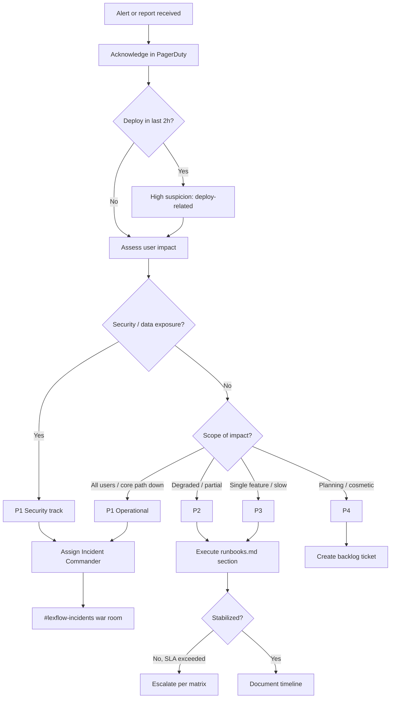
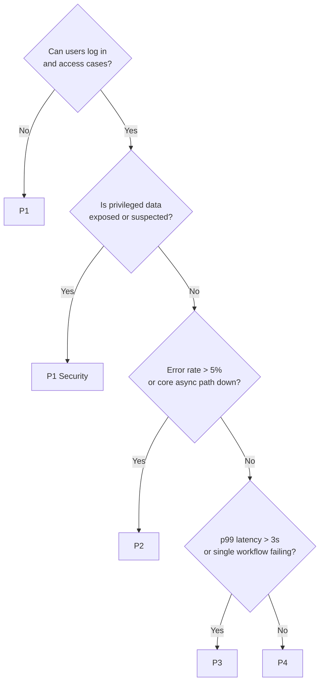
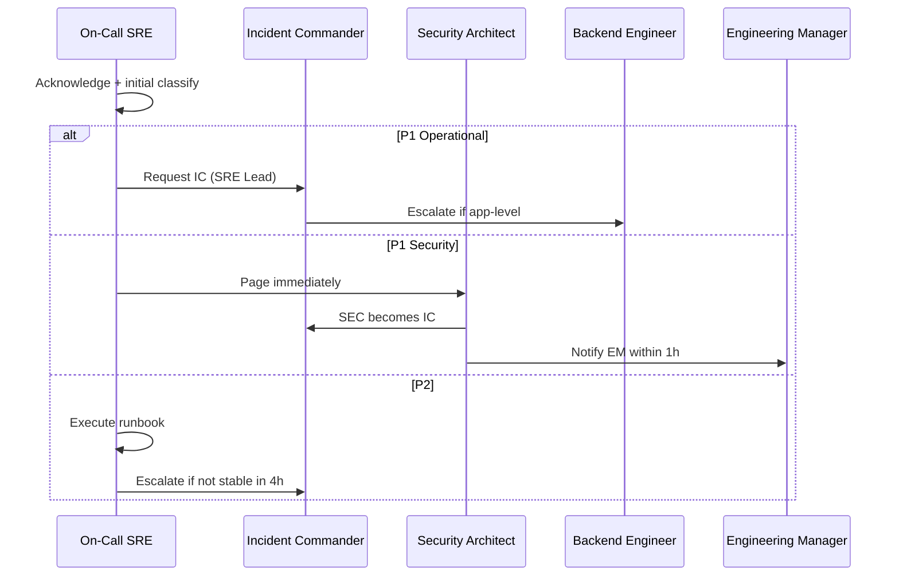
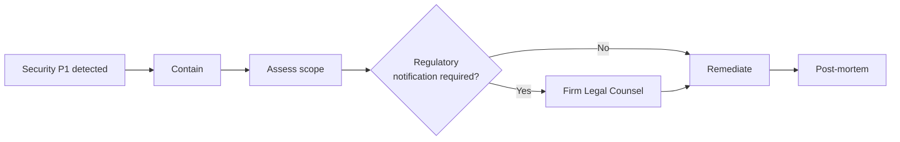

# Incident Triage

**LexFlow AI** — P1–P4 Classification, Response & Escalation  
**Version:** 1.0  
**Status:** Draft — Pre-Implementation  
**Last Updated:** 2026-07-06

---

## Purpose

This playbook defines **how to triage incidents** at LexFlow AI — severity classification (P1–P4), first-response steps, escalation paths, communication templates, and handoff to alert-specific runbooks. Use this document when you receive a PagerDuty page, security alert, or `#lexflow-incidents` report.

**Operational alert procedures** (API down, DLQ messages, etc.) continue in [../11-observability/runbooks.md](../11-observability/runbooks.md). **Security breach lifecycle** continues in [../08-security/incident-response.md](../08-security/incident-response.md).

---

## Scope

| In Scope | Out of Scope |
|----------|--------------|
| Severity classification P1–P4 | Writing application hotfixes |
| Triage decision trees and escalation | Legal/regulatory notification drafting |
| Communication templates | Full region DR failover (see disaster recovery) |
| Incident commander assignment | Penetration test execution |

---

## Responsibilities

| Role | Triage Responsibility |
|------|----------------------|
| **On-Call SRE** | First responder; classify severity; stabilize |
| **Incident Commander** | P1/P2 coordination; war room; timeline |
| **Security Architect** | Security incidents; data exposure assessment |
| **Compliance Officer** | Regulatory notification decisions |
| **Engineering Manager** | Resource allocation; client communication approval |
| **Backend Engineer** | Application diagnosis when escalated |

---

## Severity Definitions

| Severity | Definition | Examples | User Impact |
|----------|------------|----------|-------------|
| **P1 — Critical** | Complete outage or active data breach | API down; DB unreachable; confirmed privileged data exposure | All or most users blocked |
| **P2 — High** | Major degradation or high breach risk | 5xx spike; DLQ growing; auth failures; workflow failure > 10% | Significant feature impact |
| **P3 — Medium** | Partial degradation; no data risk | High latency; single workflow failing; Redis evictions | Minor feature impact |
| **P4 — Low** | Cosmetic; capacity planning | Certificate expiry 30d; storage trend alert | No immediate user impact |

### Response SLAs

| Severity | Acknowledge | Stabilize | Resolve Target | Post-Mortem |
|----------|-------------|-----------|----------------|-------------|
| **P1** | 15 min | 30 min | 2 hours | Required |
| **P2** | 1 hour | 2 hours | 8 hours | Required |
| **P3** | 4 hours | Next business day | 3 business days | Optional |
| **P4** | Next business day | — | 1 week | No |

---

## Triage Flow



---

## First 15 Minutes (All Severities)

| Step | Action | Checklist |
|------|--------|-----------|
| 1 | **Acknowledge** PagerDuty alert | [ ] |
| 2 | Open [Operational Dashboard](../11-observability/dashboards.md) | [ ] |
| 3 | Check recent deploys — [deploy-production.md](./deploy-production.md) / `#lexflow-releases` | [ ] |
| 4 | Post in `#lexflow-incidents`: severity (initial), responder, investigating | [ ] |
| 5 | Identify affected service(s) — API, worker, n8n, RDS, Redis, RabbitMQ | [ ] |
| 6 | Capture first `correlationId` / `traceId` from error logs | [ ] |
| 7 | Reclassify severity if initial alert was wrong | [ ] |

### Initial Slack Template

```
🚨 INCIDENT — Initial triage
Severity: P{1-4} (initial)
Responder: @{name}
Symptoms: {one line}
Investigating: {service/alert name}
Deploy correlation: {yes/no — link if yes}
Thread for updates ↓
```

---

## Classification Decision Tree



---

## Escalation Matrix

| Condition | Escalate To | Method | When |
|-----------|-------------|--------|------|
| Data exposure suspected or confirmed | Security Architect + Compliance Officer | PagerDuty `lexflow-security` | Immediately |
| Privileged data in logs | Security Architect | PagerDuty + direct call | Immediately |
| Cannot stabilize P1 in 30 min | SRE Lead → Engineering Manager | PagerDuty escalation policy | At 30 min |
| Cannot stabilize P2 in 4 hours | Reclassify to P1; SRE Lead | War room | At 4 hours |
| Database corruption suspected | SRE Lead + Backend Engineer | Teams call | Immediately — do not restart RDS |
| Multi-service outage | SRE Lead as Incident Commander | `#lexflow-incidents` war room | Immediately |
| External vendor outage (LLM, M365) | Integration Engineer | Teams | Within 1 hour |
| Deploy-caused regression | Release Manager + deploy rollback | `#lexflow-releases` | After confirm correlation |
| Region-level failure | SRE Lead + DR playbook | PagerDuty + exec notify | Immediately |



---

## P1 — Critical Response

### Operational P1

1. Assign **Incident Commander** (default: SRE Lead on-call).
2. Open war room thread in `#lexflow-incidents`.
3. Execute matching section in [runbooks.md](../11-observability/runbooks.md):
   - API Down
   - Database Unreachable
   - Error Rate Spike
   - Queue Consumer Failure
   - Service Task Failure
   - Auth System Failure
4. If deploy-correlated within 2 hours → initiate rollback per [deploy-production.md](./deploy-production.md#rollback-procedures).
5. Post status updates every **30 minutes** until stable.

### Security P1

Follow [../08-security/incident-response.md](../08-security/incident-response.md) containment steps:

| Priority | Action |
|----------|--------|
| 1 | Security Architect becomes Incident Commander |
| 2 | Contain — revoke tokens, isolate affected resources |
| 3 | Preserve evidence — do not delete logs |
| 4 | Assess scope — which firms, matters, documents affected |
| 5 | Compliance Officer engaged within 1 hour |
| 6 | **Do not** communicate externally without Legal approval |



---

## P2 — High Response

1. Acknowledge within 1 hour.
2. Execute relevant [runbooks.md](../11-observability/runbooks.md) section.
3. If workflow-related → check n8n health + [06-workflows/retry-dlq.md](../06-workflows/retry-dlq.md).
4. If AI-related → check provider status + [07-ai/llm-providers.md](../07-ai/llm-providers.md).
5. Create incident ticket with timeline.
6. Post-mortem required if user-visible impact > 30 minutes.

---

## P3 / P4 — Medium / Low Response

| Severity | Action |
|----------|--------|
| **P3** | Execute runbook during business hours; ticket with owner; no war room |
| **P4** | Backlog ticket; address in next sprint or ops review |

---

## Deploy Correlation Check

```bash
# Recent ECS deployments (production)
aws ecs describe-services \
  --cluster lexflow-production \
  --services lexflow-api lexflow-worker lexflow-web lexflow-n8n \
  --query 'services[*].{name:serviceName,deployments:deployments[0].updatedAt}' \
  --output table

# GitHub Actions — last production deploy
gh run list --workflow=deploy-production.yml --limit 5
```

| Finding | Action |
|---------|--------|
| Deploy < 2h before alert | Strong correlation — consider rollback first |
| Migration ran same window | Check migration task logs before app rollback |
| n8n workflow deploy same window | Re-import previous workflow JSON |
| No recent deploy | Infrastructure or external dependency — dig deeper |

---

## Communication Guidelines

| Audience | P1 Update Frequency | Channel |
|----------|---------------------|---------|
| Engineering | Every 30 min | `#lexflow-incidents` |
| Leadership | Every 1 hour | DM + email summary |
| Firm clients | Only with Legal + EM approval | Status page / firm IT contact |
| Regulatory | Compliance Officer only | Per [incident-response.md](../08-security/incident-response.md) |

### All-Clear Template

```
✅ INCIDENT RESOLVED
Severity: P{n}
Duration: {start} – {end} UTC
Impact: {one line}
Root cause: {brief or "under investigation"}
Follow-up ticket: {JIRA-123}
Post-mortem: {scheduled date if P1/P2}
```

---

## Handoff to Alert Runbooks

After triage, use this routing table:

| Symptom | Runbook Section |
|---------|-----------------|
| `/health` failing | [API Down](../11-observability/runbooks.md#api-down) |
| RDS connection errors | [Database Unreachable](../11-observability/runbooks.md#database-unreachable) |
| 5xx rate spike | [Error Rate Spike](../11-observability/runbooks.md#error-rate-spike) |
| Zero queue consumers | [Queue Consumer Failure](../11-observability/runbooks.md#queue-consumer-failure) |
| ECS tasks = 0 | [Service Task Failure](../11-observability/runbooks.md#service-task-failure) |
| JWT / login failures | [Auth System Failure](../11-observability/runbooks.md#auth-system-failure) |
| DLQ messages | [DLQ Messages](../11-observability/runbooks.md#dlq-messages) |
| Workflow failures | [Workflow Failure Rate](../11-observability/runbooks.md#workflow-failure-rate) |
| Failed ECS deploy | [Deployment Failure](../11-observability/runbooks.md#deployment-failure) |
| Suspected secret leak | [rotate-secrets.md](./rotate-secrets.md) emergency section |

---

## Post-Incident Requirements

| Severity | Requirement | Deadline |
|----------|-------------|----------|
| P1 / P2 | Incident ticket with full timeline | 24 hours |
| P1 / P2 | Post-mortem document | 5 business days |
| P1 / P2 | Post-mortem review meeting | 10 business days |
| P1 security | Compliance assessment | 72 hours (GDPR clock) |
| All | Update runbook/playbook if gap found | Next sprint |

Post-mortem template: [runbooks.md — Post-Mortem Template](../11-observability/runbooks.md#post-mortem-template).

---

## Triage Checklist Summary

- [ ] Alert acknowledged within SLA
- [ ] Severity classified (and reclassified if needed)
- [ ] `#lexflow-incidents` thread opened
- [ ] Deploy correlation checked
- [ ] Security escalation evaluated
- [ ] Incident Commander assigned (P1/P2)
- [ ] Alert-specific runbook executed
- [ ] Stabilization verified via dashboards
- [ ] All-clear posted
- [ ] Ticket + post-mortem scheduled (P1/P2)

---

## References

| Document | Description |
|----------|-------------|
| [../11-observability/runbooks.md](../11-observability/runbooks.md) | Alert-specific procedures |
| [../11-observability/metrics-alerting.md](../11-observability/metrics-alerting.md) | Alert definitions |
| [../08-security/incident-response.md](../08-security/incident-response.md) | Security incident lifecycle |
| [deploy-production.md](./deploy-production.md) | Rollback procedures |
| [rotate-secrets.md](./rotate-secrets.md) | Emergency secret rotation |
| [../09-deployment/disaster-recovery.md](../09-deployment/disaster-recovery.md) | Region failover |
