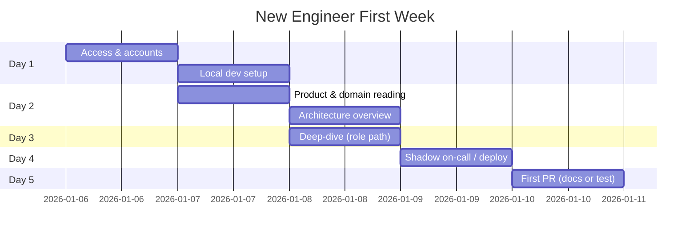
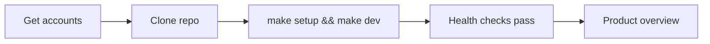
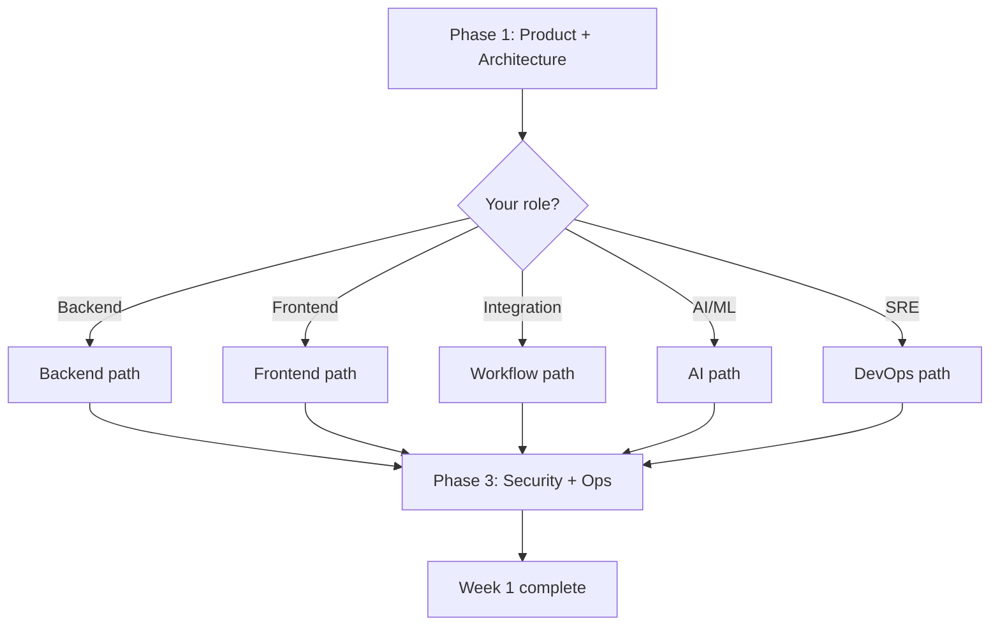

# Engineer Onboarding

**LexFlow AI** — New Engineer First-Week Guide  
**Version:** 1.0  
**Status:** Draft — Pre-Implementation  
**Last Updated:** 2026-07-06

---

## Purpose

This playbook onboards a new LexFlow AI engineer through **Day 1 access**, **local environment setup**, **mandatory reading order**, **first contribution**, and **week-one checkpoints**. Goal: productive, security-aware contributor within five business days.

Pair this playbook with [local-dev-setup.md](./local-dev-setup.md) for machine setup.

---

## Scope

| In Scope | Out of Scope |
|----------|--------------|
| First-week tasks and doc reading order | HR onboarding (payroll, benefits) |
| Access provisioning checklist | Firm-specific legal training |
| Shadowing and first PR guidance | Performance review process |
| Role-specific reading paths | Sales or client-facing training |

---

## Responsibilities

| Role | Responsibility |
|------|----------------|
| **Engineering Manager** | Assign onboarding buddy; track checklist completion |
| **Onboarding Buddy** | Pair on local setup; review first PR |
| **New Engineer** | Complete reading and setup within week one |
| **IT / SRE** | Provision AWS, GitHub, PagerDuty (on-call roles only) |

---

## Week-One Overview

---

## Day 1 — Access & Environment

### Access Checklist

- [ ] GitHub access to [`abhishekthatguy/luxflow-ai`](https://github.com/abhishekthatguy/luxflow-ai) (write)
- [ ] Slack workspace — channels: `#lexflow-dev`, `#lexflow-releases`, `#lexflow-incidents` (observe only)
- [ ] Google Drive / Notion — engineering wiki (if applicable)
- [ ] AWS SSO — **dev** and **staging** read-only (no production until week 4+ and approval)
- [ ] PagerDuty — **not** required week one unless joining on-call rotation
- [ ] VPN credentials — required for staging n8n admin UI access (week 2+)
- [ ] 1Password / secrets vault — team shared dev credentials only

### Day 1 Tasks

| # | Task | Owner | Done |
|---|------|-------|------|
| 1 | Meet engineering manager + onboarding buddy | EM | [ ] |
| 2 | Complete [local-dev-setup.md](./local-dev-setup.md) end-to-end | You | [ ] |
| 3 | Log in to local app with seed user | You | [ ] |
| 4 | Skim [product-overview.md](../product-overview.md) (30 min) | You | [ ] |
| 5 | Join standup; introduce yourself | You | [ ] |

---

## Documentation Reading Order

Read documents **in sequence** unless your role path says otherwise. Do not skip security and ADR sections.

### Phase 1 — Everyone (Days 1–2)

| Order | Document | Time | Why |
|-------|----------|------|-----|
| 1 | [product-overview.md](../product-overview.md) | 45 min | Vision, users, capabilities |
| 2 | [01-product/vision.md](../01-product/vision.md) | 15 min | Strategic north star |
| 3 | [02-domain/ubiquitous-language.md](../02-domain/ubiquitous-language.md) | 30 min | Shared vocabulary (Case, Matter Wall, etc.) |
| 4 | [03-architecture/system-context.md](../03-architecture/system-context.md) | 30 min | C4 Level 1 — external systems |
| 5 | [03-architecture/container-architecture.md](../03-architecture/container-architecture.md) | 45 min | C4 Level 2 — services and data stores |
| 6 | [adr/README.md](../13-decisions/README.md) + ADRs 001–006 | 60 min | Non-negotiable architectural decisions |
| 7 | [development-standards.md](../development-standards.md) | 30 min | Branching, PR process, code style |
| 8 | [folder-structure.md](../folder-structure.md) | 20 min | Where code lives |

### Phase 2 — Role-Specific (Days 2–3)

Pick **one path** based on your team assignment.

#### Backend Engineer Path

| Order | Document |
|-------|----------|
| 9 | [03-architecture/component-architecture.md](../03-architecture/component-architecture.md) |
| 10 | [03-architecture/event-driven-design.md](../03-architecture/event-driven-design.md) |
| 11 | [domain-model.md](../domain-model.md) |
| 12 | [05-database/schema-overview.md](../05-database/schema-overview.md) |
| 13 | [04-api/README.md](../04-api/README.md) |
| 14 | [authentication-authorization.md](../authentication-authorization.md) |
| 15 | [08-security/matter-walls.md](../08-security/matter-walls.md) |

#### Frontend Engineer Path

| Order | Document |
|-------|----------|
| 9 | [api-architecture.md](../api-architecture.md) |
| 10 | [04-api/authentication.md](../04-api/authentication.md) |
| 11 | [04-api/authorization-rbac.md](../04-api/authorization-rbac.md) |
| 12 | [12-ui/README.md](../12-ui/README.md) |
| 13 | [12-ui/design-system.md](../12-ui/design-system.md) |
| 14 | [12-ui/state-management.md](../12-ui/state-management.md) |

#### Integration / Workflow Engineer Path

| Order | Document |
|-------|----------|
| 9 | [06-workflows/README.md](../06-workflows/README.md) |
| 10 | [06-workflows/orchestration-model.md](../06-workflows/orchestration-model.md) |
| 11 | [06-workflows/n8n-integration.md](../06-workflows/n8n-integration.md) |
| 12 | [06-workflows/webhook-contracts.md](../06-workflows/webhook-contracts.md) |
| 13 | [06-workflows/promotion-pipeline.md](../06-workflows/promotion-pipeline.md) |
| 14 | [add-workflow.md](./add-workflow.md) |

#### AI / ML Engineer Path

| Order | Document |
|-------|----------|
| 9 | [ai-architecture.md](../ai-architecture.md) |
| 10 | [07-ai/README.md](../07-ai/README.md) |
| 11 | [07-ai/llm-providers.md](../07-ai/llm-providers.md) |
| 12 | [07-ai/prompt-management.md](../07-ai/prompt-management.md) |
| 13 | [07-ai/safety-guardrails.md](../07-ai/safety-guardrails.md) |
| 14 | [07-ai/rag-architecture.md](../07-ai/rag-architecture.md) |
| 15 | [add-llm-provider.md](./add-llm-provider.md) |

#### DevOps / SRE Path

| Order | Document |
|-------|----------|
| 9 | [deployment-architecture.md](../deployment-architecture.md) |
| 10 | [09-deployment/README.md](../09-deployment/README.md) |
| 11 | [09-deployment/aws-topology.md](../09-deployment/aws-topology.md) |
| 12 | [09-deployment/cicd-pipeline.md](../09-deployment/cicd-pipeline.md) |
| 13 | [11-observability/README.md](../11-observability/README.md) |
| 14 | [11-observability/runbooks.md](../11-observability/runbooks.md) |
| 15 | [deploy-production.md](./deploy-production.md) |

### Phase 3 — Security & Operations (Days 3–4, All Roles)

| Order | Document | Time |
|-------|----------|------|
| 16 | [security-architecture.md](../security-architecture.md) | 45 min |
| 17 | [08-security/secrets-management.md](../08-security/secrets-management.md) | 30 min |
| 18 | [08-security/incident-response.md](../08-security/incident-response.md) | 30 min |
| 19 | [compliance-data-governance.md](../compliance-data-governance.md) | 30 min |
| 20 | [testing-strategy.md](../testing-strategy.md) | 20 min |
| 21 | [incident-triage.md](./incident-triage.md) | 30 min |
| 22 | [14-playbooks/README.md](./README.md) | 10 min |

---

## Day 4 — Shadow & Observe

| Activity | Duration | Goal |
|----------|----------|------|
| Attend standup + planning | 1 hr | Team rhythm |
| Shadow buddy's PR review | 30 min | Review standards |
| Read recent `#lexflow-incidents` threads (if any) | 30 min | Incident culture |
| Walk through [11-observability/dashboards.md](../11-observability/dashboards.md) in staging | 45 min | Operational visibility |
| Optional: observe staging deploy in `#lexflow-releases` | 30 min | Release process |

**SRE track addition:** Pair on a non-prod deploy using [deploy-production.md](./deploy-production.md) sections for staging only.

---

## Day 5 — First Contribution

First PR should be **low risk** — documentation fix, test improvement, or small bug in dev tooling.

### First PR Checklist

- [ ] Branch from `main`: `docs/onboarding-clarity` or `test/add-{module}-unit-test`
- [ ] Follow [development-standards.md](../development-standards.md) PR template
- [ ] `make test && make lint` pass locally
- [ ] Buddy reviews within 24 hours
- [ ] Squash merge to `main`

### Suggested First PR Ideas

| Role | Example PR |
|------|------------|
| Any | Fix typo in docs you read during onboarding |
| Backend | Add unit test for existing utility |
| Frontend | Storybook story for shared component |
| Integration | Validate existing workflow JSON in CI |
| AI | Add provider adapter mock for tests |
| SRE | Improve Makefile target documentation |

---

## Core Principles (Memorize Week One)

These are enforced in code review — not suggestions.

| # | Principle | Source |
|---|-----------|--------|
| 1 | **Business logic lives in FastAPI** — never in n8n or frontend | ADR-002 |
| 2 | **n8n is private orchestration only** — no public access, no DB nodes | [n8n-integration.md](../06-workflows/n8n-integration.md) |
| 3 | **All AI is async** — never in HTTP request path | ADR-004 |
| 4 | **Matter walls on every case query** — no exceptions | [matter-walls.md](../08-security/matter-walls.md) |
| 5 | **No secrets in git** — ever | [secrets-management.md](../08-security/secrets-management.md) |
| 6 | **Immutable audit log** — significant actions are recorded | [audit-schema.md](../05-database/audit-schema.md) |

---

## Week-One Completion Checklist

| Checkpoint | Owner | Done |
|------------|-------|------|
| Local stack running; tests pass | New engineer | [ ] |
| Phase 1 + role path docs read | New engineer | [ ] |
| Phase 3 security docs read | New engineer | [ ] |
| First PR merged | New engineer | [ ] |
| Buddy sign-off | Buddy | [ ] |
| EM 1:1 — week-one feedback | EM | [ ] |

---

## Weeks 2–4 Preview

| Week | Focus |
|------|-------|
| **2** | First feature ticket; staging environment access; n8n VPN if integration role |
| **3** | On-call shadow (SRE); participate in PR reviews |
| **4** | Production read-only AWS; optional on-call rotation enrollment |

---

## References

| Document | Description |
|----------|-------------|
| [local-dev-setup.md](./local-dev-setup.md) | Machine setup procedure |
| [../README.md](../README.md) | Full documentation index |
| [../01-product/user-personas.md](../01-product/user-personas.md) | Who we build for |
| [../03-architecture/nfr-requirements.md](../03-architecture/nfr-requirements.md) | Availability and performance targets |
| [../08-security/threat-model.md](../08-security/threat-model.md) | Security threats to understand early |
