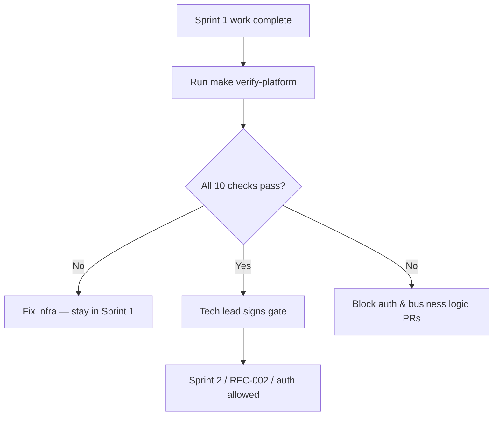

# Platform Readiness Gate

**LexFlow AI** — Cross-Cutting Verification Before Auth & Business Logic  
**Version:** 1.0  
**Status:** Accepted  
**Last Updated:** 2026-07-06

---

## Purpose

**No authentication, domain logic, or feature RFC implementation may begin until every row in the Platform Readiness Checklist passes.**

Sprint 0 delivers **clone → dev in < 10 min** (api, web, postgres, redis — no business code).  
Sprint 1 extends to the **full platform stack** and this gate. Sprint 2 (auth, RBAC, domain models) depends on a **proven foundation** — not assumed Compose configuration.

This gate is the **hard prerequisite** for:
- [RFC-002: Authentication & RBAC](../18-rfc/RFC-002-authentication-rbac.md)
- Any `services/*/domain/` or `services/*/application/` code
- JWT, matter walls, case aggregates, or business rules

---

## Scope

| In Scope | Out of Scope |
|----------|--------------|
| Local Docker Compose verification (Sprint 1 full stack) | Sprint 0 core-four quickstart ([10-minute-quickstart.md](./10-minute-quickstart.md)) |
| Smoke tests for infra integrations | Feature-level integration tests |
| Health, logging, tracing, messaging, storage | Auth endpoints or identity schema |
| CI pipeline green on `main` | Staging ECS deploy (parallel track) |

---

## Platform Readiness Checklist

Every item must be **✅ verified** before Sprint 2 kickoff or any auth/business logic PR merges.

| # | Check | Target | Verify With |
|---|-------|--------|-------------|
| 1 | Docker Compose boots all services | All containers `healthy` or `running` | `make dev` + `make ps` |
| 2 | Health endpoints for every service | Each service responds 200 (or equivalent) | `make verify-health` |
| 3 | Structured logging with request/correlation IDs | JSON logs; same `correlationId` across api → worker | `make verify-logging` |
| 4 | OpenTelemetry traces visible in Grafana | Trace spans for sample HTTP + worker path | `make verify-traces` |
| 5 | Redis cache abstraction tested | Get/set/delete via shared cache interface | `make verify-redis` |
| 6 | RabbitMQ publish/consume sample works | Message published and consumed end-to-end | `make verify-rabbitmq` |
| 7 | Celery worker processes a sample job | `ping` task returns `pong` asynchronously | `make verify-celery` |
| 8 | n8n can call FastAPI through internal network | n8n HTTP node → api internal URL → 200 | `make verify-n8n-callback` |
| 9 | MinIO upload/download works | Put object + get object via S3 adapter | `make verify-minio` |
| 10 | GitHub Actions pass lint, type checks, and tests | CI green on `main` and sample PR | GitHub Actions UI |

**Single command (when implemented):** `make verify-platform` runs checks 2–9 locally.

---

## Service Health Matrix

| Service | Container | Health Check | Expected |
|---------|-----------|--------------|----------|
| **FastAPI** | `api` | `GET http://localhost:8000/health` | `200` `{ "status": "ok" }` |
| **Next.js** | `web` | `GET http://localhost:3000/` | `200` |
| **PostgreSQL** | `postgres` | `pg_isready -U lexflow` | exit 0 |
| **Redis** | `redis` | `redis-cli PING` | `PONG` |
| **RabbitMQ** | `rabbitmq` | `rabbitmq-diagnostics ping` | `Ping succeeded` |
| **Celery worker** | `worker` | Celery `inspect ping` | worker responds |
| **n8n** | `n8n` | `GET http://n8n:5678/healthz` (internal) | `200` |
| **MinIO** | `minio` | `GET http://minio:9000/minio/health/live` | `200` |
| **OTel Collector** | `otel-collector` | `GET http://localhost:13133/` | `200` |
| **Grafana** | `grafana` | `GET http://localhost:3001/api/health` | `200` |

n8n is **not** exposed on a public host port — health checks run from inside the Compose network (`docker compose exec api curl ...`).

---

## Verification Details

### 1. Docker Compose — All Services Boot

```bash
make dev          # or: docker compose up -d
make ps           # all services running/healthy
docker compose ps --format "table {{.Name}}\t{{.Status}}"
```

**Required services:** `web`, `api`, `postgres`, `redis`, `rabbitmq`, `worker`, `n8n`, `minio`, `otel-collector`, `grafana`

---

### 2. Health Endpoints

```bash
make verify-health
# Expected: all checks PASS (script exits 0)
```

Implementation: `scripts/verify/health.sh` — curls each endpoint; fails fast on first failure.

---

### 3. Structured Logging & Correlation IDs

**Requirement:** API generates or accepts `X-Correlation-ID`; logs emit JSON with `correlationId` field; worker logs include the same ID when processing a job triggered by that request.

```bash
CORRELATION_ID=$(uuidgen)
curl -s -H "X-Correlation-ID: $CORRELATION_ID" http://localhost:8000/health
docker compose logs api --since 1m | grep "$CORRELATION_ID"
make verify-logging
```

**Log shape** (minimum):

```json
{
  "timestamp": "2026-07-06T10:00:00.000Z",
  "level": "INFO",
  "message": "request_completed",
  "correlationId": "550e8400-e29b-41d4-a716-446655440000",
  "service": "api",
  "method": "GET",
  "path": "/health",
  "statusCode": 200,
  "durationMs": 3
}
```

Reference: [`docs/11-observability/structured-logging.md`](../11-observability/structured-logging.md)

---

### 4. OpenTelemetry Traces in Grafana

**Local stack:** OTel Collector receives OTLP from `api` and `worker`; exports to **Grafana Tempo** (or Jaeger); Grafana datasource pre-provisioned.

```bash
make verify-traces
# Triggers sample request + worker job; queries Grafana Tempo API for trace ID
open http://localhost:3001   # Grafana UI — Explore → Tempo
```

**Minimum spans in sample trace:**
- `HTTP GET /health` (api)
- `celery.ping` or equivalent worker task span

Production uses ADOT → X-Ray ([`distributed-tracing.md`](../11-observability/distributed-tracing.md)); local uses Grafana for developer visibility.

---

### 5. Redis Cache Abstraction

**Requirement:** Shared interface in `packages/shared` or `apps/api` infrastructure — not raw `redis-py` calls scattered in domain code.

```bash
make verify-redis
# Runs: pytest tests/integration/test_redis_cache.py
```

Sample test flow:
1. `cache.set("platform:smoke", "ok", ttl=60)`
2. `cache.get("platform:smoke")` → `"ok"`
3. `cache.delete("platform:smoke")`

---

### 6. RabbitMQ Publish / Consume

```bash
make verify-rabbitmq
# Publishes to platform.smoke queue; consumer acks; exits 0
```

Sample exchange/queue: `platform.smoke` (direct, dev-only). Proves broker connectivity before outbox/Celery feature work.

---

### 7. Celery Sample Job

```bash
make verify-celery
# Dispatches workers.tasks.ping; polls result; prints pong
```

Acceptance: task completes within 30s; result backend (Redis) stores task ID; worker logs include `correlationId` if passed.

---

### 8. n8n → FastAPI Internal Network

**Requirement:** n8n workflow (committed as `n8n/workflows/platform/smoke-callback-v1.json`) calls `http://api:8000/internal/platform/smoke` with HMAC stub; FastAPI returns 200.

```bash
make verify-n8n-callback
# Triggers workflow via internal webhook; asserts api received callback
```

Proves:
- n8n reachable only on internal Docker network
- FastAPI internal route pattern works before real workflow RFCs
- `correlationId` passed in webhook payload

Reference: ADR-002 (n8n orchestration only), [`webhook-contracts.md`](../06-workflows/webhook-contracts.md)

---

### 9. MinIO Upload / Download

```bash
make verify-minio
# Uses S3 adapter: put_object → get_object → assert bytes match
```

Uses `S3_ENDPOINT=http://minio:9000` from `.env`. Proves document pipeline prerequisites without AWS credentials.

---

### 10. GitHub Actions CI

| Job | Tools | Must Pass |
|-----|-------|-----------|
| `lint-python` | ruff, mypy | ✅ |
| `lint-typescript` | eslint, tsc | ✅ |
| `test-python` | pytest (unit + integration smoke) | ✅ |
| `test-typescript` | vitest | ✅ |
| `build-images` | Docker build api + web | ✅ |
| `trivy-scan` | No CRITICAL vulnerabilities | ✅ |

Branch protection on `main`: require all checks + 1 approval.

---

## Gate Decision



| Outcome | Label | Action |
|---------|-------|--------|
| Not ready | `platform-not-ready` | Continue Sprint 1; no auth/domain PRs |
| Ready | `platform-ready` | Sprint 2 kickoff; RFC-002 implementation allowed |
| Regression | `platform-regression` | Halt feature work; restore failing check |

**Sign-off template** (PR or sprint doc comment):

```markdown
## Platform Readiness Sign-Off

- [ ] All 10 checklist items verified locally
- [ ] `make verify-platform` exits 0 on clean clone
- [ ] CI green on `main`

**Signed:** {tech lead} · **Date:** {YYYY-MM-DD}
```

---

## Makefile Targets (Specification)

Add to root `Makefile` when Sprint 1 is implemented:

```makefile
.PHONY: verify-platform verify-health verify-logging verify-traces \
        verify-redis verify-rabbitmq verify-celery verify-n8n-callback verify-minio

verify-platform: verify-health verify-logging verify-traces verify-redis \
                 verify-rabbitmq verify-celery verify-n8n-callback verify-minio
	@echo "✅ Platform readiness gate passed"

verify-health:
	@./scripts/verify/health.sh

verify-logging:
	@pytest tests/integration/test_correlation_logging.py -q

verify-traces:
	@./scripts/verify/traces.sh

verify-redis:
	@pytest tests/integration/test_redis_cache.py -q

verify-rabbitmq:
	@pytest tests/integration/test_rabbitmq_smoke.py -q

verify-celery:
	@./scripts/verify/celery_ping.sh

verify-n8n-callback:
	@pytest tests/integration/test_n8n_smoke_callback.py -q

verify-minio:
	@pytest tests/integration/test_minio_storage.py -q
```

---

## Relationship to RFC & Sprint Gates

| Gate | When | Blocks |
|------|------|--------|
| **Platform Readiness** (this doc) | End of Sprint 1 | Auth, RBAC, domain logic, RFC-002+ implementation |
| **RFC Accepted** | Before each major feature | Feature-specific implementation |
| **Definition of Ready** | Before picking up any ticket | Individual story start |

Both gates apply for Sprint 2: **Platform Ready** AND **RFC-002 Accepted**.

---

## Best Practices

1. **Run `make verify-platform` before every Sprint 2 PR** — catch infra regressions early.
2. **Keep smoke tests fast** — total verify suite < 2 minutes locally.
3. **No business logic in smoke tests** — infrastructure proof only.
4. **Commit n8n smoke workflow JSON** — same promotion path as production workflows.
5. **Correlation ID in every new integration** — logging and tracing from day one.

---

## References

- [Sprint 0 — Engineering Setup](../17-sprint-planning/sprint-00-documentation.md)
- [10-Minute Quickstart](./10-minute-quickstart.md)
- [Sprint 2 — Auth & Domain](../17-sprint-planning/sprint-02-auth-domain.md)
- [Local Dev Setup](./local-dev-setup.md)
- [Structured Logging](../11-observability/structured-logging.md)
- [Distributed Tracing](../11-observability/distributed-tracing.md)
- [RFC-002: Authentication & RBAC](../18-rfc/RFC-002-authentication-rbac.md)
