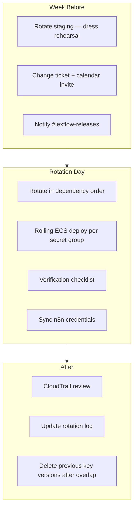
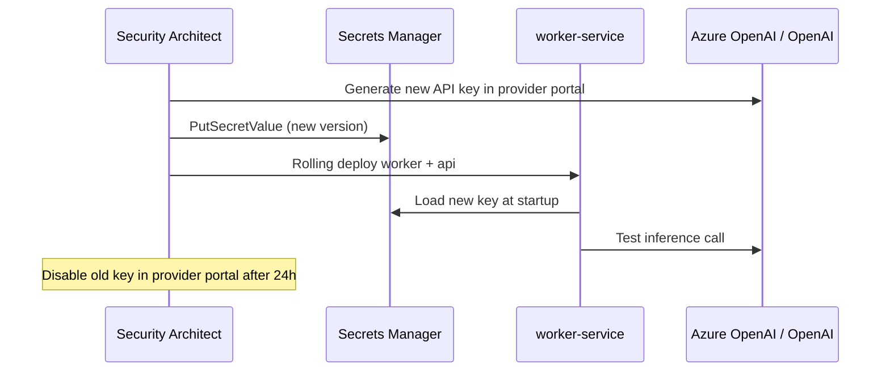
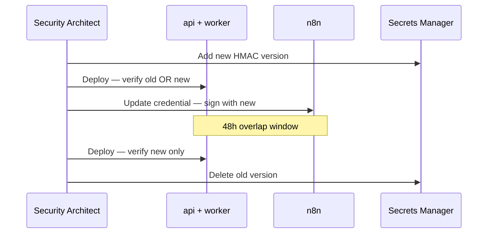
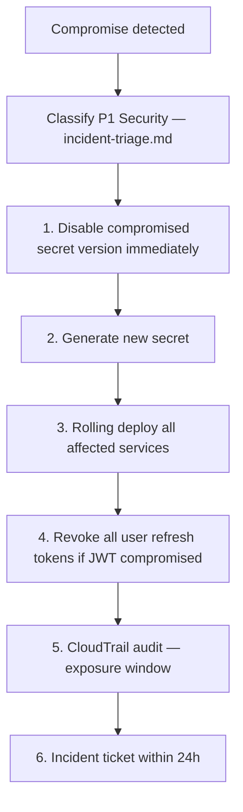

# Rotate Secrets

**LexFlow AI** — Quarterly Secret Rotation Ceremony  
**Version:** 1.0  
**Status:** Draft — Pre-Implementation  
**Last Updated:** 2026-07-06

---

## Purpose

This playbook defines the **quarterly secret rotation ceremony** for LexFlow AI — scheduled rotation of credentials in AWS Secrets Manager, coordinated ECS redeploys, n8n credential sync, and verification steps. Also covers **emergency rotation** when compromise is suspected.

Architecture: [../08-security/secrets-management.md](../08-security/secrets-management.md).

---

## Scope

| In Scope | Out of Scope |
|----------|--------------|
| Quarterly rotation schedule and ceremony | Firm employee password resets (Entra ID) |
| Step-by-step rotation per secret type | CloudHSM key migration |
| Emergency rotation on compromise | Microsoft Graph app registration creation |
| Verification and rollback | Penetration testing |

---

## Responsibilities

| Role | Responsibility |
|------|----------------|
| **Security Architect** | Schedule ceremony; lead JWT and HMAC rotation |
| **DevOps / SRE** | Execute ECS rolling deploys; verify service health |
| **IT Administrator** | Update n8n credentials; verify external API keys |
| **Backend Engineer** | Standby for auth issues during JWT rotation |
| **Compliance Officer** | Audit trail review post-ceremony |

---

## Rotation Schedule

| Secret | Path Pattern | Frequency | Method | Downtime |
|--------|--------------|-----------|--------|----------|
| Database password | `{env}/database/credentials` | Quarterly | Secrets Manager Lambda | Zero |
| Redis AUTH token | `{env}/redis/auth-token` | Quarterly | Manual + rolling deploy | Zero |
| RabbitMQ credentials | `{env}/rabbitmq/credentials` | Quarterly | Manual + rolling deploy | Zero |
| JWT RS256 key pair | `{env}/jwt/signing-key` | Quarterly | Dual-key overlap (24h) | Zero |
| LLM API keys | `{env}/openai/api-key`, `{env}/azure-openai/api-key`, `{env}/anthropic/api-key` | Quarterly | Manual + redeploy | Zero |
| n8n encryption key | `{env}/n8n/encryption-key` | Quarterly | Manual; n8n restart | Brief n8n restart |
| HMAC webhook secret | `{env}/n8n/webhook-hmac-secret` | Quarterly | Dual-secret overlap (48h) | Zero |
| n8n admin password | `{env}/n8n/admin-credentials` | Quarterly | Manual | Admin re-login |
| Microsoft Graph client secret | `{env}/microsoft-graph/client-secret` | Per Azure policy (≤ 24 months) | Azure portal + SM | Zero |

**Ceremony window:** First Tuesday of each quarter, 10:00–14:00 US/Eastern. Staging rotated **one week prior** as dress rehearsal.

---

## Ceremony Overview



---

## Pre-Ceremony Checklist

- [ ] Staging rotation completed successfully (prior week)
- [ ] Change ticket approved by Security Architect
- [ ] No P1/P2 incidents open
- [ ] On-call SRE and Backend Engineer available
- [ ] Not a production deploy day
- [ ] Rollback plan documented (re-enable previous secret version)
- [ ] `#lexflow-releases` announcement scheduled

---

## Rotation Order

Rotate in this order to minimize dependency failures:

```mermaid
flowchart LR
    S1[1. LLM API keys] --> S2[2. HMAC webhook secret]
    S2 --> S3[3. JWT signing key]
    S3 --> S4[4. Database password]
    S4 --> S5[5. Redis AUTH]
    S5 --> S6[6. RabbitMQ credentials]
    S6 --> S7[7. n8n encryption key]
    S7 --> S8[8. n8n admin credentials]
    S8 --> S9[9. Microsoft Graph secret]
```



---

## Procedure by Secret Type

### 1 — LLM API Keys



| Step | Action | Check |
|------|--------|-------|
| 1 | Generate new key in provider admin portal | [ ] |
| 2 | `aws secretsmanager put-secret-value --secret-id prod/azure-openai/api-key` | [ ] |
| 3 | Rolling deploy `api-service` and `worker-service` | [ ] |
| 4 | Trigger test AI job in staging first, then production smoke | [ ] |
| 5 | Disable old key in provider portal after 24h overlap | [ ] |

Repeat for OpenAI and Anthropic keys if configured.

---

### 2 — HMAC Webhook Secret (Dual-Secret Overlap)

Shared between n8n callbacks and FastAPI verification. **48-hour overlap** required.

| Step | Action |
|------|--------|
| 1 | Generate new 256-bit secret: `openssl rand -hex 32` |
| 2 | Store as **new version** in `{env}/n8n/webhook-hmac-secret` |
| 3 | Update FastAPI config to accept **both** current and previous secret (verify with either) |
| 4 | Rolling deploy `api-service` and `worker-service` |
| 5 | Update n8n credential via deploy script or admin UI |
| 6 | Rolling deploy `n8n-service` |
| 7 | Run workflow smoke test: `python n8n/scripts/smoke-test.py --target production --slug {test-slug}` |
| 8 | After 48h: remove previous secret from verifier config; deploy again |
| 9 | Delete previous SM version |



---

### 3 — JWT RS256 Signing Key (Dual-Key Overlap)

| Step | Action |
|------|--------|
| 1 | Generate new key pair: `openssl genrsa -out jwt-private.pem 4096` |
| 2 | Move current private key → `{env}/jwt/signing-key-previous` |
| 3 | Store new private key → `{env}/jwt/signing-key` |
| 4 | Store new public key → `{env}/jwt/public-key` |
| 5 | Rolling deploy **all** `api-service` tasks |
| 6 | API signs with new key; verifies tokens with **either** key |
| 7 | Wait 24h (max access token TTL: 15 min; refresh tokens revoked if compromise) |
| 8 | Delete `signing-key-previous` |
| 9 | Verify login + refresh flow |

- [ ] Login succeeds
- [ ] Existing sessions valid until natural expiry
- [ ] No spike in `auth_failures_total`

---

### 4 — Database Password

| Step | Action |
|------|--------|
| 1 | Secrets Manager rotation Lambda triggers (or manual `rotate-secret`) |
| 2 | Lambda updates RDS master password + `{env}/database/credentials` |
| 3 | Rolling deploy `api-service`, `worker-service`, `outbox-publisher` |
| 4 | Verify `/health` → `database: ok` |
| 5 | Verify migration task can connect (dry-run `alembic current`) |

```bash
aws secretsmanager rotate-secret \
  --secret-id prod/database/credentials \
  --rotation-lambda-arn arn:aws:lambda:us-east-1:ACCOUNT:function:lexflow-rds-rotation
```

---

### 5 — Redis AUTH Token

| Step | Action |
|------|--------|
| 1 | Generate new token: `openssl rand -base64 32` |
| 2 | Update ElastiCache AUTH token (online rotation supported) |
| 3 | Update Secrets Manager `{env}/redis/auth-token` |
| 4 | Rolling deploy all services using Redis |
| 5 | Verify cache operations; session store functional |

---

### 6 — RabbitMQ Credentials

| Step | Action |
|------|--------|
| 1 | Create new broker user in Amazon MQ console |
| 2 | Update `{env}/rabbitmq/credentials` in Secrets Manager |
| 3 | Rolling deploy `api-service`, `worker-service`, `outbox-publisher` |
| 4 | Verify queue consumers connected |
| 5 | Delete old broker user |

---

### 7 — n8n Encryption Key

**Requires brief n8n restart.** Schedule during low-traffic window.

| Step | Action |
|------|--------|
| 1 | Export workflow list (backup) from n8n admin |
| 2 | Stop `n8n-service` (scale to 0) |
| 3 | Update `{env}/n8n/encryption-key` in Secrets Manager |
| 4 | Run n8n credential re-encryption script: `python n8n/scripts/reencrypt-credentials.py --env production` |
| 5 | Scale `n8n-service` back to desired count |
| 6 | Verify workflow execution smoke test |

---

### 8 — n8n Admin Credentials

| Step | Action |
|------|--------|
| 1 | Generate new password (password manager) |
| 2 | Update `{env}/n8n/admin-credentials` |
| 3 | Rolling restart `n8n-service` |
| 4 | Verify admin UI login via VPN |
| 5 | Notify integration engineers of new credentials (1Password vault) |

---

### 9 — Microsoft Graph Client Secret

| Step | Action |
|------|--------|
| 1 | Azure Portal → App Registration → New client secret |
| 2 | Update `{env}/microsoft-graph/client-secret` in Secrets Manager |
| 3 | Rolling deploy `n8n-service`, `worker-service` |
| 4 | Trigger workflow using Graph (e.g., email notification test) |
| 5 | Delete old secret in Azure Portal |

---

## Post-Rotation Verification

| Check | Command / Action | Expected |
|-------|------------------|----------|
| API health | `GET /health` | All checks `ok` |
| User login | Service account login | JWT returned |
| AI inference | Trigger test summary job | Job completes |
| Workflow callback | n8n smoke test | HMAC verified, 200 |
| Queue processing | Check consumer count | > 0 |
| No auth spike | CloudWatch `auth_failures_total` | Baseline |
| HMAC failures | CloudWatch n8n HMAC 401 count | 0 |

- [ ] All verification checks pass
- [ ] CloudTrail reviewed for unexpected `GetSecretValue` during window
- [ ] Rotation log updated in compliance tracker
- [ ] Previous secret versions scheduled for deletion per overlap policy

---

## Emergency Rotation (Compromise)

Trigger: suspected leak, GuardDuty finding, employee termination with secret access, git secret exposure.



| Step | Action | Timeline |
|------|--------|----------|
| 1 | Revoke/disable compromised secret version in Secrets Manager | Immediate |
| 2 | Generate and store new secret | < 15 min |
| 3 | Rolling deploy **all** affected ECS services | < 30 min |
| 4 | If JWT key: revoke all refresh tokens in Redis/DB | Immediate |
| 5 | If HMAC: follow dual-secret procedure under accelerated timeline | < 2 hours |
| 6 | Audit CloudTrail `GetSecretValue` for exposure window | < 4 hours |
| 7 | Document in incident response log | < 24 hours |

See [incident-triage.md](./incident-triage.md) and [../08-security/incident-response.md](../08-security/incident-response.md).

---

## Rollback

If rotation causes service failure:

| Step | Action |
|------|--------|
| 1 | Re-enable **previous** secret version in Secrets Manager (`AWSCURRENT` label) |
| 2 | Rolling deploy affected services |
| 3 | Verify health checks |
| 4 | Post-mortem before re-attempting rotation |

```bash
# Move previous version to AWSCURRENT
aws secretsmanager update-secret-version-stage \
  --secret-id prod/jwt/signing-key \
  --version-stage AWSCURRENT \
  --move-to-version-id {previous-version-id}
```

---

## Ceremony Completion Checklist

- [ ] All secrets in schedule rotated
- [ ] Staging dress rehearsal was successful
- [ ] Verification checklist all pass
- [ ] Old secret versions disabled/deleted per overlap policy
- [ ] CloudTrail audit complete
- [ ] Change ticket closed
- [ ] Compliance Officer sign-off (if required)
- [ ] Next quarter ceremony scheduled

---

## References

| Document | Description |
|----------|-------------|
| [../08-security/secrets-management.md](../08-security/secrets-management.md) | Secrets hierarchy and IAM |
| [../08-security/encryption.md](../08-security/encryption.md) | KMS CMK for Secrets Manager |
| [../06-workflows/n8n-integration.md](../06-workflows/n8n-integration.md) | n8n credential injection |
| [../07-ai/llm-providers.md](../07-ai/llm-providers.md) | LLM API key configuration |
| [incident-triage.md](./incident-triage.md) | Emergency escalation |
| [deploy-production.md](./deploy-production.md) | Rolling deploy procedure |
