# LexFlow AI — Interview Preparation

**LexFlow AI** — System Design & Architecture Discussion Guide  
**Version:** 1.0  
**Status:** Draft — Pre-Implementation  
**Last Updated:** 2026-07-06

---

## Purpose

This directory prepares **senior and staff engineers** to explain LexFlow AI architecture in technical interviews, architecture reviews, and client-facing design discussions. It synthesizes the full documentation corpus into interview-ready narratives — elevator pitches, deep dives, tradeoff debates, scaling scenarios, and security Q&A tailored to **legal technology**.

**Audience:** Engineers presenting LexFlow AI to hiring panels, firm IT leadership, or internal architecture boards. No application code lives here — only structured talking points grounded in canonical docs.

---

## How to Use This Section

### Before the Interview (30–60 minutes)

1. **Read** [system-design-overview.md](./system-design-overview.md) — memorize the 15-minute narrative and one-liner.
2. **Skim** [tradeoffs-discussion.md](./tradeoffs-discussion.md) — know which ADRs you would defend and which alternatives you considered.
3. **Pick your depth path** based on interviewer focus:
   - **Platform / backend** → [architecture-deep-dive.md](./architecture-deep-dive.md) sections 1–5, 8
   - **Infrastructure / SRE** → deep dive sections 6–7 + [scaling-questions.md](./scaling-questions.md)
   - **Security / compliance** → [security-questions.md](./security-questions.md) + [../08-security/](../08-security/README.md)
   - **AI / ML** → deep dive section 4 + [../07-ai/](../07-ai/README.md)

### During the Interview

| Time Box | Document | Goal |
|----------|----------|------|
| **0–5 min** | [system-design-overview.md](./system-design-overview.md) | Problem, users, constraints, one-sentence architecture |
| **5–15 min** | Same — C4 L1/L2 diagrams | Walk containers, data stores, trust boundaries |
| **15–45 min** | [architecture-deep-dive.md](./architecture-deep-dive.md) | Bounded contexts, events, n8n boundary, RAG, DR |
| **Anytime** | [tradeoffs-discussion.md](./tradeoffs-discussion.md) | "Why not microservices?" "Why n8n?" |
| **If asked "scale it"** | [scaling-questions.md](./scaling-questions.md) | 1K users, 50K workflows, millions of docs |
| **If asked "secure it"** | [security-questions.md](./security-questions.md) | Matter walls, AI exfiltration, audit |

### After the Interview

Note gaps where you stumbled. Cross-check against canonical docs and propose ADR updates if the design has evolved.

---

## Document Map

| File | Duration | Use When |
|------|----------|----------|
| [system-design-overview.md](./system-design-overview.md) | **15 min** | "Design a legal automation platform" — opening pitch |
| [architecture-deep-dive.md](./architecture-deep-dive.md) | **45 min** | Whiteboard session, staff-level depth |
| [tradeoffs-discussion.md](./tradeoffs-discussion.md) | **15–30 min** | "What would you do differently?" / ADR defense |
| [scaling-questions.md](./scaling-questions.md) | **20 min** | Capacity, NFRs, bottlenecks, evolution path |
| [security-questions.md](./security-questions.md) | **20 min** | Legal tech security, ethics walls, AI governance |

---

## Interview Narrative Arc

Use this arc for a coherent 45-minute system design session:

```mermaid
flowchart LR
    subgraph Act1["Act 1 — Context (5 min)"]
        PROB[Problem & users]
        CONST[Constraints: privilege, audit, ethics]
    end

    subgraph Act2["Act 2 — High Level (10 min)"]
        C4[C4 context + containers]
        PRIN[Five architectural principles]
    end

    subgraph Act3["Act 3 — Deep Dive (20 min)"]
        DOM[Domain & bounded contexts]
        ASYNC[Async + outbox + workers]
        N8N[n8n orchestration boundary]
        AI[Async AI + RAG + HITL]
    end

    subgraph Act4["Act 4 — Hardening (10 min)"]
        SCALE[Scale path to NFR targets]
        SEC[Security & matter walls]
        OPS[Observability & DR]
    end

    PROB --> CONST --> C4 --> PRIN --> DOM --> ASYNC --> N8N --> AI --> SCALE --> SEC --> OPS
```

---

## Five Principles to State Early

Interviewers remember candidates who anchor on **non-negotiables** before diving into boxes and arrows:

| # | Principle | One-Liner | Canonical Source |
|---|-----------|-----------|------------------|
| 1 | **Business logic in FastAPI** | n8n and frontend never own legal rules | [ADR-002](../13-decisions/002-n8n-orchestration-only.md) |
| 2 | **Async AI** | LLM calls never block HTTP request path | [ADR-004](../13-decisions/004-async-ai-processing.md) |
| 3 | **Case-centric + matter walls** | Every query scoped to authorized matters; 404 on deny | [08-security/matter-walls.md](../08-security/matter-walls.md) |
| 4 | **Transactional outbox** | Domain change and event publish are atomic | [ADR-006](../13-decisions/006-transactional-outbox.md) |
| 5 | **Human-in-the-loop** | AI drafts; attorneys approve before client delivery | [07-ai/human-in-the-loop.md](../07-ai/human-in-the-loop.md) |

---

## Cross-Reference Index

### By Interview Topic

| Topic | Start Here | Go Deeper |
|-------|------------|-----------|
| **Product & vision** | [01-product/vision.md](../01-product/vision.md) | [01-product/capabilities.md](../01-product/capabilities.md), [01-product/non-goals.md](../01-product/non-goals.md) |
| **Domain model** | [02-domain/bounded-contexts.md](../02-domain/bounded-contexts.md) | [02-domain/case-aggregate.md](../02-domain/case-aggregate.md), [domain-model.md](../domain-model.md) |
| **C4 architecture** | [03-architecture/system-context.md](../03-architecture/system-context.md) | [03-architecture/container-architecture.md](../03-architecture/container-architecture.md), [03-architecture/component-architecture.md](../03-architecture/component-architecture.md) |
| **Data flows & events** | [03-architecture/data-flow.md](../03-architecture/data-flow.md) | [03-architecture/event-driven-design.md](../03-architecture/event-driven-design.md), [event-driven-architecture.md](../event-driven-architecture.md) |
| **API & auth** | [04-api/authentication.md](../04-api/authentication.md) | [04-api/authorization-rbac.md](../04-api/authorization-rbac.md), [authentication-authorization.md](../authentication-authorization.md) |
| **Database** | [05-database/schema-overview.md](../05-database/schema-overview.md) | [05-database/indexing-strategy.md](../05-database/indexing-strategy.md), [database-architecture.md](../database-architecture.md) |
| **Workflows** | [06-workflows/orchestration-model.md](../06-workflows/orchestration-model.md) | [06-workflows/n8n-integration.md](../06-workflows/n8n-integration.md), [workflow-orchestration.md](../workflow-orchestration.md) |
| **AI / RAG** | [07-ai/rag-architecture.md](../07-ai/rag-architecture.md) | [07-ai/safety-guardrails.md](../07-ai/safety-guardrails.md), [ai-architecture.md](../ai-architecture.md) |
| **Security** | [08-security/threat-model.md](../08-security/threat-model.md) | [08-security/matter-walls.md](../08-security/matter-walls.md), [security-architecture.md](../security-architecture.md) |
| **Deployment & DR** | [09-deployment/aws-topology.md](../09-deployment/aws-topology.md) | [09-deployment/disaster-recovery.md](../09-deployment/disaster-recovery.md), [03-architecture/nfr-requirements.md](../03-architecture/nfr-requirements.md) |
| **Observability** | [11-observability/distributed-tracing.md](../11-observability/distributed-tracing.md) | [11-observability/metrics-alerting.md](../11-observability/metrics-alerting.md), [observability.md](../observability.md) |
| **ADRs** | [adr/README.md](../13-decisions/README.md) | All six accepted ADRs |

### By Role on the Panel

| Panel Focus | Primary Docs | Interview Supplement |
|-------------|--------------|---------------------|
| **Backend / platform** | [03-architecture/component-architecture.md](../03-architecture/component-architecture.md) | [architecture-deep-dive.md](./architecture-deep-dive.md) |
| **Frontend** | [12-ui/page-architecture.md](../12-ui/page-architecture.md) | Overview § Frontend boundary |
| **SRE / infra** | [09-deployment/README.md](../09-deployment/README.md) | [scaling-questions.md](./scaling-questions.md) |
| **Security** | [08-security/README.md](../08-security/README.md) | [security-questions.md](./security-questions.md) |
| **AI / ML** | [07-ai/README.md](../07-ai/README.md) | Deep dive § AI bounded context |
| **Product / EM** | [01-product/README.md](../01-product/README.md) | [system-design-overview.md](./system-design-overview.md) |

---

## Suggested Practice Exercises

| Exercise | Time | Success Criteria |
|----------|------|------------------|
| **Whiteboard C4 L1 + L2** from memory | 10 min | All actors, external systems, 8 containers, data stores |
| **Explain matter wall enforcement** without slides | 5 min | RBAC + ABAC, 404 pattern, test requirement |
| **Walk one user journey** (case intake → AI summary) | 10 min | Sync vs async paths, correlation IDs, approval gate |
| **Defend modular monolith** vs microservices | 10 min | Cite ADR-001, extraction triggers at Phase 4 |
| **Scale to 10× load** | 15 min | Workers, read replicas, partitioning, n8n HA |
| **STRIDE one threat** (AI exfiltration) | 10 min | Scoped RAG, PII redaction, prompt logging |

---

## Common Interview Prompts → Document Routing

| Prompt | Lead With | Then |
|--------|-----------|------|
| "Design an AI platform for law firms" | [system-design-overview.md](./system-design-overview.md) | [security-questions.md](./security-questions.md) |
| "How do you prevent AI hallucinations in legal?" | Human-in-the-loop + RAG | [07-ai/safety-guardrails.md](../07-ai/safety-guardrails.md) |
| "Why n8n instead of building workflows in code?" | ADR-002 tradeoff table | [tradeoffs-discussion.md](./tradeoffs-discussion.md) |
| "How do you handle workflow failures?" | Outbox + DLQ + idempotency | [06-workflows/retry-dlq.md](../06-workflows/retry-dlq.md) |
| "Multi-tenant vs single firm?" | Phase 1 single firm; Phase 4 tenancy | [01-product/roadmap.md](../01-product/roadmap.md) |
| "GDPR / right to erasure?" | Async erasure jobs, audit retention rules | [08-security/compliance-mapping.md](../08-security/compliance-mapping.md) |

---

## What Not to Say

Avoid these common misstatements — they contradict canonical architecture:

| Misstatement | Correct Position | Source |
|--------------|------------------|--------|
| "n8n stores case data in PostgreSQL" | n8n has **no** direct DB writes; FastAPI owns persistence | [ADR-002](../13-decisions/002-n8n-orchestration-only.md) |
| "Frontend calls n8n webhooks" | All human traffic terminates at FastAPI/Next.js BFF | [03-architecture/system-context.md](../03-architecture/system-context.md) |
| "AI runs synchronously in the API" | 202 Accepted + Celery worker path only | [ADR-004](../13-decisions/004-async-ai-processing.md) |
| "403 Forbidden on unauthorized case access" | **404 Not Found** to prevent enumeration | [08-security/matter-walls.md](../08-security/matter-walls.md) |
| "We use microservices" | **Modular monolith** with bounded contexts; extract at scale | [ADR-001](../13-decisions/001-modular-monolith.md) |

---

## References

| Document | Path |
|----------|------|
| Documentation index | [../README.md](../README.md) |
| Product overview | [../product-overview.md](../product-overview.md) |
| High-level architecture | [../high-level-architecture.md](../high-level-architecture.md) |
| NFR targets | [../03-architecture/nfr-requirements.md](../03-architecture/nfr-requirements.md) |
| ADR index | [../13-decisions/README.md](../13-decisions/README.md) |
