# Architecture Deep Dive — 45-Minute Discussion Guide

**LexFlow AI** — Staff-Level System Design Topics  
**Version:** 1.0  
**Status:** Draft — Pre-Implementation  
**Last Updated:** 2026-07-06

---

## Purpose

This document supports a **45-minute architecture deep dive** — the whiteboard session after the [15-minute elevator pitch](./system-design-overview.md). Each section is a self-contained topic with diagrams, talking points, likely interviewer probes, and cross-references to canonical docs.

**Recommended flow:** Sections 1 → 2 → 3 → 5 → 4 → 6 → 7 → 8 (domain first, then events, then AI, then ops).

---

## Scope

| In Scope | Out of Scope |
|----------|--------------|
| C4 Level 3 component design | Source code walkthrough |
| Domain-driven design boundaries | UI component hierarchy |
| Event-driven integration patterns | Terraform module internals |
| n8n bridge contracts | Individual n8n workflow JSON |
| RAG and AI safety architecture | Model fine-tuning |
| Observability and DR at architecture level | Runbook step-by-step commands |

---

## Table of Contents

1. [Domain Model & Bounded Contexts](#1-domain-model--bounded-contexts)
2. [Hexagonal Architecture & FastAPI Components](#2-hexagonal-architecture--fastapi-components)
3. [Event-Driven Design & Outbox](#3-event-driven-design--outbox)
4. [AI Pipeline — Async, RAG, Human-in-the-Loop](#4-ai-pipeline--async-rag-human-in-the-loop)
5. [Workflow Orchestration & n8n Boundary](#5-workflow-orchestration--n8n-boundary)
6. [Data Architecture — PostgreSQL, S3, pgvector](#6-data-architecture--postgresql-s3-pgvector)
7. [API, AuthZ & Matter Walls](#7-api-authz--matter-walls)
8. [Observability, Deployment & Disaster Recovery](#8-observability-deployment--disaster-recovery)

---

## 1. Domain Model & Bounded Contexts

### Talking Points

- **Case (Matter)** is the aggregate root — documents, workflows, AI outputs, and audit entries attach to cases.
- Eight bounded contexts with **schema-separated PostgreSQL** — no cross-context table writes.
- **Matter walls** are a domain policy enforced by Identity & Access, applied at query time in every context.
- Integration between contexts is **event-first**; synchronous calls only for read-only query interfaces.

### Context Map

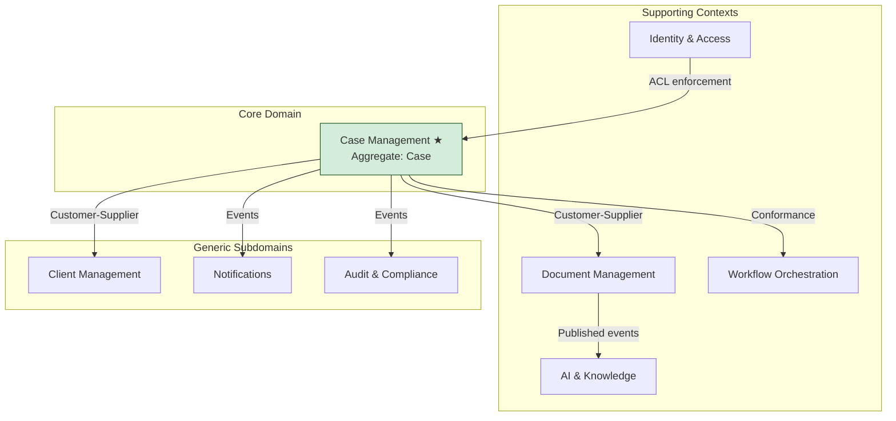

### Key Domain Events

| Event | Publisher | Typical Consumers |
|-------|-----------|-------------------|
| `CaseCreated` | Case Management | Workflow, Notifications, Audit |
| `DocumentUploaded` | Document Management | OCR worker, Workflow |
| `DocumentProcessed` | Document Management | AI embeddings, Workflow |
| `WorkflowTriggered` | Workflow Orchestration | Celery → n8n bridge |
| `SummaryGenerated` | AI & Knowledge | Notifications, Approvals |
| `ApprovalRequested` | Audit & Compliance | Notifications |

Full catalog: [02-domain/domain-events.md](../02-domain/domain-events.md).

### Interviewer Probes

| Probe | Strong Answer |
|-------|---------------|
| "Why not one big schema?" | Schema separation enforces bounded context ownership; events prevent tight coupling |
| "Who owns the client record?" | Client Management — Case references `client_id` read-only |
| "How do ethical walls work in the domain?" | `MatterWallPolicy` in Identity; Case stores participant list; every query filters |

**Go deeper:** [02-domain/case-aggregate.md](../02-domain/case-aggregate.md), [domain-model.md](../domain-model.md).

---

## 2. Hexagonal Architecture & FastAPI Components

### Talking Points

- FastAPI `apps/api` is a **thin HTTP adapter** — all logic in `services/{context}/`.
- **Workers import the same use cases** as API routes — no duplicated business rules.
- **Domain layer never imports infrastructure** — repository interfaces live in domain.
- Middleware stack order matters: CORS → CorrelationId → RateLimit → Auth → Audit.

### C4 Level 3 — Component Diagram

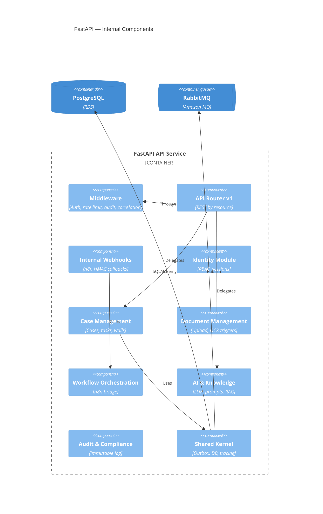

### Hexagonal Layers per Context

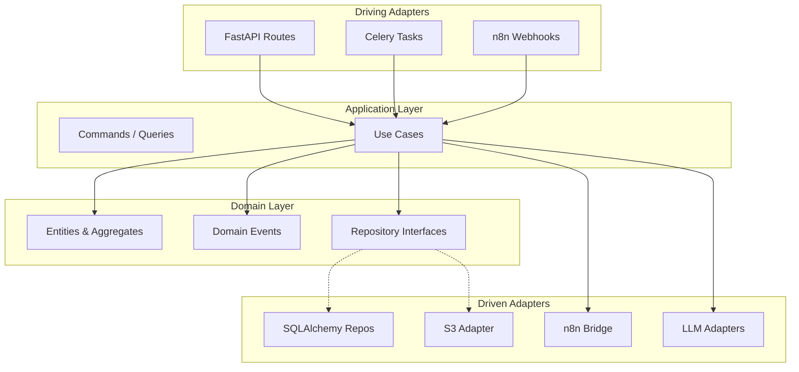

### Worker Task → Use Case Mapping

| Celery Task | Queue | Use Case |
|-------------|-------|----------|
| `document.process` | `document.process.normal` | `ProcessDocumentCommand` |
| `workflow.trigger` | `workflow.trigger.normal` | `TriggerWorkflowCommand` |
| `ai.summarize` | `ai.inference.normal` | `GenerateSummaryCommand` |
| `ai.embed` | `ai.embed.low` | `CreateEmbeddingsCommand` |
| `outbox.publish` | `system.outbox.high` | `PublishPendingEvents` |

**Go deeper:** [03-architecture/component-architecture.md](../03-architecture/component-architecture.md), [folder-structure.md](../folder-structure.md).

---

## 3. Event-Driven Design & Outbox

### Talking Points

- **Dual-write problem:** Cannot write to PostgreSQL AND publish to RabbitMQ in one atomic operation without the outbox.
- **Outbox pattern:** Domain change + `outbox_events` INSERT in **single transaction**; publisher polls and marks published.
- **At-least-once delivery** with **idempotent consumers** — use `idempotency_key` on handlers.
- **DLQ after max retries** — alert on any DLQ message count > 0.

### Event Pipeline

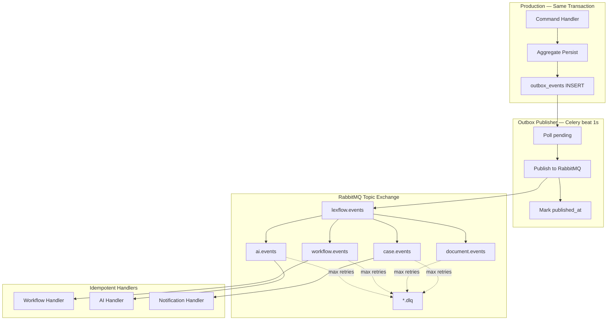

### Saga-Lite — Workflow + Document Coordination

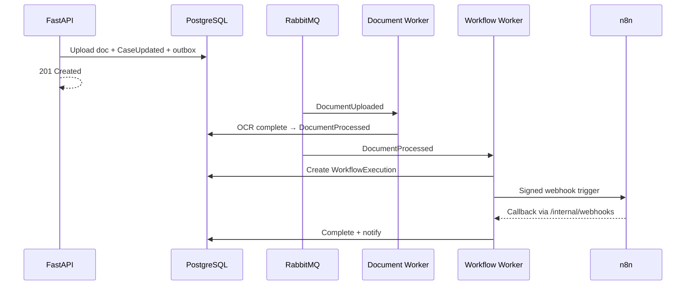

**No distributed 2PC** — each step is idempotent; compensation is manual via admin replay from DLQ.

### Interviewer Probes

| Probe | Strong Answer |
|-------|---------------|
| "Why RabbitMQ not Kafka?" | 50K workflows/month; topic routing + DLQ + priority queues; team familiarity; Amazon MQ managed HA |
| "Why not SQS?" | Need routing keys, DLQ semantics, priority — RabbitMQ fits orchestration fan-out |
| "Exactly-once?" | We target at-least-once + idempotency; exactly-once end-to-end is impractical at our scale |
| "Ordering?" | Per-aggregate ordering via partition key in Phase 2; global ordering not required |

**Go deeper:** [03-architecture/event-driven-design.md](../03-architecture/event-driven-design.md), [ADR-006](../13-decisions/006-transactional-outbox.md), [06-workflows/retry-dlq.md](../06-workflows/retry-dlq.md).

---

## 4. AI Pipeline — Async, RAG, Human-in-the-Loop

### Talking Points

- **All LLM calls via Celery** — API returns 202 immediately ([ADR-004](../13-decisions/004-async-ai-processing.md)).
- **RAG is case-scoped** — every vector query filters `case_id` + matter wall check before retrieval.
- **Hybrid search** — pgvector semantic + PostgreSQL full-text + Reciprocal Rank Fusion (RRF).
- **Human-in-the-loop** — AI output status = `draft` until attorney `approved`; never auto-sent to clients.
- **Prompt registry** — Jinja2 templates versioned in DB; all invocations logged in `prompt_history`.

### End-to-End AI Flow

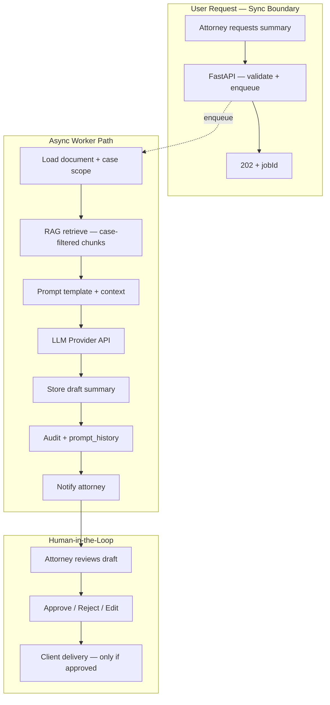

### RAG Pipeline

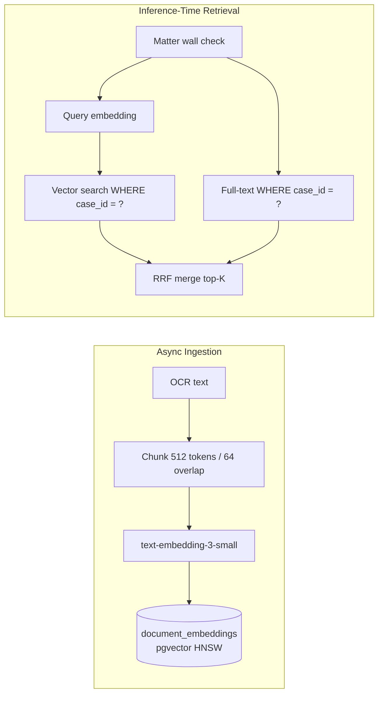

### AI Safety Controls

| Control | Implementation |
|---------|----------------|
| Case scope | `case_id` filter on every retrieval query |
| PII redaction | Pre-LLM redaction pipeline; no PII in logs |
| Prompt injection defense | System prompt hardening; no user content in system role |
| Output validation | Schema validation; citation requirement for research |
| Usage metering | Per-firm, per-case token tracking — [07-ai/usage-metering.md](../07-ai/usage-metering.md) |
| Provider DPAs | Azure OpenAI preferred for firm data residency |

**Go deeper:** [07-ai/rag-architecture.md](../07-ai/rag-architecture.md), [07-ai/safety-guardrails.md](../07-ai/safety-guardrails.md), [07-ai/human-in-the-loop.md](../07-ai/human-in-the-loop.md).

---

## 5. Workflow Orchestration & n8n Boundary

### Talking Points

- n8n is a **private HTTP orchestration engine** — invisible to end users.
- **FastAPI decides** whether a workflow may run (authZ, case state, firm config).
- **Workers invoke n8n** via HMAC-signed webhooks on internal ALB.
- **n8n callbacks** hit `/internal/webhooks` — HMAC verified, excluded from public OpenAPI.
- **Git is source of truth** for workflow JSON — sandbox → production promotion via CI.

### n8n Boundary Diagram

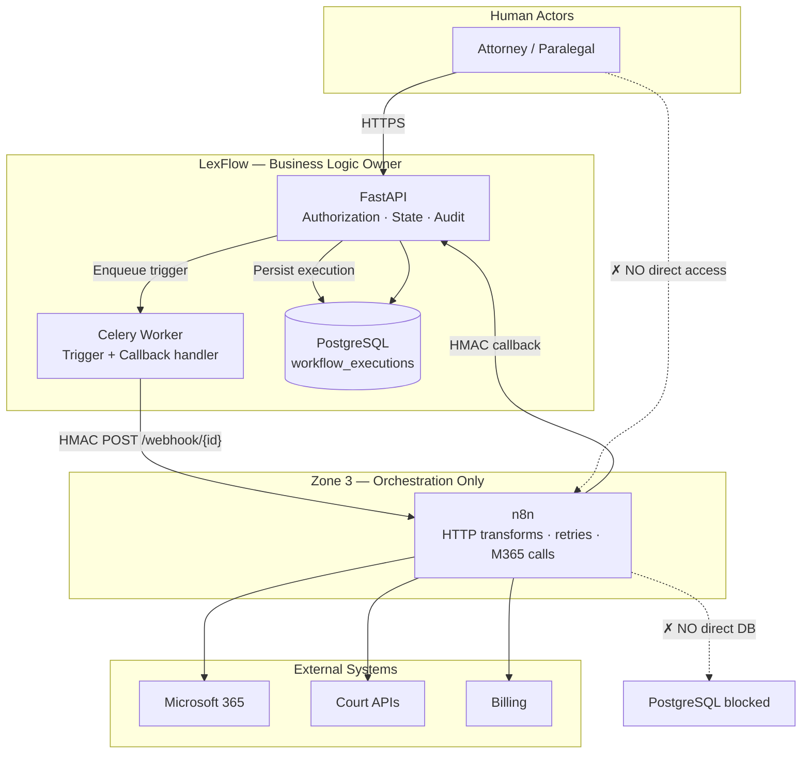

### What n8n MAY Do vs MUST NOT Do

| n8n MAY | n8n MUST NOT |
|---------|--------------|
| Call Microsoft Graph (email, SharePoint) | Write to PostgreSQL |
| Transform payloads between HTTP steps | Enforce matter walls or RBAC |
| Retry failed external API calls | Store attorney-client privileged data long-term |
| Callback to FastAPI with execution results | Be reachable from public internet |

### Workflow Promotion Pipeline

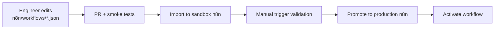

**Go deeper:** [06-workflows/orchestration-model.md](../06-workflows/orchestration-model.md), [06-workflows/n8n-integration.md](../06-workflows/n8n-integration.md), [ADR-002](../13-decisions/002-n8n-orchestration-only.md).

---

## 6. Data Architecture — PostgreSQL, S3, pgvector

### Talking Points

- **Single PostgreSQL** with schema-per-bounded-context ([ADR-003](../13-decisions/003-postgresql-single-database.md)).
- **Documents:** metadata in PostgreSQL; binaries in S3; presigned multipart upload bypasses API for large files (500 MB max).
- **Embeddings:** pgvector HNSW index in `documents.document_embeddings` — case_id denormalized for fast scoped search.
- **Audit:** append-only `audit.audit_logs` — separate DB role, no DELETE permission for app user.
- **Partitioning:** `audit_logs` and `prompt_history` partitioned monthly at scale.

### Schema Overview

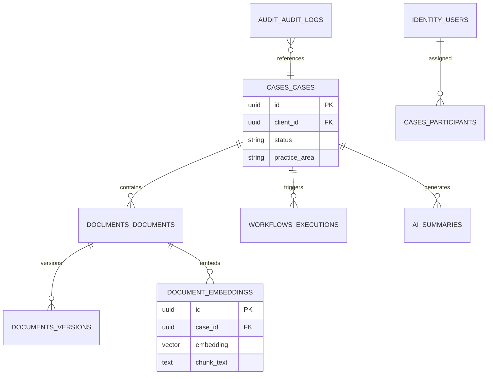

### Document Upload Path

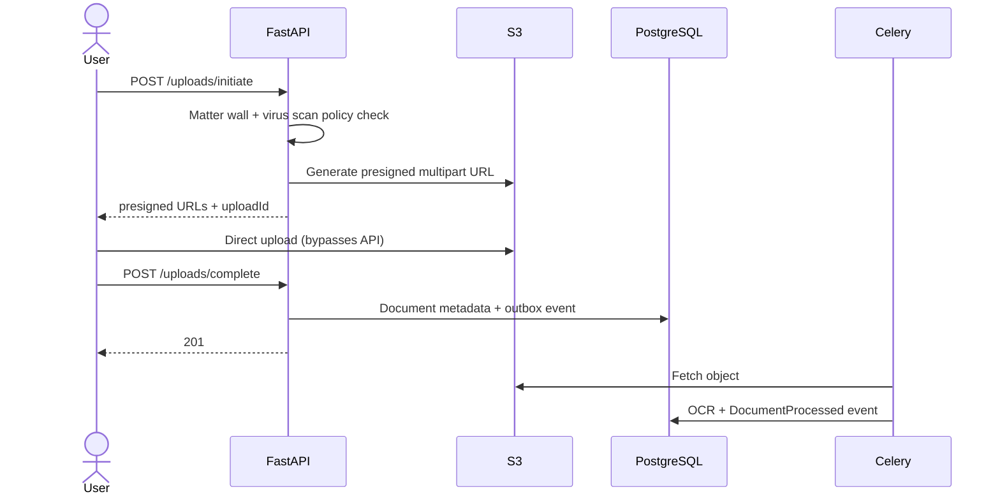

**Go deeper:** [05-database/schema-overview.md](../05-database/schema-overview.md), [05-database/indexing-strategy.md](../05-database/indexing-strategy.md), [database-architecture.md](../database-architecture.md).

---

## 7. API, AuthZ & Matter Walls

### Talking Points

- **JWT access tokens** — 15-minute TTL; refresh tokens httpOnly, rotated on use.
- **RBAC** — 10 predefined roles (Attorney, Paralegal, Admin, Client Portal, etc.).
- **Matter walls (ABAC)** — case participant list + ethical wall rules; enforced server-side on every endpoint.
- **404 on deny** — unauthorized users cannot enumerate case existence.
- **Future:** Microsoft Entra ID OIDC federation (Phase 3).

### Authorization Flow

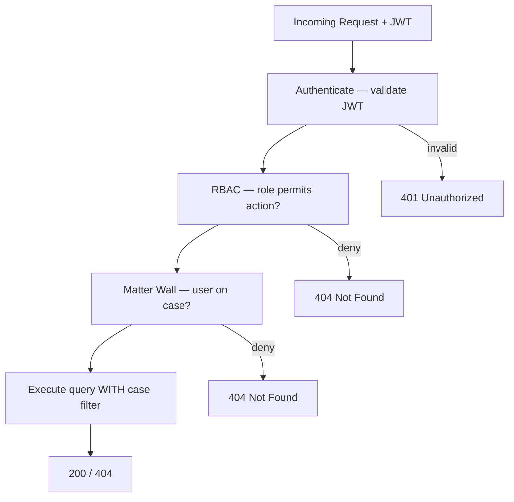

### Permission Cache

| Layer | TTL | Invalidation |
|-------|-----|--------------|
| Redis permission cache | 5 min | `RoleAssigned`, `ParticipantAdded` events |
| Matter wall evaluation | Per request | Cannot cache across cases without case_id key |

**Go deeper:** [04-api/authorization-rbac.md](../04-api/authorization-rbac.md), [08-security/matter-walls.md](../08-security/matter-walls.md), [ADR-005](../13-decisions/005-jwt-authentication.md).

---

## 8. Observability, Deployment & Disaster Recovery

### Talking Points

- **Correlation IDs** propagate from API → worker → n8n callback → audit log.
- **Structured JSON logging** — zero PII; automatic secret redaction.
- **Distributed tracing** — OpenTelemetry / X-Ray; 10% sampling at scale.
- **ECS Fargate** on AWS — separate services for web, api, worker, n8n.
- **DR:** RPO ≤ 15 min, RTO ≤ 4 hr — quarterly drills.

### Observability Stack

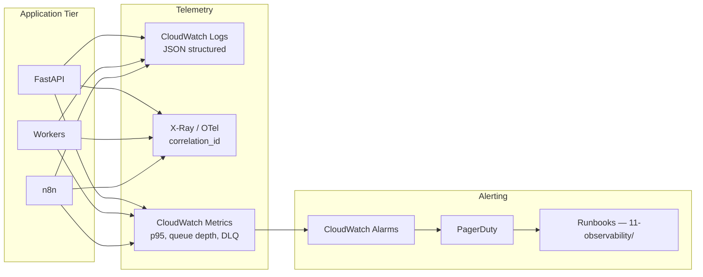

### Critical Alert Thresholds

| Metric | Warning | Critical |
|--------|---------|----------|
| API p95 latency | > 500ms | > 1s |
| RabbitMQ queue depth | > 5,000 | > 20,000 |
| DLQ messages | > 0 | > 10 |
| n8n callback failures | > 5/hr | > 20/hr |

### HA & DR Summary

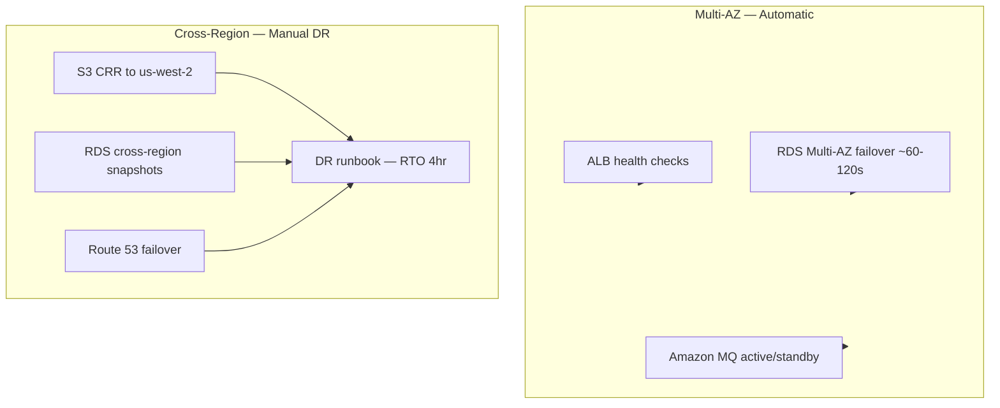

**Go deeper:** [11-observability/README.md](../11-observability/README.md), [09-deployment/aws-topology.md](../09-deployment/aws-topology.md), [09-deployment/disaster-recovery.md](../09-deployment/disaster-recovery.md).

---

## Deep Dive Checklist — Did You Cover?

| Topic | Covered? | Doc Reference |
|-------|----------|---------------|
| Bounded contexts & case aggregate | ☐ | [02-domain/](../02-domain/README.md) |
| Outbox + idempotency | ☐ | [ADR-006](../13-decisions/006-transactional-outbox.md) |
| n8n boundary | ☐ | [ADR-002](../13-decisions/002-n8n-orchestration-only.md) |
| Async AI + HITL | ☐ | [ADR-004](../13-decisions/004-async-ai-processing.md) |
| Case-scoped RAG | ☐ | [07-ai/rag-architecture.md](../07-ai/rag-architecture.md) |
| Matter walls + 404 | ☐ | [08-security/matter-walls.md](../08-security/matter-walls.md) |
| NFR targets | ☐ | [03-architecture/nfr-requirements.md](../03-architecture/nfr-requirements.md) |
| DR RPO/RTO | ☐ | [09-deployment/disaster-recovery.md](../09-deployment/disaster-recovery.md) |

---

## References

| Document | Path |
|----------|------|
| Interview index | [README.md](./README.md) |
| 15-minute pitch | [system-design-overview.md](./system-design-overview.md) |
| Tradeoffs | [tradeoffs-discussion.md](./tradeoffs-discussion.md) |
| Scaling scenarios | [scaling-questions.md](./scaling-questions.md) |
| Security Q&A | [security-questions.md](./security-questions.md) |
| C4 component architecture | [../03-architecture/component-architecture.md](../03-architecture/component-architecture.md) |
| Integration patterns | [../03-architecture/integration-patterns.md](../03-architecture/integration-patterns.md) |
| Cross-cutting concerns | [../03-architecture/cross-cutting-concerns.md](../03-architecture/cross-cutting-concerns.md) |
