# Scaling Questions — Interview Scenarios

**LexFlow AI** — Capacity Planning & Growth Path  
**Version:** 1.0  
**Status:** Draft — Pre-Implementation  
**Last Updated:** 2026-07-06

---

## Purpose

Interviewers frequently ask **"How would you scale this to X?"** This document provides structured answers for three canonical LexFlow AI scale scenarios — aligned with [03-architecture/nfr-requirements.md](../03-architecture/nfr-requirements.md) Year 1 targets and Phase 4 evolution paths.

Each scenario includes: baseline assumptions, bottleneck analysis, scaling actions, architecture diagrams, and honest limits.

---

## Scope

| In Scope | Out of Scope |
|----------|--------------|
| 1,000+ concurrent users | Cost optimization spreadsheets |
| 50,000+ workflows/month | Vendor pricing negotiation |
| Millions of documents | Application implementation code |
| Scaling order of operations | Terraform variable tuning |

---

## NFR Baseline — What "Scale" Means for LexFlow

| Metric | Year 1 Target | Measurement |
|--------|---------------|-------------|
| Concurrent users | 1,000+ | ALB active connections |
| Daily active users | 3,000+ | Unique JWT subjects / 24h |
| Workflow executions | 50,000/month (~1,700/day) | `workflow_executions` rows |
| Peak workflow rate | 200/hour | Burst intake scenarios |
| Documents | Millions | S3 objects + `documents` metadata |
| Audit entries | Millions | `audit.audit_logs` append-only |
| AI inferences | 10,000/month | `prompt_history` rows |
| API requests | 10M/month | ALB request count |

---

## Scenario 1 — Scale to 1,000 Concurrent Users

### The Question

> "You have 200 users today. The firm is rolling out firm-wide next quarter. How do you handle 1,000 concurrent users browsing cases, searching documents, and triggering workflows?"

### Assumptions

- **Concurrent** = active HTTP sessions with requests in flight, not total licensed users
- Firm has ~2,000 staff; 1,000 concurrent ≈ 50% peak utilization during business hours
- Read-heavy traffic pattern: 80% GET, 20% POST (commands + async triggers)
- Average 5 API calls per page load; 2 pages/minute per active user

### Back-of-Envelope Math

| Calculation | Value |
|-------------|-------|
| Requests/second at peak | 1,000 users × 2 pages/min × 5 calls ÷ 60 ≈ **167 RPS** |
| With 3× safety margin | ~500 RPS design capacity |
| Target API p95 | < 300ms |
| PostgreSQL connections | 20 API tasks × 5 pool = 100 via PgBouncer |

### Bottleneck Analysis

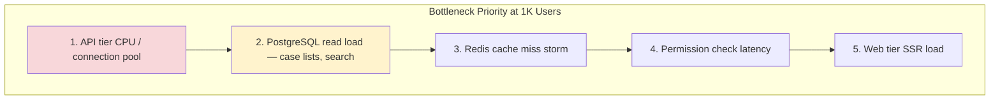

| Component | Symptom at Scale | First Response |
|-----------|------------------|----------------|
| FastAPI | p95 > 500ms, CPU > 70% | Scale api-service 2 → 10 tasks |
| PostgreSQL | CPU > 70%, slow case list queries | Read replica for dashboards/search |
| Redis | Eviction rate high | Increase shard memory; tune TTLs |
| ALB | Connection count high | Already scales; verify idle timeout |
| Next.js | SSR latency | Scale web-service; static where possible |

### Scaling Actions — Ordered

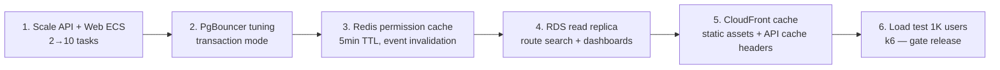

### Architecture at 1K Users

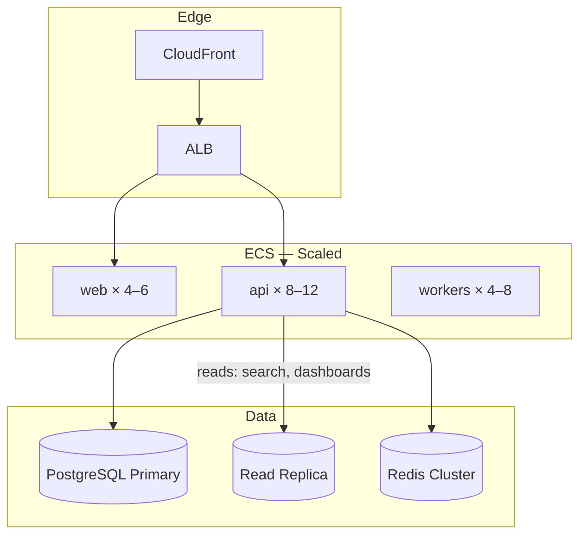

### Talking Points

1. **Stateless horizontal scale** — API and web tasks are interchangeable; no session affinity (JWT).
2. **Permission cache is critical** — without Redis, every request hits PostgreSQL for RBAC; 5-min TTL with event-driven invalidation.
3. **Read replica routing** — case list and full-text search go to replica; writes stay on primary.
4. **Rate limiting** — per-user and per-firm limits prevent one attorney from degrading firm-wide experience.
5. **Load test gate** — [10-testing/load-testing.md](../10-testing/load-testing.md) requires k6 1K user scenario pre-release.

### What We Do NOT Do at 1K Users

| Premature Optimization | Why Wait |
|------------------------|----------|
| Split into microservices | Modular monolith handles 500 RPS |
| Shard PostgreSQL | Single RDS r6g.2xlarge sufficient |
| Replace pgvector with Pinecone | Millions of chunks, not tens of millions |
| Multi-region active-active | 99.9% met with Multi-AZ |

---

## Scenario 2 — Scale to 50,000 Workflows per Month

### The Question

> "Workflow adoption hits 80% of matters. You're executing 50,000 workflows a month with burst periods of 200/hour around intake deadlines. How does the system handle it?"

### Assumptions

- Average workflow = 3 n8n HTTP steps + 1 callback to FastAPI
- Average workflow duration = 30 seconds (external API latency dominates)
- 50K/month ≈ 1,700/day ≈ 70/hour average; peaks at 200/hour (3× average)
- Each workflow trigger = 1 API command + 1 outbox event + 1 Celery task + 1 n8n execution

### Back-of-Envelope Math

| Calculation | Value |
|-------------|-------|
| Peak workflows/hour | 200 |
| Concurrent n8n executions at peak | 200 × 30s ÷ 3600s ≈ **1.7 average**, ~10–20 burst |
| Celery tasks/hour at peak | 200 triggers + 200 callbacks + events ≈ **600/hour** |
| RabbitMQ messages/day | ~5,000 workflow-related + ~10,000 domain events |

### Bottleneck Analysis

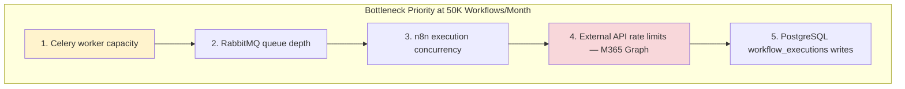

| Component | Symptom | Response |
|-----------|---------|----------|
| RabbitMQ | Queue depth > 5,000 | Scale workers; check consumer rate |
| Celery workers | Task latency increasing | Add tasks to `workflow.trigger` pool |
| n8n | Execution queue backlog | Increase n8n concurrency setting; Phase 3 HA |
| Microsoft Graph | 429 throttling | Exponential backoff in n8n; batch requests |
| DLQ | Messages appearing | Alert; investigate poison payloads |

### Scaling Actions

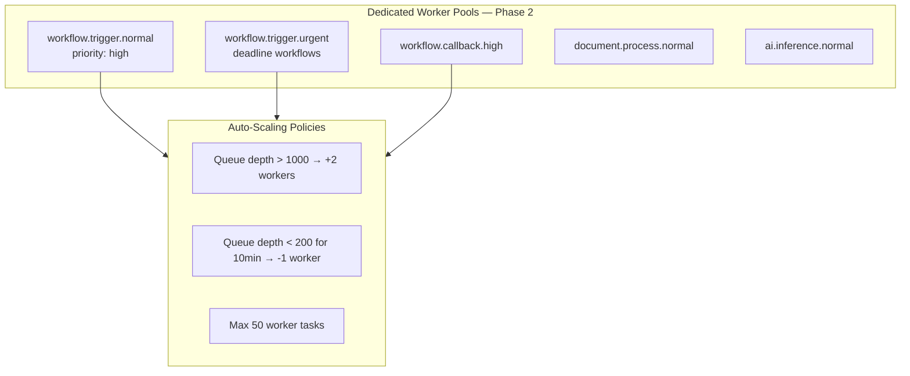

### Workflow Throughput Architecture

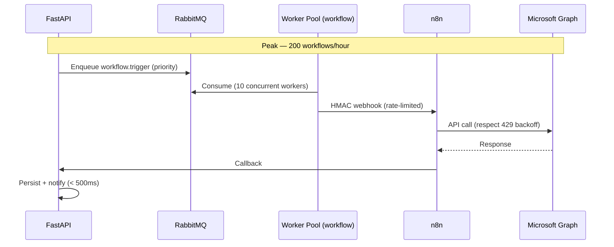

### Idempotency & Retry — Critical at Scale

| Mechanism | Purpose |
|-----------|---------|
| `execution_id` as idempotency key | Duplicate trigger → no-op |
| Celery `acks_late` + visibility timeout | Worker crash → redeliver |
| n8n retry on HTTP 5xx/429 | External API resilience |
| DLQ after 5 retries | Poison isolation + alert |
| Outbox republish | No lost trigger events |

See [06-workflows/retry-dlq.md](../06-workflows/retry-dlq.md).

### n8n Scaling Path

| Phase | Configuration | Capacity |
|-------|---------------|----------|
| Phase 1 | Single n8n task; concurrency 10 | 50K workflows/month ✅ |
| Phase 2 | Concurrency 20; dedicated CPU | 100K/month |
| Phase 3 | 2+ n8n tasks behind internal ALB | 250K/month; 99.9% HA |

### Talking Points

1. **Workers scale on queue depth**, not CPU — CloudWatch metric `ApproximateNumberOfMessagesVisible`.
2. **Priority queues** — `deadline.approaching` workflows jump ahead of bulk operations.
3. **External API limits are the real ceiling** — M365 Graph throttling requires backoff; not solved by more workers alone.
4. **n8n is 99.5% tier** — acceptable; Celery retries on n8n timeout.
5. **50K is not high for message queues** — RabbitMQ handles this easily; the concern is external dependency latency.

### Evolution Beyond 50K

| Scale | Architecture Change |
|-------|---------------------|
| 100K/month | n8n HA + dedicated workflow worker pool (10–20 tasks) |
| 250K/month | Evaluate Temporal for internal sagas; n8n for external only |
| 500K/month | Extract Workflow Orchestration service; workflow-specific RDS |

---

## Scenario 3 — Scale to Millions of Documents

### The Question

> "The firm has 5 million documents across 50,000 matters after 3 years. Search must stay under 2 seconds. Uploads can be 500 MB. How do you architect storage and retrieval?"

### Assumptions

- Average document metadata row: ~2 KB
- Average document binary: ~5 MB (mix of PDF, email, images)
- 5M documents × 5 MB ≈ **25 TB** in S3 (grows unbounded)
- 5M metadata rows ≈ 10 GB PostgreSQL (manageable)
- OCR text + embeddings: ~10 chunks/doc × 5M = **50M embedding rows**
- Embedding row: ~6 KB (1536-dim vector + text) ≈ **300 GB** in pgvector

### Storage Topology

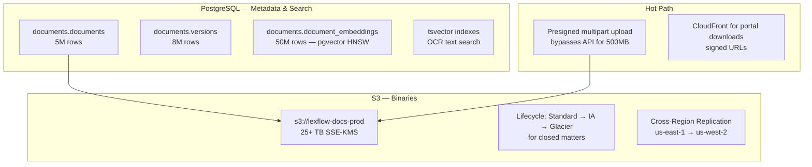

### Bottleneck Analysis

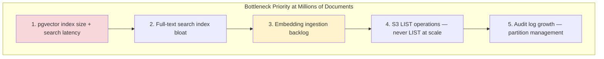

### Scaling Actions — Documents

| Layer | Action | Detail |
|-------|--------|--------|
| **Upload** | Presigned S3 multipart | API never proxies 500 MB; [05-database/documents-schema.md](../05-database/documents-schema.md) |
| **Metadata** | Index on `(case_id, created_at)` | All queries case-scoped first |
| **Full-text** | GIN index on `tsvector`; read replica | Partition OCR text if > 100M rows |
| **Embeddings** | HNSW index `(m=16, ef_construction=64)` | Tune `ef_search` for recall vs latency |
| **Embedding ingestion** | Dedicated `ai.embed.low` queue | Throttle to protect OLTP; 50M rows over months |
| **S3** | Prefix by `firm_id/case_id/doc_id` | No bucket LIST; direct key access |
| **Lifecycle** | IA after 90 days on closed matters | Glacier for 7-year retention compliance |
| **Audit** | Monthly partition on `audit_logs` | Drop is never allowed; archive to S3 |

### Search Architecture at Scale

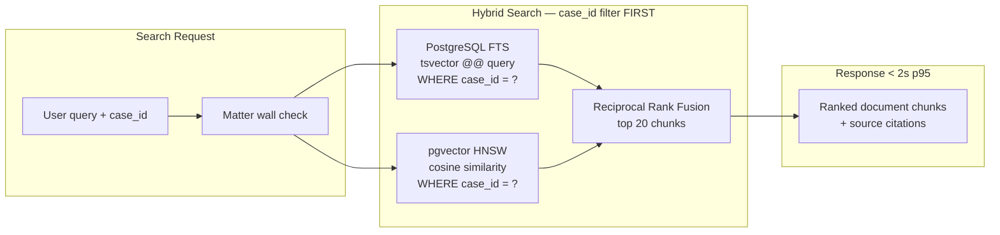

**Key insight for interviews:** Case-scoped search dramatically reduces index scan size. A firm with 5M documents across 50K matters averages ~100 documents/matter. Vector search within one case scans thousands of chunks, not 50 million.

### Embedding Ingestion Pipeline at Scale

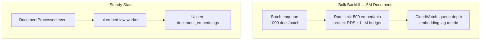

### PostgreSQL Sizing Evolution

| Documents | RDS Class | Read Replicas | Notes |
|-----------|-----------|---------------|-------|
| < 500K | db.r6g.xlarge | 0 | Year 1 |
| 500K – 2M | db.r6g.2xlarge | 1 (search) | Phase 2 |
| 2M – 5M | db.r6g.4xlarge | 2 (search + dashboards) | Phase 3 |
| > 5M embeddings | Evaluate dedicated vector reader | 1+ | Or extract to Pinecone |

### When pgvector Is Not Enough

| Trigger | Migration Path |
|---------|----------------|
| 50M+ embedding rows; p95 > 3s | Pinecone with `case_id` metadata filter |
| Cross-case firm-wide search (new feature) | Dedicated search service (Elasticsearch + vector) |
| Multi-firm tenancy | Shard embeddings by `firm_id` |

See [05-database/indexing-strategy.md](../05-database/indexing-strategy.md).

---

## Scenario 4 — Combined: "Scale Everything 10×"

### The Question

> "Fast forward 3 years. 10,000 concurrent users, 500K workflows/month, 10M documents. What breaks first?"

### Failure Order Prediction

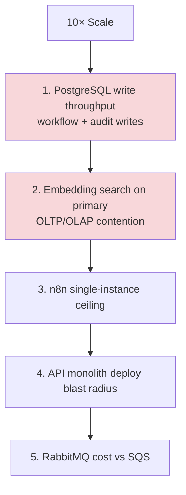

### 10× Scaling Roadmap

| Order | Action | Timeline |
|-------|--------|----------|
| 1 | RDS vertical scale + 2 read replicas | Phase 2 |
| 2 | Dedicated worker pools (AI, workflow, document) | Phase 2 |
| 3 | n8n HA (2+ instances) | Phase 3 |
| 4 | Extract AI & Knowledge to independent ECS service | Phase 3–4 |
| 5 | CQRS read models for case search | Phase 3 |
| 6 | Audit + prompt_history archival to S3 | Phase 3 |
| 7 | Evaluate Pinecone for firm-wide vector search | Phase 4 |
| 8 | Multi-region active-passive DR | Phase 4 |
| 9 | Service extraction per bounded context | Phase 4+ |

### Architecture at 10× Scale

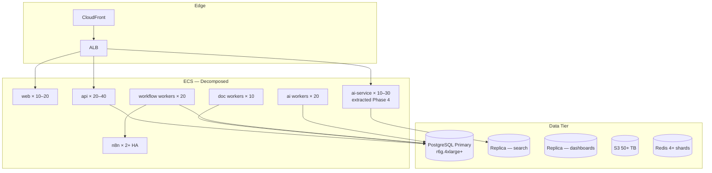

---

## Monitoring Scale Health

| Metric | Healthy | Investigate | Critical |
|--------|---------|-------------|----------|
| API p95 | < 300ms | > 500ms | > 1s |
| Queue depth | < 1,000 | > 5,000 | > 20,000 |
| RDS CPU | < 60% | > 70% | > 85% |
| Embedding lag | < 1 hour | < 24 hours | > 48 hours |
| Search p95 | < 2s | > 3s | > 5s |
| DLQ count | 0 | > 0 | > 10 |

See [11-observability/metrics-alerting.md](../11-observability/metrics-alerting.md).

---

## Interview Answer Template

Use this structure for any scale question:

1. **Clarify the metric** — concurrent vs total users; average vs peak
2. **State current NFR targets** — cite numbers from nfr-requirements.md
3. **Identify the bottleneck** — don't scale everything; name the constraint
4. **Horizontal first** — stateless containers, queue consumers
5. **Data layer second** — read replicas, partitioning, S3 for binaries
6. **Extract services last** — only when modular monolith proves insufficient
7. **Validate with load tests** — k6 scenarios, quarterly DR drills

---

## References

| Document | Path |
|----------|------|
| Interview index | [README.md](./README.md) |
| NFR requirements | [../03-architecture/nfr-requirements.md](../03-architecture/nfr-requirements.md) |
| Database indexing | [../05-database/indexing-strategy.md](../05-database/indexing-strategy.md) |
| Load testing | [../10-testing/load-testing.md](../10-testing/load-testing.md) |
| AWS topology | [../09-deployment/aws-topology.md](../09-deployment/aws-topology.md) |
| Tradeoffs | [tradeoffs-discussion.md](./tradeoffs-discussion.md) |
| RAG architecture | [../07-ai/rag-architecture.md](../07-ai/rag-architecture.md) |
| Retention & backup | [../05-database/retention-backup.md](../05-database/retention-backup.md) |
