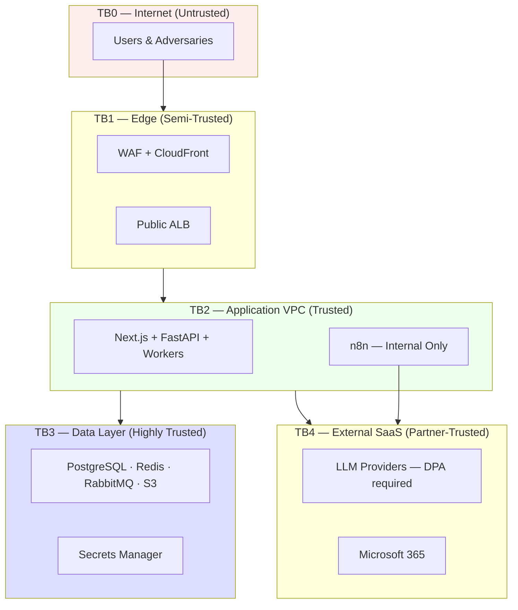
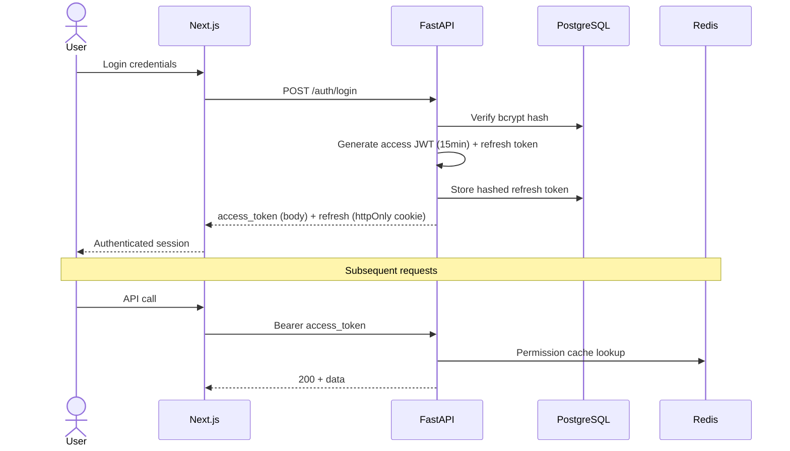
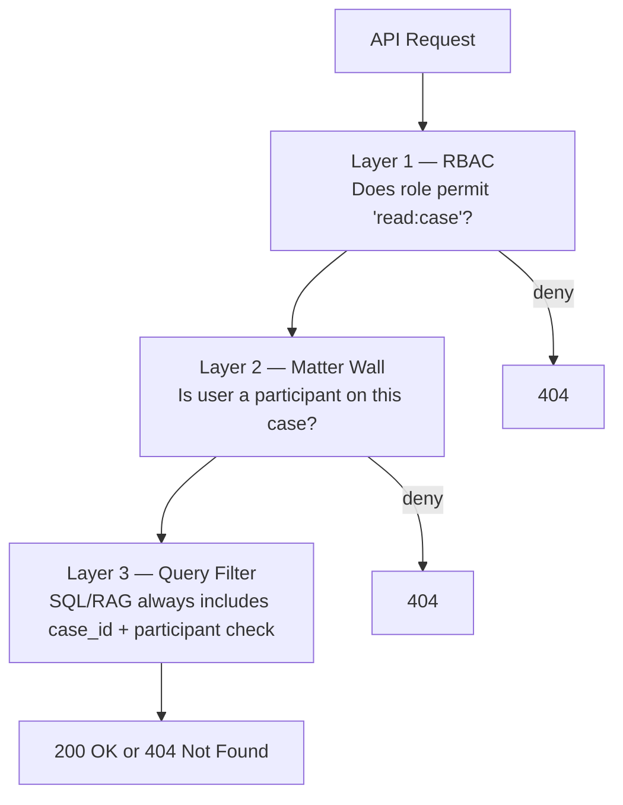
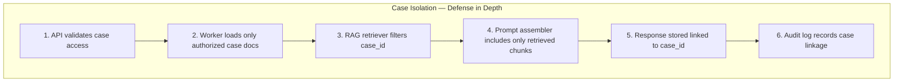
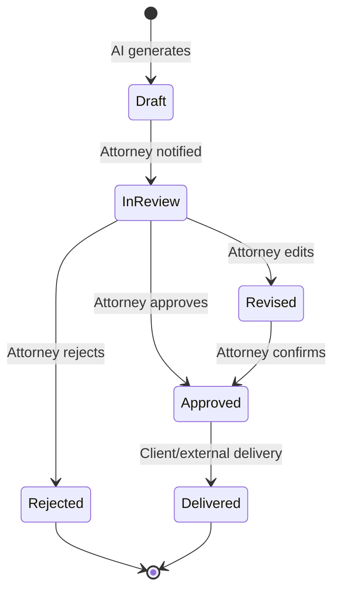
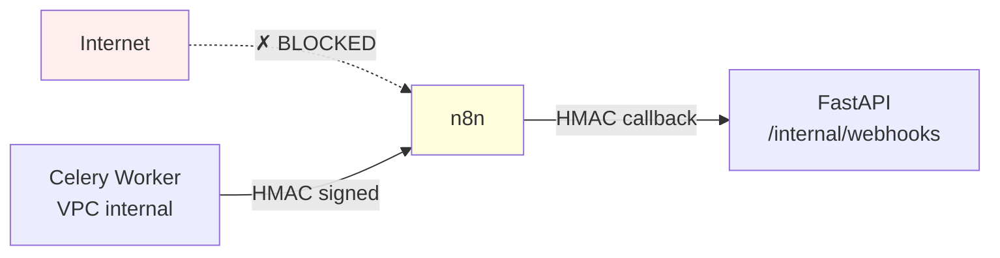
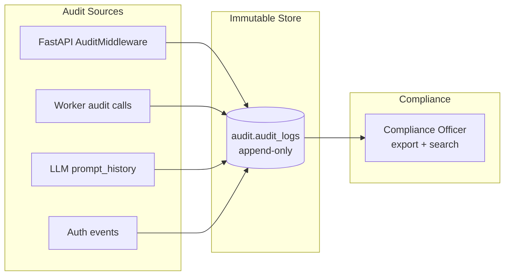
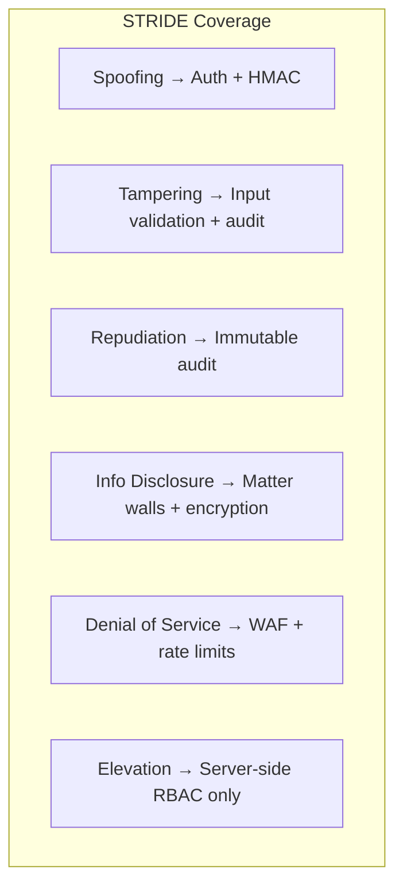

# Security Questions — Legal Tech Interview Guide

**LexFlow AI** — Common Security & Compliance Q&A  
**Version:** 1.0  
**Status:** Draft — Pre-Implementation  
**Last Updated:** 2026-07-06

---

## Purpose

Legal technology interviews emphasize **security, ethics, and compliance** differently from generic SaaS. This document provides structured answers to common security questions for LexFlow AI — grounded in the threat model, matter walls, AI governance, and regulatory requirements documented across [08-security/](../08-security/README.md).

---

## Scope

| In Scope | Out of Scope |
|----------|--------------|
| Authentication, authorization, matter walls | Penetration test execution |
| AI-specific threats (exfiltration, injection) | Firm-specific ethics opinions |
| Network segmentation and encryption | Cyber insurance terms |
| Audit, retention, GDPR erasure | SOC 2 report contents |
| STRIDE threat model summary | Raw vulnerability scan output |

---

## Security Posture Summary

LexFlow AI handles **attorney-client privileged information**. Security is designed in — not bolted on.

| Classification | Examples | Controls |
|----------------|----------|----------|
| **Restricted** | Case documents, AI summaries, client PII | Encryption, matter walls, audit, access logging |
| **Confidential** | API keys, integration tokens | Secrets Manager, rotation |
| **Internal** | Workflow configs, prompt templates | RBAC, network segmentation |
| **Public** | N/A — no public data in platform | — |

Full posture: [security-architecture.md](../security-architecture.md).

---

## Trust Boundaries

---

## Q&A — Authentication & Session Management

### Q1: "How do users authenticate?"

**Answer:**

- **Phase 1:** Email/password with bcrypt-hashed credentials; JWT access tokens (15-minute TTL) + httpOnly refresh tokens (7-day, rotated on use).
- **Phase 3:** Microsoft Entra ID OIDC federation for firm SSO.
- Access tokens are Bearer tokens; refresh tokens never exposed to JavaScript (httpOnly, Secure, SameSite=Strict).

**References:** [04-api/authentication.md](../04-api/authentication.md), [ADR-005](../13-decisions/005-jwt-authentication.md).

---

### Q2: "How do you handle token theft or session hijacking?"

**Answer:**

| Threat | Mitigation |
|--------|------------|
| Stolen access token | 15-minute TTL limits exposure window |
| Stolen refresh token | Rotation on use — old refresh invalidated; detect reuse |
| XSS stealing token | httpOnly refresh cookie; access token in memory only |
| Credential stuffing | Lockout after 5 failed attempts; rate limiting on `/auth/login` |
| Brute force | WAF rate rules + application rate limiter (Redis) |

**If refresh token reuse detected:** Invalidate all sessions for user; force re-authentication; audit alert.

---

### Q3: "Why JWT and not server-side sessions?"

**Answer:**

- **Horizontal API scaling** without session affinity or shared session store.
- **Stateless validation** at any API task — critical for ECS auto-scaling to 20 tasks.
- **Tradeoff accepted:** Cannot instantly revoke access token (15-min window). Mitigated by short TTL + refresh rotation + admin session revocation (blacklist in Redis for emergencies).

See [tradeoffs-discussion.md](./tradeoffs-discussion.md) § JWT vs Sessions.

---

## Q&A — Authorization & Matter Walls

### Q4: "What are matter walls and why do they matter?"

**Answer:**

**Matter walls** (ethical walls / conflict screens) prevent attorneys on one side of a conflict from accessing another party's case data. In large firms, this is an **ethics requirement**, not just access control.

LexFlow enforces walls at **three layers:**

| Layer | Implementation |
|-------|----------------|
| RBAC | 10 predefined roles; server-side only — never trust client |
| Matter wall | `cases.participants` + `MatterWallPolicy` in Identity context |
| Query filter | Every repository method requires `case_id` + `user_id` authorization |
| RAG retrieval | Vector search `WHERE case_id = ?` after wall check |
| Response | **404 Not Found** — not 403 — prevents case enumeration |

**References:** [08-security/matter-walls.md](../08-security/matter-walls.md), [04-api/authorization-rbac.md](../04-api/authorization-rbac.md).

---

### Q5: "Why 404 instead of 403 Forbidden?"

**Answer:**

- **403 confirms the resource exists** — an attacker can enumerate valid case UUIDs.
- **404 treats unauthorized cases as invisible** — correct semantics for ethical walls where conflict counsel must not know a matter exists.
- **Server-side audit logs the real reason** — `access_denied_matter_wall` with user, case, timestamp — but client never sees this.

This is a deliberate security UX tradeoff. See [tradeoffs-discussion.md](./tradeoffs-discussion.md) § 404 vs 403.

---

### Q6: "How do you test matter walls?"

**Answer:**

- **Non-negotiable CI gate** — matter wall integration tests must pass on every PR.
- Test matrix: every role × every case participant scenario × every endpoint.
- Testcontainers with real PostgreSQL — no in-memory shortcuts.
- Negative tests: user A on Case 1 must get 404 for Case 2 (even if UUID is known).

**References:** [10-testing/security-testing.md](../10-testing/security-testing.md), [10-testing/README.md](../10-testing/README.md).

---

## Q&A — AI Security & Governance

### Q7: "How do you prevent AI from leaking data across cases?"

**Answer:**

This is the **most important AI security question** for legal tech.

| Control | Mechanism |
|---------|-----------|
| **Case-scoped RAG** | Every embedding query: `WHERE case_id = :authorized_case` |
| **Matter wall before retrieval** | Authorization check before any vector or FTS query |
| **No cross-case context** | Prompt template cannot include chunks from other cases |
| **No firm-wide search (Phase 1–3)** | Feature non-goal until explicit security review |
| **PII redaction** | Pre-LLM pipeline redacts SSN, account numbers from chunks |
| **Prompt logging** | Every LLM call logged with `case_id`, `user_id`, `prompt_hash` |
| **Provider DPA** | Azure OpenAI preferred; data not used for training |

**References:** [07-ai/rag-architecture.md](../07-ai/rag-architecture.md), [07-ai/safety-guardrails.md](../07-ai/safety-guardrails.md), Threat T-005/T-006 in [08-security/threat-model.md](../08-security/threat-model.md).

---

### Q8: "How do you handle prompt injection?"

**Answer:**

| Vector | Mitigation |
|--------|------------|
| User text in uploaded documents | Documents processed as **data**, not instructions; system prompt hardened |
| Client portal input | Input validation; length limits; no direct LLM access from portal |
| Malicious document content | Chunk text treated as untrusted; system role immutable |
| AI assistant chat | Case-scoped context only; no tool execution without approval |
| Output validation | Schema validation on structured outputs; citation requirements |

**What we do NOT do:** Allow LLM to execute arbitrary tools or make external API calls without human approval gate.

---

### Q9: "Can attorneys trust AI output? Should clients see it directly?"

**Answer:**

**No client sees raw AI output.** Human-in-the-loop is a core architectural principle:

- AI output status = `draft` until explicit attorney approval.
- Configurable per summary type — internal research drafts may have lighter approval.
- Aligns with [01-product/non-goals.md](../01-product/non-goals.md): no auto-send to clients.

**References:** [07-ai/human-in-the-loop.md](../07-ai/human-in-the-loop.md).

---

### Q10: "What data goes to LLM providers?"

**Answer:**

| Data | Sent to LLM? | Control |
|------|--------------|---------|
| Document chunks (authorized case) | Yes — for inference | DPA; Azure preferred |
| User credentials | Never | Architecture prevents |
| Cross-case data | Never | Case-scoped RAG |
| Full document binaries | No — OCR text chunks only | Chunking pipeline |
| Audit logs | Never | Internal only |
| PII (SSN, etc.) | Redacted before send | PII redaction pipeline |

All calls logged in `prompt_history` with token counts for metering and compliance reporting.

---

## Q&A — Network & Infrastructure Security

### Q11: "Why is n8n not publicly accessible?"

**Answer:**

n8n workflows contain integration logic and credentials for Microsoft 365, court systems, and billing. Public exposure would:

- Bypass FastAPI authorization layer
- Expose workflow triggers to DDoS and unauthorized execution
- Violate firm security policy and [ADR-002](../13-decisions/002-n8n-orchestration-only.md)

**Controls:**

| Control | Implementation |
|---------|----------------|
| No public DNS | n8n not in Route 53 public zone |
| Internal ALB only | Security groups: workers + API SGs only |
| Admin UI | VPN or bastion host only |
| Webhook auth | HMAC-signed payloads from workers |
| Callback auth | `/internal/webhooks` HMAC verification |

---

### Q12: "How is data encrypted?"

**Answer:**

| State | Asset | Method |
|-------|-------|--------|
| **At rest** | PostgreSQL | AES-256 RDS KMS |
| **At rest** | S3 documents | SSE-KMS customer-managed key |
| **At rest** | Redis, RabbitMQ | Encryption at rest enabled |
| **At rest** | Secrets | AWS Secrets Manager CMK |
| **At rest** | Sensitive PII fields | Application-level AES-256-GCM envelope |
| **In transit** | All paths | TLS 1.2+ minimum |
| **In transit** | ECS → RDS | TLS verify-full |
| **In transit** | ECS → S3 | HTTPS |

**References:** [08-security/encryption.md](../08-security/encryption.md), [08-security/network-security.md](../08-security/network-security.md).

---

### Q13: "How do you manage secrets?"

**Answer:**

| Rule | Implementation |
|------|----------------|
| No secrets in code | `.env.example` only — no values |
| No secrets in n8n Git repo | Injected via Secrets Manager at deploy |
| No secrets in logs | Structured logging with automatic redaction |
| Rotation | API keys quarterly; DB passwords on deploy |
| Access | IAM roles per ECS task — least privilege |

**References:** [08-security/secrets-management.md](../08-security/secrets-management.md).

---

## Q&A — Audit, Compliance & Data Governance

### Q14: "How do you prove who accessed what for a compliance audit?"

**Answer:**

**Immutable, append-only audit log** — 100% of mutating API calls and privileged reads:

| Field | Purpose |
|-------|---------|
| `timestamp` | When (UTC) |
| `user_id` | Who |
| `action` | What (e.g., `case.read`, `document.download`) |
| `resource_type` + `resource_id` | Which resource |
| `case_id` | Matter linkage |
| `correlation_id` | Trace across async path |
| `ip_address` | Source |
| `metadata` | Sanitized context (no PII) |

**Tamper resistance:**
- Append-only PostgreSQL role — application user has no DELETE on `audit.audit_logs`
- Monthly partitioning for scale
- 7-year retention default
- Compliance officer export API

**References:** [05-database/audit-schema.md](../05-database/audit-schema.md), [compliance-data-governance.md](../compliance-data-governance.md), [08-security/compliance-mapping.md](../08-security/compliance-mapping.md).

---

### Q15: "How do you handle GDPR right to erasure?"

**Answer:**

| Data Type | Erasure Approach |
|-----------|------------------|
| User PII | Async erasure job; anonymize `users` row; revoke sessions |
| Client portal data | Delete client contact fields; retain case metadata if legal hold |
| Documents | Delete S3 objects + metadata if no legal hold |
| Audit logs | **Retained** — anonymize `user_id` to `DELETED_USER_{hash}` — legal obligation |
| Embeddings | Cascade delete with document erasure |
| AI prompt history | Anonymize user; retain case linkage for matter record |

- Erasure completes within **30 days** (NFR target).
- Legal hold flag on case blocks erasure until hold released.
- Erasure itself is audited.

---

### Q16: "What about SOC 2 / ISO 27001?"

**Answer:**

LexFlow architecture is **designed for SOC 2 Type II alignment**:

| SOC 2 Criteria | LexFlow Control |
|----------------|-----------------|
| Security | WAF, RBAC, matter walls, encryption |
| Availability | 99.9% Multi-AZ, DR runbook |
| Processing integrity | Idempotent workers, outbox, audit |
| Confidentiality | Matter walls, classification, DPAs |
| Privacy | GDPR erasure, PII redaction, minimization |

Formal certification is a **deployment-phase activity** — architecture provides the controls. Mapping: [08-security/compliance-mapping.md](../08-security/compliance-mapping.md).

---

## Q&A — Threat Model & Incident Response

### Q17: "Walk me through your threat model."

**Answer:**

We use **STRIDE** per trust boundary. Top threats:

| ID | Threat | STRIDE | Mitigation |
|----|--------|--------|------------|
| T-001 | Stolen JWT | Spoofing | Short TTL, refresh rotation |
| T-004 | n8n public exposure | Spoofing, Info Disclosure | Private subnet, no DNS |
| T-005 | Cross-matter access | Info Disclosure, Elevation | Matter walls + 404 |
| T-006 | AI data exfiltration | Tampering, Info Disclosure | Case-scoped RAG, PII redaction |
| T-010 | Audit log tampering | Repudiation | Append-only DB role |
| T-012 | DDoS | Denial of Service | WAF, CloudFront, rate limiting |
| T-015 | Supply chain attack | Tampering | Dependabot, Trivy, pinned deps |

**References:** [08-security/threat-model.md](../08-security/threat-model.md).

---

### Q18: "What happens during a security incident?"

**Answer:**

1. **Detect** — GuardDuty, CloudWatch alarms, DLQ alerts, audit anomaly detection
2. **Contain** — Revoke sessions (Redis blacklist), disable compromised integration, WAF block
3. **Investigate** — Audit log search by `correlation_id`, X-Ray traces, prompt_history review
4. **Notify** — Firm IT admin + compliance officer per [08-security/incident-response.md](../08-security/incident-response.md)
5. **Recover** — Rotate secrets, patch CVE, replay from DLQ if needed
6. **Post-mortem** — Blameless review; update threat model

**Breach involving client data:** Firm notification within contractual timeframe; preserve audit chain of custody.

---

## Q&A — Client Portal Security

### Q19: "How is the client portal secured differently?"

**Answer:**

| Dimension | Firm User | Client Portal |
|-----------|-----------|---------------|
| Role | Attorney, Paralegal, Admin | `client_portal` role only |
| Case access | Assigned matters | Single matter or limited set |
| AI features | Full (with approval) | No direct AI access |
| Document upload | Full | Upload to requested folder only |
| Visibility | Matter wall within firm | Firm-controlled status fields only |
| Authentication | Firm credentials / Entra ID | Separate portal credentials; optional magic link |

Portal users never see internal notes, ethical wall indicators, or other clients' data.

**References:** [12-ui/client-portal.md](../12-ui/client-portal.md).

---

## Quick-Fire Security Answers

| Question | One-Sentence Answer |
|----------|---------------------|
| "SQL injection?" | SQLAlchemy parameterized queries; input validation on all DTOs |
| "XSS?" | React auto-escaping; CSP headers; DOMPurify for rich text |
| "CSRF?" | SameSite cookies; CSRF tokens on state-changing forms |
| "Insider threat?" | Audit logs; least privilege; separation of duties for admin |
| "Data residency?" | AWS region configurable; Azure OpenAI for firm preference |
| "LLM training on our data?" | DPAs prohibit; Azure OpenAI enterprise default |
| "Penetration testing?" | Annual third-party pentest planned; continuous DAST in CI |

---

## Security Interview Checklist

| Topic | Can you explain it? | Doc |
|-------|---------------------|-----|
| Matter walls + 404 | ☐ | [08-security/matter-walls.md](../08-security/matter-walls.md) |
| Case-scoped RAG | ☐ | [07-ai/rag-architecture.md](../07-ai/rag-architecture.md) |
| n8n isolation | ☐ | [ADR-002](../13-decisions/002-n8n-orchestration-only.md) |
| Human-in-the-loop AI | ☐ | [07-ai/human-in-the-loop.md](../07-ai/human-in-the-loop.md) |
| Immutable audit | ☐ | [05-database/audit-schema.md](../05-database/audit-schema.md) |
| Encryption at rest/transit | ☐ | [08-security/encryption.md](../08-security/encryption.md) |
| STRIDE threat model | ☐ | [08-security/threat-model.md](../08-security/threat-model.md) |
| GDPR erasure | ☐ | [compliance-data-governance.md](../compliance-data-governance.md) |

---

## References

| Document | Path |
|----------|------|
| Interview index | [README.md](./README.md) |
| Security folder | [../08-security/README.md](../08-security/README.md) |
| Security architecture | [../security-architecture.md](../security-architecture.md) |
| Authentication & authorization | [../authentication-authorization.md](../authentication-authorization.md) |
| Compliance & data governance | [../compliance-data-governance.md](../compliance-data-governance.md) |
| Security testing | [../10-testing/security-testing.md](../10-testing/security-testing.md) |
| Tradeoffs — 404 vs 403 | [tradeoffs-discussion.md](./tradeoffs-discussion.md) |
