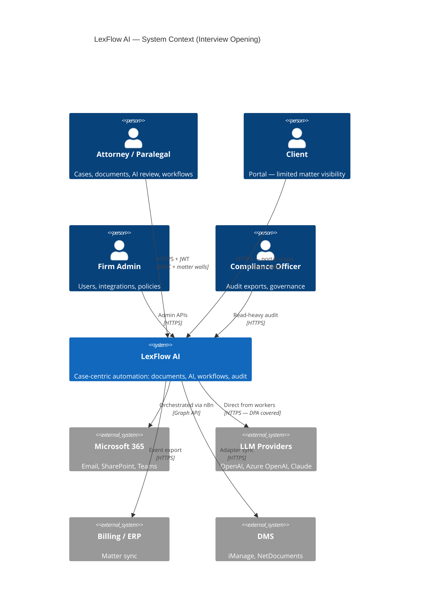
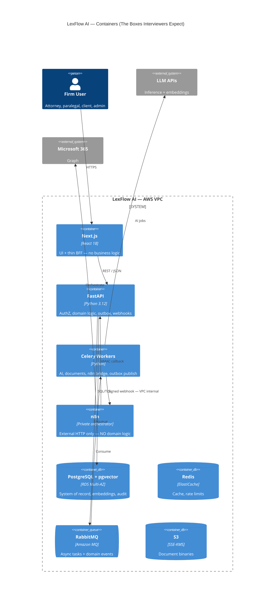
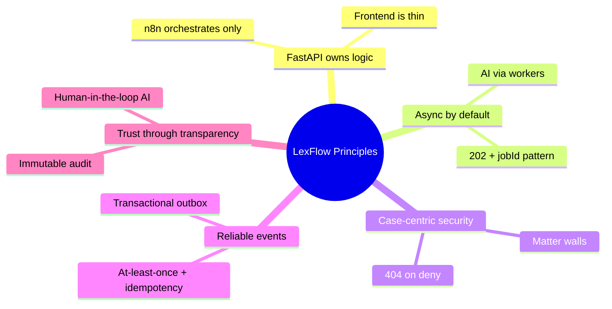
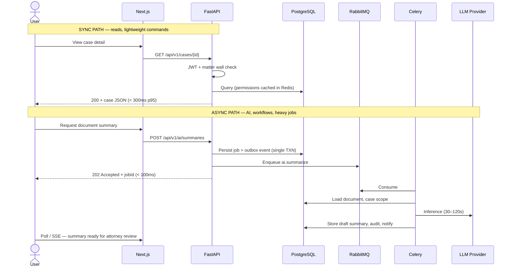
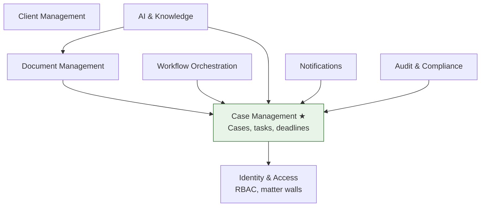
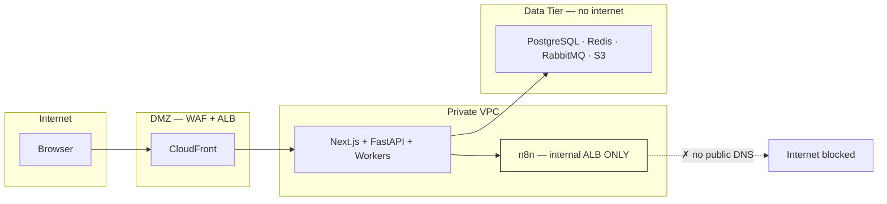

# System Design Overview — 15-Minute Elevator Pitch

**LexFlow AI** — Interview Architecture Narrative  
**Version:** 1.0  
**Status:** Draft — Pre-Implementation  
**Last Updated:** 2026-07-06

---

## Purpose

This document is the **15-minute elevator pitch** for LexFlow AI system design interviews. It covers problem framing, constraints, high-level architecture, and the five principles interviewers should hear in the first five minutes. Use it as the opening act before [architecture-deep-dive.md](./architecture-deep-dive.md).

---

## Scope

| In Scope | Out of Scope |
|----------|--------------|
| Problem statement and user personas | SQL schema details |
| C4 Level 1 and Level 2 diagrams | FastAPI route catalog |
| Sync vs async path summary | n8n node-level configuration |
| NFR headline numbers | Load test scripts |
| Interview talking points | Application code |

---

## The One-Liner

> **LexFlow AI is an event-driven, async-first legal automation platform where FastAPI owns all business logic and matter-wall authorization, Celery workers handle AI and orchestration, and private n8n connects Microsoft 365 and external systems — with immutable audit trails and human-in-the-loop AI for every client-facing output.**

---

## Minute-by-Minute Script

| Minute | Topic | Key Phrase |
|--------|-------|------------|
| **0–2** | Problem & users | "Large firms lose days on intake; documents live in email; AI tools bypass ethics walls" |
| **2–4** | Constraints | "Attorney-client privilege, matter walls, 7-year audit, no public automation surface" |
| **4–7** | C4 context | "Attorneys, clients, ops — platform talks to M365, LLMs, billing, courts" |
| **7–11** | C4 containers | "Next.js → FastAPI → RabbitMQ → Workers → n8n; PostgreSQL + S3 + Redis" |
| **11–13** | Two paths | "Sync for reads/commands; async 202 for AI, workflows, heavy processing" |
| **13–15** | Close | "Modular monolith today; scale horizontally; extract AI service at Phase 4 if needed" |

---

## Problem Statement

Large US law firms (500–2,000+ attorneys) need a **unified, auditable platform** — not another point solution.

| Pain Point | Why Architecture Matters |
|------------|-------------------------|
| Manual case intake | Needs reliable async workflows + external integrations |
| Document chaos | S3 + versioning + OCR + semantic search at scale |
| AI without governance | Async path, case-scoped RAG, attorney approval gates |
| Ethics / conflict walls | Matter-level ABAC on every API and retrieval query |
| Compliance burden | Immutable audit log; 100% mutation coverage |

**Non-goals to state explicitly:** LexFlow does not replace attorneys, auto-file with courts, or expose n8n publicly. See [01-product/non-goals.md](../01-product/non-goals.md).

---

## Users & System Context (C4 Level 1)

**Interview tip:** Draw actors first, then external systems. Emphasize that **human legal judgment stays outside** the platform boundary.

---

## Container Architecture (C4 Level 2)

### Technology Stack Summary

| Layer | Choice | Interview Justification |
|-------|--------|-------------------------|
| Frontend | Next.js | Modern UX; BFF proxies to FastAPI — secrets never in browser |
| API | FastAPI | Single source of truth for legal rules, RBAC, audit |
| Workers | Celery + RabbitMQ | Proven async; priority queues; DLQ for poison messages |
| Orchestration | n8n (private) | Fast M365 integration without redeploying API for every connector |
| Data | PostgreSQL + pgvector | ACID across contexts; case-scoped semantic search in one store |
| Objects | S3 SSE-KMS | Unlimited document scale; presigned uploads bypass API |
| Compute | ECS Fargate | Enterprise AWS; horizontal scale per container type |

Full detail: [03-architecture/container-architecture.md](../03-architecture/container-architecture.md).

---

## Five Architectural Principles

State these **before** drawing internal boxes:

| Principle | ADR / Doc |
|-----------|-----------|
| Modular monolith | [ADR-001](../13-decisions/001-modular-monolith.md) |
| n8n orchestration only | [ADR-002](../13-decisions/002-n8n-orchestration-only.md) |
| Single PostgreSQL | [ADR-003](../13-decisions/003-postgresql-single-database.md) |
| Async AI | [ADR-004](../13-decisions/004-async-ai-processing.md) |
| JWT auth | [ADR-005](../13-decisions/005-jwt-authentication.md) |
| Transactional outbox | [ADR-006](../13-decisions/006-transactional-outbox.md) |

---

## Two Request Paths — Sync vs Async

Interviewers often ask "what happens when a user triggers AI?" — answer with this diagram:

**Key numbers:** API p95 < 300ms sync; 202 response < 100ms; AI total 30–120s in worker. See [03-architecture/nfr-requirements.md](../03-architecture/nfr-requirements.md).

---

## Bounded Contexts — One Slide

Eight DDD bounded contexts; **Case Management** is the aggregate hub:

No context writes another's tables. Integration via **domain events** (outbox → RabbitMQ). See [02-domain/bounded-contexts.md](../02-domain/bounded-contexts.md).

---

## Trust Boundaries — Security in 60 Seconds

- **404 not 403** on unauthorized case access — prevents matter enumeration
- **n8n never public** — workers invoke via HMAC-signed VPC webhooks
- **LLM calls from workers only** — centralized prompt governance and metering

See [08-security/threat-model.md](../08-security/threat-model.md).

---

## NFR Headlines (Year 1 Targets)

| Dimension | Target | How We Get There |
|-----------|--------|------------------|
| Concurrent users | 1,000+ | Scale web + api ECS tasks (2–20) |
| Workflows | 50K/month | Worker auto-scale on queue depth |
| Documents | Millions | S3 + RDS read replicas for metadata |
| Uptime | 99.9% | Multi-AZ everything; n8n is weakest link (99.5%) |
| RPO / RTO | 15 min / 4 hr | RDS backup + S3 CRR + DR runbook |
| Audit retention | 7 years | Monthly partitioned `audit_logs` |

Full matrix: [03-architecture/nfr-requirements.md](../03-architecture/nfr-requirements.md).

---

## Phased Delivery — Shows You Think Long-Term

| Phase | Focus | Architecture Milestone |
|-------|-------|------------------------|
| **1** (Mo 1–4) | Foundation | Auth, cases, documents, basic AI summary, audit |
| **2** (Mo 5–8) | Automation | n8n workflows, M365, approvals, notifications |
| **3** (Mo 9–12) | Intelligence | RAG search, client portal, Entra ID SSO |
| **4** (Year 2+) | Enterprise scale | Multi-office tenancy, n8n HA, service extraction |

Roadmap: [01-product/roadmap.md](../01-product/roadmap.md).

---

## Closing Statements for the Pitch

Use one of these depending on panel tone:

**For a platform interviewer:**
> "We chose a modular monolith because legal workflows need ACID transactions across case, document, and audit contexts. We scale horizontally on stateless containers and extract the AI bounded context when inference isolation demands it."

**For a security interviewer:**
> "Every data path is case-scoped. Matter walls run server-side before any query or RAG retrieval. AI outputs are drafts until an attorney approves — and every LLM call is logged with case linkage."

**For an EM / product interviewer:**
> "We measure success by intake time reduction and audit completeness, not model benchmarks. The architecture serves firm ethics requirements first, throughput second."

---

## Likely Follow-Up Questions → Where to Go Next

| Question | Next Document |
|----------|---------------|
| "Walk me through workflow failure handling" | [architecture-deep-dive.md](./architecture-deep-dive.md) § Events |
| "Why not microservices?" | [tradeoffs-discussion.md](./tradeoffs-discussion.md) |
| "Scale to 10× users" | [scaling-questions.md](./scaling-questions.md) |
| "How do matter walls work?" | [security-questions.md](./security-questions.md) |
| "Design the RAG pipeline" | [07-ai/rag-architecture.md](../07-ai/rag-architecture.md) |

---

## References

| Document | Path |
|----------|------|
| Interview index | [README.md](./README.md) |
| System context (C4 L1) | [../03-architecture/system-context.md](../03-architecture/system-context.md) |
| Container architecture (C4 L2) | [../03-architecture/container-architecture.md](../03-architecture/container-architecture.md) |
| Product overview | [../product-overview.md](../product-overview.md) |
| High-level architecture | [../high-level-architecture.md](../high-level-architecture.md) |
| Data flows | [../03-architecture/data-flow.md](../03-architecture/data-flow.md) |
