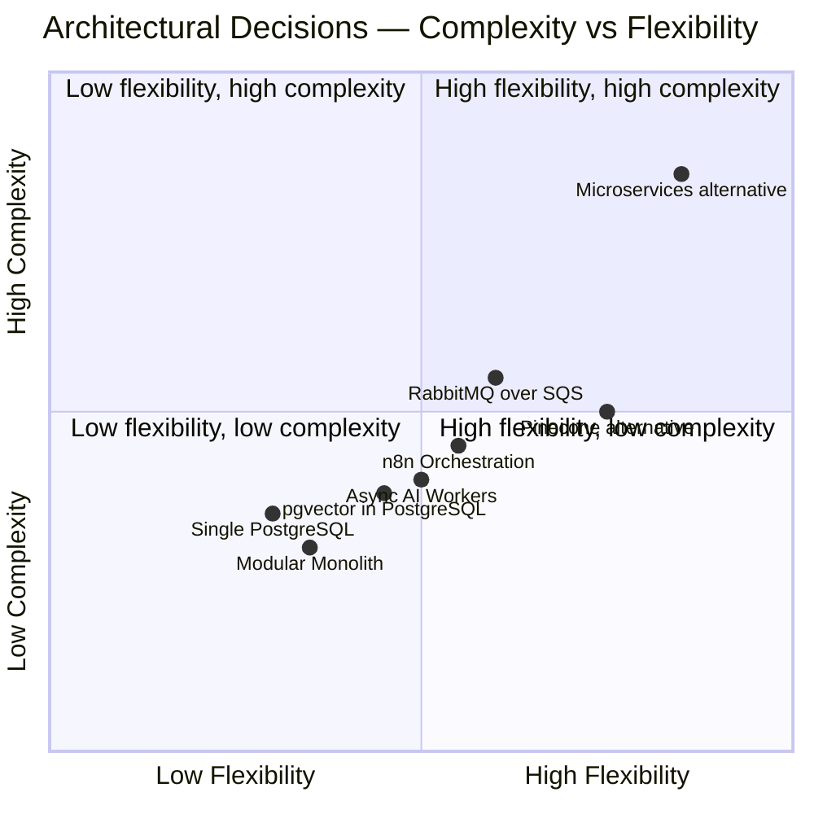
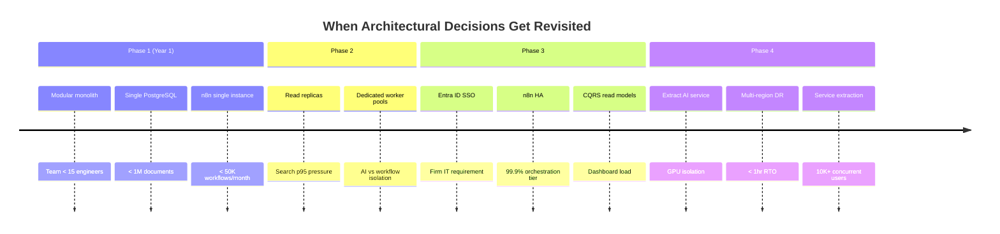

# Architectural Tradeoffs — Discussion Guide

**LexFlow AI** — Pros, Cons & ADR Defense  
**Version:** 1.0  
**Status:** Draft — Pre-Implementation  
**Last Updated:** 2026-07-06

---

## Purpose

Senior and staff interviews spend significant time on **"why this, not that?"** This document catalogs LexFlow AI's major architectural tradeoffs with structured pros/cons, decision rationale, alternatives considered, and **when we would revisit** each decision. Every tradeoff maps to an accepted ADR or canonical architecture doc.

Use alongside [architecture-deep-dive.md](./architecture-deep-dive.md) when the interviewer pushes on design choices.

---

## Scope

| In Scope | Out of Scope |
|----------|--------------|
| Major platform decisions with alternatives | Library-level choices (e.g., Pydantic vs Marshmallow) |
| ADR defense talking points | Implementation code |
| Revisit triggers and extraction paths | Cost spreadsheets |
| Interviewer counter-arguments | Vendor contract terms |

---

## How to Discuss Tradeoffs in Interviews

### The STAR-T Framework for Architecture

| Step | Action | Example |
|------|--------|---------|
| **S** — Situation | State constraints | "Legal tech: privilege, audit, 1K users, 50K workflows/month" |
| **T** — Tradeoff | Name the tension | "Operational simplicity vs independent service scaling" |
| **A** — Alternative | What you rejected | "Microservices from day one" |
| **R** — Rationale | Why you chose | "ACID across case + audit; small team; modular monolith" |
| **T** — Trigger | When to revisit | "10K concurrent users or AI GPU isolation needs" |

---

## Tradeoff Summary Matrix

---

## 1. Modular Monolith vs Microservices

**Decision:** Start with modular monolith — bounded contexts as Python packages in one deployable API.  
**ADR:** [001-modular-monolith.md](../13-decisions/001-modular-monolith.md)

### Comparison

| Dimension | Modular Monolith ✅ | Microservices |
|-----------|---------------------|---------------|
| **Deploy complexity** | Single ECS service; one CI pipeline | N services, N pipelines, contract versioning |
| **Cross-context transactions** | ACID — case + audit + outbox in one TXN | Saga choreography; eventual consistency |
| **Team size fit** | 5–15 engineers | Needs platform team + service owners |
| **Independent scaling** | Scale whole API tier together | Scale AI service separately from cases API |
| **Blast radius** | Bug can affect all contexts | Isolated per service |
| **Matter wall enforcement** | Single auth middleware | Must replicate auth in every service |
| **Time to first production** | Faster | Slower — infra tax upfront |

### Pros (Chosen Path)

- **ACID across bounded contexts** — case creation + audit + outbox in one transaction is trivial
- **Single authorization boundary** — matter walls enforced once in middleware
- **Lower operational overhead** — one Fargate service to monitor, one DB connection pool strategy
- **Extraction path exists** — `ai_knowledge` package can become independent ECS service at Phase 4

### Cons (Accepted Costs)

- Cannot scale AI inference independently without extraction
- Large codebase risk — mitigated by strict bounded context import rules
- Deploy of any context change redeploys entire API — mitigated by zero-downtime rolling deploys

### When to Revisit

| Trigger | Action |
|---------|--------|
| AI inference > 30% of worker capacity | Extract `ai_knowledge` to dedicated ECS service |
| 10K+ concurrent users | Split read API (CQRS) or extract search service |
| Team > 20 engineers on API | Evaluate service ownership per bounded context |
| Deploy frequency conflicts | Module-level feature flags; then extract hot contexts |

### Interviewer Counter: "Netflix uses microservices"

> "Netflix operates at orders of magnitude beyond our Year 1 NFRs. We optimize for **correctness of legal data and audit integrity** over deploy independence. Our extraction triggers are defined — we're not philosophically opposed to services, we're **sequencing complexity**."

---

## 2. n8n as Orchestrator vs Custom Workflow Engine

**Decision:** n8n for external HTTP orchestration only; FastAPI owns all business logic.  
**ADR:** [002-n8n-orchestration-only.md](../13-decisions/002-n8n-orchestration-only.md)

### Comparison

| Dimension | n8n (Private) ✅ | Custom Engine in FastAPI | SaaS (Zapier/Make) |
|-----------|------------------|--------------------------|---------------------|
| **M365 integration speed** | Visual workflow builder; Graph nodes | Every connector = code + deploy | Fast but data leaves VPC |
| **Business logic location** | Strictly forbidden in n8n | Natural fit | No control |
| **Security** | Private subnet; no public DNS | Same VPC | Third-party data processor |
| **Version control** | JSON in Git; CI promotion | Code in Git | Opaque |
| **Observability** | Split traces; correlation IDs bridge | Unified | External |
| **Operational dependency** | Additional container to operate | None extra | Vendor lock-in |

### Pros

- **Integration velocity** — paralegal-facing workflow changes don't require API deploy for M365 connector tweaks
- **Retry and transform** — n8n handles HTTP retry semantics that would be boilerplate in Python
- **Firm familiarity** — operations teams can inspect workflow graphs (via VPN)
- **Clear boundary** — ADR makes "no logic in n8n" auditable and testable

### Cons

- **Split observability** — must propagate `correlation_id` through n8n executions
- **Additional failure domain** — n8n restart pauses orchestration (~99.5% tier)
- **Credential management** — n8n needs Secrets Manager injection; not in workflow JSON repo
- **Team skill** — engineers must understand both Python and n8n promotion pipeline

### When to Revisit

| Trigger | Action |
|---------|--------|
| n8n becomes performance bottleneck | Evaluate Temporal or custom engine for hot paths only |
| Compliance prohibits third-party orchestrator | Rewrite top 10 workflows as Celery chains |
| n8n license/cost at scale | Build internal orchestration abstraction |

### Interviewer Counter: "Why not Temporal?"

> "Temporal is excellent for durable execution with compensation. Our workflows are primarily **external HTTP orchestration** to M365 and court APIs — n8n's connector ecosystem wins on time-to-integration. We use Celery + outbox for **domain event durability**; n8n for **external glue**. If we need saga compensation across 5+ internal steps, we'd add Temporal for that subset."

---

## 3. Single PostgreSQL vs Polyglot Persistence

**Decision:** Single PostgreSQL with schema-separated bounded contexts + pgvector.  
**ADR:** [003-postgresql-single-database.md](../13-decisions/003-postgresql-single-database.md)

### Comparison

| Dimension | Single PostgreSQL ✅ | Polyglot (PG + Mongo + Pinecone) |
|-----------|----------------------|----------------------------------|
| **Transactions** | ACID across schemas | Cross-store consistency is hard |
| **Matter wall queries** | Single JOIN with case filter | Must enforce in application layer across stores |
| **Semantic search** | pgvector HNSW in same DB | Dedicated vector DB (Pinecone, Weaviate) |
| **Ops complexity** | One RDS to backup, monitor, failover | N data stores × DR procedures |
| **Scale ceiling** | Vertical + read replicas + partitioning | Each store scales independently |
| **Embedding search load** | Competes with OLTP on same instance | Isolated vector workload |

### Pros

- **Matter wall + RAG in one query** — `WHERE case_id = ? AND user_authorized = true` on embeddings
- **Simpler DR** — one RDS Multi-AZ; cross-region snapshot
- **Audit co-location** — audit entries reference case rows without cross-DB joins
- **pgvector maturity** — HNSW indexes adequate for millions of chunks per firm

### Cons

- Embedding search load competes with OLTP — mitigated by read replicas (Phase 2)
- Vertical scaling ceiling — mitigated by partitioning audit/prompt_history
- No independent vector index tuning — acceptable at Year 1 scale

### When to Revisit

| Trigger | Action |
|---------|--------|
| Semantic search p95 > 3s sustained | Dedicated read replica for vector queries |
| > 50M embedding rows per firm | Evaluate Pinecone with case_id metadata filter |
| Write throughput saturates RDS | Shard by firm_id (Phase 4 multi-tenancy) |

---

## 4. Async AI vs Synchronous LLM in Request Path

**Decision:** All AI processing via Celery worker path; API returns 202.  
**ADR:** [004-async-ai-processing.md](../13-decisions/004-async-ai-processing.md)

### Comparison

| Dimension | Async Workers ✅ | Sync in API |
|-----------|-----------------|-------------|
| **API latency** | 202 in < 100ms | 30–120s blocked connection |
| **Timeout risk** | None on API tier | ALB 60s timeout kills request |
| **Retry semantics** | Celery retry + DLQ | Client must retry; duplicate charges |
| **User experience** | Progress via SSE/poll | Spinner; connection drops on mobile |
| **Worker scaling** | Independent from API | API tasks tied up during inference |
| **Cost control** | Queue-based throttling | Unbounded concurrent LLM calls |

### Pros

- Meets NFR: API p95 < 300ms regardless of AI load
- Natural place for RAG retrieval, PII redaction, prompt assembly
- Usage metering and rate limiting at queue admission
- Attorney notification when job completes — fits legal review workflow

### Cons

- More complex client UX (polling, SSE, job status)
- Eventual consistency — summary not immediately available
- Requires job status tracking table and cleanup

### When to Revisit

| Trigger | Action |
|---------|--------|
| Simple 1-sentence completions < 2s | Optional sync path for `/ai/complete` with strict timeout |
| Real-time chat assistant | WebSocket + streaming from dedicated AI service |

---

## 5. RabbitMQ vs Amazon SQS vs Kafka

**Decision:** RabbitMQ via Amazon MQ (active/standby).

### Comparison

| Dimension | RabbitMQ ✅ | SQS | Kafka |
|-----------|------------|-----|-------|
| **Routing** | Topic exchanges, routing keys | Queue or SNS fan-out | Topic partitions |
| **Priority queues** | Native | Not native | Not native |
| **DLQ** | Built-in via DLX | Built-in | Manual |
| **Ordering** | Per-queue FIFO option | FIFO queues (limited) | Per-partition |
| **Ops** | Amazon MQ managed | Fully serverless | MSK operational overhead |
| **Throughput at 50K wf/mo** | More than sufficient | Sufficient | Overkill |
| **Cost** | Higher than SQS | Lowest | Highest |

### Pros

- Priority queues for urgent workflow triggers (deadline approaching)
- Topic routing maps cleanly to bounded context event queues
- Celery has mature RabbitMQ backend
- DLQ + retry semantics well understood by team

### Cons

- Higher cost than SQS at very high volume
- Amazon MQ is managed SPOF — active/standby, not multi-master
- Less ecosystem momentum than Kafka for event sourcing

### When to Revisit

| Trigger | Action |
|---------|--------|
| Event replay / event sourcing needed | Evaluate Kafka for audit stream |
| Cost optimization at 500K workflows/month | SQS for task queues; keep RabbitMQ for events |
| Multi-region active-active | Kafka with MirrorMaker or redesign for SQS |

---

## 6. JWT vs Session Cookies vs Entra ID Only

**Decision:** JWT access (15 min) + httpOnly refresh rotation now; Entra ID OIDC in Phase 3.  
**ADR:** [005-jwt-authentication.md](../13-decisions/005-jwt-authentication.md)

### Comparison

| Dimension | JWT + Refresh ✅ | Server Sessions | Entra Only (Day 1) |
|-----------|------------------|-----------------|---------------------|
| **Stateless API scaling** | Yes — no session store | Requires Redis session store | Depends on IdP |
| **Mobile / API clients** | Natural Bearer token | Cookie complications | OIDC standard |
| **Revocation** | Short TTL + refresh rotation | Immediate server-side | IdP handles |
| **Firm SSO** | Phase 3 federation | Phase 3 | Requires IdP day one |
| **Client portal** | JWT with limited scope | Same | Federated guest users hard |

### Pros

- Horizontally scalable API — no session affinity
- Clear migration path to Entra ID OIDC federation
- Refresh token rotation detects theft

### Cons

- Cannot instantly revoke access token (15-min window)
- JWT size with permissions claims — mitigated by Redis permission cache
- Entra ID not day-one — local credentials for Phase 1 pilot

---

## 7. ECS Fargate vs EKS vs EC2

**Decision:** ECS Fargate for all application containers.

### Comparison

| Dimension | ECS Fargate ✅ | EKS | EC2 + Docker |
|-----------|---------------|-----|--------------|
| **Operational overhead** | Low — no nodes to patch | High — control plane + nodes | Medium |
| **Scaling** | Task-level auto-scaling | Pod HPA + cluster autoscaler | ASG |
| **Cost at low scale** | Higher per-task | Cluster baseline cost | Lowest compute |
| **Team K8s expertise** | Not required | Required | Not required |
| **Service mesh** | App Mesh optional | Istio/Linkerd native | Manual |

### Pros

- Matches team size and AWS-native toolchain (Terraform ECS modules)
- Independent scaling per service (web, api, worker, n8n)
- No Kubernetes operational tax for a modular monolith

### Cons

- Less portable than Kubernetes
- n8n HA patterns less documented on ECS than K8s
- Cannot use K8s ecosystem tools (Helm charts for everything)

### When to Revisit

| Trigger | Action |
|---------|--------|
| Firm mandates Kubernetes | Migrate to EKS with same container images |
| Service count > 10 | EKS service mesh becomes attractive |

---

## 8. Human-in-the-Loop AI vs Full Automation

**Decision:** All client-facing AI outputs require attorney approval.

### Comparison

| Dimension | Human-in-the-Loop ✅ | Full Automation |
|-----------|----------------------|-----------------|
| **Malpractice risk** | Attorney validates | Firm liability on AI errors |
| **ABA / ethics alignment** | Compliant with competence duty | Scrutiny from ethics committees |
| **Speed** | Slower than auto-send | Instant delivery |
| **Trust** | Attorneys adopt because they control output | Resistance from legal professionals |
| **Audit** | Clear approval chain | Harder to defend in discovery |

### Pros

- Aligns with [01-product/non-goals.md](../01-product/non-goals.md) — no auto-send to clients
- Approval workflow is itself auditable — who approved, when, what changed
- Configurable by summary type — internal drafts may skip approval

### Cons

- Bottleneck if attorneys don't review promptly — mitigated by notifications + SLA dashboards
- Not competitive with consumer AI speed — acceptable for enterprise legal

---

## 9. 404 vs 403 on Authorization Failure

**Decision:** Return 404 Not Found when user lacks case access.

### Comparison

| Dimension | 404 ✅ | 403 Forbidden |
|-----------|--------|---------------|
| **Information leakage** | Attacker cannot enumerate case IDs | Confirms case exists |
| **Ethical walls** | Critical — conflict parties must not know matter exists | Violates wall semantics |
| **Client UX** | "Case not found" — acceptable | "Access denied" — reveals wall |
| **Debugging** | Harder for developers | Clearer error |
| **Compliance** | Preferred by security reviewers | Common in generic apps |

### Pros

- Prevents matter enumeration attacks (T-005 in threat model)
- Correct semantics for ethical walls — unauthorized = invisible
- Consistent across API, search, and RAG retrieval

### Cons

- Support confusion — "I know this case exists" tickets
- Must log actual denial reason server-side for audit (not exposed to client)

**Go deeper:** [08-security/matter-walls.md](../08-security/matter-walls.md).

---

## 10. Transactional Outbox vs Dual Write vs Change Data Capture

**Decision:** Transactional outbox table polled by Celery publisher.  
**ADR:** [006-transactional-outbox.md](../13-decisions/006-transactional-outbox.md)

### Comparison

| Dimension | Outbox ✅ | Dual Write | CDC (Debezium) |
|-----------|----------|------------|----------------|
| **Consistency** | Atomic with domain TXN | Race conditions | Eventually consistent |
| **Complexity** | Poll + publish loop | Simple but wrong | Kafka Connect overhead |
| **Latency** | ~1s poll interval | Immediate (if it works) | Seconds |
| **Ordering** | Controllable | Unreliable | Per-table ordering |
| **Fit for monolith** | Excellent | Tempting but dangerous | Over-engineered |

### Pros

- Proven pattern for at-least-once without losing events
- No additional infrastructure (Debezium, Kafka Connect)
- Outbox rows are auditable — replay from DB if broker loses messages

### Cons

- 1-second poll latency — acceptable for legal workflows
- Outbox table growth — mitigated by archival job
- Not true exactly-once — consumers must be idempotent

---

## Decision Revisit Roadmap

---

## Quick-Fire Tradeoff Responses

| Question | 10-Second Answer |
|----------|------------------|
| "Monolith or microservices?" | Modular monolith; extract at defined triggers |
| "Why n8n?" | External HTTP glue; business logic stays in FastAPI |
| "Why not serverless Lambda?" | Long-running AI jobs, Celery worker pools, predictable latency |
| "Why PostgreSQL for vectors?" | Case-scoped joins; ops simplicity; adequate to millions of chunks |
| "Why not event sourcing everywhere?" | Audit log gives us immutability; full ES is Phase 4 for workflows only |
| "CAP theorem?" | AP on async path (at-least-once); CP on sync reads (strong consistency via PostgreSQL) |

---

## References

| Document | Path |
|----------|------|
| Interview index | [README.md](./README.md) |
| ADR index | [../13-decisions/README.md](../13-decisions/README.md) |
| NFR requirements | [../03-architecture/nfr-requirements.md](../03-architecture/nfr-requirements.md) |
| Product non-goals | [../01-product/non-goals.md](../01-product/non-goals.md) |
| Integration patterns | [../03-architecture/integration-patterns.md](../03-architecture/integration-patterns.md) |
| Cross-cutting concerns | [../03-architecture/cross-cutting-concerns.md](../03-architecture/cross-cutting-concerns.md) |
