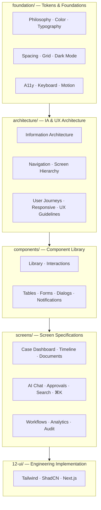
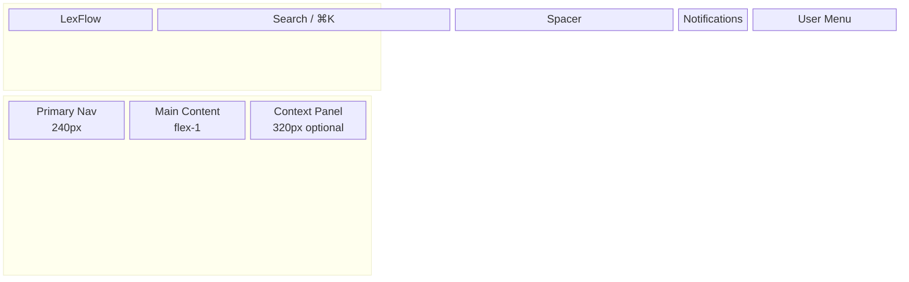

# LexFlow AI — Design System

**Version:** 1.0  
**Status:** Draft — Pre-Implementation  
**Last Updated:** 2026-07-06  
**Authored for:** Product Design · Frontend Engineering · UX Research

---

## Purpose

The **LexFlow AI Design System** is the complete visual and interaction specification for an enterprise legal SaaS platform used by US law firms. It synthesizes patterns from **Microsoft Fluent UI**, **Microsoft 365**, **Azure Portal**, **GitHub**, **Linear**, **Stripe Dashboard**, and **Atlassian** — adapted for attorneys, paralegals, compliance officers, and client portal users.

**No React code lives here.** Implementation guidance is in [`docs/12-ui/`](../12-ui/README.md).

---

## Design North Star

> **Trustworthy density** — the clarity of Microsoft 365, the precision of Linear, the operational depth of Azure Portal, and the gravitas expected by legal professionals.

LexFlow should feel like software a Managing Partner would trust with privileged client data — not a consumer app or a startup demo.

---

## Structure

---

## Quick Start by Role

| Role | Start Here |
|------|------------|
| **Product Designer** | [foundation/design-philosophy.md](./foundation/design-philosophy.md) → [architecture/information-architecture.md](./architecture/information-architecture.md) |
| **Frontend Engineer** | [foundation/design-tokens.md](./foundation/design-tokens.md) → [components/component-library.md](./components/component-library.md) → [../12-ui/design-system.md](../12-ui/design-system.md) |
| **UX Researcher** | [architecture/user-journeys.md](./architecture/user-journeys.md) → [../01-product/user-personas.md](../01-product/user-personas.md) |
| **Accessibility** | [foundation/accessibility.md](./foundation/accessibility.md) → [foundation/keyboard-navigation.md](./foundation/keyboard-navigation.md) |
| **Compliance / Legal Ops** | [screens/audit-logs-viewer.md](./screens/audit-logs-viewer.md) → [screens/approval-center.md](./screens/approval-center.md) |

---

## Foundation (10 documents)

| Topic | Document |
|-------|----------|
| Design Philosophy | [foundation/design-philosophy.md](./foundation/design-philosophy.md) |
| Design Tokens | [foundation/design-tokens.md](./foundation/design-tokens.md) |
| Color System | [foundation/color-system.md](./foundation/color-system.md) |
| Typography | [foundation/typography.md](./foundation/typography.md) |
| Spacing | [foundation/spacing.md](./foundation/spacing.md) |
| Grid & Layout | [foundation/grid-layout.md](./foundation/grid-layout.md) |
| Dark Mode | [foundation/dark-mode.md](./foundation/dark-mode.md) |
| Accessibility | [foundation/accessibility.md](./foundation/accessibility.md) |
| Keyboard Navigation | [foundation/keyboard-navigation.md](./foundation/keyboard-navigation.md) |
| Motion & Animation | [foundation/motion-animation.md](./foundation/motion-animation.md) |

---

## Architecture (6 documents)

| Topic | Document |
|-------|----------|
| Information Architecture | [architecture/information-architecture.md](./architecture/information-architecture.md) |
| Navigation Structure | [architecture/navigation-structure.md](./architecture/navigation-structure.md) |
| Screen Hierarchy | [architecture/screen-hierarchy.md](./architecture/screen-hierarchy.md) |
| User Journeys | [architecture/user-journeys.md](./architecture/user-journeys.md) |
| Responsive Behavior | [architecture/responsive-behavior.md](./architecture/responsive-behavior.md) |
| UX Guidelines | [architecture/ux-guidelines.md](./architecture/ux-guidelines.md) |

---

## Components (7 documents)

| Topic | Document |
|-------|----------|
| Component Index | [components/README.md](./components/README.md) |
| Component Library | [components/component-library.md](./components/component-library.md) |
| Component Interactions | [components/component-interactions.md](./components/component-interactions.md) |
| Data Tables | [components/data-tables.md](./components/data-tables.md) |
| Forms | [components/forms.md](./components/forms.md) |
| Dialogs | [components/dialogs.md](./components/dialogs.md) |
| Notifications | [components/notifications.md](./components/notifications.md) |

---

## Screens (11 documents)

| Screen | Document |
|--------|----------|
| Screen Index | [screens/README.md](./screens/README.md) |
| Case Dashboard | [screens/case-dashboard.md](./screens/case-dashboard.md) |
| Timeline / Activity Feed | [screens/timeline-activity-feed.md](./screens/timeline-activity-feed.md) |
| Document Viewer | [screens/document-viewer.md](./screens/document-viewer.md) |
| AI Chat | [screens/ai-chat.md](./screens/ai-chat.md) |
| Approval Center | [screens/approval-center.md](./screens/approval-center.md) |
| Search Experience | [screens/search-experience.md](./screens/search-experience.md) |
| Command Palette | [screens/command-palette.md](./screens/command-palette.md) |
| Workflow Dashboard | [screens/workflow-dashboard.md](./screens/workflow-dashboard.md) |
| Analytics Dashboard | [screens/analytics-dashboard.md](./screens/analytics-dashboard.md) |
| Audit Logs Viewer | [screens/audit-logs-viewer.md](./screens/audit-logs-viewer.md) |

---

## App Shell Wireframe

---

## Visual Reference Matrix

| Reference Product | LexFlow Adoption |
|-------------------|------------------|
| **Microsoft Fluent UI** | Design tokens, focus rings, semantic color, component anatomy |
| **Microsoft 365** | App shell, sidebar navigation, document-centric workflows |
| **Azure Portal** | Operational density, status pills, resource detail blades |
| **GitHub** | Tabbed detail views, monospace IDs, dark mode aesthetic |
| **Linear** | Command palette (⌘K), keyboard-first navigation, clean list rows |
| **Stripe Dashboard** | Client portal clarity, card summaries, trustworthy whitespace |
| **Atlassian** | Workflow status visualization, activity feeds, audit trails |

---

## Legal-Specific UX Patterns

| Pattern | Where Defined |
|---------|---------------|
| Matter wall 404 (no case existence leak) | [architecture/ux-guidelines.md](./architecture/ux-guidelines.md) |
| AI draft labeling (HITL) | [components/component-library.md](./components/component-library.md), [screens/ai-chat.md](./screens/ai-chat.md) |
| Confidentiality badges | [foundation/color-system.md](./foundation/color-system.md), [components/data-tables.md](./components/data-tables.md) |
| Approval state pills | [components/component-library.md](./components/component-library.md), [screens/approval-center.md](./screens/approval-center.md) |
| Deadline urgency colors | [foundation/color-system.md](./foundation/color-system.md) |
| Immutable audit presentation | [screens/audit-logs-viewer.md](./screens/audit-logs-viewer.md) |

---

## Related Documentation

| Document | Path |
|----------|------|
| UI implementation (Tailwind/ShadCN) | [../12-ui/design-system.md](../12-ui/design-system.md) |
| Page routes & App Router | [../12-ui/page-architecture.md](../12-ui/page-architecture.md) |
| User personas | [../01-product/user-personas.md](../01-product/user-personas.md) |
| API contracts | [../04-api/README.md](../04-api/README.md) |
| Matter walls (security UX) | [../08-security/matter-walls.md](../08-security/matter-walls.md) |
| AI context for designers | [../../.ai/agents/frontend-engineer.md](../../.ai/agents/frontend-engineer.md) |

---

## Document Standards

Every design system document includes where applicable:

**Purpose · Scope · Specifications · Wireframes (Mermaid) · States · Interactions · Accessibility · References**

---

## Maintenance

When UI patterns change:

1. Update authoritative spec in `docs/16-design-system/`
2. Update implementation notes in `docs/12-ui/`
3. Update design tokens in `foundation/design-tokens.md`
4. Notify frontend via PR with design review checklist
