# Information Architecture — Case-Centric Content Hierarchy

**LexFlow AI** — Enterprise Legal SaaS Information Architecture  
**Version:** 1.0  
**Status:** Draft — Pre-Implementation  
**Last Updated:** 2026-07-06

---

## Purpose

Define the **content hierarchy**, **mental models**, and **information grouping** for LexFlow AI's firm dashboard and client portal. The Case (legal matter) is the central organizing unit — all documents, tasks, workflows, AI outputs, and audit events are scoped to a case. This document guides navigation design, screen layout, search scope, and matter wall UX implications.

**Invariant:** The UI reflects API responses only. Fields absent from a DTO are not rendered — never hidden client-side. Authorization is enforced in FastAPI; IA describes what authorized users see.

Cross-reference: [../../12-ui/page-architecture.md](../../12-ui/page-architecture.md), [../../01-product/user-personas.md](../../01-product/user-personas.md), [../../04-api/authorization-rbac.md](../../04-api/authorization-rbac.md), [../../08-security/matter-walls.md](../../08-security/matter-walls.md).

---

## Scope

| In Scope | Out of Scope |
|----------|--------------|
| Content taxonomy and hierarchy | Visual design tokens (see [../../12-ui/design-system.md](../../12-ui/design-system.md)) |
| Case-centric IA model | Component implementation |
| Firm vs portal information boundaries | Marketing website structure |
| Matter wall UX implications | Database schema |
| Search and discovery scope | n8n workflow internals |

---

## Core Mental Model

LexFlow AI organizes legal work around **Cases** — not clients, not documents, not users. Clients, documents, workflows, and AI jobs are **subordinate entities** accessed through or in relation to a case.

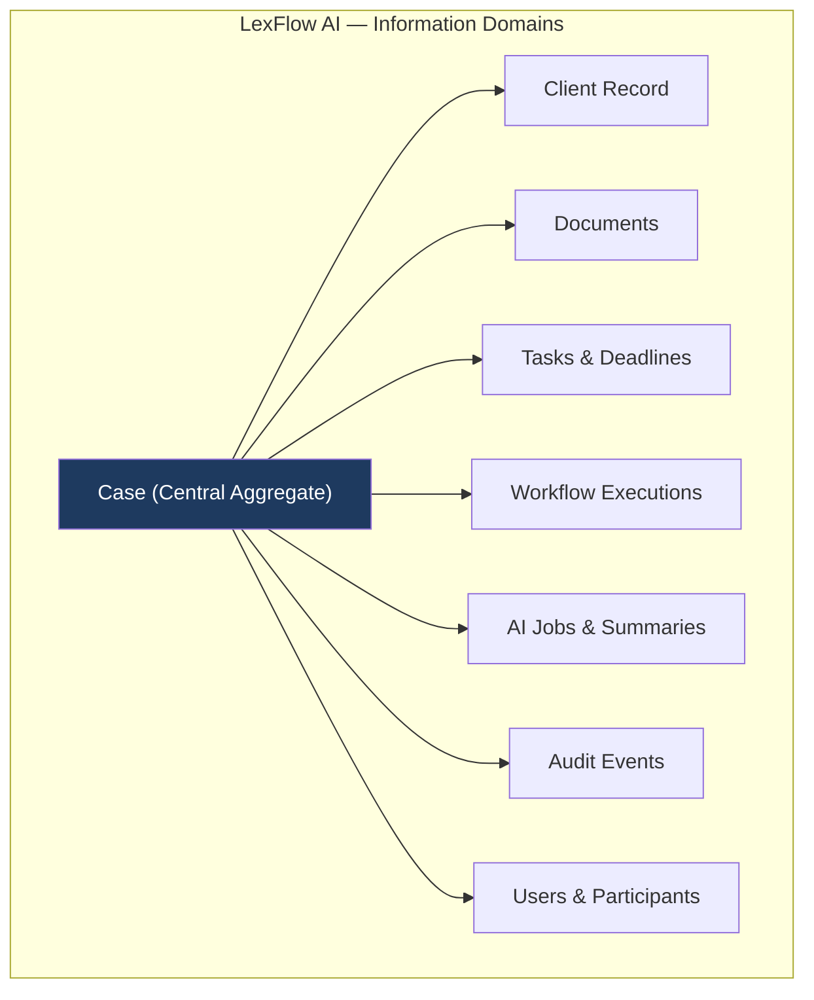

### Why Case-Centric?

| Alternative | Why Not Primary |
|-------------|-----------------|
| Client-centric | One client may have many matters; conflates relationship with active work |
| Document-centric | Documents belong to matters; firm-wide doc search is secondary discovery |
| User-centric | Users span many cases; assignment is a filter, not a container |
| Workflow-centric | Workflows orchestrate case work; they do not own case data |

---

## Content Hierarchy — Firm Dashboard

### Level 0: Application Shell

The authenticated firm application presents four persistent zones:

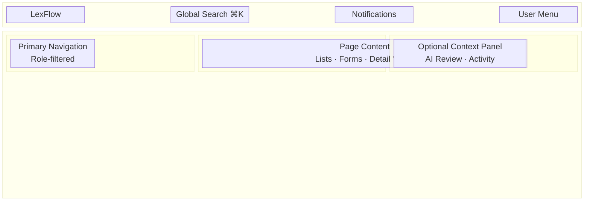

| Zone | Content Type | Update Frequency |
|------|--------------|------------------|
| Header | Global actions, search, notifications | Real-time (SSE) for notifications |
| Sidebar | Primary navigation — role-filtered | Session-stable |
| Main | Page-specific content | Per navigation |
| Context panel | Case-scoped auxiliary content | Per case selection |

### Level 1: Primary Domains

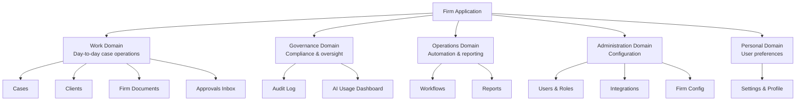

| Domain | Primary Personas | IA Principle |
|--------|------------------|--------------|
| Work | Attorney, Paralegal, Associate, Legal Assistant | Case-first; minimize clicks to active matter |
| Governance | Compliance Officer, Managing Partner | Firm-wide read; no mutation paths |
| Operations | Operations Team, Managing Partner | Template and metrics focus |
| Administration | System Admin, IT Admin | Separated from case data |
| Personal | All firm users | Decoupled from case context |

### Level 2: Case Workspace — Tab Hierarchy

Within a case, content is organized by **functional tabs** — each tab maps to API sub-resources:

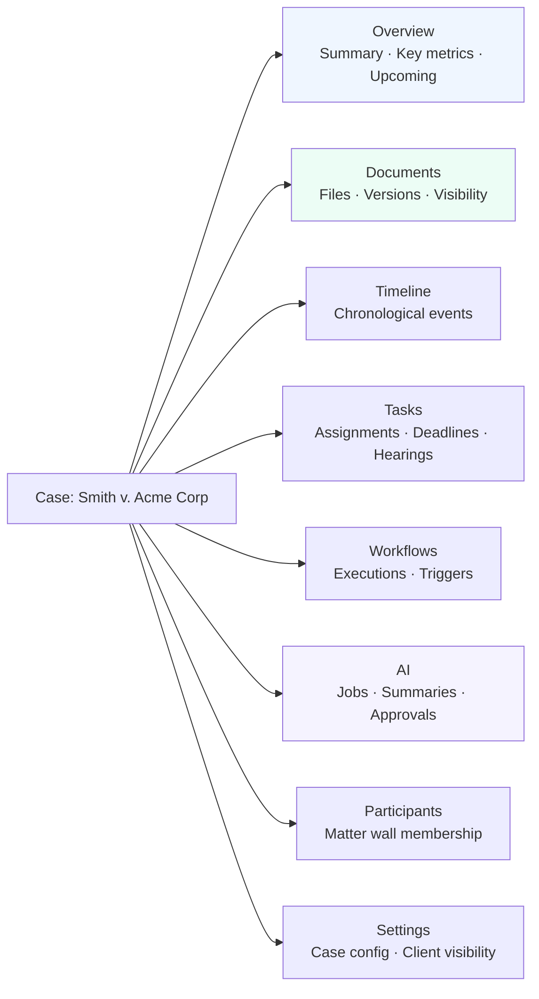

| Tab | API Root | Content Priority |
|-----|----------|------------------|
| Overview | `GET /cases/{id}` + aggregates | Status, lead, counts, next deadline |
| Documents | `GET /cases/{id}/documents` | Primary working surface for paralegals |
| Timeline | `GET /cases/{id}/timeline` | Audit-friendly event stream |
| Tasks | `GET /cases/{id}/tasks`, `/deadlines`, `/hearings` | Operational calendar |
| Workflows | `GET /cases/{id}/workflows` | Automation status |
| AI | `GET /cases/{id}/ai/jobs` | Human-in-the-loop review |
| Participants | `GET /cases/{id}/participants` | Matter wall management |
| Settings | `PATCH /cases/{id}` + client visibility | Lead attorney only |

Tab visibility is driven by **capabilities** returned in `GET /api/v1/cases/{id}` — not computed from role alone.

---

## Content Hierarchy — Client Portal

The portal uses a **flat, client-scoped** hierarchy — maximum three levels deep:

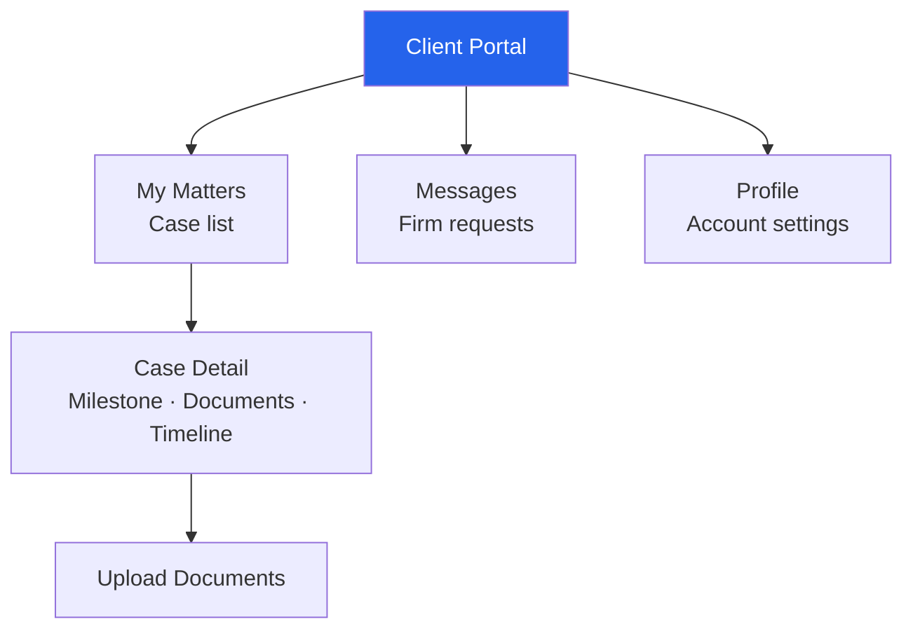

| Portal Level | Firm Equivalent | Deliberately Omitted |
|--------------|-----------------|-------------------|
| My Matters | Cases list (filtered) | Internal case numbers, other clients |
| Case Detail | Case overview + documents | AI, workflows, internal notes, participants |
| Upload | Document upload | Version history, privilege labels |
| Messages | N/A (firm-initiated requests) | Internal task assignments |

Cross-reference: [../../12-ui/client-portal.md](../../12-ui/client-portal.md).

---

## Entity Relationship — Information Model

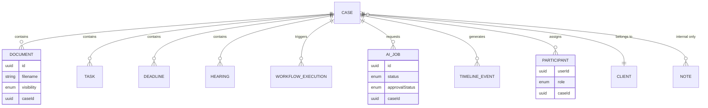

### Visibility Taxonomy (Documents & Notes)

| Level | Firm UI | Portal UI | API Field |
|-------|---------|-----------|-----------|
| Internal | Default — no badge | **Not returned** | `visibility: internal` |
| Privileged | Lock icon + left border | **Not returned** | `visibility: privileged` |
| Work product | Muted badge | **Not returned** | `visibility: work_product` |
| Client shared | Green badge | Visible in document list | `visibility: client_shared` |
| Client uploaded | "Client upload" badge | Own uploads visible | `visibility: client_uploaded` |

---

## Matter Wall UX Implications

Matter walls enforce ethical boundaries at the API layer. IA must **never leak information** about cases the user cannot access.

### MW-004: Uniform 404 Response

When a user requests a case they are not authorized to view:

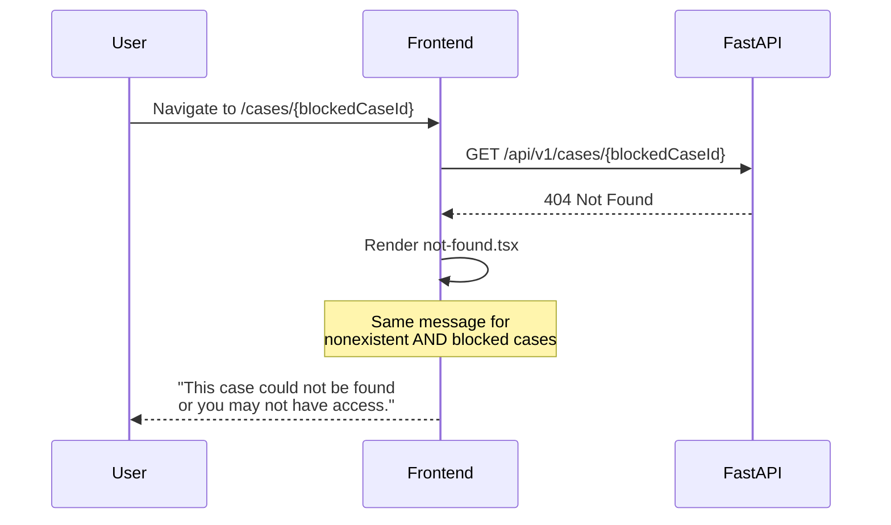

### IA Rules for Matter Walls

| Scenario | UI Behavior | Rationale |
|----------|-------------|-----------|
| Case not in list | **Never shown** — API filters list | No enumeration via list gaps |
| Direct URL to blocked case | Generic 404 page | MW-004 — no "access denied" |
| Search result for blocked case | **Not returned** in results | Server-side filter |
| Breadcrumb to removed case | 404 at case level | No partial render |
| Notification link to blocked case | 404 on follow | No toast revealing existence |
| Recently viewed (local) | Remove on 404 | Prevent stale links |

### Firm-Wide Read Exception

`ManagingPartner` and `ComplianceOfficer` with `case:read:firm` see cases they are not assigned to — but **ethical wall overrides** may still block specific cases:

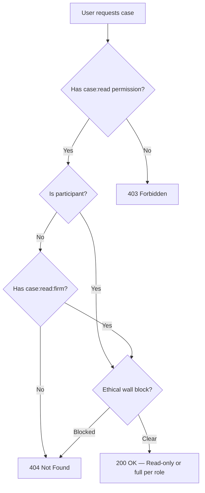

Compliance Officer IA note: firm-wide read surfaces appear in **Audit** and **Reports** — not mixed into personal case lists without explicit filter.

---

## Content Grouping by Persona

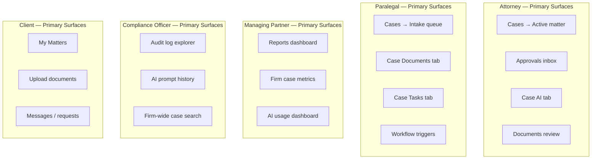

Cross-reference: [../../01-product/user-personas.md](../../01-product/user-personas.md).

---

## Search & Discovery Architecture

### Search Scopes

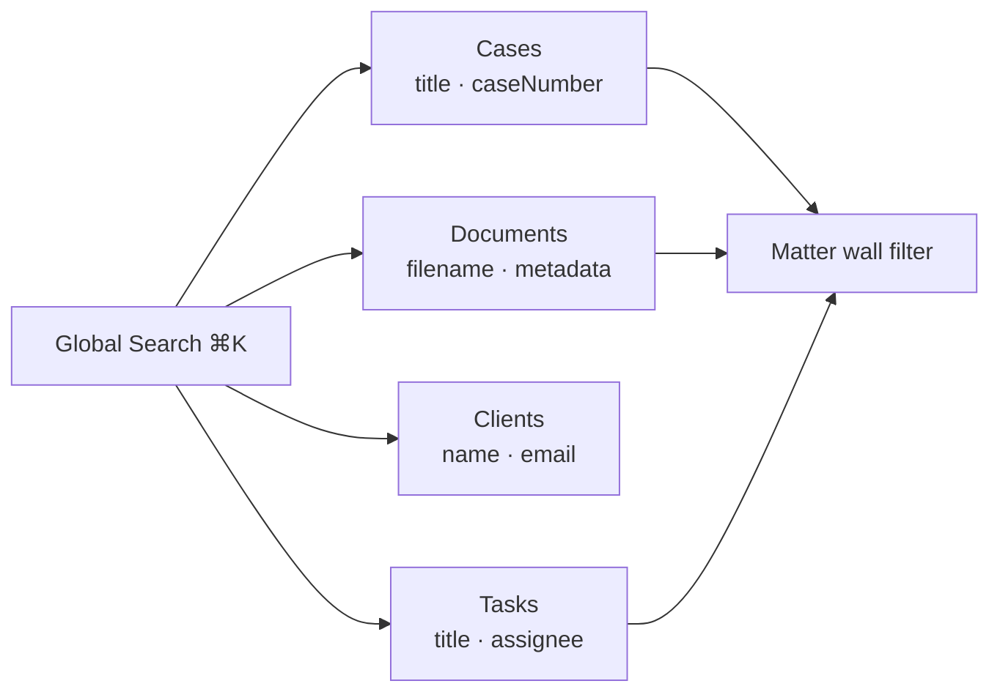

| Scope | API Endpoint | Matter Wall |
|-------|--------------|-------------|
| Cases | `GET /cases?search=` | Applied — only assigned (+ firm read) |
| Documents | `GET /documents?search=` | Applied — case-scoped |
| Clients | `GET /clients?search=` | Role-gated — not all roles |
| Tasks | `GET /tasks?search=` | Applied — assigned cases only |

Search results **never include** blocked case titles, document names, or metadata snippets from walled matters.

### Discovery Patterns

| Pattern | Location | Content |
|---------|----------|---------|
| **Assigned cases** | `/cases` default view | User's active matters |
| **Approvals queue** | `/approvals` | Pending AI + workflow approvals |
| **Upcoming deadlines** | Case overview + dashboard widget | Cross-case deadline aggregation |
| **Recent activity** | Case timeline | Per-case event stream |
| **Firm-wide audit** | `/audit` | Compliance search only |

---

## Labeling & Terminology

Consistent terminology reduces cognitive load across personas:

| Concept | Firm UI Label | Portal UI Label | Avoid |
|---------|---------------|-----------------|-------|
| Case | Case / Matter | Your Matter | Ticket, Issue, Project |
| Client | Client | — (implicit) | Customer |
| AI output | AI Draft / AI Summary | *(hidden)* | Generated text (unlabeled) |
| Workflow | Workflow | *(hidden — use Milestone)* | Automation, n8n |
| Deadline | Deadline | Important Date | Due date (ambiguous) |
| Participant | Team Member | Your Contact | User |
| Privileged doc | Privileged | *(hidden)* | Confidential (vague) |

---

## Content Density by Surface

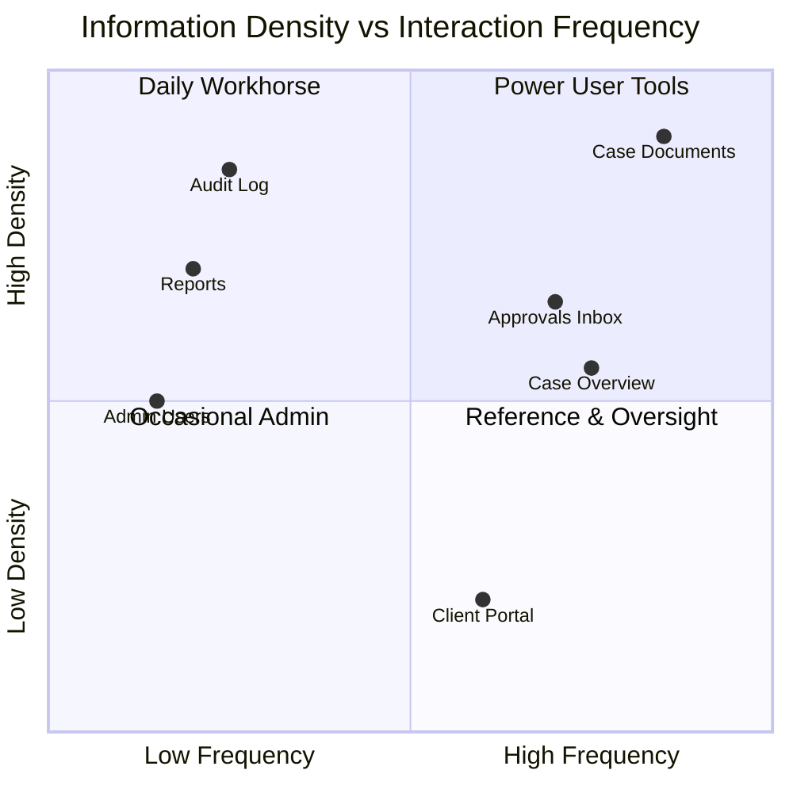

| Surface | Density Mode | Rationale |
|---------|--------------|-----------|
| Firm dashboard tables | Compact-capable | Attorneys prefer dense data |
| Client portal | Spacious (fixed) | External users, mobile-first |
| Audit log | Compact (default) | Compliance needs scanability |
| AI review panel | Comfortable | Long-form reading |

---

## IA Wireframe — Case Detail Information Zones

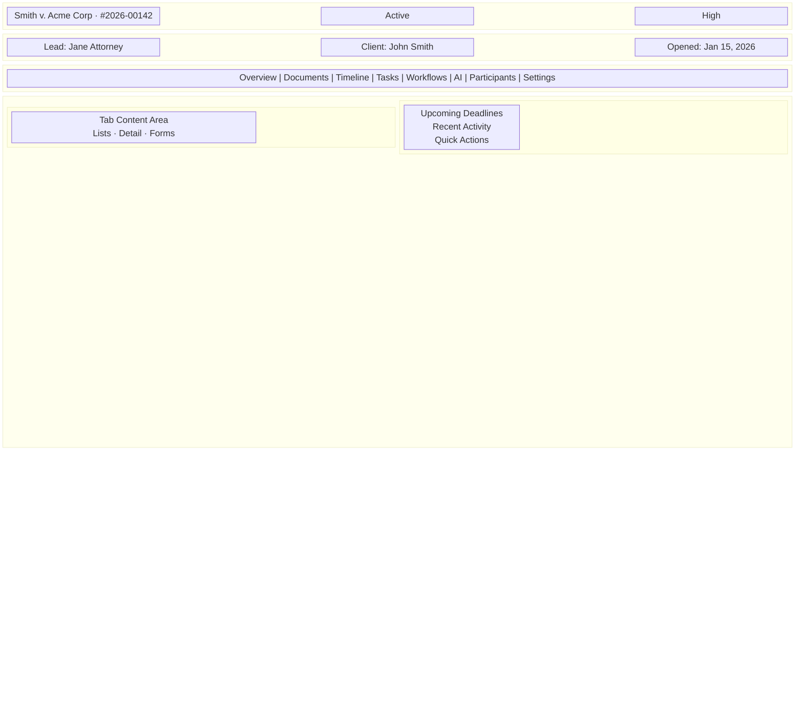

---

## Best Practices

1. **Case as URL anchor** — Deep links always include `caseId`; shareable within authorized team.
2. **API-driven tab visibility** — Never show empty tabs; omit tabs user cannot access.
3. **No phantom content** — Do not render placeholders for walled data ("Document hidden").
4. **Separate portal IA** — Client portal is not a "lite" dashboard; it is a distinct product surface.
5. **Governance isolation** — Audit and compliance surfaces do not embed in case tabs.
6. **Consistent 404 copy** — Matter wall denials use identical messaging everywhere.
7. **Search respects walls** — Global search is a discovery tool, not an enumeration vector.

---

## Tradeoffs

| Decision | Benefit | Cost |
|----------|---------|------|
| Case-centric over client-centric | Matches legal mental model | Client history requires navigation |
| Tab-based case workspace | Deep linking per concern | More layout complexity |
| Capabilities from API vs role UI | Accurate per-case permissions | Extra API field on case DTO |
| 404 for walled cases | Security (MW-004) | User confusion — mitigate with copy |
| Separate portal hierarchy | Clear external boundary | Duplicate some patterns (upload) |

---

## References

| Document | Path |
|----------|------|
| Page architecture | [../../12-ui/page-architecture.md](../../12-ui/page-architecture.md) |
| User personas | [../../01-product/user-personas.md](../../01-product/user-personas.md) |
| Authorization RBAC | [../../04-api/authorization-rbac.md](../../04-api/authorization-rbac.md) |
| Case endpoints | [../../04-api/endpoints-cases.md](../../04-api/endpoints-cases.md) |
| Client portal | [../../12-ui/client-portal.md](../../12-ui/client-portal.md) |
| Matter walls | [../../08-security/matter-walls.md](../../08-security/matter-walls.md) |
| Navigation structure | [navigation-structure.md](./navigation-structure.md) |
| Screen hierarchy | [screen-hierarchy.md](./screen-hierarchy.md) |
