# Navigation Structure — Primary, Secondary & Role-Based Menus

**LexFlow AI** — Enterprise Legal SaaS Navigation Architecture  
**Version:** 1.0  
**Status:** Draft — Pre-Implementation  
**Last Updated:** 2026-07-06

---

## Purpose

Define the **navigation architecture** for LexFlow AI — primary sidebar navigation, secondary sub-navigation, breadcrumbs, role-based menu filtering, and client portal navigation. Navigation reflects RBAC permissions from the API but does not enforce security; unauthorized direct URL access is blocked by FastAPI.

Cross-reference: [../../12-ui/page-architecture.md](../../12-ui/page-architecture.md), [../../04-api/authorization-rbac.md](../../04-api/authorization-rbac.md), [../../01-product/user-personas.md](../../01-product/user-personas.md), [information-architecture.md](./information-architecture.md).

---

## Scope

| In Scope | Out of Scope |
|----------|--------------|
| Primary sidebar structure | Middleware implementation |
| Secondary and tab navigation | Animation and transition specs |
| Breadcrumb rules | Mobile gesture navigation |
| Role-based menu visibility | Marketing site navigation |
| Portal navigation (4 items max) | Command palette internals (Phase 2) |

---

## Navigation Architecture Overview

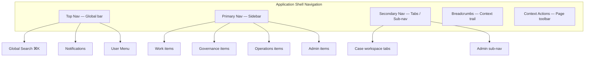

---

## Primary Navigation — Firm Dashboard

### Sidebar Structure

The sidebar is **240px fixed width** on desktop, collapsible on tablet/mobile. Items are grouped with visual separators — not nested accordion menus in Phase 1.

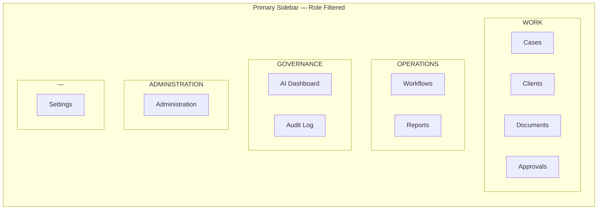

### Sidebar Wireframe

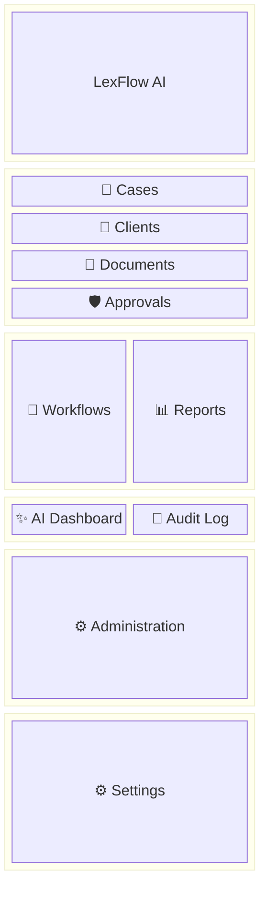

### Primary Nav Item Registry

| Item | Route | Icon | Min Permission | Default Landing |
|------|-------|------|----------------|-----------------|
| Cases | `/cases` | Briefcase | `case:read:assigned` | Attorney, Paralegal, Associate, LA |
| Clients | `/clients` | Users | `case:read:assigned` | Paralegal+ |
| Documents | `/documents` | FileText | `document:read:assigned` | Attorney, Paralegal |
| Approvals | `/approvals` | ShieldCheck | `approval:decide:assigned` OR submitter queue | Attorney |
| Workflows | `/workflows` | GitBranch | `workflow:trigger:assigned` | Operations, Paralegal |
| Reports | `/reports` | BarChart3 | `case:read:firm` | Managing Partner |
| AI Dashboard | `/ai` | Sparkles | `audit:read:firm` OR firm AI policy role | Managing Partner, Compliance |
| Audit Log | `/audit` | ScrollText | `audit:read:firm` | Compliance Officer |
| Administration | `/admin/users` | Settings2 | `admin:users:firm` OR `admin:config:firm` | System Admin, IT Admin |
| Settings | `/settings` | UserCog | Authenticated | All |

**Rule:** Hidden nav items are **not rendered** — not disabled with tooltip. Direct URL access still hits API authorization.

---

## Role-Based Menu Matrix

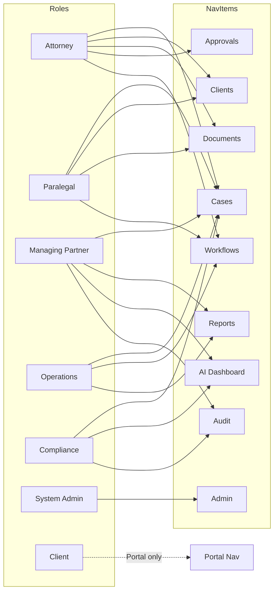

### Detailed Role Visibility

| Nav Item | SysAdmin | MngPartner | Attorney | Associate | Paralegal | LegalAsst | Ops | ITAdmin | Compliance | Client |
|----------|:--------:|:----------:|:--------:|:---------:|:---------:|:---------:|:---:|:-------:|:----------:|:------:|
| Cases | ✓ | ✓ | ✓ | ✓ | ✓ | ✓ | ✓ | | ✓ | Portal |
| Clients | ✓ | ✓ | ✓ | ✓ | ✓ | ✓ | ✓ | | ✓ | |
| Documents | ✓ | ✓ | ✓ | ✓ | ✓ | ✓ | ✓ | | ✓ | |
| Approvals | ✓ | ✓ | ✓ | | ✓* | | | | | |
| Workflows | ✓ | ✓ | ✓ | ✓ | ✓ | ✓ | ✓ | | | |
| Reports | ✓ | ✓ | | | | | ✓ | | ✓ | |
| AI Dashboard | ✓ | ✓ | | | | | | | ✓ | |
| Audit Log | ✓ | ✓ | | | | | | | ✓ | |
| Administration | ✓ | | | | | | | ✓ | | |
| Settings | ✓ | ✓ | ✓ | ✓ | ✓ | ✓ | ✓ | ✓ | ✓ | ✓ |

\* Paralegal sees Approvals for **submitted items status** — not decision actions unless permitted.

### Role-Based Default Landing

```mermaid
flowchart TD
    LOGIN[Login Success] --> JWT[Read JWT roles + permissions]
    JWT --> ROUTE{Resolve default route}

    ROUTE -->|Attorney · Associate · Paralegal · LA| CASES[/cases]
    ROUTE -->|Managing Partner| REPORTS[/reports]
    ROUTE -->|Operations Team| TEMPLATES[/workflows/templates]
    ROUTE -->|Compliance Officer| AUDIT[/audit]
    ROUTE -->|System / IT Admin| ADMIN[/admin/users]
    ROUTE -->|Client| PORTAL[/portal]
```

Cross-reference: [../../12-ui/page-architecture.md](../../12-ui/page-architecture.md#role-based-landing).

---

## Secondary Navigation

### Case Workspace Tabs

Secondary navigation within a case uses **horizontal tabs** below the case header:

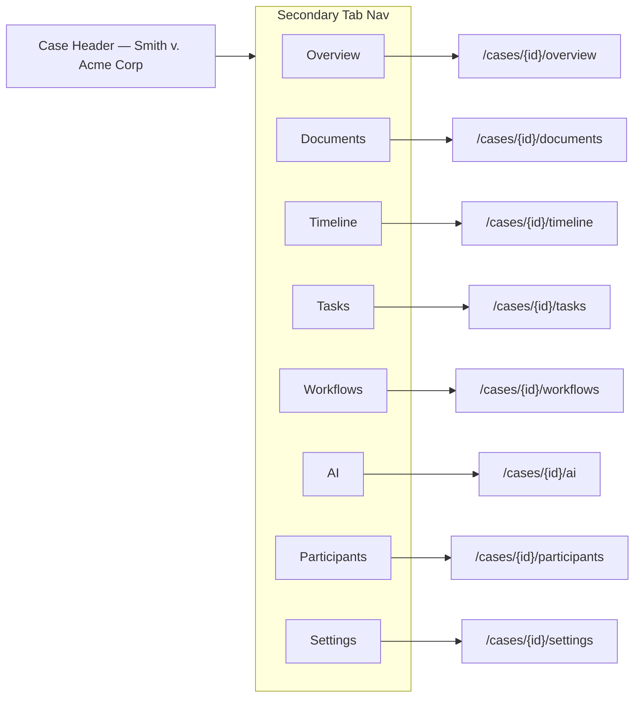

#### Tab Visibility by Capability

| Tab | Capability Flag | Route |
|-----|-----------------|-------|
| Overview | Always (if case accessible) | `/cases/[caseId]/overview` |
| Documents | `canReadDocuments` | `/cases/[caseId]/documents` |
| Timeline | `canReadTimeline` | `/cases/[caseId]/timeline` |
| Tasks | `canReadTasks` | `/cases/[caseId]/tasks` |
| Workflows | `canTriggerWorkflow` OR `canViewExecutions` | `/cases/[caseId]/workflows` |
| AI | `canRequestAI` OR `canApproveAI` | `/cases/[caseId]/ai` |
| Participants | `canReadParticipants` | `/cases/[caseId]/participants` |
| Settings | `canManageCase` | `/cases/[caseId]/settings` |

### Admin Sub-Navigation

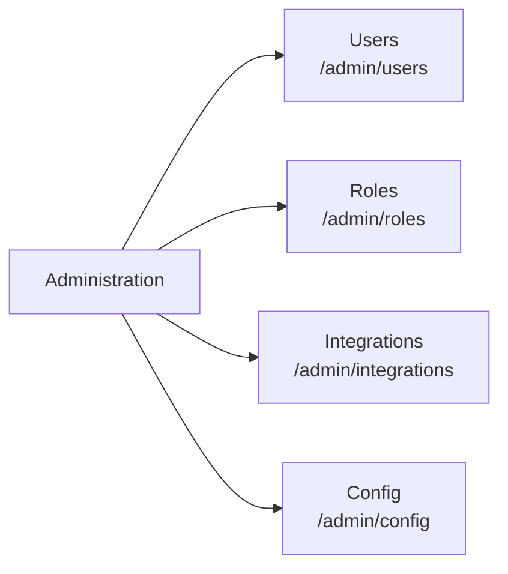

Admin layout includes a **vertical sub-nav** (left column within main content) — not additional sidebar items.

### Workflows Sub-Navigation

| Tab | Route | Primary Persona |
|-----|-------|-----------------|
| Executions | `/workflows` | All with trigger permission |
| Templates | `/workflows/templates` | Operations Team |

---

## Top Navigation Bar

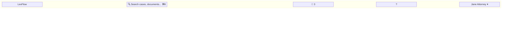

| Element | Behavior | Permission |
|---------|----------|------------|
| Logo | Link to role default home | All authenticated |
| Global search | Opens command palette | Per search scope |
| Notifications | Dropdown + link to item | All — content filtered by access |
| Help | Link to firm help / support | All |
| User menu | Profile, settings, logout | All |

### User Menu Dropdown

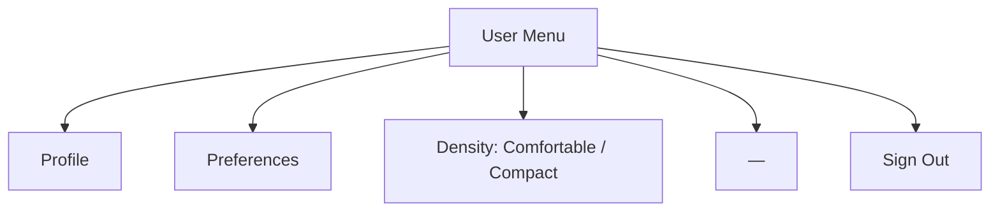

---

## Breadcrumb Architecture

### Breadcrumb Rules

| Rule | Implementation |
|------|----------------|
| Max depth | 4 levels |
| Current page | Not linked — `aria-current="page"` |
| Truncation | Middle segments collapse with `...` on narrow viewports |
| Matter wall | Breadcrumb links to walled case → 404 (same as direct nav) |
| Portal | Simpler — max 2 levels |

### Breadcrumb Patterns

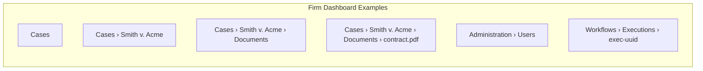

| Page | Breadcrumb Trail |
|------|------------------|
| Case list | `Cases` |
| Case overview | `Cases › {caseTitle}` |
| Case documents | `Cases › {caseTitle} › Documents` |
| Document detail | `Cases › {caseTitle} › Documents › {filename}` |
| AI job detail | `Cases › {caseTitle} › AI › {jobType}` |
| Admin users | `Administration › Users` |
| Audit log | `Audit Log` |
| Approvals | `Approvals` |

### Breadcrumb Wireframe

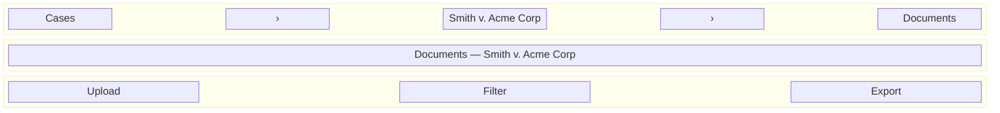

### Portal Breadcrumbs

| Page | Breadcrumb |
|------|------------|
| My Matters | *(none — page title only)* |
| Case detail | `My Matters › {clientDisplayName}` |
| Upload | `My Matters › {name} › Upload` |
| Messages | `Messages` |

---

## Client Portal Navigation

Portal navigation is intentionally **minimal** — four top-level items maximum:

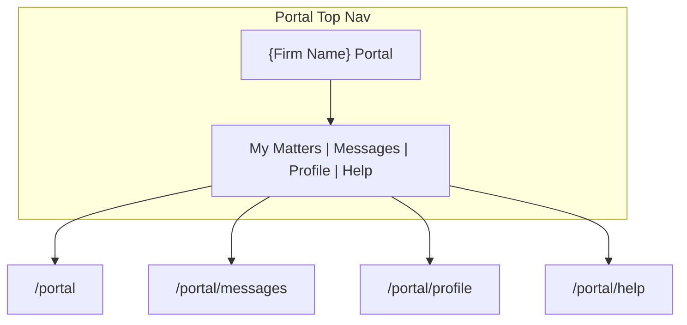

### Portal Nav Wireframe

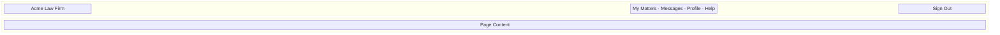

**Portal rules:**
- No sidebar — horizontal nav only
- No access to firm routes (`/cases`, `/admin`, `/audit`)
- Middleware enforces `Client` role → `(portal)/` prefix only
- Mobile: hamburger menu with same four items

---

## Navigation State & Active Indicators

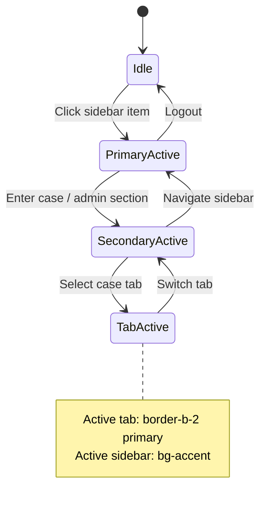

| State | Visual Treatment |
|-------|------------------|
| Primary nav active | `bg-accent text-accent-foreground` + left border |
| Secondary tab active | `border-b-2 border-primary font-medium` |
| Breadcrumb current | `text-foreground font-medium` — not linked |
| Disabled action | Not shown (preferred) or `opacity-50` with tooltip |

---

## Notification Navigation

Notifications link to context — subject to matter wall:

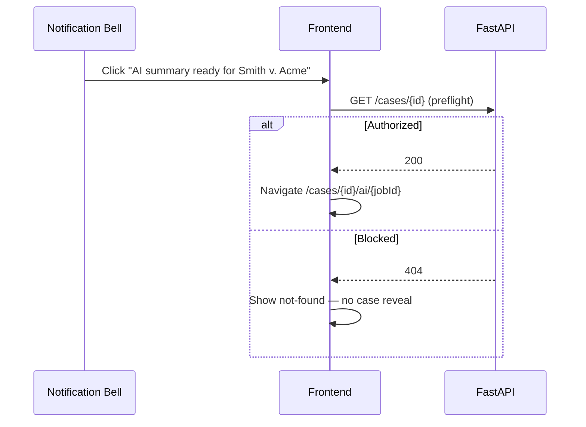

---

## Mobile & Collapsed Navigation

See [responsive-behavior.md](./responsive-behavior.md) for breakpoint details.

| Viewport | Primary Nav | Secondary Nav |
|----------|-------------|---------------|
| Desktop (≥1024px) | Fixed sidebar 240px | Horizontal tabs |
| Tablet (768–1023px) | Collapsible sidebar — icon rail or overlay | Scrollable tab bar |
| Mobile (<768px) | Sheet overlay (hamburger) | Dropdown tab selector |

### Collapsed Sidebar Wireframe

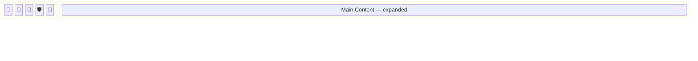

---

## Navigation Performance

| Pattern | Behavior |
|---------|----------|
| Prefetch on hover | Sidebar links prefetch route data via React Query |
| Stale nav permissions | Refresh on login and every 5 min (matches permission cache TTL) |
| Case list cache | Invalidate on SSE `case.updated` events |
| Portal nav | Static — no role variants |

---

## Best Practices

1. **Permission-driven rendering** — Nav items derived from `GET /users/me` permissions array.
2. **No security through obscurity alone** — Hidden nav + API enforcement.
3. **Stable route URLs** — UUID-based case routes; never sequential IDs in URLs.
4. **Preserve returnTo** — Login redirect preserves intended destination.
5. **Consistent tab order** — Case tabs always same sequence; omit invisible tabs without gap.
6. **Portal isolation** — Separate layout component; no shared sidebar with firm app.
7. **Keyboard navigation** — Sidebar and tabs fully keyboard accessible (see [../../12-ui/accessibility.md](../../12-ui/accessibility.md)).

---

## Tradeoffs

| Decision | Benefit | Cost |
|----------|---------|------|
| Flat sidebar vs nested tree | Faster scanning for lawyers | More items visible at once |
| Hide vs disable nav items | Cleaner UI | User may not know feature exists |
| Tab-based case nav vs single scroll page | Deep linking | More routes to maintain |
| Separate portal nav | Security clarity | Two nav patterns |
| Breadcrumb vs back button | Orientation in deep hierarchies | Redundant on mobile |

---

## References

| Document | Path |
|----------|------|
| Page architecture | [../../12-ui/page-architecture.md](../../12-ui/page-architecture.md) |
| Authorization RBAC | [../../04-api/authorization-rbac.md](../../04-api/authorization-rbac.md) |
| User personas | [../../01-product/user-personas.md](../../01-product/user-personas.md) |
| Client portal | [../../12-ui/client-portal.md](../../12-ui/client-portal.md) |
| Information architecture | [information-architecture.md](./information-architecture.md) |
| Screen hierarchy | [screen-hierarchy.md](./screen-hierarchy.md) |
| Responsive behavior | [responsive-behavior.md](./responsive-behavior.md) |
