# Responsive Behavior — Breakpoints, Layouts & Mobile Legal Workflows

**LexFlow AI** — Enterprise Legal SaaS Responsive Design Architecture  
**Version:** 1.0  
**Status:** Draft — Pre-Implementation  
**Last Updated:** 2026-07-06

---

## Purpose

Define **responsive behavior** across LexFlow AI surfaces — breakpoint system, layout adaptations, collapsible sidebar patterns, and mobile/tablet use cases for legal professionals and client portal users. Attorneys and paralegals increasingly access case status from court, client sites, and travel — responsive design is operational, not cosmetic.

Cross-reference: [../../12-ui/design-system.md](../../12-ui/design-system.md), [navigation-structure.md](./navigation-structure.md), [screen-hierarchy.md](./screen-hierarchy.md), [../../12-ui/client-portal.md](../../12-ui/client-portal.md).

---

## Scope

| In Scope | Out of Scope |
|----------|--------------|
| Breakpoint definitions and layout rules | Native mobile app (Phase 4+) |
| Collapsible sidebar behavior | Print stylesheets |
| Tablet and mobile lawyer use cases | Device-specific bug fixes |
| Portal mobile-first patterns | PWA offline mode |
| Touch target requirements | Implementation CSS |

---

## Breakpoint System

LexFlow uses Tailwind CSS default breakpoints with legal-enterprise layout conventions:

| Token | Min Width | Target Devices | Primary Use Case |
|-------|-----------|----------------|------------------|
| `(default)` | 0px | Mobile phones | Portal, quick case checks |
| `sm` | 640px | Large phones, small tablets | Portal upload, notifications |
| `md` | 768px | Tablets (iPad) | Court-side review, depositions |
| `lg` | 1024px | Laptops, small desktops | Primary firm work — sidebar visible |
| `xl` | 1280px | Desktop monitors | Full case workspace + right panel |
| `2xl` | 1536px | Ultra-wide | Max content width 1400px centered |

### Breakpoint Flow

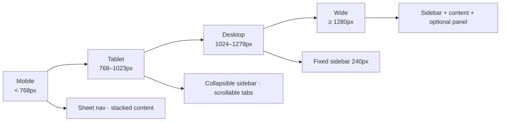

---

## Layout Adaptation Matrix

| Component | Mobile (<768px) | Tablet (768–1023px) | Desktop (≥1024px) |
|-----------|-----------------|---------------------|-------------------|
| Primary sidebar | Hidden — hamburger sheet | Collapsed icon rail OR overlay | Fixed 240px |
| Top nav | Full width — compact search | Full width | Full width |
| Case tabs | Dropdown selector | Horizontal scroll | Full tab bar |
| Data tables | Card list view | Horizontal scroll table | Full table |
| Right context panel | Bottom sheet / hidden | Collapsible drawer | Fixed 320px |
| Breadcrumbs | Truncated — last segment | Collapsed middle | Full trail |
| Command palette | Full screen | Centered modal 640px | Centered modal 640px |
| Portal nav | Hamburger menu | Horizontal links | Horizontal links |

---

## Firm Dashboard — Responsive Layouts

### Desktop (≥1024px) — Standard App Shell

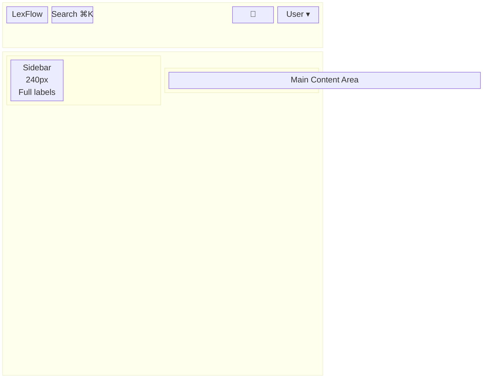

### Tablet (768–1023px) — Collapsible Sidebar

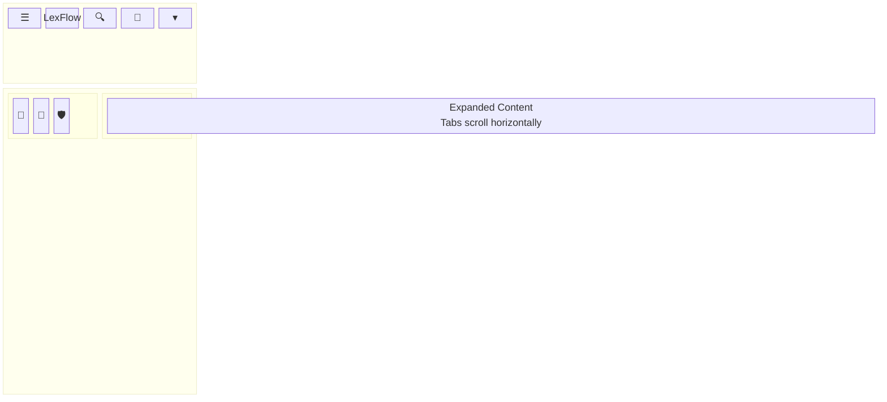

**Tablet sidebar modes:**

| Mode | Width | Trigger | Behavior |
|------|-------|---------|----------|
| Icon rail | 56px | Default on tablet | Icons only + tooltip on hover |
| Expanded overlay | 240px | Click hamburger or icon | Overlays content — dismiss on navigate |
| Hidden | 0px | User preference | Full-width content |

### Mobile (<768px) — Sheet Navigation

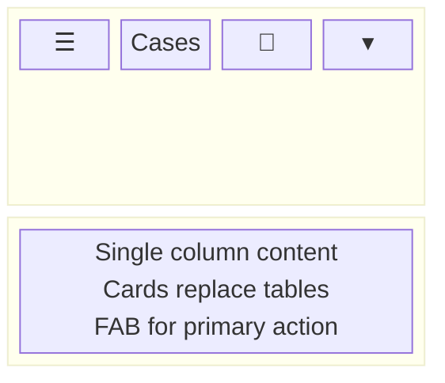

**Mobile firm app priorities (Phase 1):**
- Case list with status badges
- Case overview — key metrics only
- Notifications and approvals queue
- Document list (no inline preview — link to detail)
- **Deferred on mobile:** Audit log, admin, workflow templates, AI review editing

---

## Collapsible Sidebar — Behavior Specification

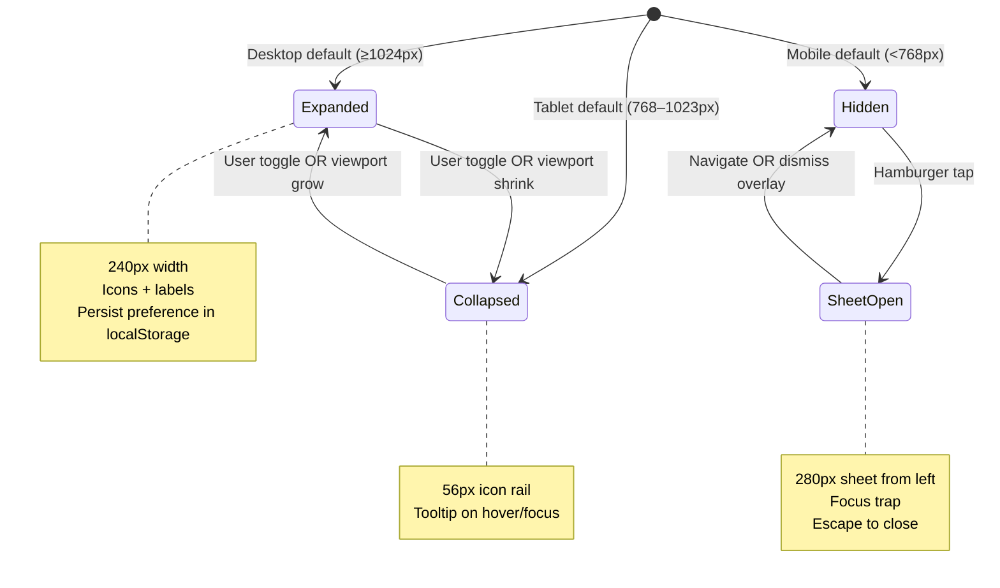

### Sidebar Collapse Interaction

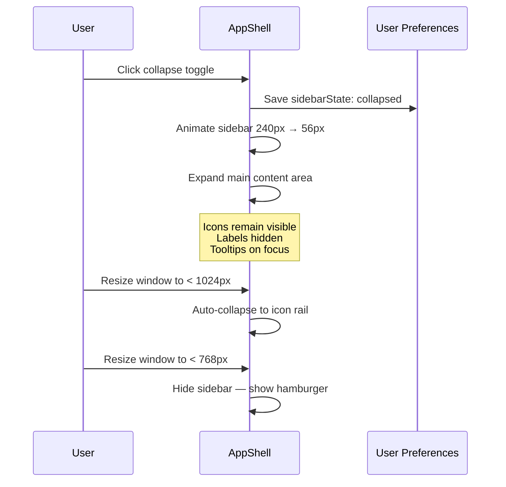

### Sidebar Wireframe — Three States

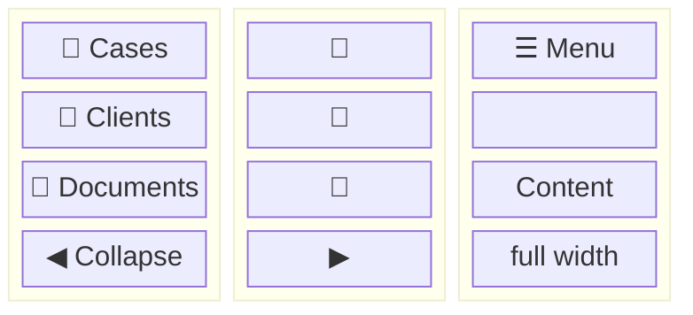

---

## Case Workspace — Responsive Adaptations

### Case Tabs by Viewport

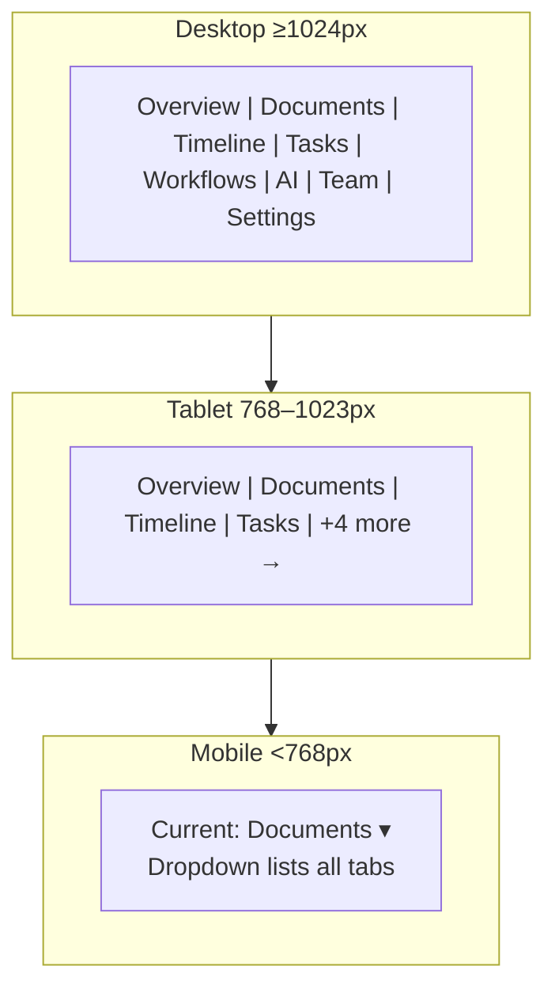

### Case Overview — Content Reflow

| Element | Desktop | Tablet | Mobile |
|---------|---------|--------|--------|
| Case header | Single row — title + status + actions | Wrapped — actions in menu | Stacked — title, status, actions menu |
| Metrics cards | 4-column grid | 2×2 grid | Single column stack |
| Upcoming deadlines | Right rail panel | Below metrics | Below metrics |
| Quick actions | Button row | Button row — scroll | FAB + overflow menu |
| Timeline preview | Side panel | Collapsed accordion | Link to full timeline tab |

### Case Workspace Wireframe — Mobile

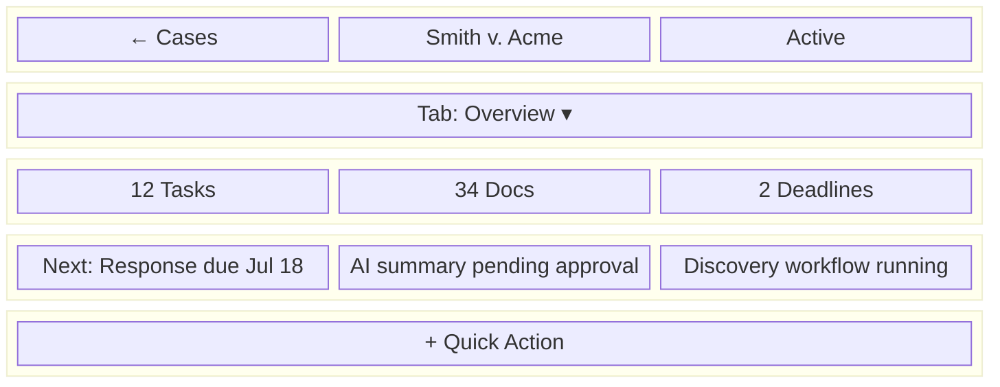

---

## Data Tables — Responsive Patterns

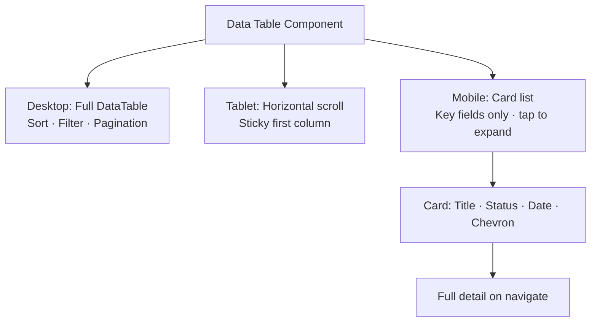

### Case List — Mobile Card Layout

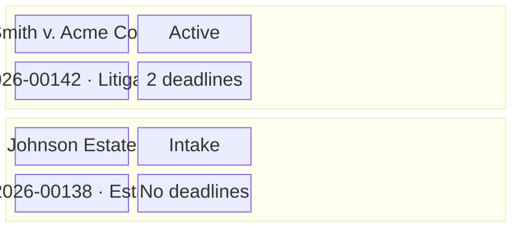

---

## Client Portal — Mobile-First

The client portal is **mobile-first by design** — clients frequently access from phones:

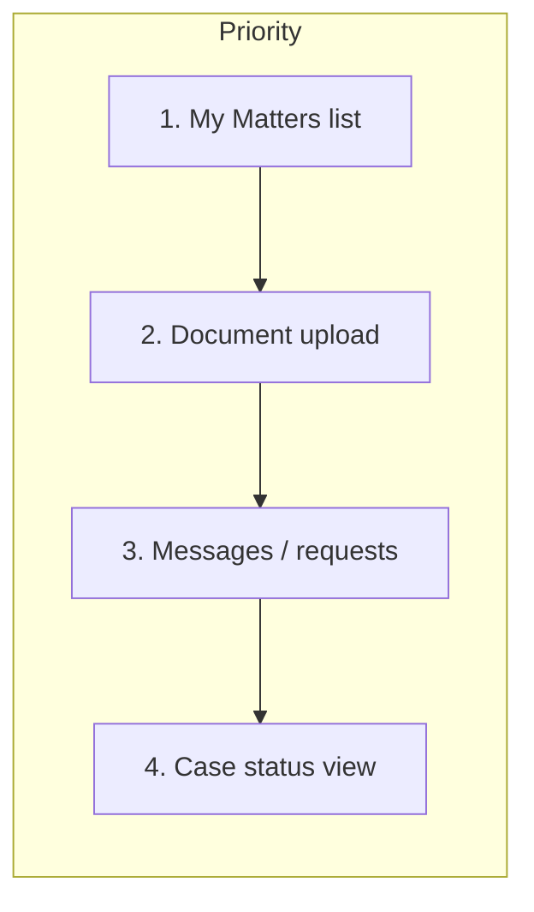

### Portal Responsive Rules

| Rule | Value | Rationale |
|------|-------|-----------|
| Base font size | 16px (all viewports) | Readability for external users |
| Touch target minimum | 44×44px | WCAG / Apple HIG |
| Upload drop zone | Full width on mobile | Primary mobile action |
| Navigation | Hamburger below `md` | Maximize content area |
| Case cards | Full width stack | Thumb-friendly scrolling |

### Portal Wireframe — Mobile

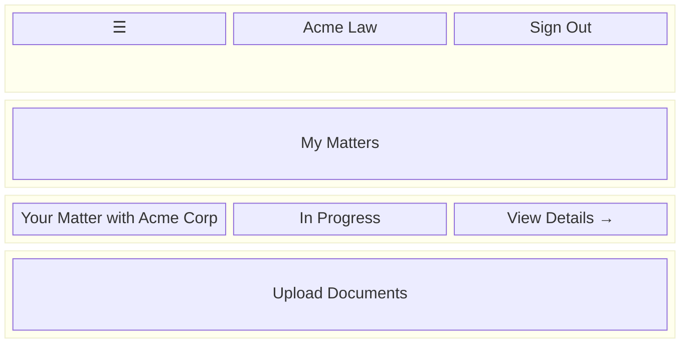

### Portal Wireframe — Desktop

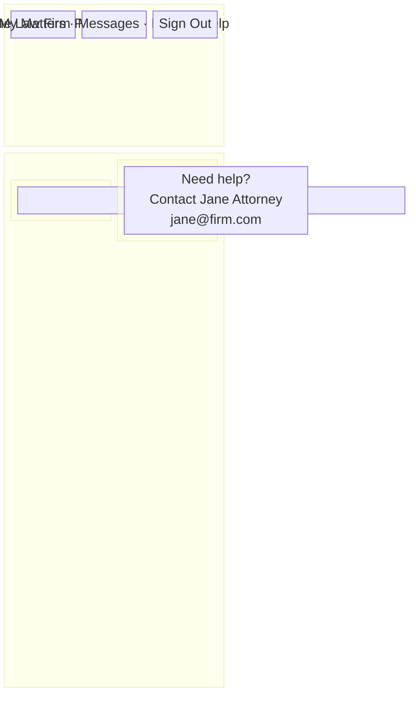

---

## Mobile Lawyer Use Cases

Legal professionals use mobile/tablet in specific contexts — design priorities reflect actual workflows:

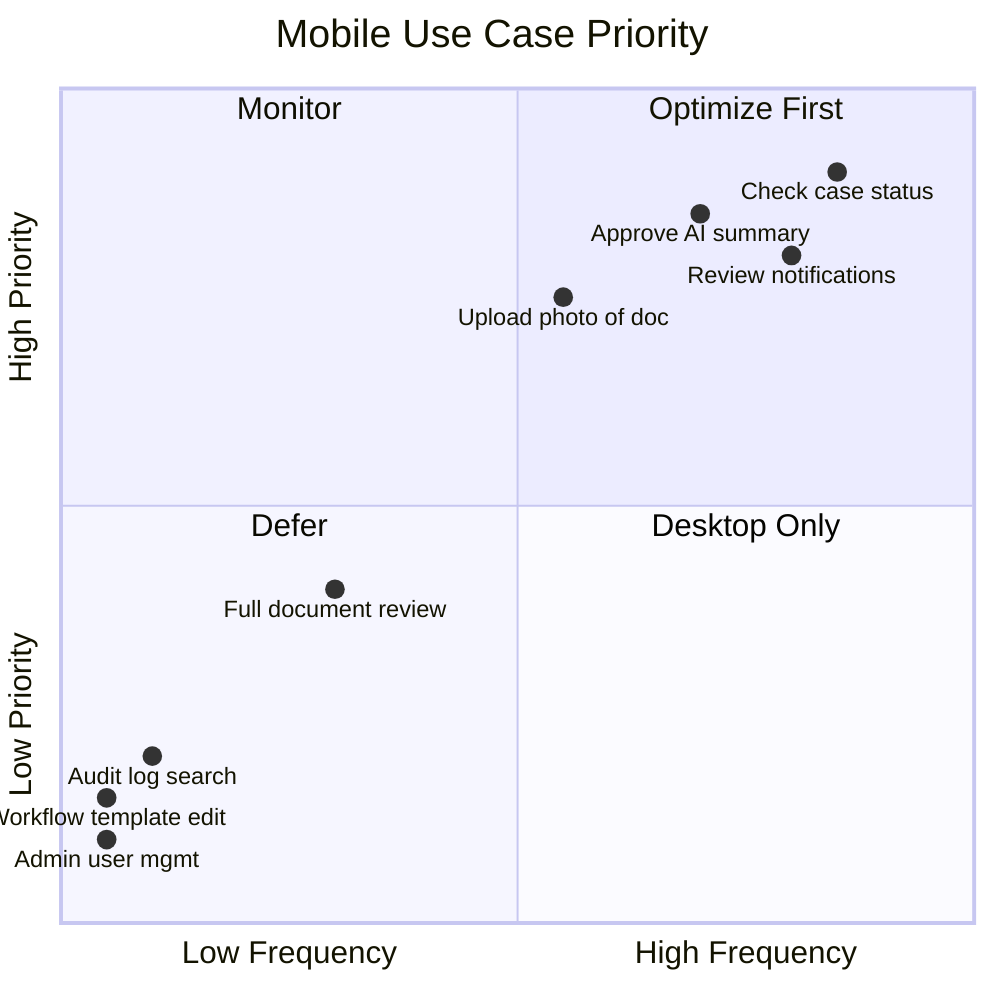

### Use Case Detail

| Scenario | Device | Priority Screens | Notes |
|----------|--------|------------------|-------|
| **Court — check deadline** | Phone | Case overview, tasks | Read-only; fast load |
| **Client dinner — approval** | Phone | Approvals inbox, AI review | Read + approve/reject |
| **Deposition — photo upload** | Tablet | Document upload | Camera integration Phase 2 |
| **Travel — notification triage** | Phone | Notifications list | Deep link to context |
| **Conference room — case review** | Tablet | Case overview, timeline | Landscape orientation |
| **Full document redline** | Desktop | Document detail | **Not mobile target** |
| **Audit investigation** | Desktop | Audit explorer | **Not mobile target** |

---

## Orientation Behavior

| Surface | Portrait | Landscape |
|---------|----------|-----------|
| Firm case list | Card stack | Optional 2-column cards |
| Document preview | Full width | Side-by-side metadata + preview (tablet+) |
| Portal upload | Full width drop zone | Same — centered max 600px |
| AI review | Single column draft | Draft + source panel (tablet+) |

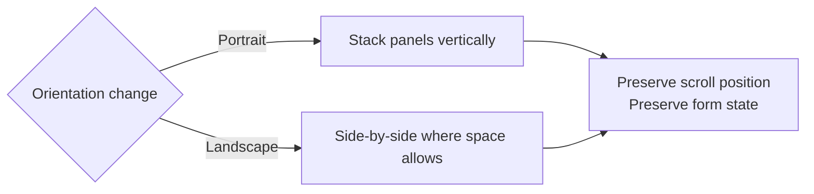

---

## Touch & Interaction Guidelines

| Pattern | Desktop | Touch Device |
|---------|---------|--------------|
| Hover prefetch | Sidebar links prefetch on hover | Prefetch on touch start |
| Tooltips | On hover | On long-press OR always visible label |
| Context menu | Right-click | Long-press OR action sheet |
| Drag-drop upload | Supported | Supported + explicit file picker button |
| Table row actions | Hover reveal | Always visible OR swipe actions (Phase 2) |
| Sidebar toggle | Click chevron | Tap hamburger |

---

## Performance Budgets by Viewport

| Viewport | Initial JS Target | Skeleton First Paint | Notes |
|----------|-------------------|----------------------|-------|
| Mobile | < 150KB gzip | < 1.5s | Defer non-critical panels |
| Tablet | < 180KB gzip | < 1.2s | Icon rail — no sidebar JS until expand |
| Desktop | < 200KB gzip | < 1.0s | Full shell — prefetch active case |

---

## Accessibility Across Breakpoints

Cross-reference: [../../12-ui/accessibility.md](../../12-ui/accessibility.md).

| Requirement | Mobile | Desktop |
|-------------|--------|---------|
| Focus trap in sheet nav | Required | N/A |
| Skip to main content | Required | Required |
| Pinch zoom | Never disabled | Never disabled |
| Minimum touch target | 44×44px | 32×32px (mouse precision) |
| Reduced motion | Respect `prefers-reduced-motion` | Same |

---

## Phase Roadmap

| Phase | Enhancement |
|-------|-------------|
| Phase 1 | Collapsible sidebar, mobile card lists, portal mobile-first |
| Phase 2 | Swipe actions on mobile tables; camera upload |
| Phase 2 | Offline indicator (no offline data) |
| Phase 3 | Dark mode — responsive tokens |
| Phase 4 | Dedicated mobile case workspace layout |
| Phase 4 | PWA install prompt for portal |

---

## Best Practices

1. **Mobile-first portal, desktop-first firm app** — Different primary devices per audience.
2. **Never hide critical actions on mobile** — Approvals and notifications remain accessible.
3. **Preserve state on resize** — Form inputs, scroll position, tab selection survive orientation change.
4. **Test at 320px width** — Minimum supported viewport.
5. **Sheet nav focus trap** — Keyboard and screen reader must work in mobile menu.
6. **Tables degrade gracefully** — Card list is not a truncated table — it's a purpose-built mobile view.
7. **Defer desktop-only surfaces** — Audit and admin redirect to "best on desktop" notice on mobile (optional link).

---

## Tradeoffs

| Decision | Benefit | Cost |
|----------|---------|------|
| Icon rail on tablet vs hidden | Faster nav for power users | Uses 56px horizontal space |
| Card list vs horizontal scroll table on mobile | Readable without zoom | Loses column scanability |
| Mobile AI review read-only vs full | Faster Phase 1 ship | Approve requires desktop for long edits |
| Portal mobile-first | Matches client behavior | Different patterns from firm app |
| localStorage sidebar preference | Persists user choice | SSR flash on first load |

---

## References

| Document | Path |
|----------|------|
| Design system | [../../12-ui/design-system.md](../../12-ui/design-system.md) |
| Navigation structure | [navigation-structure.md](./navigation-structure.md) |
| Screen hierarchy | [screen-hierarchy.md](./screen-hierarchy.md) |
| Client portal | [../../12-ui/client-portal.md](../../12-ui/client-portal.md) |
| Accessibility | [../../12-ui/accessibility.md](../../12-ui/accessibility.md) |
| UX guidelines | [ux-guidelines.md](./ux-guidelines.md) |
