# Screen Hierarchy — Complete Route & Screen Map

**LexFlow AI** — Enterprise Legal SaaS Screen Inventory  
**Version:** 1.0  
**Status:** Draft — Pre-Implementation  
**Last Updated:** 2026-07-06

---

## Purpose

Provide the **complete screen map** for LexFlow AI — every major route, layout boundary, and screen relationship across the firm dashboard, authentication flows, and client portal. This document is the visual companion to [../../12-ui/page-architecture.md](../../12-ui/page-architecture.md).

Cross-reference: [information-architecture.md](./information-architecture.md), [navigation-structure.md](./navigation-structure.md), [../../01-product/user-personas.md](../../01-product/user-personas.md), [../../04-api/](../../04-api/).

---

## Scope

| In Scope | Out of Scope |
|----------|--------------|
| All major routes and screens | Component-level specs |
| Layout group boundaries | API implementation |
| Modal and intercepting routes (Phase 1) | E2E test definitions |
| Screen-to-API mapping summary | n8n workflow screens |

---

## Master Screen Tree

```mermaid
flowchart TB
    ROOT["LexFlow AI — apps/web"]

    ROOT --> AUTH["(auth)/ — Public"]
    ROOT --> DASH["(dashboard)/ — Firm Users"]
    ROOT --> PORTAL["(portal)/ — Client Users"]
    ROOT --> BFF["api/ — BFF Handlers"]
    ROOT --> GLOBAL["Global Boundaries<br/>not-found · error"]

    AUTH --> A1["/login"]
    AUTH --> A2["/reset-password"]
    AUTH --> A3["/accept-invite"]

    DASH --> D0["/ — Role redirect"]
    DASH --> CASES["/cases/*"]
    DASH --> CLIENTS["/clients/*"]
    DASH --> DOCS["/documents"]
    DASH --> WF["/workflows/*"]
    DASH --> APPROVALS["/approvals"]
    DASH --> AI["/ai"]
    DASH --> AUDIT["/audit"]
    DASH --> REPORTS["/reports"]
    DASH --> ADMIN["/admin/*"]
    DASH --> SETTINGS["/settings/*"]

    PORTAL --> P0["/portal"]
    PORTAL --> PCASES["/portal/cases/*"]
    PORTAL --> PMSG["/portal/messages"]
    PORTAL --> PINTAKE["/portal/intake/*"]
    PORTAL --> PPROF["/portal/profile"]

    BFF --> B1["/api/auth/refresh"]
    BFF --> B2["/api/events/stream"]
```

---

## Route Group Screen Inventory

### `(auth)` — Authentication Screens

| Screen | Route | Layout | Primary API |
|--------|-------|--------|-------------|
| Login | `/login` | Auth card — centered | `POST /api/v1/auth/login` |
| Reset Password | `/reset-password` | Auth card | `POST /api/v1/auth/reset-password` |
| Accept Invite | `/accept-invite` | Auth card | `POST /api/v1/auth/accept-invite` |

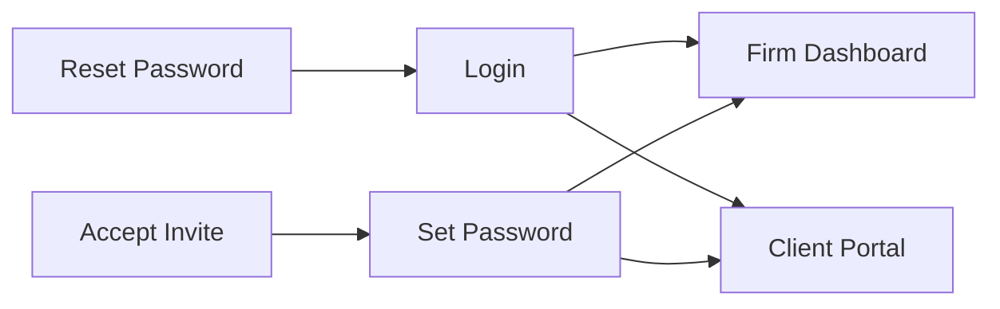

---

### `(dashboard)` — Firm Application Screens

#### Top-Level Screens

| Screen | Route | Personas | API Dependencies |
|--------|-------|----------|------------------|
| Home redirect | `/` | All firm | Session role resolution |
| Case list | `/cases` | All assigned roles | `GET /cases` |
| Create case | `/cases/new` | Paralegal+ | `POST /cases` |
| Client list | `/clients` | Paralegal+ | `GET /clients` |
| Client detail | `/clients/[clientId]` | Paralegal+ | `GET /clients/{id}` |
| Firm documents | `/documents` | Attorney, Paralegal, Ops | `GET /documents` |
| Workflow executions | `/workflows` | Trigger roles | `GET /workflows/executions` |
| Workflow templates | `/workflows/templates` | Operations, SysAdmin | `GET /workflows/definitions` |
| Execution detail | `/workflows/executions/[id]` | Trigger roles | `GET /workflows/executions/{id}` |
| Approvals inbox | `/approvals` | Attorney+ | `GET /approvals` |
| AI dashboard | `/ai` | MP, Compliance | `GET /ai/usage` |
| Audit log | `/audit` | Compliance, MP | `GET /audit/logs` |
| Reports | `/reports` | MP, Operations | `GET /reports/*` |
| User settings | `/settings` | All | `GET /users/me` |
| User profile | `/settings/profile` | All | `PATCH /users/me` |

#### Admin Screens

| Screen | Route | Personas | API |
|--------|-------|----------|-----|
| Users | `/admin/users` | SysAdmin, ITAdmin | `GET /admin/users` |
| Roles | `/admin/roles` | SysAdmin | `GET /admin/roles` |
| Integrations | `/admin/integrations` | SysAdmin, ITAdmin | `GET /admin/integrations` |
| Firm config | `/admin/config` | SysAdmin | `GET /admin/config` |

---

### Case Workspace — Nested Screen Tree

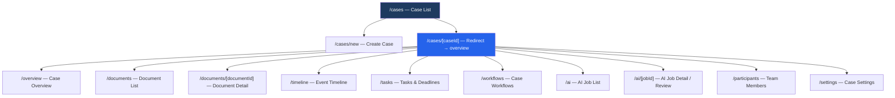

#### Case Screen Detail

| Screen | Route | Key UI Elements | API |
|--------|-------|-----------------|-----|
| Case overview | `/cases/[id]/overview` | Status, metrics, upcoming deadlines, quick actions | `GET /cases/{id}` |
| Document list | `/cases/[id]/documents` | Filterable table, upload, visibility badges | `GET /cases/{id}/documents` |
| Document detail | `/cases/[id]/documents/[docId]` | Preview, metadata, version history, share | `GET /cases/{id}/documents/{docId}` |
| Timeline | `/cases/[id]/timeline` | Infinite scroll event feed | `GET /cases/{id}/timeline` |
| Tasks | `/cases/[id]/tasks` | Task list, deadline calendar, hearings | `GET /tasks`, `/deadlines`, `/hearings` |
| Workflows | `/cases/[id]/workflows` | Trigger panel, execution history | `GET /cases/{id}/workflows` |
| AI list | `/cases/[id]/ai` | Job queue, status filters | `GET /cases/{id}/ai/jobs` |
| AI review | `/cases/[id]/ai/[jobId]` | Draft viewer, approve/reject, disclaimer | `GET /ai/jobs/{id}` |
| Participants | `/cases/[id]/participants` | Member list, add/remove | `GET /cases/{id}/participants` |
| Case settings | `/cases/[id]/settings` | Client visibility, display name | `PATCH /cases/{id}` |

---

### `(portal)` — Client Portal Screens

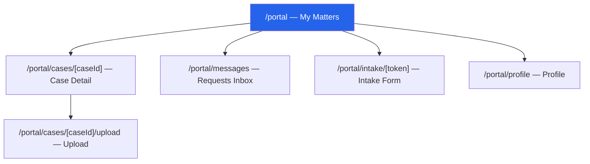

| Screen | Route | Key Elements | API |
|--------|-------|--------------|-----|
| My Matters | `/portal` | Case cards, milestone badges | `GET /portal/cases` |
| Case detail | `/portal/cases/[id]` | Status, contact, shared docs, timeline | `GET /portal/cases/{id}` |
| Upload | `/portal/cases/[id]/upload` | Drag-drop, progress, confirm | Presigned upload flow |
| Messages | `/portal/messages` | Firm requests, respond action | `GET /portal/messages` |
| Intake | `/portal/intake/[token]` | Dynamic form from schema | `GET/POST /portal/intake/{token}` |
| Profile | `/portal/profile` | Name, password, notifications | `GET/PATCH /portal/profile` |

---

## Layout Hierarchy Diagram

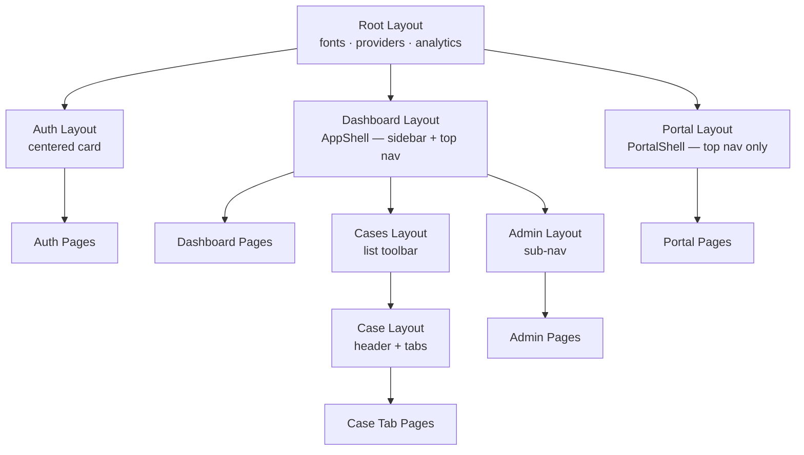

---

## Screen Relationship Map — Firm User Flow

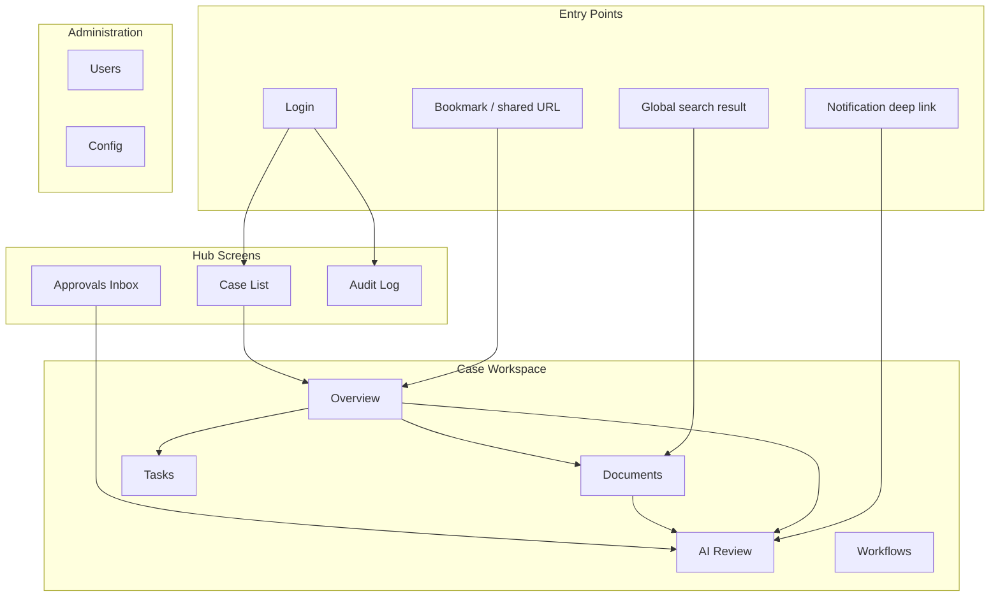

---

## Screen-to-Persona Matrix

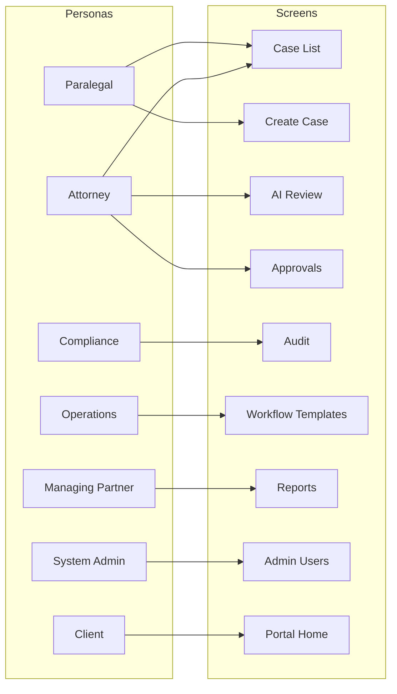

| Screen | Attorney | Associate | Paralegal | LA | MP | Ops | Compliance | SysAdmin | Client |
|--------|:--------:|:---------:|:---------:|:--:|:--:|:---:|:----------:|:--------:|:------:|
| Case list | ✓ | ✓ | ✓ | ✓ | ✓ | ✓ | ✓ | ✓ | Portal |
| Create case | ✓ | ✓ | ✓ | ✓ | ✓ | ✓ | | ✓ | |
| AI review | ✓ | view | view | | ✓ | | ✓ | ✓ | |
| Approvals decide | ✓ | | | | ✓ | | | ✓ | |
| Audit log | | | | | ✓ | | ✓ | ✓ | |
| WF templates | | | | | ✓ | ✓ | | ✓ | |
| Admin | | | | | | | | ✓ | |
| Portal | | | | | | | | | ✓ |

---

## Modal & Overlay Screens (Phase 1)

| Screen | Pattern | Route Fallback |
|--------|---------|----------------|
| Create case modal | Intercepting `@modal` | `/cases/new` full page |
| Document quick preview | Parallel `@modal` | Document detail page |
| Confirm destructive action | Dialog overlay | N/A — inline |
| Add participant | Dialog overlay | N/A — inline |
| Trigger workflow | Sheet overlay | N/A — inline |

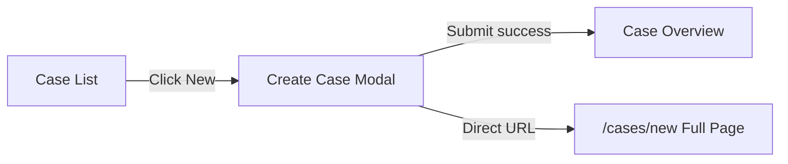

---

## Error & Boundary Screens

| Screen | Trigger | Route Context |
|--------|---------|---------------|
| Global 404 | Unknown route | `not-found.tsx` |
| Case 404 | Matter wall / missing case | `cases/[caseId]/not-found.tsx` |
| Global error | Unhandled exception | `error.tsx` |
| Case error | Case fetch failure | `cases/[caseId]/error.tsx` |
| Loading skeleton | Route transition | `loading.tsx` per segment |

---

## App Shell Wireframe — Firm Dashboard

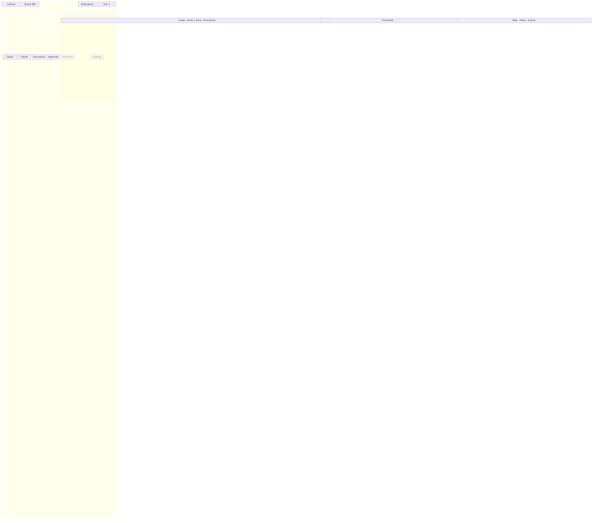

---

## App Shell Wireframe — Client Portal

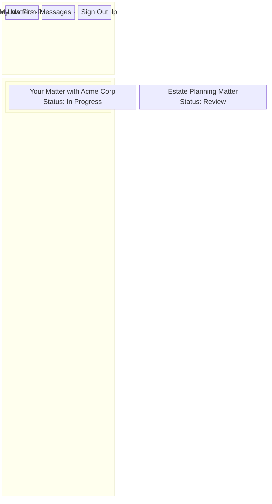

---

## Case Workspace Wireframe

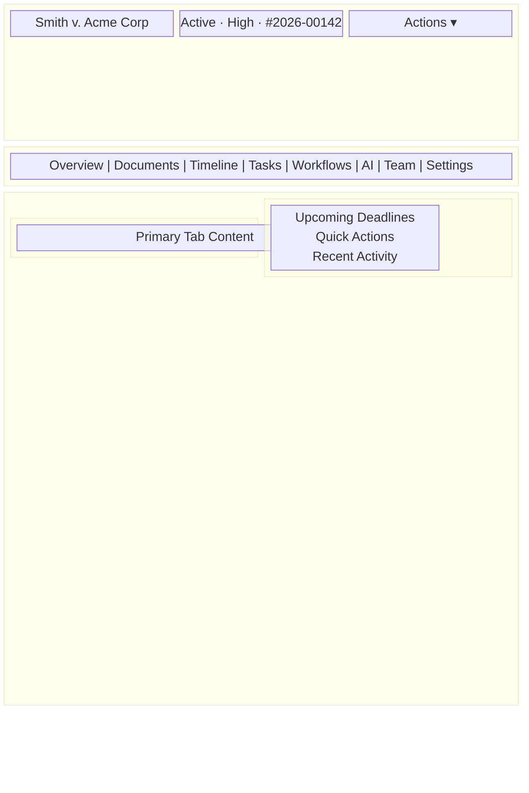

---

## Screen Count Summary

| Route Group | Screen Count | Nested Depth |
|-------------|:------------:|:------------:|
| `(auth)` | 3 | 1 |
| `(dashboard)` top-level | 14 | 1 |
| `(dashboard)` case workspace | 11 | 3 |
| `(dashboard)` admin | 4 | 2 |
| `(portal)` | 6 | 2 |
| BFF handlers | 2 | 1 |
| **Total major screens** | **~40** | **Max 4** |

---

## API Screen Mapping Summary

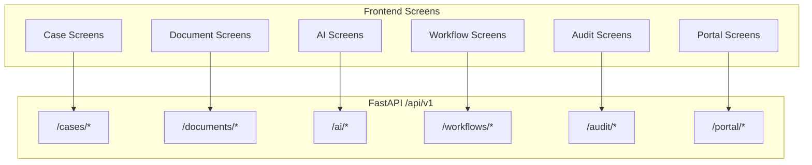

Cross-reference: [../../04-api/endpoints-cases.md](../../04-api/endpoints-cases.md), [../../04-api/endpoints-documents.md](../../04-api/endpoints-documents.md), [../../04-api/endpoints-ai.md](../../04-api/endpoints-ai.md), [../../04-api/endpoints-workflows.md](../../04-api/endpoints-workflows.md).

---

## Best Practices

1. **One screen per route** — Avoid multi-view SPA patterns without URL state.
2. **Colocate screen components** — Route-specific components under route directory.
3. **Consistent case header** — Shared layout across all case tabs.
4. **Portal screen isolation** — No imports from `(dashboard)/` into `(portal)/`.
5. **404 at case level** — Matter wall uses case-scoped `not-found.tsx`.
6. **Loading skeletons match layout** — Each major screen has shape-matched skeleton.

---

## References

| Document | Path |
|----------|------|
| Page architecture | [../../12-ui/page-architecture.md](../../12-ui/page-architecture.md) |
| Information architecture | [information-architecture.md](./information-architecture.md) |
| Navigation structure | [navigation-structure.md](./navigation-structure.md) |
| User journeys | [user-journeys.md](./user-journeys.md) |
| Client portal | [../../12-ui/client-portal.md](../../12-ui/client-portal.md) |
| API index | [../../04-api/README.md](../../04-api/README.md) |
