# User Journeys — Key Flows & Interaction Diagrams

**LexFlow AI** — Enterprise Legal SaaS User Journey Documentation  
**Version:** 1.0  
**Status:** Draft — Pre-Implementation  
**Last Updated:** 2026-07-06

---

## Purpose

Document **eight or more critical user journeys** across LexFlow AI personas — from case intake through AI approval, workflow automation, compliance audit, and client portal interactions. Each journey includes Mermaid journey maps, sequence diagrams, touchpoint tables, and success criteria aligned with [../../01-product/user-personas.md](../../01-product/user-personas.md).

Cross-reference: [screen-hierarchy.md](./screen-hierarchy.md), [../../04-api/](../../04-api/), [../../12-ui/page-architecture.md](../../12-ui/page-architecture.md), [ux-guidelines.md](./ux-guidelines.md).

---

## Scope

| In Scope | Out of Scope |
|----------|--------------|
| End-to-end user journeys with diagrams | Automated test scripts |
| Persona attribution per journey | n8n internal orchestration detail |
| API touchpoints per step | Email notification templates |
| Error and edge paths | Third-party DMS migration |

---

## Journey Index

| # | Journey | Primary Persona | Entry Point |
|---|---------|-----------------|-------------|
| 1 | Case intake | Paralegal, Legal Assistant | `/cases/new` |
| 2 | Document upload (firm) | Paralegal, Associate | Case documents tab |
| 3 | AI summary request & approval | Associate → Attorney | Case AI tab |
| 4 | Workflow trigger | Paralegal, Operations | Case workflows tab |
| 5 | Deadline management | Paralegal, Attorney | Case tasks tab |
| 6 | Audit log review | Compliance Officer | `/audit` |
| 7 | Client portal — upload & status | Client | `/portal` |
| 8 | Global search & discovery | All firm users | `⌘K` command palette |
| 9 | Approvals inbox triage | Attorney | `/approvals` |
| 10 | Client intake via invite token | Client | `/portal/intake/{token}` |

---

## Journey 1 — Case Intake

**Persona:** Paralegal (Pat), Legal Assistant  
**Goal:** Create a new case from client information in under one hour  
**Success criteria:** Case created with lead attorney assigned; intake workflow triggered

### Journey Map

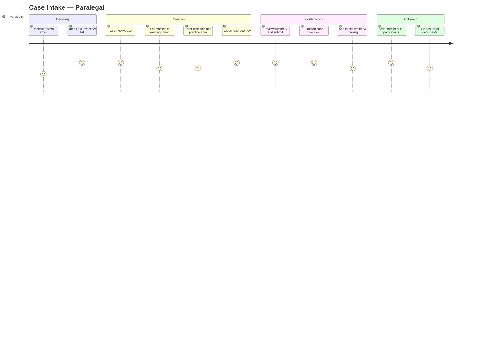
```mermaid
journey
    title Case Intake — Paralegal
    section Discovery
      Receive referral email: 3: Paralegal
      Open LexFlow cases list: 5: Paralegal
    section Creation
      Click New Case: 5: Paralegal
      Search/select existing client: 4: Paralegal
      Enter case title and practice area: 4: Paralegal
      Assign lead attorney: 5: Paralegal
    section Confirmation
      Review summary and submit: 5: Paralegal
      Land on case overview: 5: Paralegal
      See intake workflow running: 4: Paralegal
    section Follow-up
      Add paralegal to participants: 5: Paralegal
      Upload initial documents: 4: Paralegal
```

### Sequence Diagram

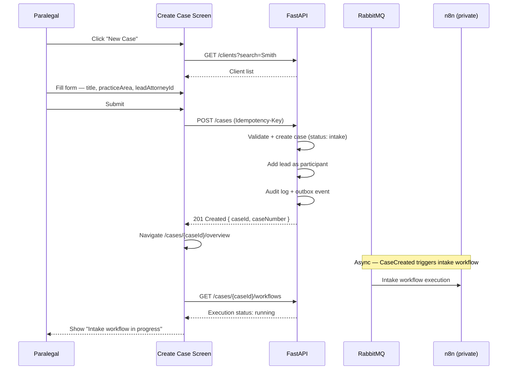
```mermaid
sequenceDiagram
    participant P as Paralegal
    participant UI as Create Case Screen
    participant API as FastAPI
    participant MQ as RabbitMQ
    participant N8N as n8n (private)

    P->>UI: Click "New Case"
    UI->>API: GET /clients?search=Smith
    API-->>UI: Client list
    P->>UI: Fill form — title, practiceArea, leadAttorneyId
    P->>UI: Submit
    UI->>API: POST /cases (Idempotency-Key)
    API->>API: Validate + create case (status: intake)
    API->>API: Add lead as participant
    API->>API: Audit log + outbox event
    API-->>UI: 201 Created { caseId, caseNumber }
    UI->>UI: Navigate /cases/{caseId}/overview
    Note over MQ,N8N: Async — CaseCreated triggers intake workflow
    MQ->>N8N: Intake workflow execution
    UI->>API: GET /cases/{caseId}/workflows
    API-->>UI: Execution status: running
    UI-->>P: Show "Intake workflow in progress"
```

### Touchpoints

| Step | Screen | API | Error Path |
|------|--------|-----|------------|
| Open create | `/cases/new` | — | 403 if no `case:create` |
| Client search | Combobox | `GET /clients?search=` | Empty — offer create client |
| Submit | Form | `POST /cases` | 422 validation → inline errors |
| Redirect | Case overview | `GET /cases/{id}` | 404 if wall blocks (unlikely on create) |

---

## Journey 2 — Document Upload (Firm)

**Persona:** Paralegal, Associate Attorney  
**Goal:** Upload case documents with correct visibility; searchable within 5 minutes  
**Success criteria:** Document appears in case list with processing complete

### Journey Map

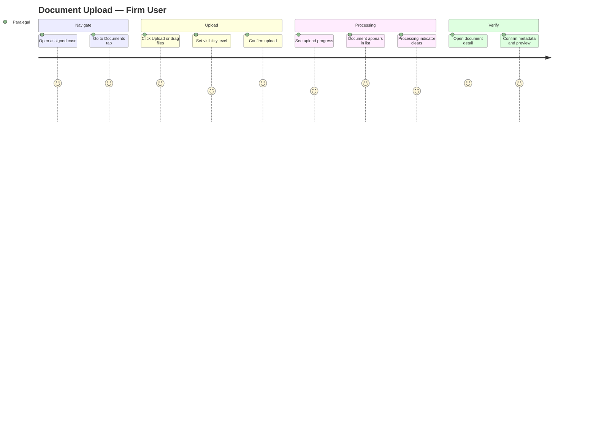
```mermaid
journey
    title Document Upload — Firm User
    section Navigate
      Open assigned case: 5: Paralegal
      Go to Documents tab: 5: Paralegal
    section Upload
      Click Upload or drag files: 5: Paralegal
      Set visibility level: 4: Paralegal
      Confirm upload: 5: Paralegal
    section Processing
      See upload progress: 4: Paralegal
      Document appears in list: 5: Paralegal
      Processing indicator clears: 4: Paralegal
    section Verify
      Open document detail: 5: Paralegal
      Confirm metadata and preview: 5: Paralegal
```

### Sequence Diagram

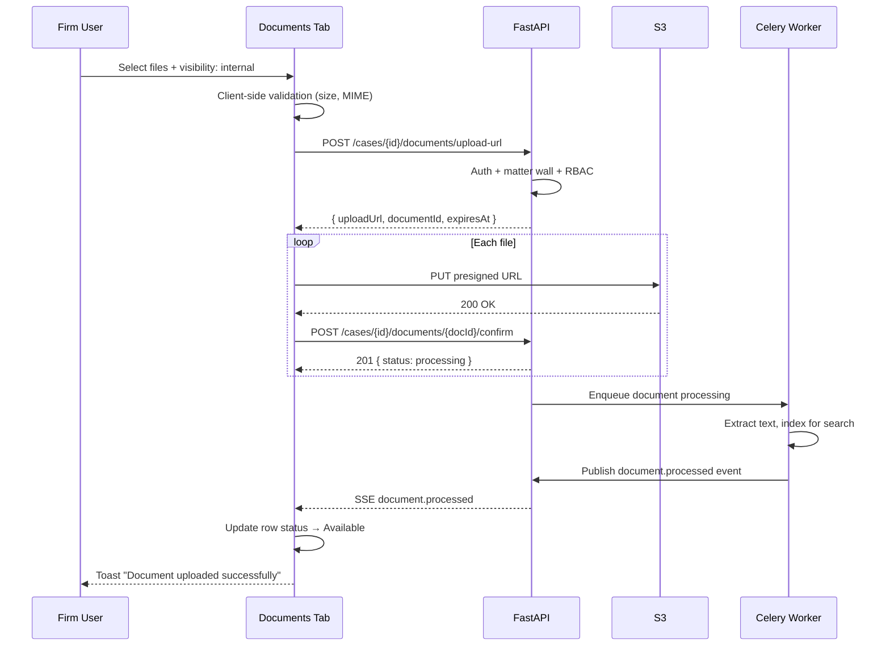
```mermaid
sequenceDiagram
    participant U as Firm User
    participant UI as Documents Tab
    participant API as FastAPI
    participant S3 as S3
    participant Worker as Celery Worker

    U->>UI: Select files + visibility: internal
    UI->>UI: Client-side validation (size, MIME)
    UI->>API: POST /cases/{id}/documents/upload-url
    API->>API: Auth + matter wall + RBAC
    API-->>UI: { uploadUrl, documentId, expiresAt }
    
    loop Each file
        UI->>S3: PUT presigned URL
        S3-->>UI: 200 OK
        UI->>API: POST /cases/{id}/documents/{docId}/confirm
        API-->>UI: 201 { status: processing }
    end

    API->>Worker: Enqueue document processing
    Worker->>Worker: Extract text, index for search
    Worker->>API: Publish document.processed event
    API-->>UI: SSE document.processed
    UI->>UI: Update row status → Available
    UI-->>U: Toast "Document uploaded successfully"
```

### Visibility Decision Flow

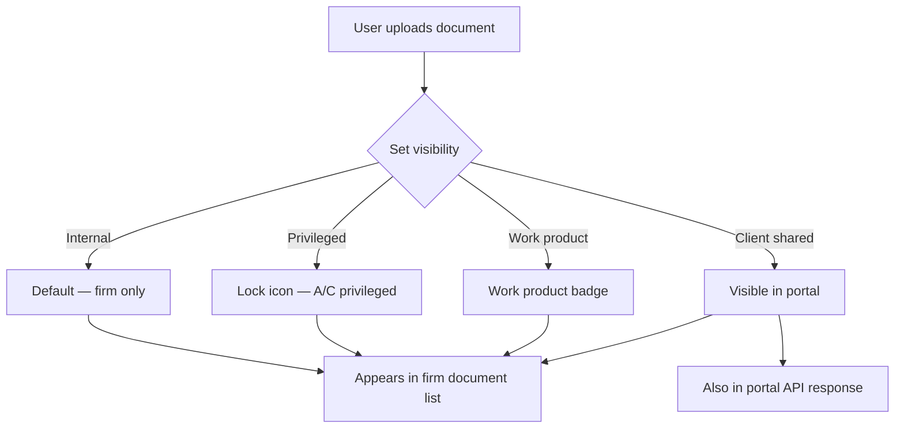
```mermaid
flowchart TD
    UPLOAD[User uploads document] --> PROMPT{Set visibility}
    PROMPT -->|Internal| INT[Default — firm only]
    PROMPT -->|Privileged| PRIV[Lock icon — A/C privileged]
    PROMPT -->|Work product| WP[Work product badge]
    PROMPT -->|Client shared| CS[Visible in portal]

    INT --> LIST[Appears in firm document list]
    PRIV --> LIST
    WP --> LIST
    CS --> LIST
    CS --> PORTAL[Also in portal API response]
```

Cross-reference: [../../04-api/endpoints-documents.md](../../04-api/endpoints-documents.md).

---

## Journey 3 — AI Summary Request & Approval

**Persona:** Associate Attorney (request) → Attorney (approve)  
**Goal:** Generate AI summary; attorney approves before team visibility  
**Success criteria:** Approved summary visible to case team; audit trail complete

### Journey Map

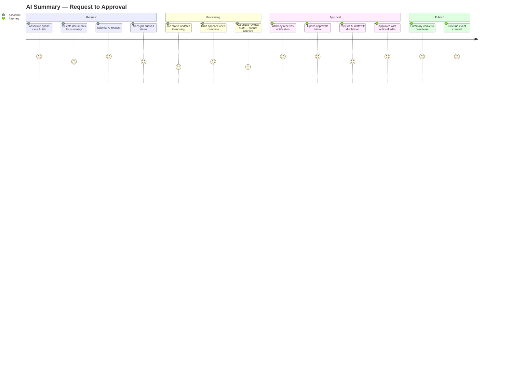
```mermaid
journey
    title AI Summary — Request to Approval
    section Request
      Associate opens case AI tab: 5: Associate
      Selects documents for summary: 4: Associate
      Submits AI request: 5: Associate
      Sees job queued status: 4: Associate
    section Processing
      Job status updates to running: 3: Associate
      Draft appears when complete: 4: Associate
      Associate reviews draft — cannot approve: 3: Associate
    section Approval
      Attorney receives notification: 5: Attorney
      Opens approvals inbox: 5: Attorney
      Reviews AI draft with disclaimer: 4: Attorney
      Approves with optional edits: 5: Attorney
    section Publish
      Summary visible to case team: 5: Attorney
      Timeline event created: 5: Attorney
```

### Sequence Diagram — Request (Async)

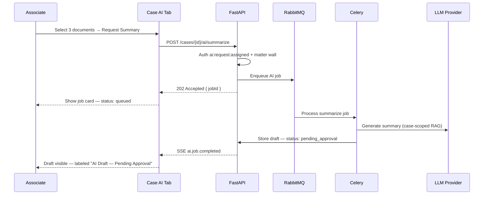
```mermaid
sequenceDiagram
    participant A as Associate
    participant UI as Case AI Tab
    participant API as FastAPI
    participant MQ as RabbitMQ
    participant Worker as Celery
    participant LLM as LLM Provider

    A->>UI: Select 3 documents → Request Summary
    UI->>API: POST /cases/{id}/ai/summarize
    API->>API: Auth ai:request:assigned + matter wall
    API->>MQ: Enqueue AI job
    API-->>UI: 202 Accepted { jobId }
    UI-->>A: Show job card — status: queued

    MQ->>Worker: Process summarize job
    Worker->>LLM: Generate summary (case-scoped RAG)
    Worker->>API: Store draft — status: pending_approval
    API-->>UI: SSE ai.job.completed
    UI-->>A: Draft visible — labeled "AI Draft — Pending Approval"
```

### Sequence Diagram — Approval

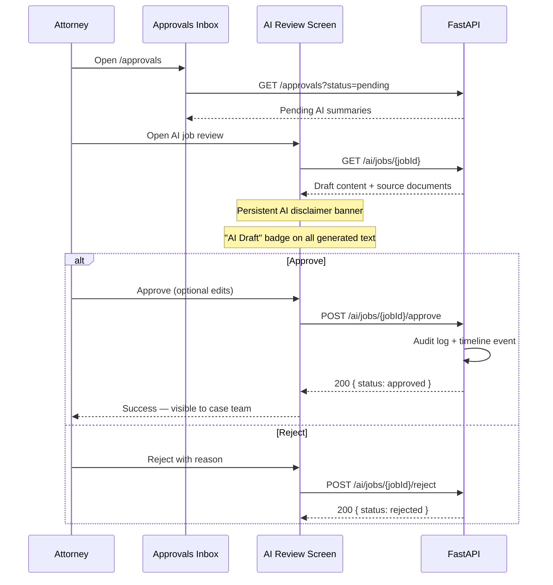
```mermaid
sequenceDiagram
    participant AT as Attorney
    participant INBOX as Approvals Inbox
    participant REV as AI Review Screen
    participant API as FastAPI

    AT->>INBOX: Open /approvals
    INBOX->>API: GET /approvals?status=pending
    API-->>INBOX: Pending AI summaries
    AT->>REV: Open AI job review
    REV->>API: GET /ai/jobs/{jobId}
    API-->>REV: Draft content + source documents
    
    Note over REV: Persistent AI disclaimer banner
    Note over REV: "AI Draft" badge on all generated text

    alt Approve
        AT->>REV: Approve (optional edits)
        REV->>API: POST /ai/jobs/{jobId}/approve
        API->>API: Audit log + timeline event
        API-->>REV: 200 { status: approved }
        REV-->>AT: Success — visible to case team
    else Reject
        AT->>REV: Reject with reason
        REV->>API: POST /ai/jobs/{jobId}/reject
        API-->>REV: 200 { status: rejected }
    end
```

Cross-reference: [../../04-api/endpoints-ai.md](../../04-api/endpoints-ai.md).

---

## Journey 4 — Workflow Trigger

**Persona:** Paralegal, Operations Team  
**Goal:** Trigger standardized workflow on a case; monitor execution status  
**Success criteria:** Workflow completes; timeline updated; tasks created if configured

### Journey Map

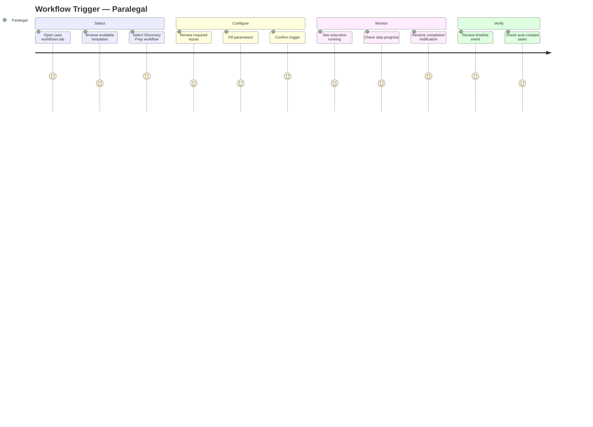
```mermaid
journey
    title Workflow Trigger — Paralegal
    section Select
      Open case workflows tab: 5: Paralegal
      Browse available templates: 4: Paralegal
      Select Discovery Prep workflow: 5: Paralegal
    section Configure
      Review required inputs: 4: Paralegal
      Fill parameters: 4: Paralegal
      Confirm trigger: 5: Paralegal
    section Monitor
      See execution running: 4: Paralegal
      Check step progress: 4: Paralegal
      Receive completion notification: 5: Paralegal
    section Verify
      Review timeline event: 5: Paralegal
      Check auto-created tasks: 4: Paralegal
```

### Sequence Diagram

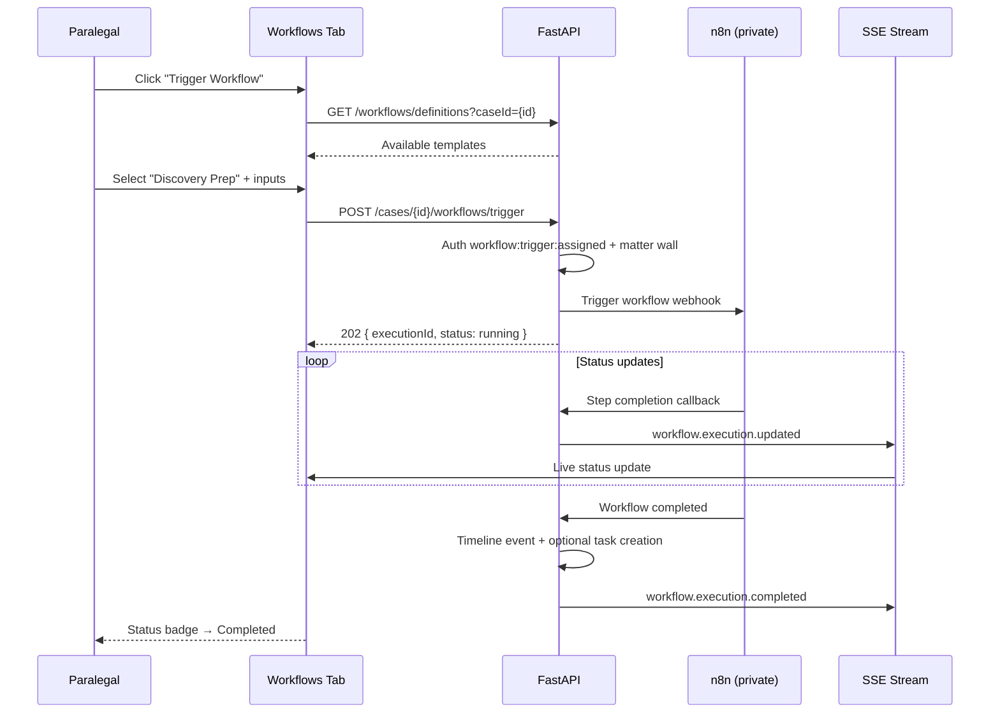
```mermaid
sequenceDiagram
    participant P as Paralegal
    participant UI as Workflows Tab
    participant API as FastAPI
    participant N8N as n8n (private)
    participant SSE as SSE Stream

    P->>UI: Click "Trigger Workflow"
    UI->>API: GET /workflows/definitions?caseId={id}
    API-->>UI: Available templates
    P->>UI: Select "Discovery Prep" + inputs
    UI->>API: POST /cases/{id}/workflows/trigger
    API->>API: Auth workflow:trigger:assigned + matter wall
    API->>N8N: Trigger workflow webhook
    API-->>UI: 202 { executionId, status: running }
    
    loop Status updates
        N8N->>API: Step completion callback
        API->>SSE: workflow.execution.updated
        SSE->>UI: Live status update
    end

    N8N->>API: Workflow completed
    API->>API: Timeline event + optional task creation
    API->>SSE: workflow.execution.completed
    UI-->>P: Status badge → Completed
```

Cross-reference: [../../04-api/endpoints-workflows.md](../../04-api/endpoints-workflows.md).

---

## Journey 5 — Deadline Management

**Persona:** Paralegal, Attorney  
**Goal:** Create, track, and receive reminders for legal deadlines  
**Success criteria:** Zero missed deadline due to platform notification failure

### Journey Map

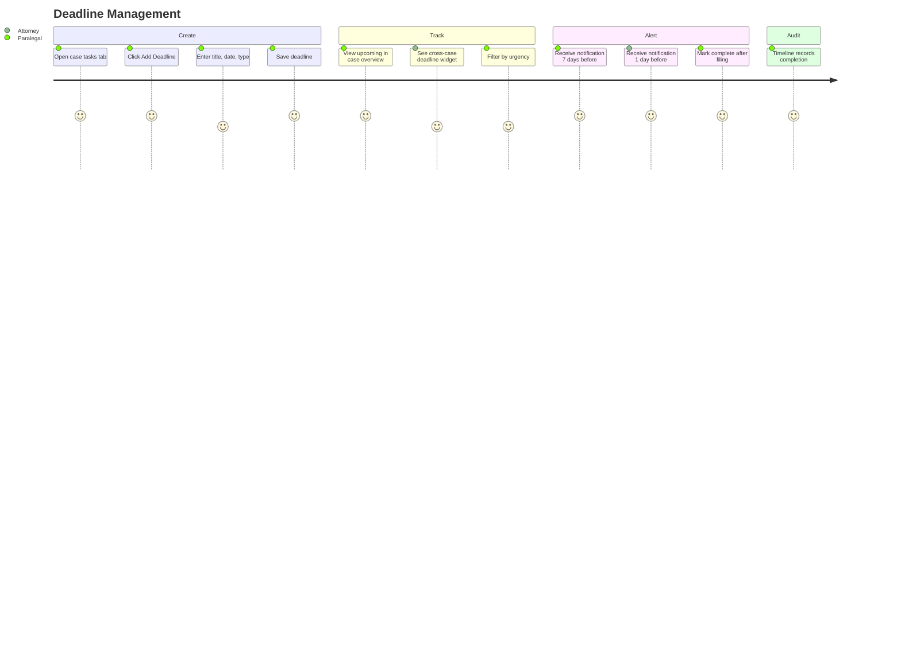
```mermaid
journey
    title Deadline Management
    section Create
      Open case tasks tab: 5: Paralegal
      Click Add Deadline: 5: Paralegal
      Enter title, date, type: 4: Paralegal
      Save deadline: 5: Paralegal
    section Track
      View upcoming in case overview: 5: Paralegal
      See cross-case deadline widget: 4: Attorney
      Filter by urgency: 4: Paralegal
    section Alert
      Receive notification 7 days before: 5: Paralegal
      Receive notification 1 day before: 5: Attorney
      Mark complete after filing: 5: Paralegal
    section Audit
      Timeline records completion: 5: Paralegal
```

### Sequence Diagram

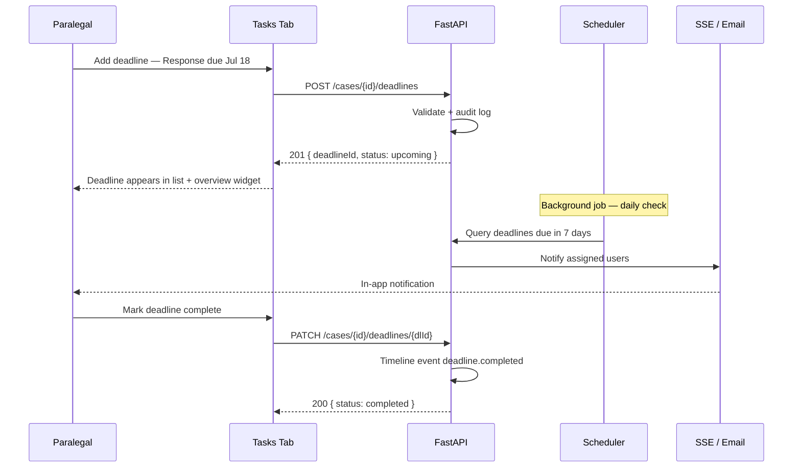
```mermaid
sequenceDiagram
    participant P as Paralegal
    participant UI as Tasks Tab
    participant API as FastAPI
    participant SCHED as Scheduler
    participant SSE as SSE / Email

    P->>UI: Add deadline — Response due Jul 18
    UI->>API: POST /cases/{id}/deadlines
    API->>API: Validate + audit log
    API-->>UI: 201 { deadlineId, status: upcoming }
    UI-->>P: Deadline appears in list + overview widget

    Note over SCHED: Background job — daily check
    SCHED->>API: Query deadlines due in 7 days
    API->>SSE: Notify assigned users
    SSE-->>P: In-app notification

    P->>UI: Mark deadline complete
    UI->>API: PATCH /cases/{id}/deadlines/{dlId}
    API->>API: Timeline event deadline.completed
    API-->>UI: 200 { status: completed }
```

### Deadline Status Flow

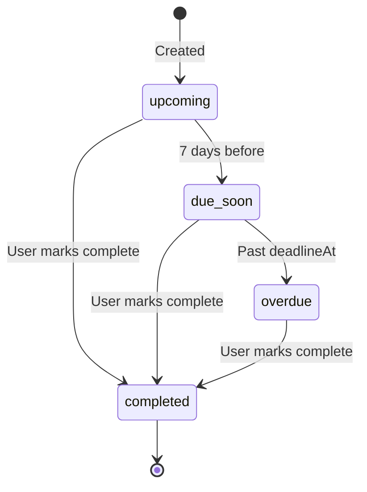
```mermaid
stateDiagram-v2
    [*] --> upcoming: Created
    upcoming --> due_soon: 7 days before
    due_soon --> overdue: Past deadlineAt
    upcoming --> completed: User marks complete
    due_soon --> completed: User marks complete
    overdue --> completed: User marks complete
    completed --> [*]
```

---

## Journey 6 — Audit Log Review

**Persona:** Compliance Officer  
**Goal:** Search firm-wide audit trail; demonstrate regulatory compliance  
**Success criteria:** Audit report generated in under one hour

### Journey Map

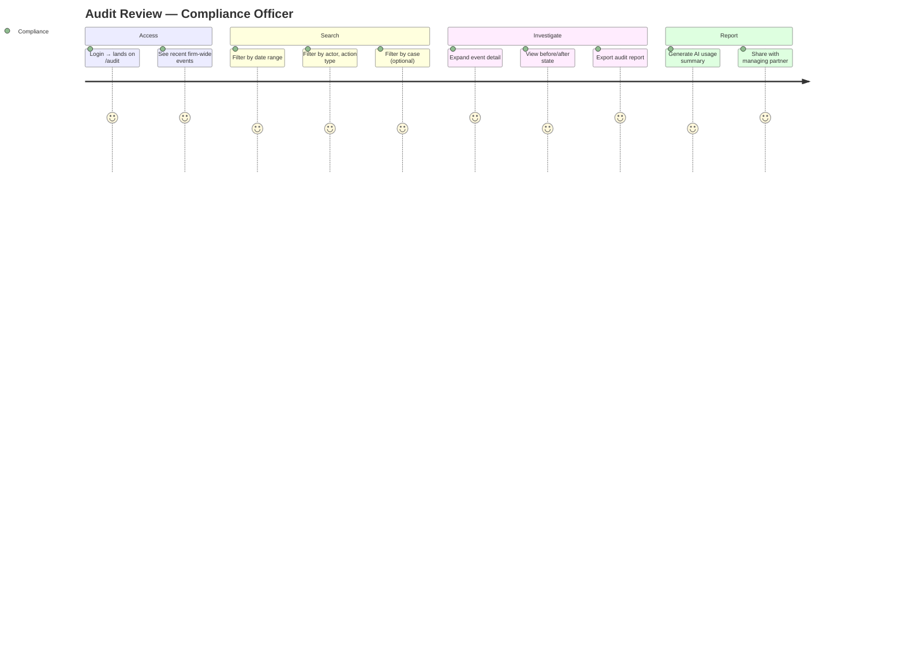
```mermaid
journey
    title Audit Review — Compliance Officer
    section Access
      Login → lands on /audit: 5: Compliance
      See recent firm-wide events: 5: Compliance
    section Search
      Filter by date range: 4: Compliance
      Filter by actor, action type: 4: Compliance
      Filter by case (optional): 4: Compliance
    section Investigate
      Expand event detail: 5: Compliance
      View before/after state: 4: Compliance
      Export audit report: 5: Compliance
    section Report
      Generate AI usage summary: 4: Compliance
      Share with managing partner: 5: Compliance
```

### Sequence Diagram

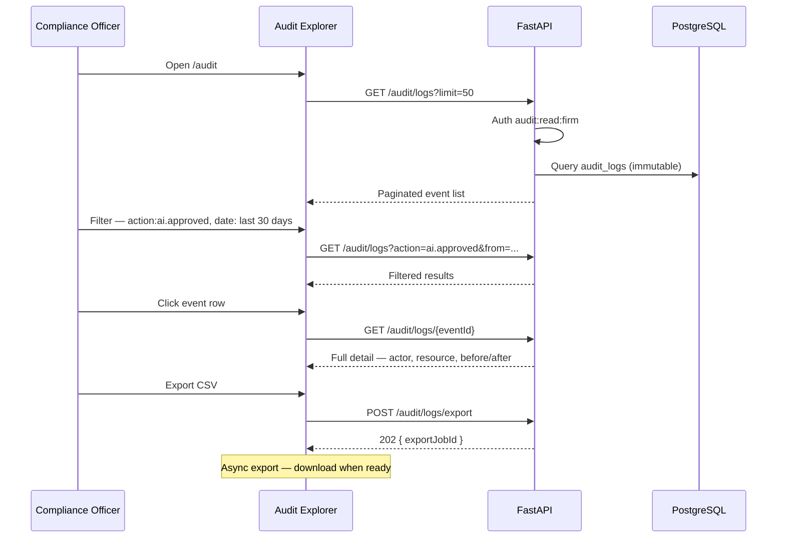
```mermaid
sequenceDiagram
    participant C as Compliance Officer
    participant UI as Audit Explorer
    participant API as FastAPI
    participant DB as PostgreSQL

    C->>UI: Open /audit
    UI->>API: GET /audit/logs?limit=50
    API->>API: Auth audit:read:firm
    API->>DB: Query audit_logs (immutable)
    API-->>UI: Paginated event list

    C->>UI: Filter — action:ai.approved, date: last 30 days
    UI->>API: GET /audit/logs?action=ai.approved&from=...
    API-->>UI: Filtered results

    C->>UI: Click event row
    UI->>API: GET /audit/logs/{eventId}
    API-->>UI: Full detail — actor, resource, before/after

    C->>UI: Export CSV
    UI->>API: POST /audit/logs/export
    API-->>UI: 202 { exportJobId }
    Note over UI: Async export — download when ready
```

### Audit IA Note

Compliance Officer has `case:read:firm` but audit screen is **separate from case workspace** — governance domain, not mixed into daily case tabs.

---

## Journey 7 — Client Portal — Upload & Status

**Persona:** Client (Portal User)  
**Goal:** Securely upload documents; view matter status in plain language  
**Success criteria:** Upload without email; status visible within firm-configured bounds

### Journey Map

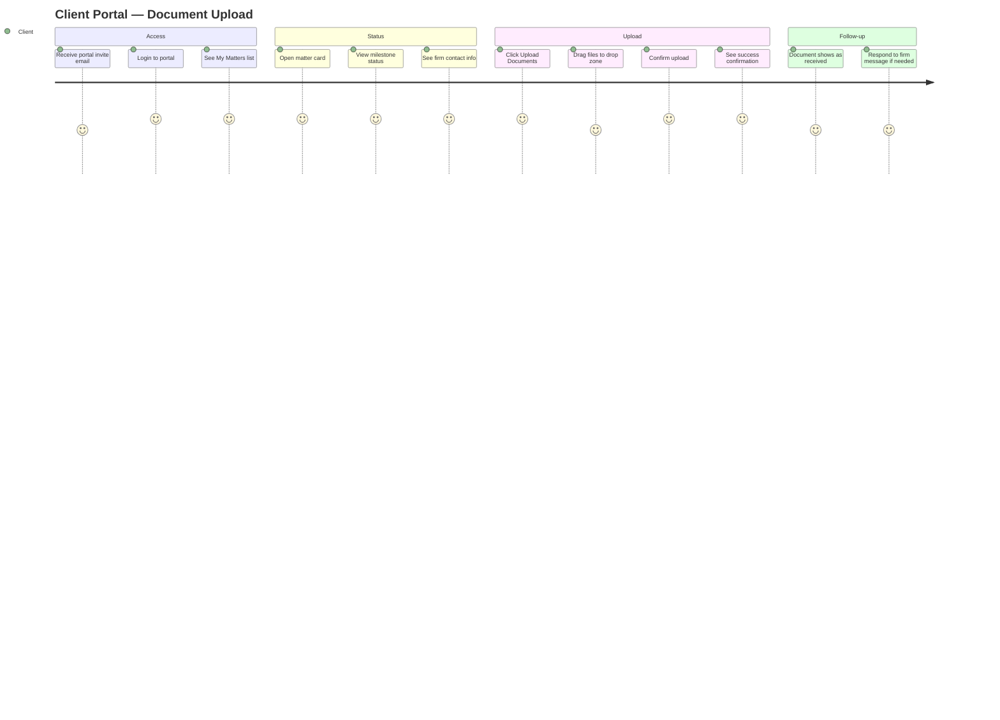
```mermaid
journey
    title Client Portal — Document Upload
    section Access
      Receive portal invite email: 4: Client
      Login to portal: 5: Client
      See My Matters list: 5: Client
    section Status
      Open matter card: 5: Client
      View milestone status: 5: Client
      See firm contact info: 5: Client
    section Upload
      Click Upload Documents: 5: Client
      Drag files to drop zone: 4: Client
      Confirm upload: 5: Client
      See success confirmation: 5: Client
    section Follow-up
      Document shows as received: 4: Client
      Respond to firm message if needed: 4: Client
```

### Sequence Diagram

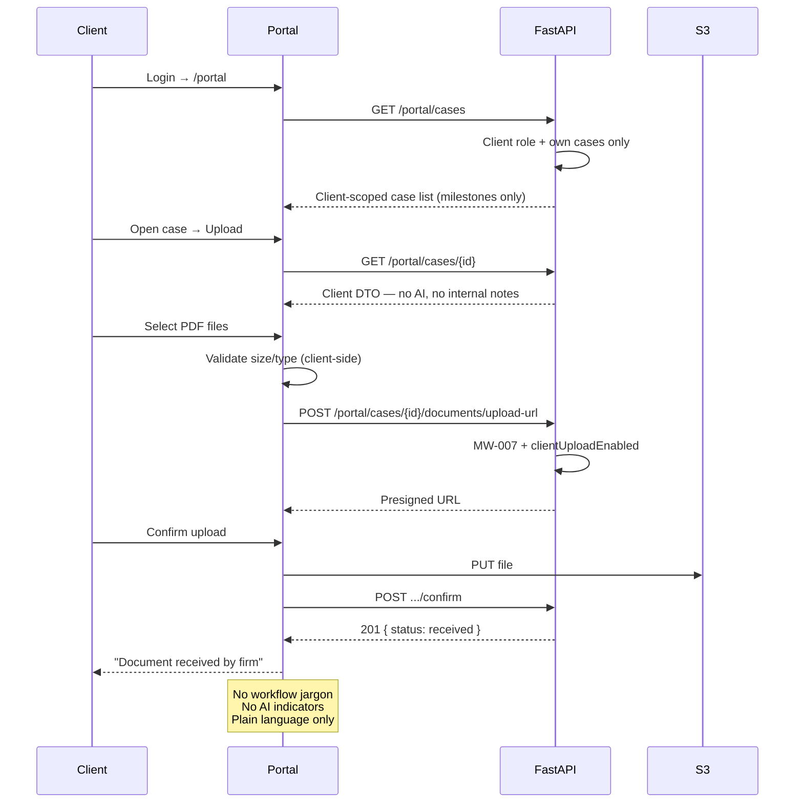
```mermaid
sequenceDiagram
    participant C as Client
    participant UI as Portal
    participant API as FastAPI
    participant S3 as S3

    C->>UI: Login → /portal
    UI->>API: GET /portal/cases
    API->>API: Client role + own cases only
    API-->>UI: Client-scoped case list (milestones only)

    C->>UI: Open case → Upload
    UI->>API: GET /portal/cases/{id}
    API-->>UI: Client DTO — no AI, no internal notes

    C->>UI: Select PDF files
    UI->>UI: Validate size/type (client-side)
    UI->>API: POST /portal/cases/{id}/documents/upload-url
    API->>API: MW-007 + clientUploadEnabled
    API-->>UI: Presigned URL

    C->>UI: Confirm upload
    UI->>S3: PUT file
    UI->>API: POST .../confirm
    API-->>UI: 201 { status: received }
    UI-->>C: "Document received by firm"

    Note over UI: No workflow jargon<br/>No AI indicators<br/>Plain language only
```

Cross-reference: [../../12-ui/client-portal.md](../../12-ui/client-portal.md).

---

## Journey 8 — Global Search & Discovery

**Persona:** Attorney, Paralegal, Compliance Officer  
**Goal:** Find cases, documents, and tasks quickly without enumeration risk  
**Success criteria:** Relevant results in under 2 seconds; walled matters excluded

### Journey Map

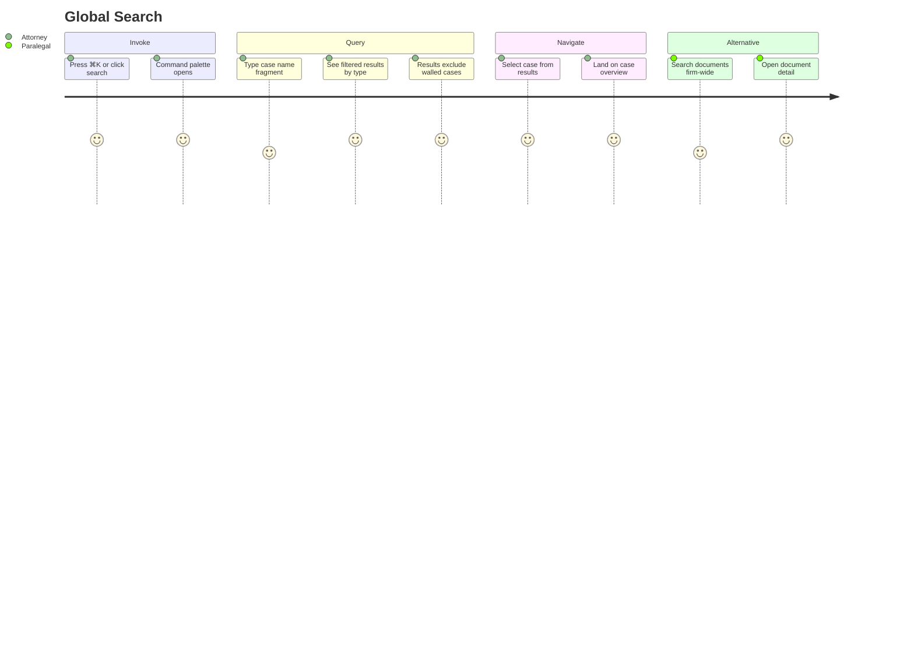
```mermaid
journey
    title Global Search
    section Invoke
      Press ⌘K or click search: 5: Attorney
      Command palette opens: 5: Attorney
    section Query
      Type case name fragment: 4: Attorney
      See filtered results by type: 5: Attorney
      Results exclude walled cases: 5: Attorney
    section Navigate
      Select case from results: 5: Attorney
      Land on case overview: 5: Attorney
    section Alternative
      Search documents firm-wide: 4: Paralegal
      Open document detail: 5: Paralegal
```

### Sequence Diagram

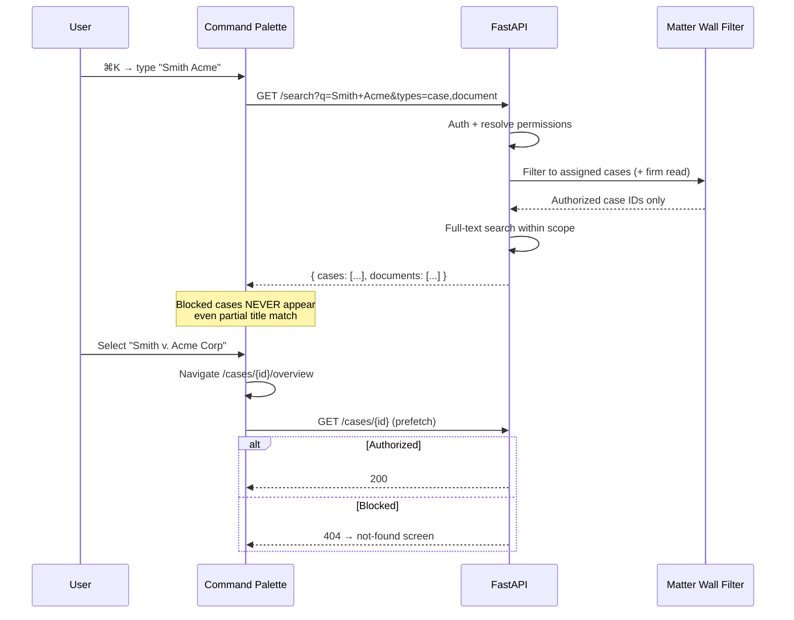
```mermaid
sequenceDiagram
    participant U as User
    participant CMD as Command Palette
    participant API as FastAPI
    participant MW as Matter Wall Filter

    U->>CMD: ⌘K → type "Smith Acme"
    CMD->>API: GET /search?q=Smith+Acme&types=case,document
    API->>API: Auth + resolve permissions
    API->>MW: Filter to assigned cases (+ firm read)
    MW-->>API: Authorized case IDs only
    API->>API: Full-text search within scope
    API-->>CMD: { cases: [...], documents: [...] }

    Note over CMD: Blocked cases NEVER appear<br/>even partial title match

    U->>CMD: Select "Smith v. Acme Corp"
    CMD->>CMD: Navigate /cases/{id}/overview
    CMD->>API: GET /cases/{id} (prefetch)
    alt Authorized
        API-->>CMD: 200
    else Blocked
        API-->>CMD: 404 → not-found screen
    end
```

### Search Result Grouping

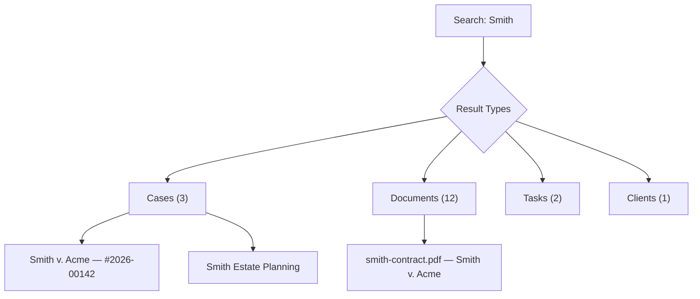
```mermaid
flowchart TB
    QUERY["Search: Smith"] --> GROUP{Result Types}

    GROUP --> CASES["Cases (3)"]
    GROUP --> DOCS["Documents (12)"]
    GROUP --> TASKS["Tasks (2)"]
    GROUP --> CLIENTS["Clients (1)"]

    CASES --> C1["Smith v. Acme — #2026-00142"]
    CASES --> C2["Smith Estate Planning"]

    DOCS --> D1["smith-contract.pdf — Smith v. Acme"]
```

---

## Journey 9 — Approvals Inbox Triage

**Persona:** Attorney  
**Goal:** Process pending AI and workflow approvals efficiently  
**Success criteria:** Clear queue; no unapproved AI visible to wider team

### Journey Map

```mermaid
journey
    title Approvals Inbox — Attorney
    section Queue
      See notification badge: 5: Attorney
      Open /approvals: 5: Attorney
      View pending items by type: 5: Attorney
    section Triage
      Sort by urgency/age: 4: Attorney
      Open first AI summary: 5: Attorney
      Review sources and draft: 4: Attorney
    section Decide
      Approve or reject: 5: Attorney
      Return to inbox — item removed: 5: Attorney
      Process next item: 4: Attorney
```

### Sequence Diagram

```mermaid
sequenceDiagram
    participant AT as Attorney
    participant INBOX as /approvals
    participant API as FastAPI

    AT->>INBOX: Open approvals inbox
    INBOX->>API: GET /approvals?status=pending
    API->>API: Filter to cases where user can decide
    API-->>INBOX: [{ type: ai_summary, jobId, caseTitle, submittedAt }]

    AT->>INBOX: Click item
    INBOX->>INBOX: Navigate /cases/{id}/ai/{jobId}

    AT->>INBOX: Approve
    INBOX->>API: POST /ai/jobs/{jobId}/approve
    API-->>INBOX: 200

    INBOX->>API: Invalidate approvals query
    INBOX-->>AT: Item removed from queue; badge count decrements
```

---

## Journey 10 — Client Intake via Invite Token

**Persona:** Client (pre-authentication)  
**Goal:** Submit intake information via secure email link  
**Success criteria:** Information received; optional case creation

### Journey Map

```mermaid
journey
    title Client Intake — Invite Token
    section Receive
      Open email invite link: 5: Client
      Land on intake form: 5: Client
    section Complete
      Fill dynamic form fields: 4: Client
      Upload supporting documents: 4: Client
      Review and submit: 5: Client
    section Confirm
      See thank you message: 5: Client
      Optional — create portal account: 3: Client
```

### Sequence Diagram

```mermaid
sequenceDiagram
    participant C as Client
    participant UI as Intake Form
    participant API as FastAPI

    C->>UI: GET /portal/intake/{token}
    UI->>API: GET /portal/intake/{token}/validate
    alt Valid
        API-->>UI: { formSchema, firmName, caseId? }
        UI-->>C: Render dynamic form
        C->>UI: Complete form + upload docs
        UI->>API: POST /portal/intake/{token}/submit
        API->>API: Create/update case per firm config
        API-->>UI: 201 { message, caseId? }
        UI-->>C: Thank you — firm will contact you
    else Expired
        API-->>UI: 404
        UI-->>C: Link invalid — contact {firmName}
    end
```

---

## Cross-Journey Dependencies

```mermaid
flowchart TB
    INTAKE[J1: Case Intake] --> DOC[J2: Document Upload]
    DOC --> AI[J3: AI Summary]
    AI --> APPROVAL[J9: Approvals Inbox]
    INTAKE --> WF[J4: Workflow Trigger]
    WF --> DEADLINE[J5: Deadlines]
    INTAKE --> PORTAL[J7: Client Portal]
    INTAKE --> TOKEN[J10: Client Intake Token]

    AI --> AUDIT[J6: Audit Review]
    WF --> AUDIT
    APPROVAL --> AUDIT

    SEARCH[J8: Global Search] -.-> INTAKE
    SEARCH -.-> DOC
    SEARCH -.-> AI
```

---

## Persona Journey Heatmap

| Journey | Attorney | Associate | Paralegal | LA | MP | Ops | Compliance | Client |
|---------|:--------:|:---------:|:---------:|:--:|:--:|:---:|:----------:|:------:|
| 1 Intake | ○ | ○ | ● | ● | ○ | ○ | | |
| 2 Doc upload | ● | ● | ● | ● | ○ | ○ | | |
| 3 AI approval | ● | ◐ | ◐ | | ○ | | ○ | |
| 4 Workflow | ● | ● | ● | ◐ | ○ | ● | | |
| 5 Deadlines | ● | ○ | ● | ◐ | ○ | ○ | | |
| 6 Audit | | | | | ● | | ● | |
| 7 Portal | | | | | | | | ● |
| 8 Search | ● | ● | ● | ● | ● | ● | ● | |
| 9 Approvals | ● | | ◐ | | ● | | | |
| 10 Intake token | | | | | | | | ● |

● Primary ◐ Secondary ○ Occasional

---

## Error Paths — Cross-Cutting

| Error | User Message | Journey Impact |
|-------|--------------|----------------|
| Matter wall 404 | "This case could not be found or you may not have access." | All case-scoped journeys |
| 403 RBAC | "You don't have permission to perform this action." | Admin, workflow template mgmt |
| 409 Version conflict | "This record was updated by someone else. Refresh and retry." | Case edit, task update |
| AI job failed | "AI processing failed. You can retry or contact support." | Journey 3 |
| Upload too large | "File exceeds maximum size of {n} MB." | Journeys 2, 7, 10 |
| Session expired | Redirect to login with returnTo | All authenticated |

---

## References

| Document | Path |
|----------|------|
| User personas | [../../01-product/user-personas.md](../../01-product/user-personas.md) |
| Screen hierarchy | [screen-hierarchy.md](./screen-hierarchy.md) |
| UX guidelines | [ux-guidelines.md](./ux-guidelines.md) |
| Case endpoints | [../../04-api/endpoints-cases.md](../../04-api/endpoints-cases.md) |
| Document endpoints | [../../04-api/endpoints-documents.md](../../04-api/endpoints-documents.md) |
| AI endpoints | [../../04-api/endpoints-ai.md](../../04-api/endpoints-ai.md) |
| Workflow endpoints | [../../04-api/endpoints-workflows.md](../../04-api/endpoints-workflows.md) |
| Client portal | [../../12-ui/client-portal.md](../../12-ui/client-portal.md) |
