# UX Guidelines — Enterprise SaaS Patterns for Legal Workflows

**LexFlow AI** — User Experience Standards & Interaction Patterns  
**Version:** 1.0  
**Status:** Draft — Pre-Implementation  
**Last Updated:** 2026-07-06

---

## Purpose

Establish **UX guidelines** for LexFlow AI — enterprise SaaS interaction patterns, feedback states, error handling, matter wall 404 UX, AI draft labeling, and legal-specific conventions. These guidelines ensure consistent, trustworthy, accessible experiences across personas and surfaces.

Cross-reference: [../../12-ui/design-system.md](../../12-ui/design-system.md), [../../12-ui/accessibility.md](../../12-ui/accessibility.md), [information-architecture.md](./information-architecture.md), [../../04-api/error-handling.md](../../04-api/error-handling.md), [../../08-security/matter-walls.md](../../08-security/matter-walls.md).

---

## Scope

| In Scope | Out of Scope |
|----------|--------------|
| Enterprise SaaS UX patterns | Visual design token values |
| Empty, loading, error states | Copy localization / i18n |
| Matter wall 404 UX | Backend error implementation |
| AI draft labeling and disclaimers | LLM prompt engineering |
| Form and confirmation patterns | Marketing website UX |
| Accessibility interaction requirements | User research protocols |

---

## Design Principles

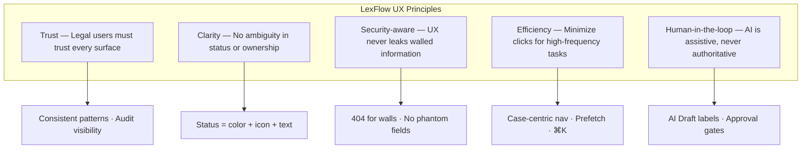

| Principle | Legal Context | Anti-Pattern |
|-----------|---------------|--------------|
| Trust | Show audit trail links on mutations | Hidden state changes |
| Clarity | "Pending attorney approval" not "Processing" | Ambiguous status |
| Security | Same 404 for missing and blocked cases | "Access denied to Case #123" |
| Efficiency | Approvals inbox — one-click to review | Buried approval 4 levels deep |
| Human-in-the-loop | AI output never styled as final work product | AI text in serif "document" styling |

---

## Enterprise SaaS Patterns

### Application Shell Consistency

Every authenticated firm screen shares:

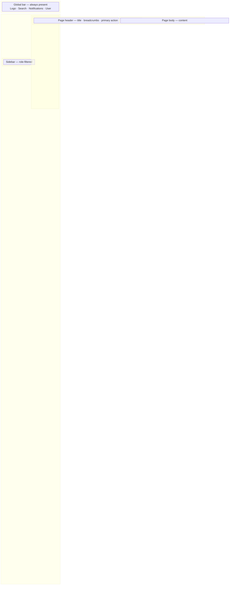

| Zone | Always Present | Never Contains |
|------|----------------|----------------|
| Global bar | Search, notifications, user menu | Page-specific forms |
| Sidebar | Role-filtered nav | Case-specific tabs |
| Page header | Title, breadcrumbs, primary CTA | Data tables |
| Page body | Page content | Global navigation |

### Primary Action Hierarchy

**Rule:** One primary action per view section. Legal confirmations require explicit dialog.

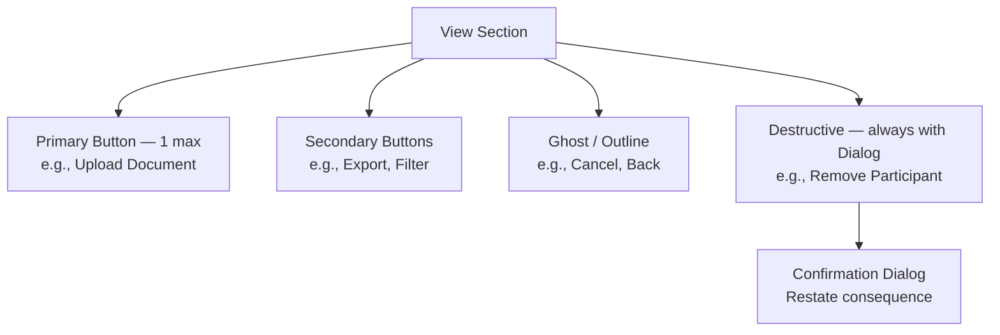

| Action Type | Component | Example |
|-------------|-----------|---------|
| Primary | `Button default` | Save, Upload, Submit for Approval |
| Secondary | `Button secondary` | Export CSV, Apply Filters |
| Tertiary | `Button outline` or `ghost` | Cancel, View Details |
| Destructive | `Button destructive` + `Dialog` | Delete participant, Cancel workflow |

### Data Table Pattern

Enterprise legal tables require scanability:

| Feature | Requirement |
|---------|-------------|
| Sort | Server-side — API `sort` param |
| Filter | Collapsible filter panel — persists in URL query |
| Pagination | Server-side — show total count |
| Row actions | Kebab menu — max 5 actions |
| Selection | Bulk actions only when API supports batch |
| Empty rows | Show empty state component — not blank table |
| Loading | Skeleton rows matching column layout |
| Density | Respect user compact/comfortable preference |

### Form Pattern

```mermaid
sequenceDiagram
    participant U as User
    participant F as Form
    participant API as FastAPI

    U->>F: Edit fields
    F->>F: Inline validation on blur
    U->>F: Submit
    F->>API: POST/PATCH with version (If-Match)
    alt Success
        API-->>F: 200/201
        F->>F: Toast success
        F->>F: Navigate or reset
    alt Validation error
        API-->>F: 422 { errors[] }
        F->>F: Map to field errors — focus first
    alt Version conflict
        API-->>F: 409
        F->>F: Dialog — refresh or overwrite
    end
```

| Rule | Implementation |
|------|----------------|
| Labels above fields | Not placeholder-only labels |
| Required indicator | Asterisk + `aria-required` |
| Optimistic UI | **Never** for legal mutations |
| Unsaved changes | `beforeunload` warning on dirty forms |
| Long forms | Section headings + sticky save bar |

---

## Empty States

Every list and dashboard widget has a designed empty state — never a blank white area.

### Empty State Anatomy

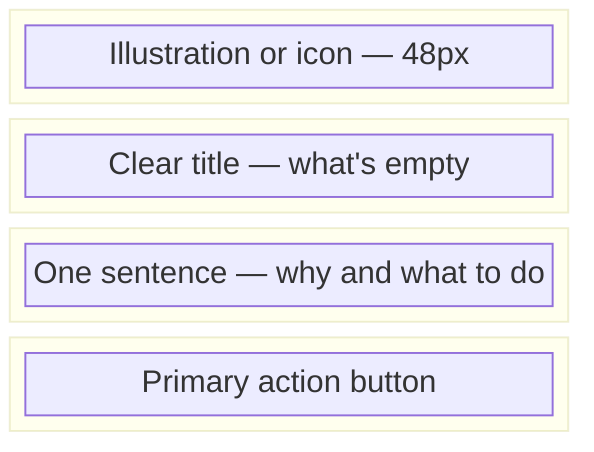

### Empty State Registry

| Surface | Title | Description | CTA |
|---------|-------|-------------|-----|
| Case list (new user) | No cases assigned yet | Cases you're assigned to will appear here. | — |
| Case list (filtered) | No cases match your filters | Try adjusting filters or search terms. | Clear filters |
| Case documents | No documents yet | Upload case documents to get started. | Upload document |
| Case AI jobs | No AI requests yet | Request a summary of case documents. | Request AI summary |
| Case tasks | No tasks yet | Create tasks to track case work. | Add task |
| Case timeline | No activity yet | Events will appear as work progresses. | — |
| Approvals inbox | All caught up | No pending approvals require your attention. | — |
| Audit log (filtered) | No events found | Adjust your search criteria. | Clear filters |
| Portal — no matters | No active matters | Contact your firm if you expected to see a matter here. | Contact firm |
| Portal — no documents | No documents shared yet | Your firm will share documents when available. | Upload (if enabled) |
| Portal — no messages | You're all caught up | No outstanding requests from your firm. | — |
| Search — no results | No results for "{query}" | Try different keywords or check spelling. | — |
| Workflow executions | No workflows run yet | Trigger a workflow to automate case tasks. | Trigger workflow |

### Empty State Wireframe

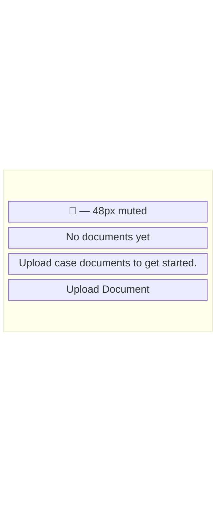

---

## Loading States

**Rule:** Skeleton placeholders matching content shape — never full-page spinners alone.

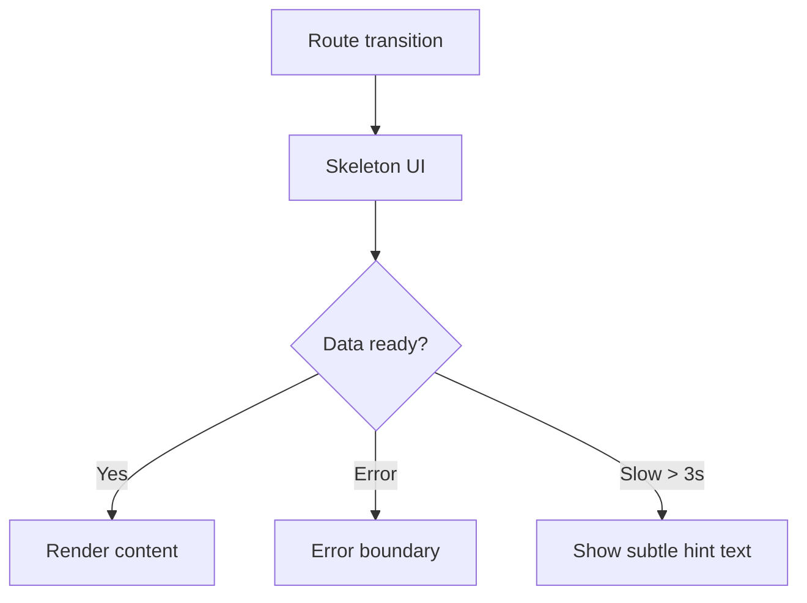

| Context | Loading Pattern | Duration Hint |
|---------|-----------------|---------------|
| Page navigation | Route `loading.tsx` skeleton | — |
| Table fetch | Skeleton rows (5–10) | — |
| Button mutation | Button disabled + spinner | — |
| AI job processing | Status card with animated pulse | "This may take 1–3 minutes" |
| Document upload | Progress bar with percentage | Per-file progress |
| Document processing | Row badge "Processing..." | "Usually under 2 minutes" |
| Export generation | Toast "Preparing export..." | Async job polling |

### Skeleton Wireframe — Case List

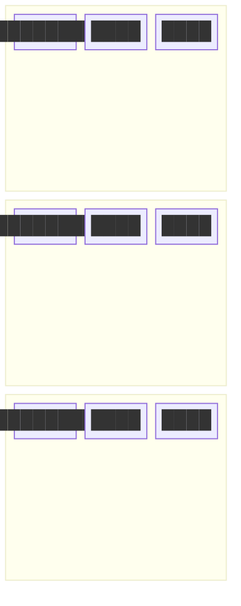

---

## Error States

Cross-reference: [../../04-api/error-handling.md](../../04-api/error-handling.md).

### Error Classification

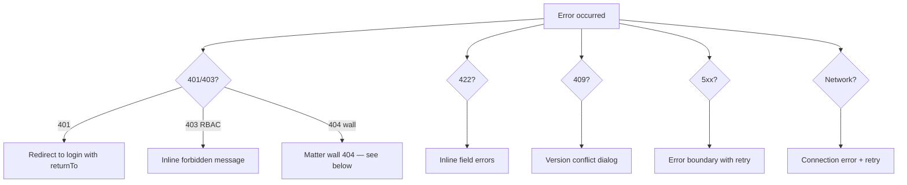

### Error Message Guidelines

| Code | User Message | Show Technical Detail? |
|------|--------------|------------------------|
| 401 | Redirect to login | No |
| 403 | "You don't have permission to perform this action." | No |
| 404 (case) | Matter wall message (below) | No |
| 404 (other) | "The requested resource could not be found." | No |
| 409 | "This record was updated by someone else. Refresh to see changes." | No |
| 422 | Field-specific validation messages | No |
| 429 | "Too many requests. Please wait a moment and try again." | No |
| 500 | "Something went wrong. Please try again." | No — log correlation ID |
| Network | "Unable to connect. Check your internet connection." | No |

**Always log** `X-Correlation-Id` / `requestId` to observability — never show stack traces to users.

### Inline Error Pattern

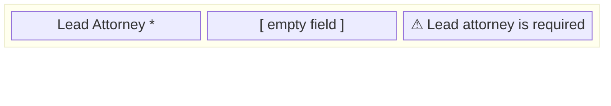

- Error text below field — `text-destructive`
- Field border — `border-destructive`
- Focus first error field on submit
- `aria-invalid="true"` + `aria-describedby` linking to error text

---

## Matter Wall 404 UX

**Invariant MW-004:** Unauthorized case access returns **404 Not Found** — the UI must not distinguish between "case does not exist" and "you lack access."

### 404 Screen Specification

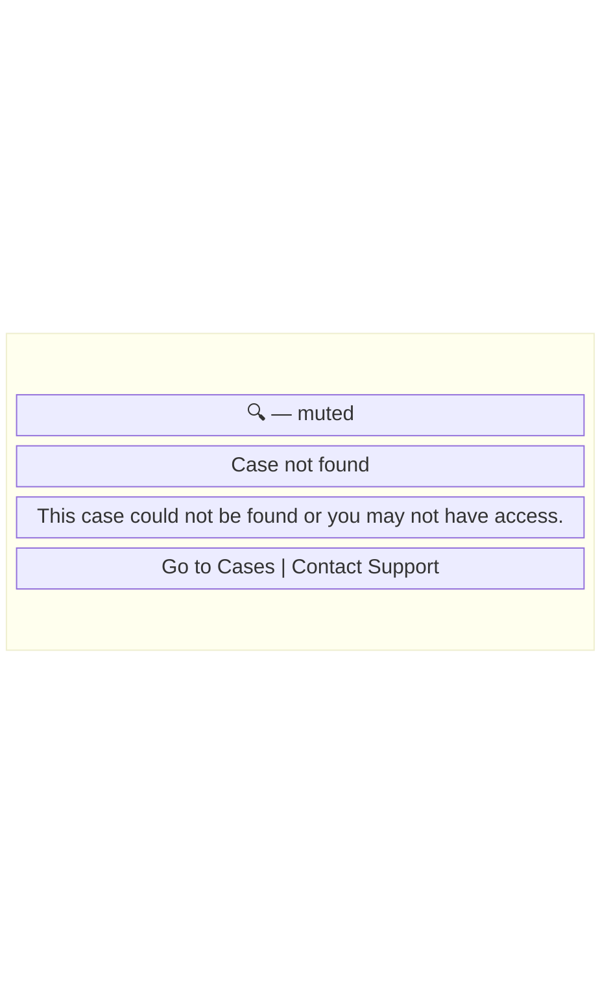

| Rule | Implementation |
|------|----------------|
| Unified message | Same copy for nonexistent and walled cases |
| No case details | Do not show case number, title, or partial data |
| No redirect with error toast | Do not redirect to case list with "access denied" toast |
| Support link | Include generic support link — not case-specific |
| Search exclusion | Walled cases never appear in search results |
| Notification links | Deep link to walled case → same 404 screen |
| Breadcrumb | Do not render breadcrumb trail to blocked case |

### Matter Wall UX Flow

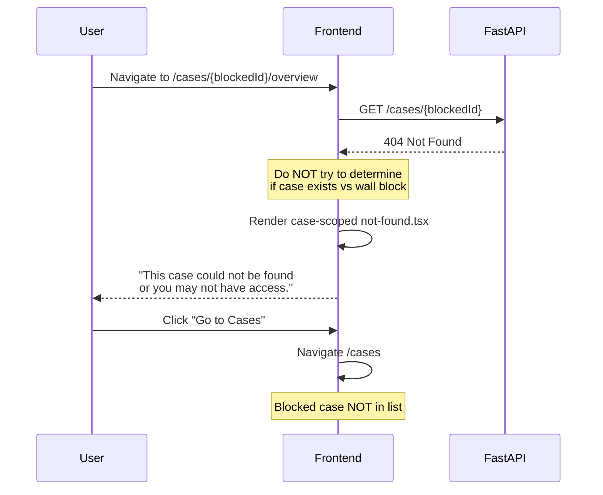

### What NOT to Do

| Anti-Pattern | Why |
|--------------|-----|
| "Access denied to Case #2026-00142" | Confirms case existence — enumeration |
| Redirect to login for 404 | Implies auth issue, not authorization |
| Show case title in breadcrumb then 404 | Leaked metadata |
| "Request access" button (Phase 1) | Implies case exists — defer to Phase 2 with care |
| Different HTTP status display | User sees "404" code — use friendly message only |

---

## AI Draft Labeling

**Invariant:** All AI-generated content requires attorney approval before team visibility. AI outputs must be **visually distinct** from human-authored content at all times.

### AI Content Visual System

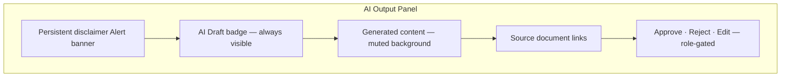

| Element | Treatment | Required |
|---------|-----------|----------|
| Disclaimer banner | `Alert` — firm-configured text | Always — cannot dismiss permanently |
| Status badge | `AI Draft` / `Pending Approval` / `Approved` / `Rejected` | Always on AI content |
| Content background | `bg-muted/50` — distinct from human notes | Until approved |
| Icon | `Sparkles` with tooltip | On all AI panels |
| Typography | Same sans as UI — **not** serif document styling | Prevents confusion with filed docs |
| Approved state | Remove muted background; add "Approved by {name} on {date}" | After approval |
| Rejected state | Strikethrough header; content collapsed | After rejection |

### AI Disclaimer Banner Wireframe

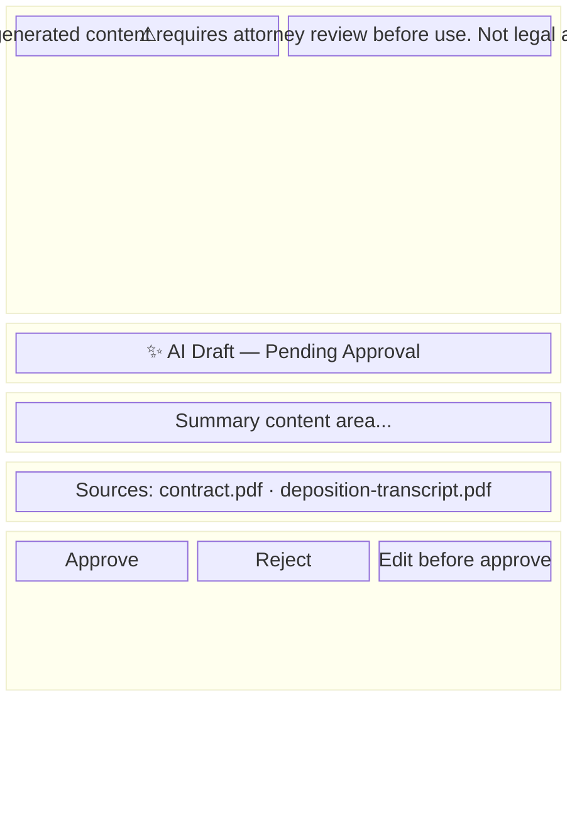

### AI Status Lifecycle

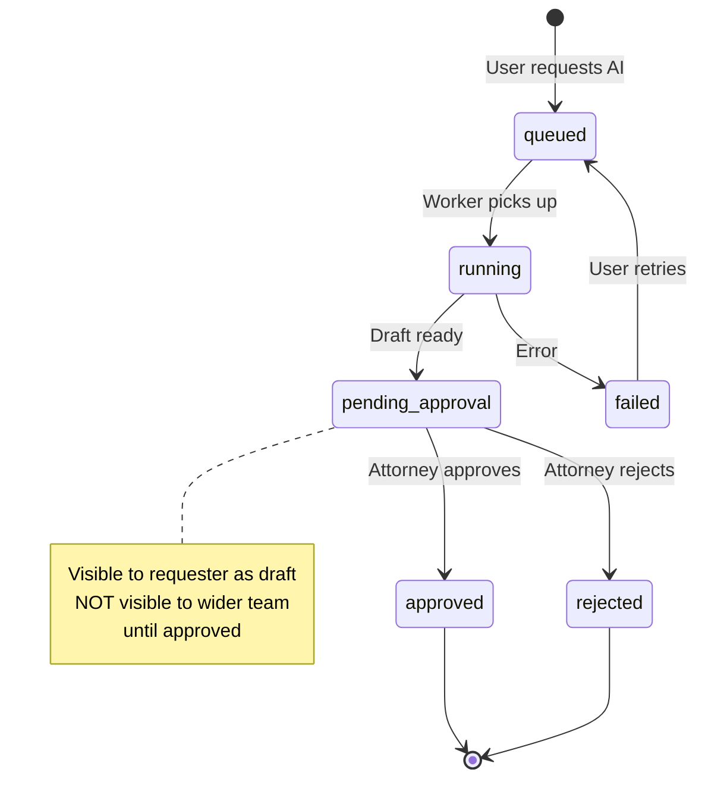

### AI Labeling Rules by Role

| Role | Sees AI Draft | Can Approve | Sees Approved |
|------|:-------------:|:-----------:|:-------------:|
| Attorney | ✓ | ✓ | ✓ |
| Associate | ✓ | ✗ | ✓ (after approval) |
| Paralegal | ✓ (if requested) | ✗ | ✓ (after approval) |
| Legal Assistant | ✗ (default) | ✗ | ✓ (after approval) |
| Client | ✗ | ✗ | ✗ |
| Compliance | ✓ (audit view) | ✗ | ✓ |

### AI in Client Portal

**No AI indicators, content, or terminology** appear in the client portal — ever. Milestones replace workflow/AI status abstraction.

---

## Status & Feedback Patterns

### Status Display Rule

**Status = color + icon + text label** — never color alone (WCAG + color-blind users).

| Status | Color Token | Icon | Label Example |
|--------|-------------|------|---------------|
| Success | `status-success` | CheckCircle | Completed |
| In progress | `status-info` | Loader2 (spin) | Running |
| Pending | `status-warning` | Clock | Pending approval |
| Error | `status-error` | AlertCircle | Failed |
| Cancelled | `status-neutral` | XCircle | Cancelled |
| Awaiting approval | `status-approval` | ShieldCheck | Awaiting attorney approval |

### Toast vs Dialog vs Inline

| Feedback Type | Component | When |
|---------------|-----------|------|
| Success (non-critical) | Toast (Sonner) | Document uploaded, task saved |
| Error (recoverable) | Toast | Network retry succeeded |
| Error (form) | Inline field errors | Validation failure |
| Destructive confirm | Dialog | Delete participant, reject AI |
| Critical legal confirm | Dialog with consequence text | Approve AI, close case |
| Informational | Alert (inline) | AI disclaimer, privilege notice |
| Progress | Progress bar / status card | Upload, AI job, workflow |

**Never use toast for:** destructive action confirmation, AI approval, case deletion, privilege changes.

---

## Confirmation Dialogs — Legal Context

Destructive and legally significant actions require explicit confirmation:

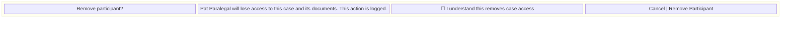

| Action | Dialog Required | Extra Safeguard |
|--------|:---------------:|-----------------|
| Remove participant | ✓ | Audit log note in body |
| Approve AI summary | ✓ | Disclaimer restatement |
| Reject AI summary | ✓ | Reason field (optional) |
| Delete document | ✓ | Soft delete — recoverable 30 days |
| Close case | ✓ | Status transition warning |
| Cancel workflow | ✓ | Partial completion note |
| Trigger workflow | ✗ | Undo not possible — show summary before trigger |
| Upload document | ✗ | Visibility selector is sufficient |

---

## Notification UX

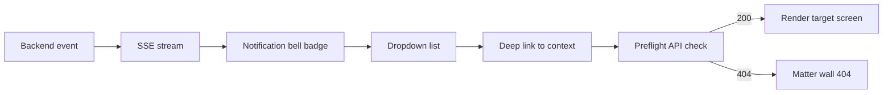

| Notification Type | Deep Link Target | Icon |
|-------------------|------------------|------|
| AI summary ready | `/cases/{id}/ai/{jobId}` | Sparkles |
| Approval required | `/approvals` | ShieldCheck |
| Deadline approaching | `/cases/{id}/tasks` | Clock |
| Workflow completed | `/cases/{id}/workflows` | GitBranch |
| Document processed | `/cases/{id}/documents/{docId}` | FileText |
| Client upload received | `/cases/{id}/documents` | Upload |
| Participant added | `/cases/{id}/participants` | UserPlus |

---

## Privilege & Confidentiality UX

| Visibility | Visual Treatment | Portal |
|------------|------------------|--------|
| Internal | Default — no badge | Hidden |
| Privileged | Left border `border-l-4 border-l-primary` + lock | Hidden |
| Work product | Muted badge | Hidden |
| Client shared | Green badge "Shared with Client" | Visible |
| Client uploaded | "Client upload" badge | Own uploads only |

**Rule:** UI reflects API `visibility` field — never infers privilege from document type or filename.

---

## Accessibility Interaction Requirements

Cross-reference: [../../12-ui/accessibility.md](../../12-ui/accessibility.md).

| Requirement | Standard |
|-------------|----------|
| Keyboard navigation | All interactive elements reachable via Tab |
| Focus visible | `ring-2 ring-ring ring-offset-2` on focus-visible |
| Skip link | "Skip to main content" — first focusable element |
| Live regions | `aria-live="polite"` for toast and status updates |
| AI status changes | Announce via live region — "AI summary ready for review" |
| Form errors | Focus first invalid field; announce error count |
| Reduced motion | Respect `prefers-reduced-motion` — no decorative animation |
| Color contrast | WCAG 2.1 AA minimum — 4.5:1 body text |

---

## Portal-Specific UX

| Firm Pattern | Portal Adaptation |
|--------------|-------------------|
| 14px body | 16px body |
| Dense tables | Card lists |
| Legal terminology | Plain language (Grade 8) |
| Workflow status | Milestone labels |
| AI indicators | Absent |
| Error messages | No HTTP codes — friendly copy |
| Touch targets | 44×44px minimum |

---

## Best Practices Summary

1. **One primary action per section** — reduce decision fatigue.
2. **Skeleton over spinner** — match content shape.
3. **Designed empty states** — always include CTA where applicable.
4. **404 for matter walls** — unified message; no enumeration.
5. **AI always labeled** — disclaimer + badge + distinct styling until approved.
6. **Status = color + icon + text** — accessible status communication.
7. **Toast for success, dialog for consequence** — legal actions need confirmation.
8. **API drives visibility** — no client-side hiding of returned fields.
9. **Optimistic UI never for legal mutations** — wait for server confirmation.
10. **Correlation ID logged, never shown** — support uses backend tools.

---

## Tradeoffs

| Decision | Benefit | Cost |
|----------|---------|------|
| 404 vs 403 for walls | Prevents enumeration | User confusion — mitigate with copy + support |
| Persistent AI disclaimer | Compliance, trust | Visual noise — acceptable for legal |
| No optimistic mutations | Data integrity | Slightly slower perceived performance |
| Skeleton vs spinner | Better perceived performance | More design/dev effort per screen |
| Plain language portal | Client comprehension | Inconsistent terminology across surfaces |

---

## References

| Document | Path |
|----------|------|
| Design system | [../../12-ui/design-system.md](../../12-ui/design-system.md) |
| Accessibility | [../../12-ui/accessibility.md](../../12-ui/accessibility.md) |
| Information architecture | [information-architecture.md](./information-architecture.md) |
| User journeys | [user-journeys.md](./user-journeys.md) |
| Matter walls | [../../08-security/matter-walls.md](../../08-security/matter-walls.md) |
| API error handling | [../../04-api/error-handling.md](../../04-api/error-handling.md) |
| Authorization RBAC | [../../04-api/authorization-rbac.md](../../04-api/authorization-rbac.md) |
| Client portal | [../../12-ui/client-portal.md](../../12-ui/client-portal.md) |
