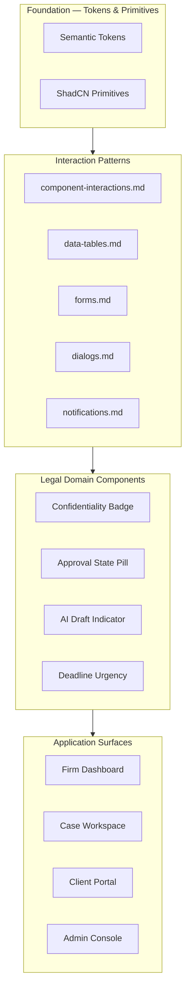

# LexFlow AI — Component Design System Index

**LexFlow AI** — Interaction Design & Component Specifications  
**Version:** 1.0  
**Status:** Draft — Pre-Implementation  
**Last Updated:** 2026-07-06

---

## Purpose

This directory is the **authoritative component interaction reference** for LexFlow AI's legal enterprise SaaS frontend. It documents anatomy, states, variants, interaction specs, and accessibility for every reusable UI pattern — without implementation code.

**Visual language:** Fluent UI clarity + Linear density + GitHub information hierarchy + Stripe polish.

**Stack alignment:** ShadCN UI primitives on Radix, Tailwind semantic tokens, Lucide icons. Token definitions live in [../../12-ui/design-system.md](../../12-ui/design-system.md).

---

## Document Map

| Document | Scope |
|----------|-------|
| [component-library.md](./component-library.md) | Full library overview, ShadCN mapping, composition hierarchy, legal domain components |
| [component-interactions.md](./component-interactions.md) | Hover, focus, disabled, loading, micro-interactions, motion |
| [data-tables.md](./data-tables.md) | Sortable, filterable, paginated tables; bulk actions; matter-scoped lists |
| [forms.md](./forms.md) | Intake forms, validation UX, multi-step wizards, file upload |
| [dialogs.md](./dialogs.md) | Modal, sheet, drawer; confirmation flows; destructive actions |
| [notifications.md](./notifications.md) | Toast, in-app feed, bell icon, Microsoft Teams integration status |

---

## Component Taxonomy

---

## Legal-Specific Components (Cross-Cutting)

These patterns appear across multiple documents. Each has dedicated variant specs in the relevant file.

| Component | Visual | Usage |
|-----------|--------|-------|
| **Confidentiality Badge** | Lock icon + left border accent | Attorney-client privileged, work product, client-visible |
| **Approval State Pill** | Purple `status-approval` + ShieldCheck | HITL queue: pending attorney review |
| **AI Draft Indicator** | Sparkles + dashed border + disclaimer | Unapproved AI output — never team-visible |
| **Deadline Urgency** | Color-coded date chip | Overdue (red), due today (amber), upcoming (neutral) |

---

## Reading Order

| Role | Path |
|------|------|
| **Designer / UX** | README → component-library → component-interactions → domain doc for feature |
| **Frontend engineer** | component-library → relevant domain doc → design-system tokens |
| **Accessibility champion** | component-interactions → each doc's Accessibility section |
| **Product / legal ops** | forms → dialogs → notifications (approval and confirmation flows) |

---

## Platform Invariants (UI)

1. **No React code in this directory** — specs only; implementation in `apps/web/src/components/`.
2. **Status = color + icon + text** — never color alone for legal-critical state.
3. **AI outputs require approval UX** — draft indicators until attorney approves. See [../../07-ai/human-in-the-loop.md](../../07-ai/human-in-the-loop.md).
4. **Matter walls → 404 UX** — no enumeration hints in empty states or error copy.
5. **Destructive actions always confirm** — dialog pattern in [dialogs.md](./dialogs.md).

---

## References

| Document | Path |
|----------|------|
| Design tokens | [../../12-ui/design-system.md](../../12-ui/design-system.md) |
| Accessibility | [../../12-ui/accessibility.md](../../12-ui/accessibility.md) |
| Page architecture | [../../12-ui/page-architecture.md](../../12-ui/page-architecture.md) |
| Client portal | [../../12-ui/client-portal.md](../../12-ui/client-portal.md) |
| Human-in-the-loop | [../../07-ai/human-in-the-loop.md](../../07-ai/human-in-the-loop.md) |
| Matter walls | [../../08-security/matter-walls.md](../../08-security/matter-walls.md) |
