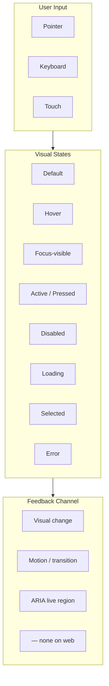
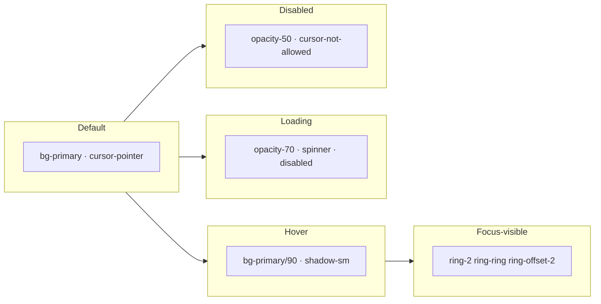
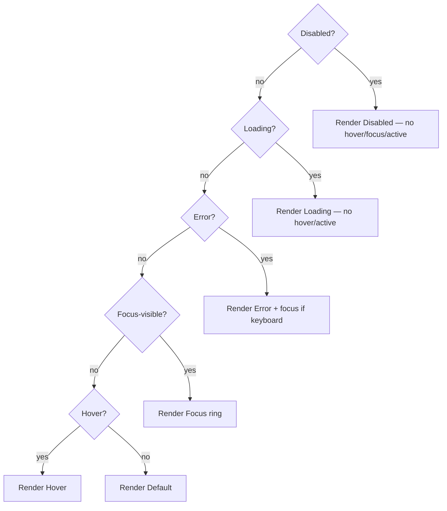
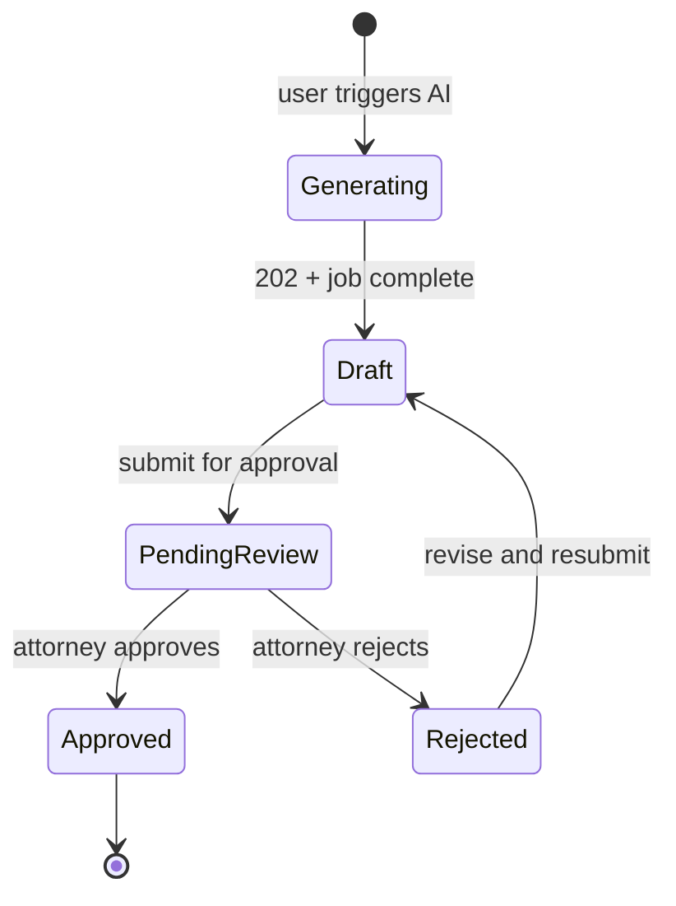
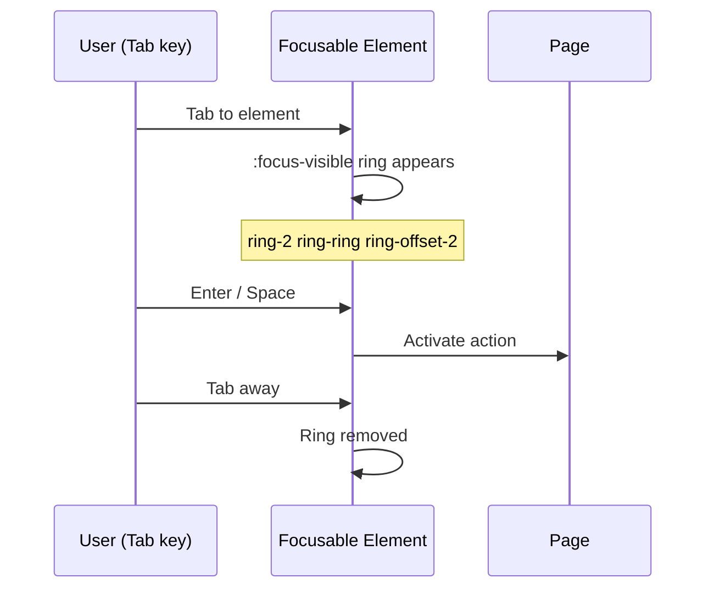
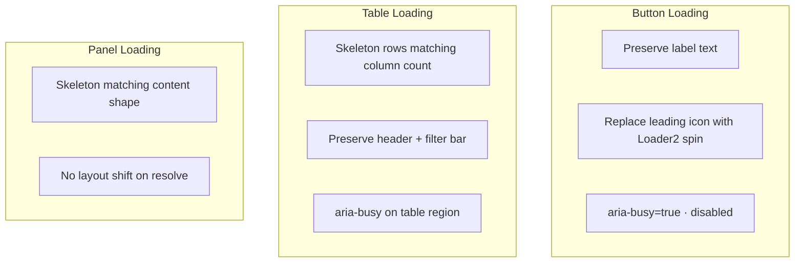

# Component Interactions — States, Motion & Micro-Interactions

**LexFlow AI** — Interaction State Specifications  
**Version:** 1.0  
**Status:** Draft — Pre-Implementation  
**Last Updated:** 2026-07-06

---

## Purpose

Define **interaction behavior** for all LexFlow components — hover, focus, disabled, loading, pressed, and selected states, plus micro-interactions that convey trust and responsiveness in legal enterprise workflows. This document is the single source for timing, easing, and state transition rules.

**Aesthetic reference:** Stripe's button feedback, Linear's snappy hover, GitHub's focus rings, Fluent UI's restrained motion.

---

## Anatomy — Interaction State Layers

### Button State Wireframe

---

## States

### Global State Definitions

| State | Trigger | Duration | Visual |
|-------|---------|----------|--------|
| **Hover** | `:hover` (pointer fine) | 150ms ease-out | Background shift to accent or 90% opacity |
| **Focus-visible** | `:focus-visible` (keyboard) | instant | 2px ring, 2px offset, `--ring` color |
| **Active** | `:active` | 100ms | Scale 0.98 or darker fill |
| **Disabled** | `disabled` or `aria-disabled` | instant | 50% opacity, no pointer events |
| **Loading** | async mutation in flight | until resolve | Spinner + disabled + label preserved |
| **Selected** | click or keyboard select | 150ms | Accent background + check icon |
| **Error** | validation fail | instant | Red border + icon + message below |

### State Precedence

When multiple states apply simultaneously:

**Rule:** Disabled and loading suppress hover and active. Error does not suppress focus.

### Component-Specific States

#### Table Row

| State | Visual |
|-------|--------|
| Default | Alternating stripe on even rows (`bg-muted/30`) |
| Hover | `bg-accent` full row |
| Selected | `bg-accent` + checkbox checked |
| Focus | Focus ring on row action button, not entire row |
| Loading row | Skeleton cells matching column widths |

#### Input Field

| State | Visual |
|-------|--------|
| Default | `border-input` |
| Hover | `border-input` (no change — avoid false affordance) |
| Focus | `ring-2 ring-ring` + border highlight |
| Disabled | `bg-muted`, muted text |
| Error | `border-destructive` + AlertCircle icon inline |
| Read-only | No border change; `bg-muted/50` |

#### AI Draft Panel

| State | Visual |
|-------|--------|
| Generating | Skeleton text + animated Sparkles + progress bar |
| Draft | Dashed border + Sparkles badge + persistent disclaimer Alert |
| Pending review | Purple approval pill + disabled edit for non-attorneys |
| Approved | Solid border; Sparkles badge removed; timestamp shown |
| Rejected | Red left border + rejection reason inline |

#### Deadline Urgency Chip

| State | Background | Text | Icon |
|-------|------------|------|------|
| Overdue | `#FEF2F2` | `#B91C1C` | AlertTriangle |
| Due today | `#FFFBEB` | `#B45309` | Clock |
| Due soon (≤7 days) | `#F4F4F5` | `#71717A` | Calendar |
| Normal | transparent | `muted-foreground` | Calendar |
| Completed | `#ECFDF5` | `#047857` | CheckCircle |

---

## Variants

### Density Modes

Interaction targets scale with density preference (Settings → Display):

| Mode | Button height | Row height | Focus ring offset |
|------|---------------|------------|-------------------|
| Comfortable | 36px (`h-9`) | 48px (`py-3`) | 2px |
| Compact | 32px (`h-8`) | 40px (`py-2`) | 2px |
| Portal | 44px (`h-11`) | 56px (`py-4`) | 3px |

### Motion Variants

| Variant | `prefers-reduced-motion: reduce` |
|---------|----------------------------------|
| Standard transitions (150ms) | Instant (0ms) |
| Skeleton pulse | Static gray block |
| Spinner rotation | Static "Loading…" text |
| Toast slide-in | Fade only |
| Sheet slide | Instant appear |
| Progress bar animate | Static fill at current % |

---

## Interaction Specs

### Timing & Easing

| Interaction | Duration | Easing | Property |
|-------------|----------|--------|----------|
| Button hover | 150ms | `ease-out` | background-color |
| Button active | 100ms | `ease-in` | transform scale |
| Focus ring | 0ms | — | box-shadow |
| Dropdown open | 200ms | `ease-out` | opacity, transform |
| Dialog open | 200ms | `ease-out` | opacity, scale(0.95→1) |
| Sheet slide | 300ms | `cubic-bezier(0.32, 0.72, 0, 1)` | transform translateX |
| Toast enter | 300ms | `ease-out` | opacity, translateY |
| Toast exit | 200ms | `ease-in` | opacity |
| Skeleton pulse | 1.5s | `ease-in-out` | opacity (loop) |
| Spinner | 1s | linear | rotate (loop) |
| Row hover | 100ms | `ease-out` | background-color |
| Tooltip delay | 400ms show / 0ms hide | — | — |

### Hover Specifications

| Component | Hover Behavior |
|-----------|----------------|
| **Button (default)** | Background darkens 10%; cursor pointer |
| **Button (ghost)** | `bg-accent` fill appears |
| **Button (link)** | Underline appears |
| **Table row** | Full-row `bg-accent`; action buttons fade in (opacity 0→1) |
| **Nav item** | `bg-accent` + left border accent on active route only |
| **Card (clickable)** | `shadow-md` elevation increase |
| **Badge** | No hover — badges are not interactive unless `asChild` link |
| **Icon button** | Circular `bg-accent` background |
| **Tab** | Underline preview (2px primary) |
| **Confidentiality badge** | Tooltip on hover showing full privilege explanation |

**Rule:** No hover state on touch-primary devices for elements that aren't tappable. Use `@media (hover: hover)`.

### Focus Specifications

| Pattern | Focus Target | Trap |
|---------|--------------|------|
| Dialog | First focusable in dialog | Yes — Tab cycles within |
| Sheet | Close button or first field | Yes |
| Dropdown | Trigger retains focus until open; then first item | Yes while open |
| DataTable | Skip container; focus sort headers and row actions | No |
| Command palette | Search input on open | Yes |
| Toast | Not focusable by default | — |
| Multi-step form | First invalid field on step change | No |

**Focus restoration:** On dialog/sheet close, return focus to trigger element.

### Disabled Specifications

| Scenario | Treatment |
|----------|-----------|
| Insufficient permissions | **Hide** action entirely (not disabled) |
| Prerequisite not met | Disabled + tooltip explaining why |
| Async in flight | Disabled + loading spinner (same button) |
| Form invalid | Submit disabled until valid; inline errors on blur |
| AI draft not approved | Share/export actions disabled + tooltip |

### Loading Specifications

| Pattern | Min display | Max wait before message |
|---------|-------------|-------------------------|
| Button mutation | 300ms (avoid flash) | 30s → "Still working…" |
| Table fetch | 0ms | 10s → retry link |
| AI generation | 0ms | Show progress % if available |
| File upload | 0ms | Progress bar required >2s |

### Micro-Interactions

| Interaction | Behavior |
|-------------|----------|
| **Checkbox toggle** | Check icon draws in 150ms |
| **Switch toggle** | Thumb slides 200ms; background color crossfade |
| **Copy to clipboard** | Icon swaps Check for 2s, then reverts |
| **Sort column** | Arrow rotates 150ms; table fades 100ms during refetch |
| **Approve AI draft** | Green flash on panel border 300ms; pill transitions to approved |
| **Notification read** | Opacity 100→60 over 200ms; unread dot fades |
| **Bulk select** | Header checkbox indeterminate state animates |
| **Drag file over drop zone** | Border dashed primary + background accent wash |
| **Deadline crosses midnight** | Chip color updates on next page focus (no live countdown) |

---

## Accessibility

| Requirement | Spec |
|-------------|------|
| Focus visible | Never `outline: none` without replacement ring |
| Hover-only info | Duplicate in tooltip accessible via focus |
| Loading | `aria-busy="true"` on container; button retains accessible name |
| Disabled | Use `disabled` attribute or `aria-disabled="true"` with explanation |
| Reduced motion | `@media (prefers-reduced-motion: reduce)` disables all non-essential animation |
| State change | Approval/rejection announces via `aria-live="polite"` |
| Error | `aria-invalid="true"` + `aria-describedby` pointing to error message |
| Color | State never conveyed by color alone — always icon + text |

Cross-reference: [../../12-ui/accessibility.md](../../12-ui/accessibility.md)

---

## Do / Don't

| Do | Don't |
|----|-------|
| Use `:focus-visible` only (not `:focus`) | Show focus ring on mouse click |
| Preserve button width during loading | Replace button with spinner-only |
| Return focus after dialog close | Leave focus in document body |
| Respect `prefers-reduced-motion` | Animate layout-shifting properties |
| Show tooltip on disabled buttons explaining why | Disable without context |
| Use 150ms transitions for hover | Use >300ms for routine interactions |
| Hide actions user cannot perform | Show grayed-out actions that fail on click |
| Animate AI draft state transitions | Snap without feedback on approval |

---

## References

| Document | Path |
|----------|------|
| Component library | [component-library.md](./component-library.md) |
| Design tokens | [../../12-ui/design-system.md](../../12-ui/design-system.md) |
| Accessibility | [../../12-ui/accessibility.md](../../12-ui/accessibility.md) |
| Dialogs (focus trap) | [dialogs.md](./dialogs.md) |
| Forms (validation states) | [forms.md](./forms.md) |
| WAI-ARIA APG | [w3.org/WAI/ARIA/apg](https://www.w3.org/WAI/ARIA/apg/) |
