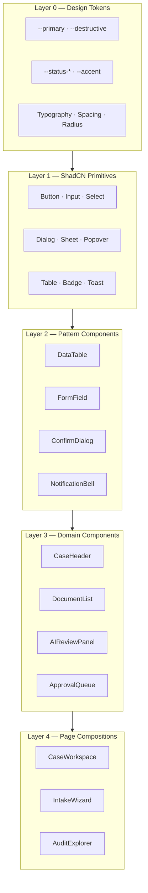
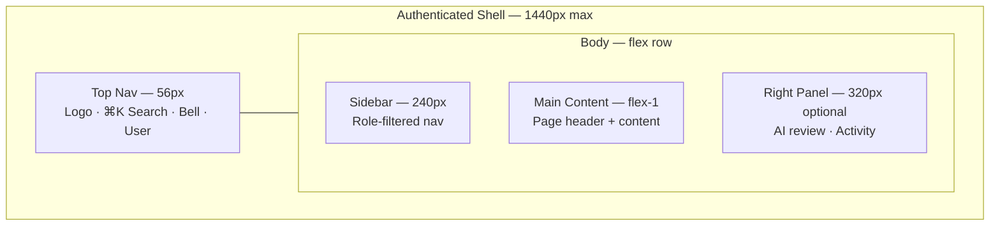
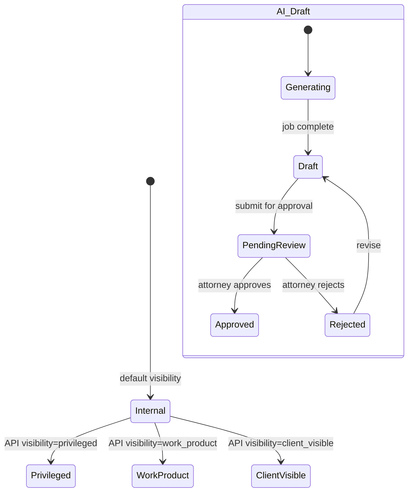
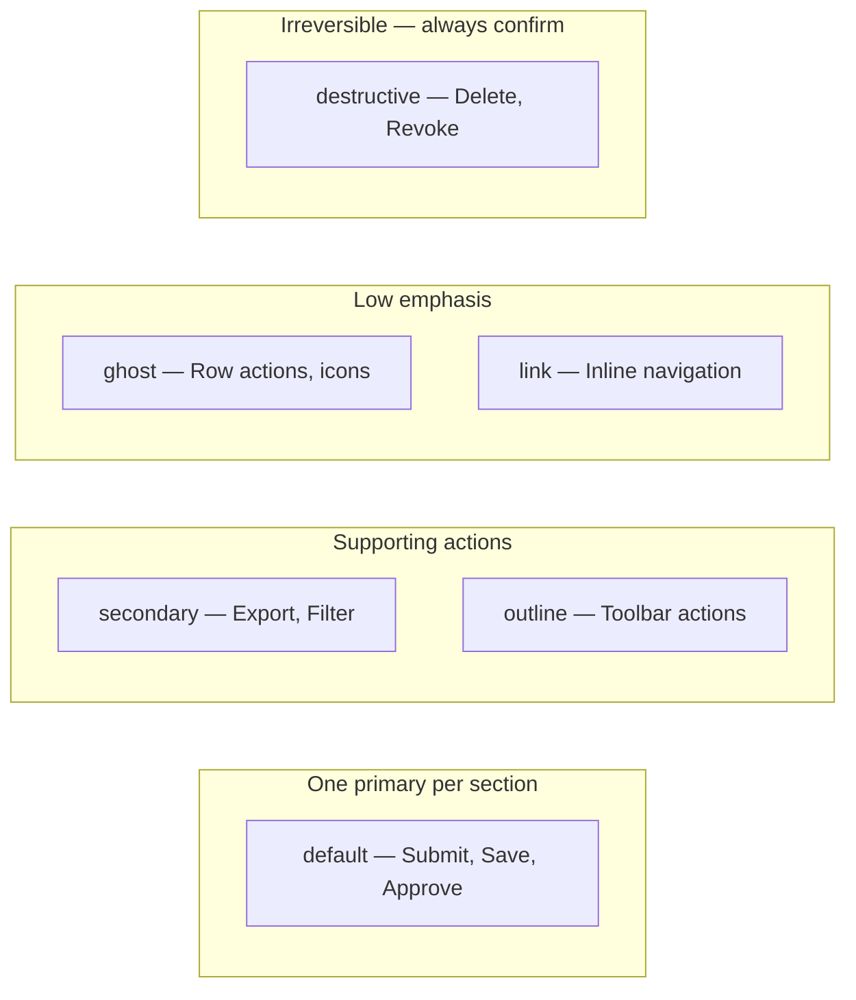
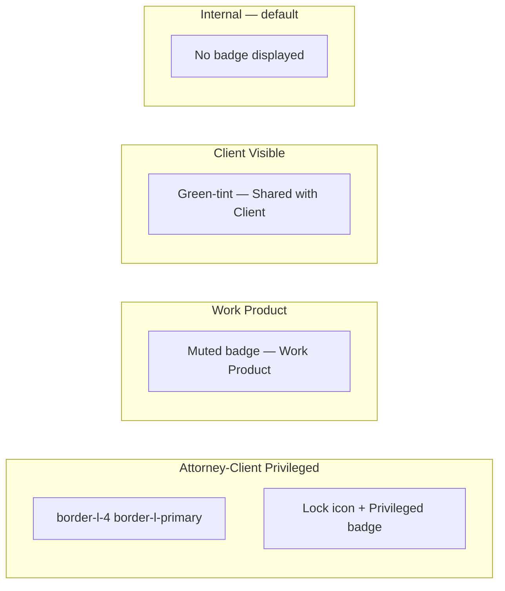
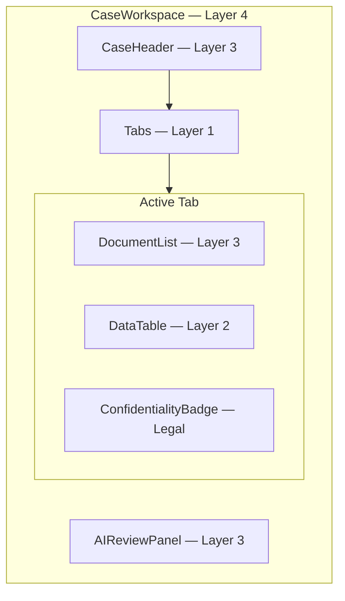

# Component Library — Overview & Composition Hierarchy

**LexFlow AI** — Full Component Library Reference  
**Version:** 1.0  
**Status:** Draft — Pre-Implementation  
**Last Updated:** 2026-07-06

---

## Purpose

Define the **complete LexFlow component library** — from ShadCN primitives through legal domain compositions. This document maps every approved primitive to its ShadCN source, specifies the composition hierarchy, and catalogs legal-specific components that extend the base library.

**Aesthetic target:** Fluent UI's enterprise clarity, Linear's information density, GitHub's neutral hierarchy, Stripe's polished micro-interactions.

---

## Anatomy — Library Layer Model

### Application Shell Wireframe

---

## States

### Primitive State Matrix

All Layer 1 primitives support these interaction states. See [component-interactions.md](./component-interactions.md) for timing and motion.

| State | Visual | Applies To |
|-------|--------|------------|
| **Default** | Base token colors | All interactive |
| **Hover** | `bg-accent` or opacity shift | Buttons, rows, nav items |
| **Focus-visible** | `ring-2 ring-ring ring-offset-2` | All focusable |
| **Active/Pressed** | Slight scale or darker fill | Buttons, toggles |
| **Disabled** | `opacity-50`, `pointer-events-none` | All interactive |
| **Loading** | Spinner + disabled | Async buttons, table refresh |
| **Selected** | `bg-accent` + check icon | Table rows, filter chips |
| **Error** | `border-destructive` + message | Inputs, form fields |

### Legal Domain State Matrix

| Component | States |
|-----------|--------|
| **Confidentiality Badge** | privileged · work-product · client-visible · internal (no badge) |
| **Approval State Pill** | pending · approved · rejected · expired |
| **AI Draft Indicator** | generating · draft · pending-review · approved · rejected |
| **Deadline Urgency** | overdue · due-today · due-soon · normal · none |

---

## Variants

### ShadCN Primitive Mapping

| LexFlow Component | ShadCN Source | Customization |
|-------------------|---------------|---------------|
| `Button` | `@/components/ui/button` | Legal blue primary; destructive for irreversible ops |
| `Input` | `@/components/ui/input` | 14px firm UI; error border + inline message |
| `Textarea` | `@/components/ui/textarea` | Auto-resize for case notes |
| `Select` | `@/components/ui/select` | Searchable for long enum lists |
| `Combobox` | `@/components/ui/combobox` | Client lookup, matter search |
| `Checkbox` | `@/components/ui/checkbox` | Bulk table selection |
| `RadioGroup` | `@/components/ui/radio-group` | Intake branching |
| `Switch` | `@/components/ui/switch` | Settings toggles |
| `Dialog` | `@/components/ui/dialog` | Confirmations, create/edit |
| `Sheet` | `@/components/ui/sheet` | Mobile nav, metadata drawer |
| `Drawer` | `@/components/ui/drawer` | Bottom sheet on mobile |
| `DropdownMenu` | `@/components/ui/dropdown-menu` | Row actions, user menu |
| `Popover` | `@/components/ui/popover` | Filter panels, date quick-pick |
| `Tooltip` | `@/components/ui/tooltip` | Icon-only labels |
| `Table` | `@/components/ui/table` | Base table markup |
| `DataTable` | Custom (TanStack Table) | Sort, filter, pagination |
| `Badge` | `@/components/ui/badge` | Status pills, roles |
| `Alert` | `@/components/ui/alert` | AI disclaimer, privilege notice |
| `Toast` | Sonner via `@/components/ui/sonner` | Transient feedback |
| `Skeleton` | `@/components/ui/skeleton` | Content-shaped loading |
| `Tabs` | `@/components/ui/tabs` | Case workspace sections |
| `Command` | `@/components/ui/command` | Global search ⌘K |
| `Calendar` | `@/components/ui/calendar` | Deadline picker |
| `Avatar` | `@/components/ui/avatar` | Participants |
| `Separator` | `@/components/ui/separator` | Section dividers |
| `ScrollArea` | `@/components/ui/scroll-area` | Long lists |
| `Progress` | `@/components/ui/progress` | Upload, workflow progress |

### Button Variant Hierarchy

| Variant | Token | Usage |
|---------|-------|-------|
| `default` | `bg-primary text-primary-foreground` | Single primary CTA per view section |
| `secondary` | `bg-secondary` | Export, filter, secondary workflow |
| `outline` | `border-input bg-background` | Toolbar, card footers |
| `ghost` | transparent + hover accent | Icon buttons, table row menus |
| `destructive` | `bg-destructive` | Delete participant, cancel workflow |
| `link` | underline on hover | "View all cases" inline links |

### Badge Variants — Legal Status

| Badge | Background | Foreground | Icon |
|-------|------------|------------|------|
| `status-success` | `#ECFDF5` | `#047857` | CheckCircle |
| `status-info` | `#EFF6FF` | `#1D4ED8` | Loader2 |
| `status-warning` | `#FFFBEB` | `#B45309` | Clock |
| `status-error` | `#FEF2F2` | `#B91C1C` | AlertCircle |
| `status-neutral` | `#F4F4F5` | `#71717A` | XCircle |
| `status-approval` | `#F5F3FF` | `#6D28D9` | ShieldCheck |

### Confidentiality Badge Variants

| Level | Border | Badge Text | Icon |
|-------|--------|------------|------|
| Privileged | `border-l-4 border-l-primary` | `Privileged` | Lock |
| Work Product | none | `Work Product` | Briefcase |
| Client Visible | none | `Shared with Client` | Users |
| Internal | none | — | — |

---

## Interaction Specs

### Composition Rules

1. **One primary action per section** — never two `default` buttons adjacent.
2. **Domain components compose primitives only** — no raw HTML buttons in Layer 3+.
3. **Props mirror API DTOs** — form fields align with OpenAPI request schemas.
4. **Permission-aware rendering** — use API `can*` flags; hide disabled actions, don't gray them out unless educational.
5. **Empty states are components** — illustration placeholder, title, description, single CTA.

### Domain Component Catalog

| Component | Layer | Composed From | Surface |
|-----------|-------|---------------|---------|
| `CaseHeader` | 3 | Badge, Button, Avatar, DeadlineChip | Case workspace |
| `DocumentList` | 3 | DataTable, ConfidentialityBadge, DropdownMenu | Case workspace |
| `AIReviewPanel` | 3 | Alert, Button, AIDraftIndicator, Tabs | Case workspace right panel |
| `ApprovalQueue` | 3 | DataTable, ApprovalStatePill, Dialog | Firm dashboard |
| `IntakeWizard` | 3 | FormField, StepIndicator, Dialog | Case intake |
| `NotificationBell` | 3 | Popover, ScrollArea, Badge | Top nav |
| `AuditLogTable` | 3 | DataTable, Badge | Compliance console |
| `WorkflowStatusCard` | 3 | Badge, Progress, Button | Workflow console |

### Composition Hierarchy Wireframe — Case Workspace

---

## Accessibility

| Requirement | Implementation |
|-------------|----------------|
| Heading hierarchy | One H1 per page; domain components don't emit headings unless section title |
| Landmark regions | Shell provides `nav`, `main`, `complementary` for right panel |
| Status announcements | Approval state changes use `aria-live="polite"` |
| Confidentiality | Badge text read by screen reader; not color-only |
| AI draft | `aria-label="AI-generated draft, pending attorney approval"` on indicator |
| Icon buttons | All ghost buttons require `aria-label` or visible tooltip |

Cross-reference: [../../12-ui/accessibility.md](../../12-ui/accessibility.md)

---

## Do / Don't

| Do | Don't |
|----|-------|
| Use semantic tokens (`bg-primary`) in all layers | Hardcode hex values in domain components |
| Compose domain components from Layer 1–2 only | Create monolithic page-specific widgets |
| Show confidentiality badge when API returns visibility | Infer privilege from document filename |
| One primary button per dialog footer | Stack two primary buttons |
| Use `DataTable` for all list views >5 rows | Build custom table markup per page |
| Keep AI draft visually distinct until approved | Show AI output as final without indicator |
| Map ShadCN components 1:1 before customizing | Fork Radix behavior without documentation |

---

## References

| Document | Path |
|----------|------|
| Component index | [README.md](./README.md) |
| Interaction states | [component-interactions.md](./component-interactions.md) |
| Design tokens | [../../12-ui/design-system.md](../../12-ui/design-system.md) |
| Data tables | [data-tables.md](./data-tables.md) |
| Forms | [forms.md](./forms.md) |
| Dialogs | [dialogs.md](./dialogs.md) |
| Notifications | [notifications.md](./notifications.md) |
| Human-in-the-loop | [../../07-ai/human-in-the-loop.md](../../07-ai/human-in-the-loop.md) |
| ShadCN UI | [ui.shadcn.com](https://ui.shadcn.com/) |
