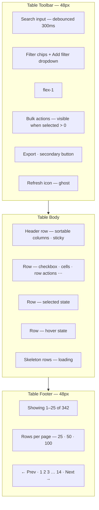
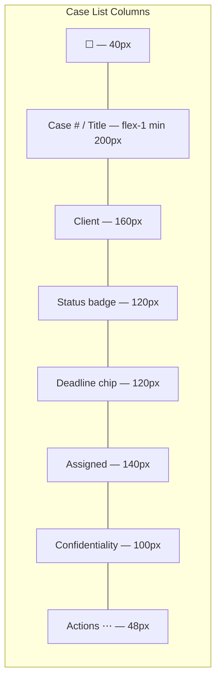
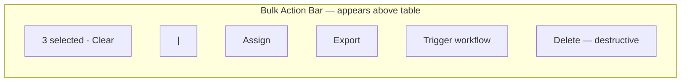
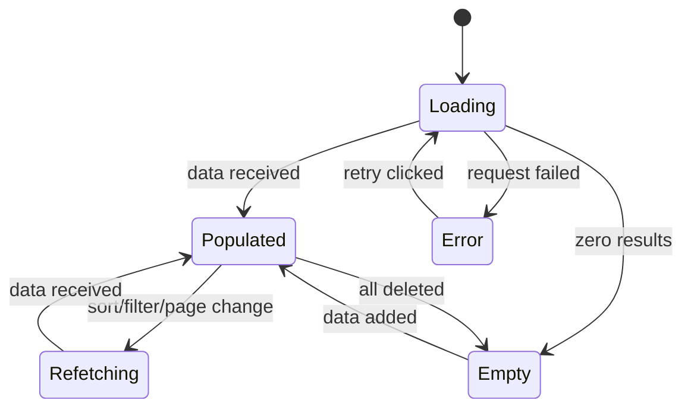
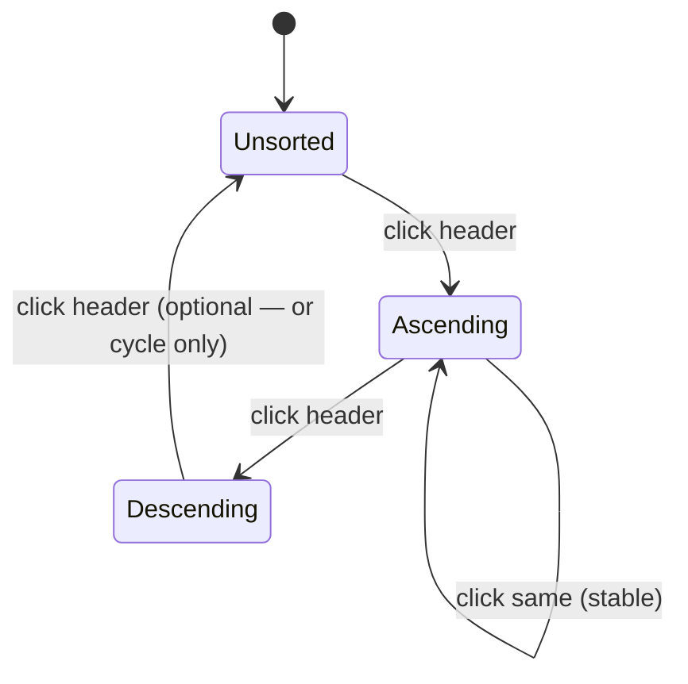
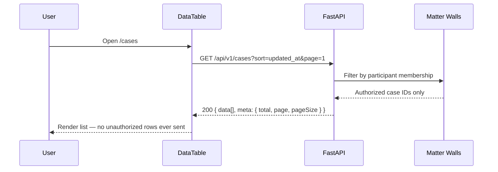
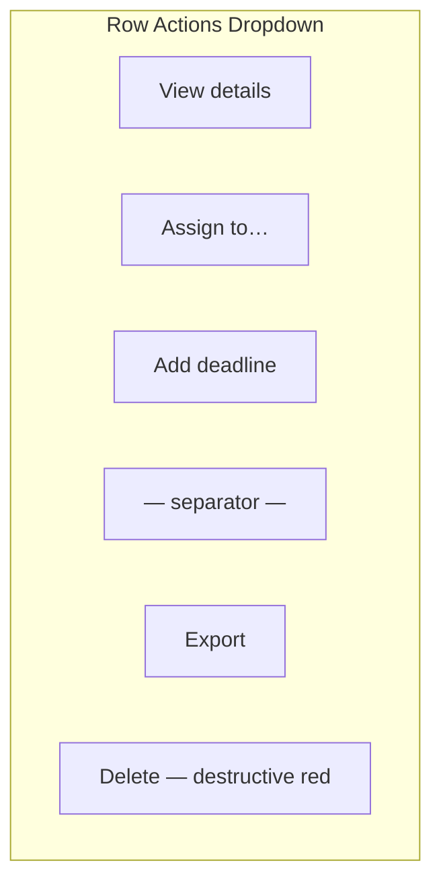

# Data Tables — Sortable, Filterable, Matter-Scoped Lists

**LexFlow AI** — DataTable Interaction Specifications  
**Version:** 1.0  
**Status:** Draft — Pre-Implementation  
**Last Updated:** 2026-07-06

---

## Purpose

Define **data table interaction patterns** for LexFlow's legal enterprise lists — cases, documents, audit logs, approval queues, and workflow executions. All tables are server-driven (sort, filter, pagination via API), matter-scoped where applicable, and optimized for 6–10 hour daily use by attorneys and paralegals.

**Reference aesthetic:** GitHub issue lists (density + actions), Linear list views (speed), Fluent UI details lists (enterprise columns).

---

## Anatomy

### Full DataTable Wireframe

### Column Layout Wireframe — Case List

### Bulk Action Bar Wireframe

---

## States

### Table-Level States

| State | Visual | Behavior |
|-------|--------|----------|
| **Loading (initial)** | Skeleton rows (5 default) + toolbar disabled | Preserve layout dimensions |
| **Loading (refetch)** | Semi-transparent overlay + spinner on table | Toolbar remains interactive |
| **Empty** | Empty state component centered in table area | Title, description, CTA |
| **Empty (filtered)** | "No results match filters" + Clear filters link | Preserve filter bar |
| **Error** | Inline Alert above table + Retry button | Last successful data remains visible if stale |
| **Partial selection** | Header checkbox indeterminate | Bulk bar shows count |
| **Full selection (page)** | Header checkbox checked | Bulk bar visible |
| **All selected (cross-page)** | Banner: "All 25 on page selected. Select all 342?" | Link to select all |

### Row-Level States

| State | Visual |
|-------|--------|
| Default | Alternating stripe even rows |
| Hover | `bg-accent`; row actions fade in |
| Selected | `bg-accent` + checked checkbox |
| Focus | Focus ring on focused cell action |
| Disabled | Not used — rows are not disabled; actions hidden by permission |
| Privileged row | Left border `border-l-4 border-l-primary` |
| Overdue deadline | Deadline chip in urgency-red |

### Sort State

| State | Header Visual |
|-------|---------------|
| Unsorted | Column label + faded ↕ icon on hover |
| Ascending | Label + ↑ icon (primary color) |
| Descending | Label + ↓ icon (primary color) |
| Sorting (loading) | Icon spins briefly during refetch |

**Default sort:** API-defined per resource (cases: `updated_at desc`, audit: `created_at desc`).

### Filter State

| State | Visual |
|-------|--------|
| No filters | Filter button with count hidden |
| Active filters | Chips below toolbar: `Status: Open ×` `Assigned: Me ×` |
| Filter panel open | Popover with form fields |
| Invalid filter combo | Inline error in filter panel |

---

## Variants

### Table Variants by Surface

| Variant | Surface | Columns | Density | Bulk Actions |
|---------|---------|---------|---------|--------------|
| `CaseListTable` | Dashboard, /cases | Full | Comfortable/Compact | Assign, export, workflow |
| `DocumentTable` | Case workspace | Name, type, date, confidentiality, actions | Compact default | Download, tag, delete |
| `AuditLogTable` | Compliance console | Timestamp, actor, action, resource, IP | Compact | Export only (no delete) |
| `ApprovalQueueTable` | Dashboard widget | Item, case, type, submitted, status | Comfortable | Approve, reject (single) |
| `WorkflowExecutionTable` | Workflow console | Name, case, status, started, duration | Comfortable | Cancel, retry |
| `NotificationTable` | Settings → notifications history | Date, channel, event, status | Comfortable | None |
| `PortalDocumentTable` | Client portal | Name, date, status | Portal density | Download only |

### Matter-Scoped List Variant

All case-associated tables receive data **pre-filtered by API** (matter walls enforced server-side). UI never exposes "cases you can't access."

**Empty matter-scoped list:** Generic "No cases found" — never "You don't have access to any cases."

### Pagination Variants

| Variant | When | Controls |
|---------|------|----------|
| **Offset pagination** | Default — lists <10k rows | Page numbers + prev/next |
| **Cursor pagination** | Audit logs, high-volume | Prev/next only; no page numbers |
| **Infinite scroll** | Activity feeds only — not primary tables | Load more on scroll |

---

## Interaction Specs

### Sorting

| Action | Behavior |
|--------|----------|
| Click sortable header | Toggle asc → desc → unsorted (if 3-state enabled) |
| Shift+click header | Multi-column sort (audit table only; max 2 columns) |
| Keyboard | Enter/Space on focused header toggles sort |
| API param | `?sort=field` or `?sort=-field` (desc) |
| Loading | Optimistic header state; table body skeleton during fetch |

### Filtering

| Action | Behavior |
|--------|----------|
| Click "Add filter" | Popover with field selector → operator → value |
| Filter chip × | Remove single filter; debounced refetch |
| "Clear all" | Remove all filters |
| Search | Full-text debounced 300ms; `?q=` param |
| Saved filters | Phase 2 — user-named filter presets |
| URL sync | Filters, sort, page reflected in URL query params |

**Legal-specific filters:**

| Filter | Type | Options |
|--------|------|---------|
| Confidentiality | Multi-select | Privileged, Work product, Client visible, Internal |
| Approval status | Multi-select | Pending, Approved, Rejected |
| Deadline urgency | Select | Overdue, Due today, Due this week, None |
| AI content | Toggle | Contains AI draft, Contains approved AI |

### Row Actions

| Action | Trigger | Pattern |
|--------|---------|---------|
| Open detail | Click row (not checkbox/actions) | Navigate to case/document |
| Row menu | ⋯ button or right-click | DropdownMenu — max 8 actions |
| Quick approve | Inline button (approval queue only) | Opens confirm dialog |
| Open in new tab | Cmd+click row | Standard browser behavior |

**Row action menu wireframe:**

### Bulk Actions

| Action | Behavior |
|--------|----------|
| Select row checkbox | Toggle single row |
| Select all (page) | Header checkbox selects visible page |
| Select all (dataset) | Banner link after page select |
| Bulk action click | Confirmation dialog if >1 item or destructive |
| Bulk action API | `POST /api/v1/cases/bulk` with `{ ids[], action }` |
| Progress | Toast with progress for async bulk ops |
| Partial failure | Toast: "8 of 10 succeeded" + link to details |

**Destructive bulk:** Always requires typed confirmation (case number or "DELETE"). See [dialogs.md](./dialogs.md).

### Column Management (Phase 2)

| Action | Behavior |
|--------|----------|
| Column picker | Toggle visibility; persist in user preferences |
| Resize | Drag column border; min-width enforced |
| Reorder | Drag header; persist in user preferences |

---

## Accessibility

| Requirement | Implementation |
|-------------|----------------|
| Table semantics | `<table>`, `<thead>`, `<tbody>`, `<th scope="col">` |
| Sortable headers | `aria-sort="ascending|descending|none"` |
| Row selection | Checkbox `aria-label="Select case FMG-2024-0847"` |
| Bulk bar | `aria-live="polite"` announces "3 items selected" |
| Row count | Footer "Showing 1–25 of 342" in live region on change |
| Actions | Row menu button `aria-label="Actions for case FMG-2024-0847"` |
| Loading | `aria-busy="true"` on `<table>` during fetch |
| Keyboard | Arrow keys navigate cells (optional Phase 2); Tab through interactive elements |
| Confidentiality | Badge text read in row context |

Cross-reference: [../../12-ui/accessibility.md](../../12-ui/accessibility.md)

---

## Do / Don't

| Do | Don't |
|----|-------|
| Server-side sort, filter, pagination | Client-side filter of full dataset |
| Sync table state to URL | Lose filters on back navigation |
| Hide row actions user lacks permission for | Show disabled actions that 403 on click |
| Show confidentiality badge in document tables | Hide privilege level |
| Use skeleton matching column widths | Generic spinner replacing entire table |
| Confirm destructive bulk actions | Delete 50 cases with one click |
| Generic empty state for matter-scoped lists | "Access denied" in list empty state |
| Debounce search input | API call on every keystroke |
| Preserve scroll on refetch | Jump to top on sort change |

---

## References

| Document | Path |
|----------|------|
| Component library | [component-library.md](./component-library.md) |
| Interactions | [component-interactions.md](./component-interactions.md) |
| Dialogs (bulk confirm) | [dialogs.md](./dialogs.md) |
| Matter walls | [../../08-security/matter-walls.md](../../08-security/matter-walls.md) |
| Cases API | [../../04-api/endpoints-cases.md](../../04-api/endpoints-cases.md) |
| Audit schema | [../../05-database/audit-schema.md](../../05-database/audit-schema.md) |
| Design tokens | [../../12-ui/design-system.md](../../12-ui/design-system.md) |
