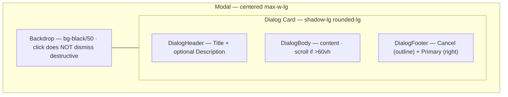
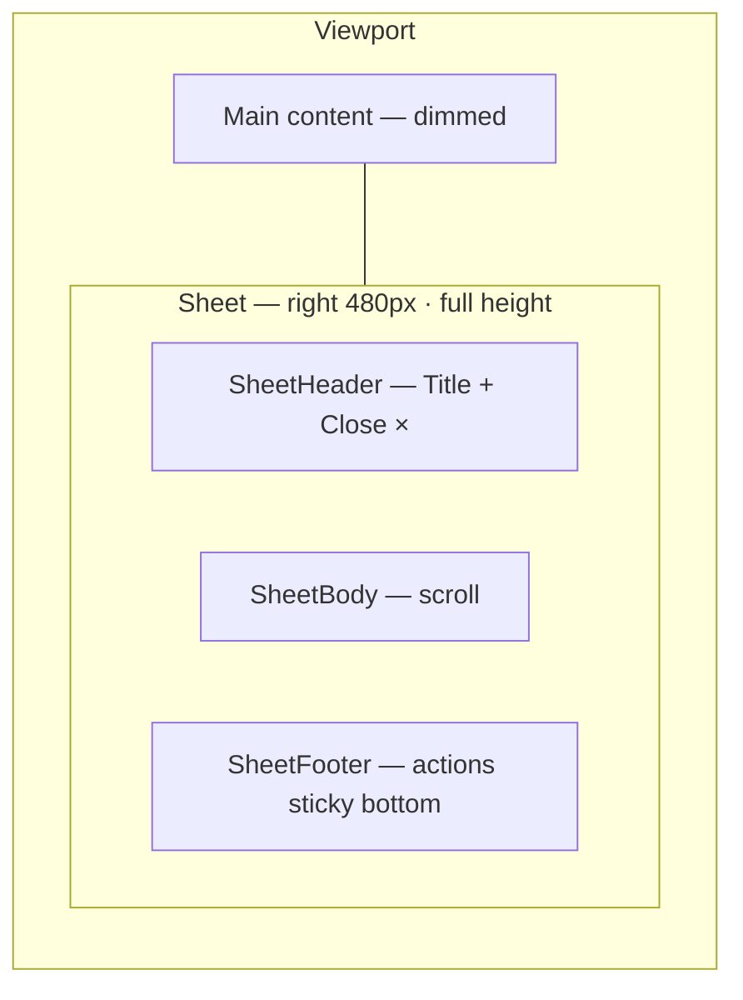
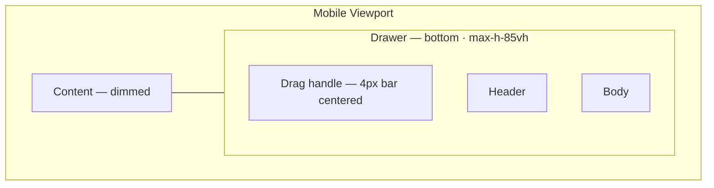
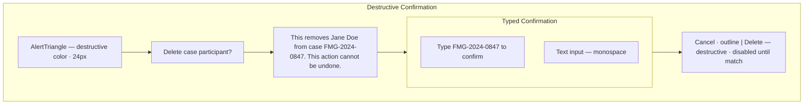
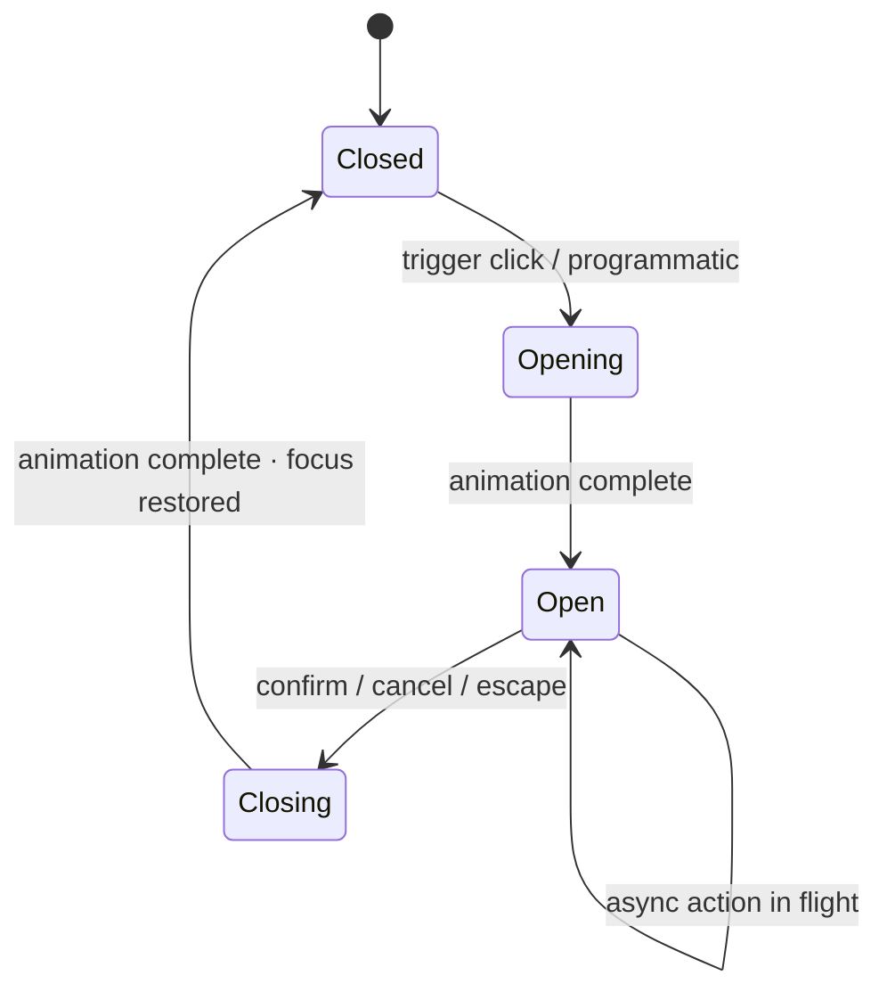
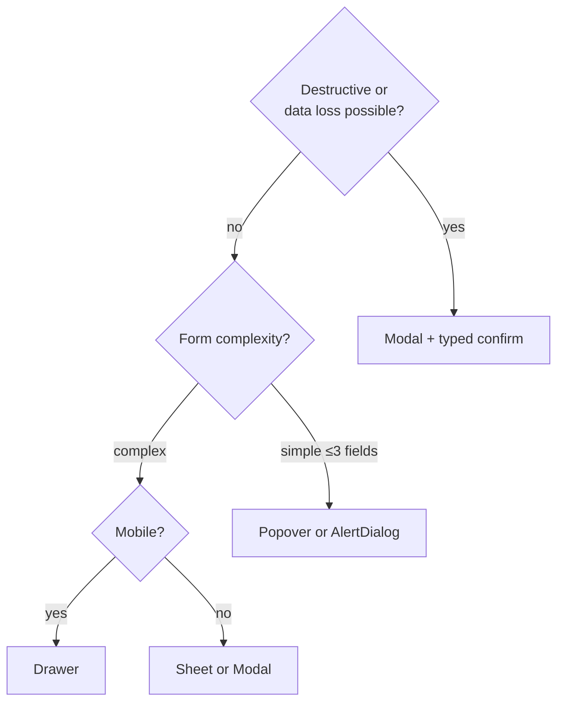
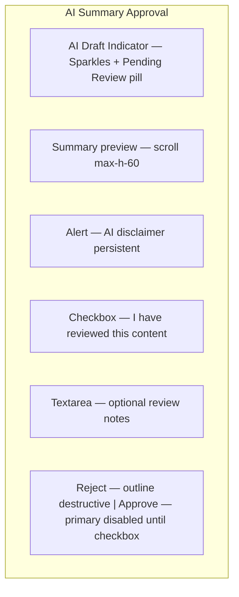
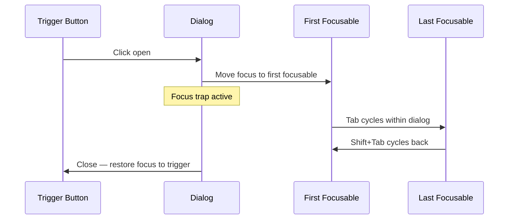
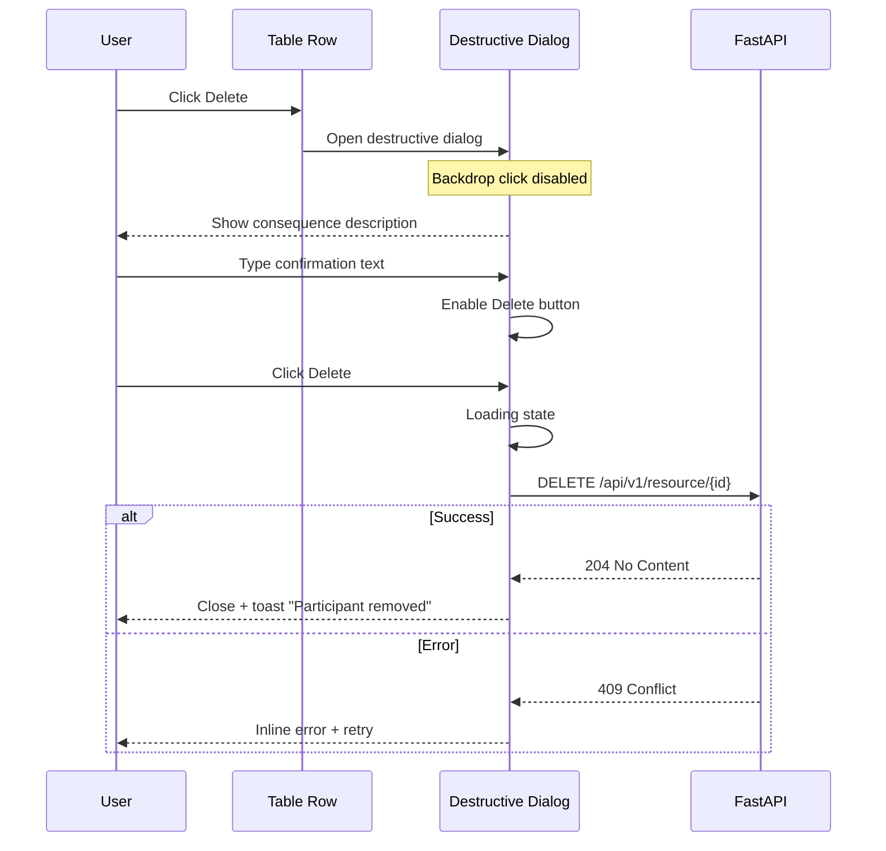

# Dialogs — Modal, Sheet, Drawer & Confirmation Flows

**LexFlow AI** — Overlay & Confirmation Interaction Specifications  
**Version:** 1.0  
**Status:** Draft — Pre-Implementation  
**Last Updated:** 2026-07-06

---

## Purpose

Define **overlay interaction patterns** for LexFlow — modals, sheets, drawers, and confirmation flows for legal operations including destructive actions, AI approval, privilege changes, and workflow cancellation. Overlays protect against accidental data loss in high-stakes legal workflows.

**Reference aesthetic:** GitHub's confirmation dialogs, Stripe's destructive flow, Fluent UI panel patterns, Linear's quick sheets.

---

## Anatomy

### Modal Dialog Wireframe

### Sheet (Side Panel) Wireframe

### Drawer (Mobile Bottom) Wireframe

### Destructive Confirmation Wireframe

---

## States

### Overlay Lifecycle States

| State | Visual | Behavior |
|-------|--------|----------|
| **Closed** | Not in DOM or hidden | Focus on trigger |
| **Opening** | Backdrop fade in 200ms; dialog scale 0.95→1 | Focus trap activates |
| **Open** | Full visibility | Scroll locked on body |
| **Closing** | Reverse animation 150ms | Focus returns to trigger |
| **Loading (in dialog)** | Primary button spinner; form disabled | Dialog stays open |

### Confirmation Dialog States

| State | Primary Button |
|-------|----------------|
| Default | Enabled — label matches action ("Delete", "Approve") |
| Typed confirm required | Disabled until input matches |
| Loading | Spinner + disabled + label preserved |
| Success | Close dialog + toast |
| Error | Inline Alert in dialog body + retry enabled |

### Sheet States

| State | Behavior |
|-------|----------|
| Collapsed | Not visible; main content full width |
| Expanded | 480px right panel; main content visible but dimmed |
| Nested dialog | Sheet remains open; modal overlays sheet (z-index stack) |
| Mobile | Sheet becomes full-screen drawer |

---

## Variants

### Overlay Type Selection Matrix

| Pattern | Component | Width | Use When |
|---------|-----------|-------|----------|
| **Modal** | Dialog | 480px (`max-w-lg`) | Confirmations, create/edit forms ≤8 fields |
| **Large modal** | Dialog | 640px (`max-w-2xl`) | Complex forms, comparison views |
| **Sheet** | Sheet | 480px right | Document metadata, filters, AI review detail |
| **Wide sheet** | Sheet | 640px right | Document preview + metadata |
| **Drawer** | Drawer | 100% width bottom | Mobile actions, quick create |
| **Alert dialog** | AlertDialog | 400px | Simple yes/no — no form content |
| **Popover** | Popover | 320px | Quick edits, date pick — not for destructive |

### Dialog Variants by Legal Workflow

| Dialog | Type | Destructive | Typed Confirm |
|--------|------|-------------|---------------|
| Delete case participant | Modal | Yes | Case number |
| Cancel workflow execution | Modal | Yes | No |
| Revoke client portal access | Modal | Yes | Client email |
| Approve AI summary | Modal | No | No — attorney checkbox only |
| Reject AI summary | Modal | No | Required reason textarea |
| Change confidentiality to privileged | Modal | No | Acknowledgment checkbox |
| Bulk delete documents | Modal | Yes | "DELETE" + count display |
| Create case (quick) | Modal | No | No |
| Unsaved changes | AlertDialog | No | No — Leave / Stay |
| Session timeout warning | AlertDialog | No | No — Extend / Log out |

### Approval Dialog Anatomy

---

## Interaction Specs

### Open & Close Behavior

| Trigger | Opens | Closes |
|---------|-------|--------|
| Button click | Yes | — |
| Escape key | — | Yes — except during async submit |
| Backdrop click | — | Yes for non-destructive; **No** for destructive |
| Cancel button | — | Yes |
| Successful submit | — | Yes + toast |
| Route change | — | Confirm if dirty form |

### Focus Management

| Rule | Spec |
|------|------|
| Initial focus | First input field, or primary action if no inputs |
| Trap | Tab/Shift+Tab cycle within overlay |
| Restore | Focus returns to trigger on close |
| Nested | Only topmost overlay receives focus |
| Screen reader | `role="dialog"` + `aria-modal="true"` + `aria-labelledby` |

### Destructive Action Flow

### Sheet Interaction

| Action | Behavior |
|--------|----------|
| Open | Slide in from right 300ms |
| Close | × button, Escape, or Cancel |
| Resize | Not resizable Phase 1 |
| Scroll | Body scrolls; header/footer sticky |
| Submit | Footer primary action; same validation as modal |

### Stacking Rules

| Scenario | z-index | Behavior |
|----------|---------|----------|
| Single modal | 50 | Standard |
| Sheet + modal | Sheet 40, Modal 50 | Modal overlays sheet |
| Toast + modal | Toast 60 | Toast visible above modal |
| Command palette | 70 | Above all except critical alerts |

---

## Accessibility

| Requirement | Implementation |
|-------------|----------------|
| Role | `role="dialog"` or `role="alertdialog"` for simple confirmations |
| Label | `aria-labelledby` → title; `aria-describedby` → description |
| Modal | `aria-modal="true"` |
| Focus trap | Radix Dialog built-in; verify in tests |
| Escape | Closes non-destructive; documented for destructive |
| Destructive | `role="alertdialog"`; initial focus on Cancel (GitHub pattern) |
| Loading | `aria-busy="true"` on dialog during submit |
| Screen reader | Announce dialog title on open via focus |

Cross-reference: [../../12-ui/accessibility.md](../../12-ui/accessibility.md)

---

## Do / Don't

| Do | Don't |
|----|-------|
| Use AlertDialog for irreversible actions | Single "OK" for delete |
| Require typed confirmation for bulk delete | One-click delete 50 documents |
| Disable backdrop dismiss on destructive | Allow accidental click-out delete |
| Describe consequences in plain language | "Are you sure?" without context |
| Return focus to trigger on close | Leave focus in void |
| Limit to one primary action in footer | Two primary buttons |
| Use sheet for contextual editing | Modal for simple metadata toggle |
| Show AI disclaimer in approval dialog | Approve without review acknowledgment |
| Keep dialog open on submit error | Close and lose user context |
| Use popover for destructive actions | Delete in a popover |

---

## References

| Document | Path |
|----------|------|
| Component library | [component-library.md](./component-library.md) |
| Interactions (focus, motion) | [component-interactions.md](./component-interactions.md) |
| Forms (dialog forms) | [forms.md](./forms.md) |
| Data tables (bulk confirm) | [data-tables.md](./data-tables.md) |
| Human-in-the-loop | [../../07-ai/human-in-the-loop.md](../../07-ai/human-in-the-loop.md) |
| Matter walls | [../../08-security/matter-walls.md](../../08-security/matter-walls.md) |
| WAI-ARIA Alert Dialog | [w3.org/WAI/ARIA/apg/patterns/alertdialog](https://www.w3.org/WAI/ARIA/apg/patterns/alertdialog/) |
