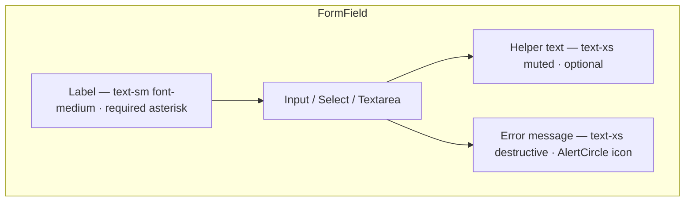
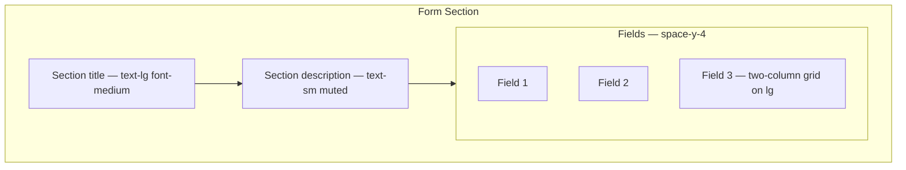
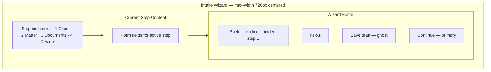
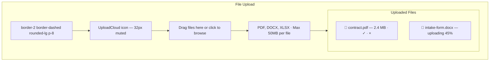
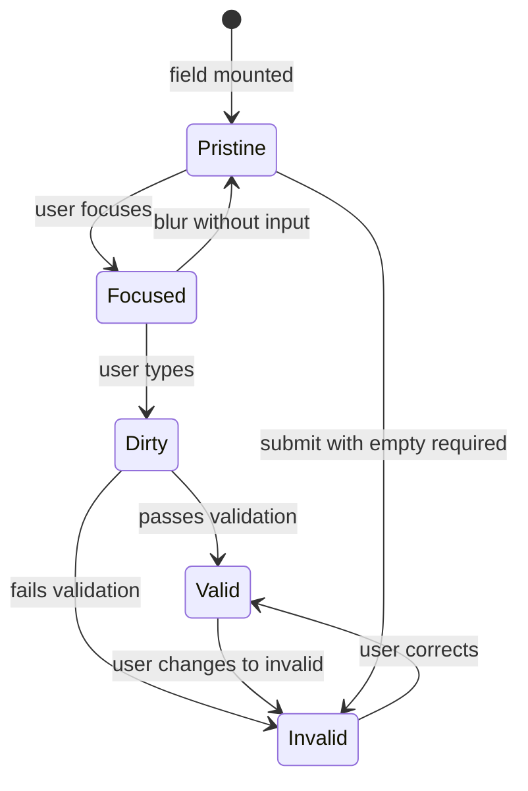
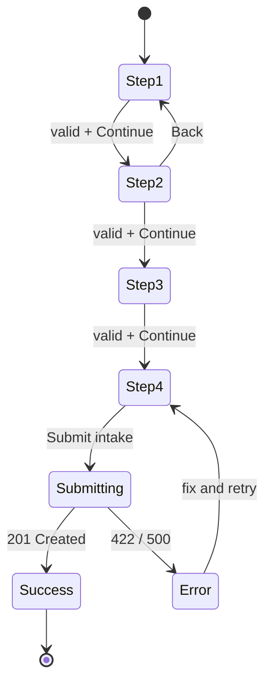
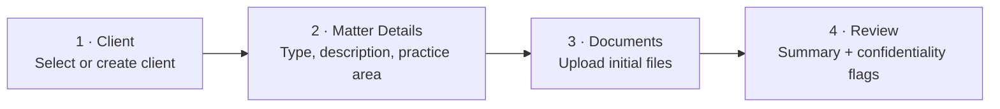
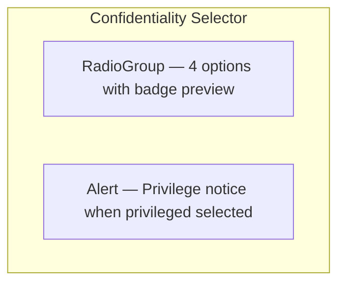
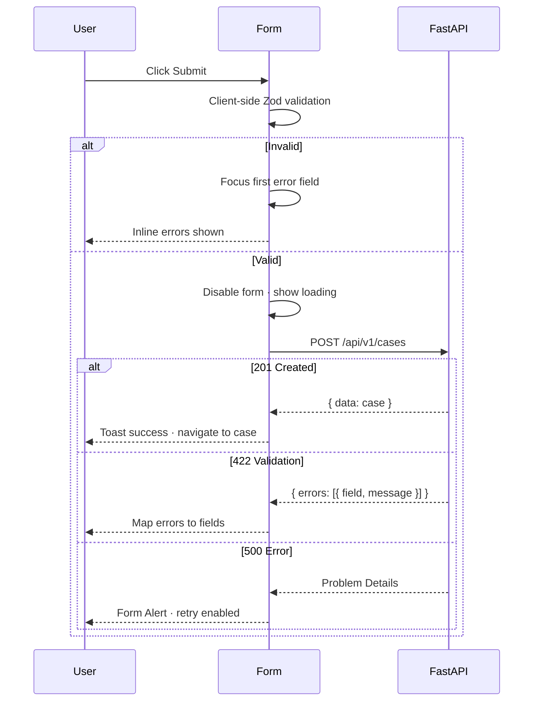

# Forms — Intake, Validation, Wizards & File Upload

**LexFlow AI** — Form Interaction Specifications  
**Version:** 1.0  
**Status:** Draft — Pre-Implementation  
**Last Updated:** 2026-07-06

---

## Purpose

Define **form interaction patterns** for LexFlow legal workflows — case intake, client onboarding, document metadata, AI review submission, and firm settings. Forms align with API DTOs (React Hook Form + Zod), prioritize error prevention for legal data entry, and support multi-step wizards for complex intake.

**Reference aesthetic:** Stripe Checkout clarity, Fluent UI form spacing, Linear's inline validation speed.

---

## Anatomy

### Standard Form Field Wireframe

### Form Section Wireframe

### Multi-Step Intake Wizard Wireframe

### File Upload Drop Zone Wireframe

---

## States

### Field-Level States

| State | Label | Input | Helper/Error |
|-------|-------|-------|--------------|
| **Default** | `foreground` | `border-input` | Helper visible if present |
| **Focus** | unchanged | `ring-2 ring-ring` | unchanged |
| **Filled** | unchanged | value present | unchanged |
| **Required empty (blur)** | unchanged | `border-destructive` | "Required field" |
| **Invalid (validation)** | unchanged | `border-destructive` | Specific error message |
| **Valid (optional)** | unchanged | `border-input` | No green check (avoid noise) |
| **Disabled** | `muted-foreground` | `bg-muted` | hidden |
| **Read-only** | unchanged | `bg-muted/50` no border focus | value displayed |

### Form-Level States

| State | Visual | Behavior |
|-------|--------|----------|
| **Pristine** | Submit disabled or enabled per step rules | No errors shown |
| **Dirty** | Unsaved changes indicator in header | beforeunload warning on navigate |
| **Submitting** | Primary button loading; all fields disabled | `aria-busy` on form |
| **Success** | Toast + redirect or next step | Clear dirty state |
| **Error (server)** | Form-level Alert at top | Field errors mapped from API 422 |
| **Draft saved** | Subtle toast "Draft saved" | Auto-save every 30s on intake |

### Wizard Step States

| State | Step Indicator |
|-------|----------------|
| Completed | Filled circle + checkmark + primary connector line |
| Current | Filled circle + step number + bold label |
| Upcoming | Empty circle + muted label |
| Error | Red circle + step number; error dot on indicator |
| Skipped | Muted with "(skipped)" label — conditional branching only |

### File Upload States

| State | Visual |
|-------|--------|
| Empty | Dashed border drop zone |
| Drag over | Primary dashed border + accent background |
| Uploading | Progress bar per file + cancel button |
| Complete | Green check + file size + remove × |
| Error | Red border + error message + retry |
| Scanning | "Scanning for malware…" — server-side Phase 1 |
| Duplicate | Warning: "File already uploaded" + replace/skip |

---

## Variants

### Form Variants by Use Case

| Variant | Steps | Auto-save | Surfaces |
|---------|-------|-----------|----------|
| `CaseIntakeWizard` | 4 | Yes — draft API | Firm dashboard |
| `QuickCaseForm` | 1 | No | Dashboard modal |
| `ClientOnboardingForm` | 3 | Yes | Client portal |
| `DocumentMetadataForm` | 1 | No | Case workspace sheet |
| `AIReviewSubmitForm` | 1 | No | AI review panel |
| `DeadlineForm` | 1 | No | Inline popover |
| `SettingsForm` | 1 | No | Admin console |
| `ApprovalRejectForm` | 1 | No | Dialog with required reason |

### Intake Wizard Steps — Case Creation

| Step | Required Fields | Conditional |
|------|-----------------|-------------|
| Client | Client selection or new client name + email | New vs existing client toggle |
| Matter | Matter type, short description, practice area | Opposing party if litigation |
| Documents | None required | Confidentiality per file |
| Review | Confirm checkbox | Attorney assignment |

### Validation Timing Variants

| Strategy | When | Used For |
|----------|------|----------|
| **On blur** | Field loses focus | Text inputs, email, phone |
| **On change (debounced 300ms)** | After typing pause | Search-as-you-type fields |
| **On submit** | Form submit click | First pass; then on blur |
| **On step advance** | Wizard Continue click | Step-scoped validation |
| **Real-time** | Every keystroke | Password strength only |

### Confidentiality Field Variant

Per-document and per-case confidentiality selector:

| Option | UI | Default |
|--------|-----|---------|
| Internal | No badge preview | **Default** |
| Attorney-client privileged | Lock badge preview | — |
| Work product | Muted badge preview | — |
| Client visible | Green badge preview | Portal-eligible flag |

---

## Interaction Specs

### Validation UX

| Error Type | Display | Recovery |
|------------|---------|----------|
| Required field | Inline below field on blur or submit | Focus first invalid on submit |
| Format (email, phone) | Inline with example format | — |
| Min/max length | Inline with character count | Show count at 80% of max |
| Cross-field | Inline on second field + form Alert | e.g., end date before start date |
| Server 422 | Map `field` → error message | Preserve user input |
| Server 409 | Form Alert — conflict description | Suggest resolution action |
| Permission denied | Redirect to 404 — not inline error | Matter wall violation |

**Submit behavior:**

### Multi-Step Wizard Navigation

| Action | Behavior |
|--------|----------|
| Continue | Validate current step only; advance if valid |
| Back | No validation; preserve entered data |
| Step indicator click | Jump to completed steps only; not upcoming |
| Save draft | POST partial payload; toast confirmation |
| Cancel | Confirm dialog if dirty |
| Submit (final) | Validate all steps; full payload POST |

### File Upload Interaction

| Action | Behavior |
|--------|----------|
| Click drop zone | Open native file picker |
| Drag files over | Highlight drop zone |
| Drop files | Validate type + size client-side; begin upload |
| Upload | Presigned S3 URL from API; progress bar |
| Remove file | Confirm if upload complete and linked to case |
| Retry failed | Re-attempt same file |

**Accepted types (Phase 1):** PDF, DOCX, DOC, XLSX, XLS, PNG, JPG, TIFF  
**Max size:** 50 MB per file; 500 MB total per batch  
**Legal:** Privilege checkbox required before upload completes on intake step 3

### AI Review Submit Form

| Field | Required | Notes |
|-------|----------|-------|
| Review notes | No | Attorney comments for approval record |
| Confirm AI disclaimer | Yes | Checkbox — "I have reviewed this AI-generated content" |
| Submit for approval | — | Primary button; creates approval record |

Only attorneys see "Approve" directly; paralegals see "Submit for attorney review."

---

## Accessibility

| Requirement | Implementation |
|-------------|----------------|
| Labels | Every input has `<label htmlFor>` or `aria-label` |
| Required | `aria-required="true"` + visual asterisk with `(required)` in label |
| Errors | `aria-invalid="true"` + `aria-describedby` → error id |
| Error summary | Form-level Alert with `role="alert"` on submit fail |
| Wizard steps | `aria-current="step"` on active step |
| Progress | `aria-valuenow` on step indicator |
| File upload | Drop zone `role="button"` + keyboard Enter/Space activation |
| Upload progress | `aria-valuenow` on progress bar |
| Grouping | `fieldset` + `legend` for radio/checkbox groups |
| Focus on error | First invalid field focused on submit |

Cross-reference: [../../12-ui/accessibility.md](../../12-ui/accessibility.md)

---

## Do / Don't

| Do | Don't |
|----|-------|
| Align Zod schema with OpenAPI DTO | Invent client-only validation rules |
| Show specific error messages | "Invalid input" without context |
| Preserve form data on server error | Clear form on 422 |
| Auto-save intake drafts | Auto-save settings without explicit save |
| Confirm before losing dirty wizard | Silent discard on Cancel |
| Require privilege acknowledgment on upload | Default to privileged without user action |
| Focus first invalid field on submit | Scroll to top only without focus |
| Show character count near max | Hide limit until exceeded |
| Disable submit during mutation | Allow double-submit |
| Map API field names to form paths | Show raw API error keys to user |

---

## References

| Document | Path |
|----------|------|
| Component library | [component-library.md](./component-library.md) |
| Interactions | [component-interactions.md](./component-interactions.md) |
| Dialogs (confirm cancel) | [dialogs.md](./dialogs.md) |
| Case aggregate | [../../02-domain/case-aggregate.md](../../02-domain/case-aggregate.md) |
| Documents API | [../../04-api/endpoints-documents.md](../../04-api/endpoints-documents.md) |
| Human-in-the-loop | [../../07-ai/human-in-the-loop.md](../../07-ai/human-in-the-loop.md) |
| Client portal forms | [../../12-ui/client-portal.md](../../12-ui/client-portal.md) |
