# Notifications — Toast, In-App, Bell & Teams Integration

**LexFlow AI** — Notification Interaction Specifications  
**Version:** 1.0  
**Status:** Draft — Pre-Implementation  
**Last Updated:** 2026-07-06

---

## Purpose

Define **notification interaction patterns** for LexFlow — transient toasts, persistent in-app notifications, the top-nav bell feed, and Microsoft Teams integration status indicators. Notifications keep attorneys and paralegals informed of workflow completion, approval requests, deadlines, and async AI job results without disrupting legal work.

**Reference aesthetic:** GitHub notification bell, Linear's subtle toasts, Stripe's success/error feedback, Fluent UI message bar for persistent alerts.

---

## Anatomy

### Toast Notification Wireframe

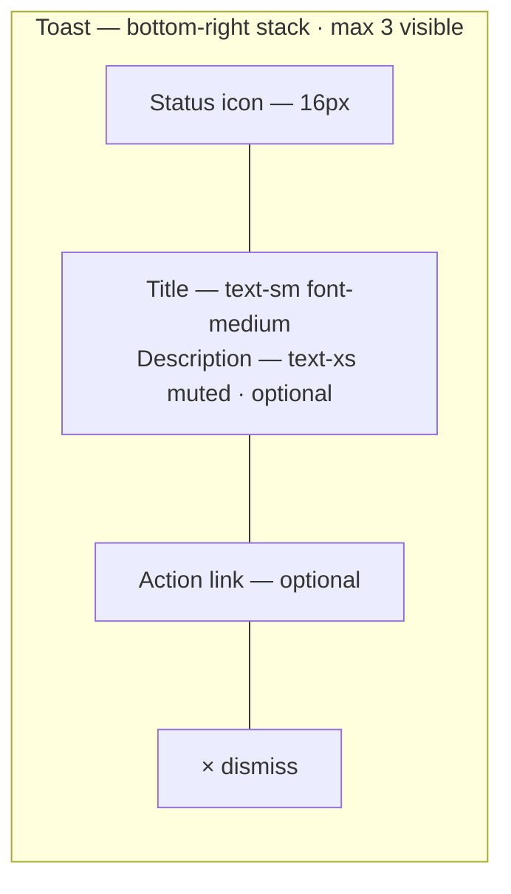

### Notification Bell Wireframe

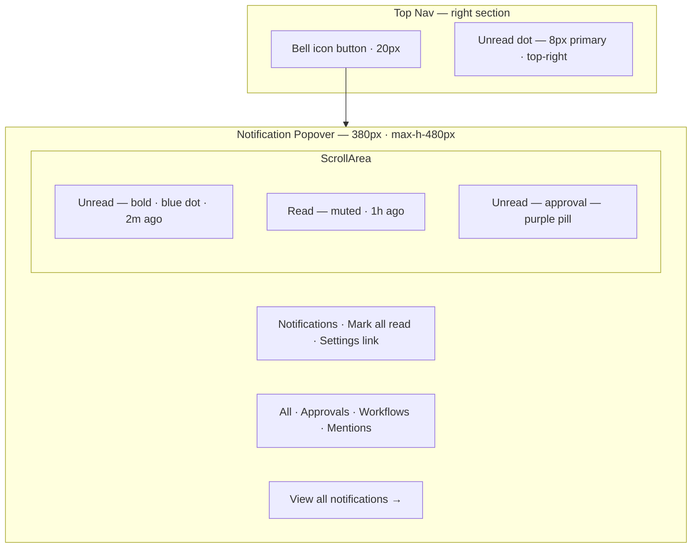

### In-App Notification Item Wireframe

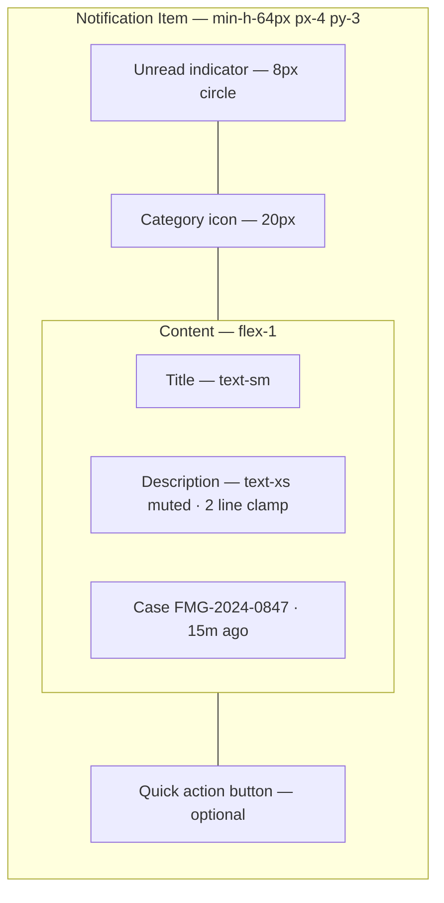

### Teams Integration Status Wireframe

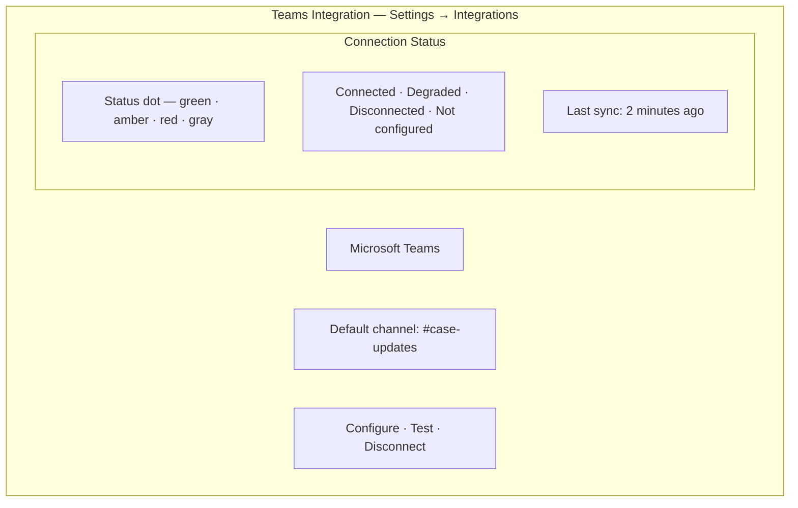

### Full Notifications Page Wireframe

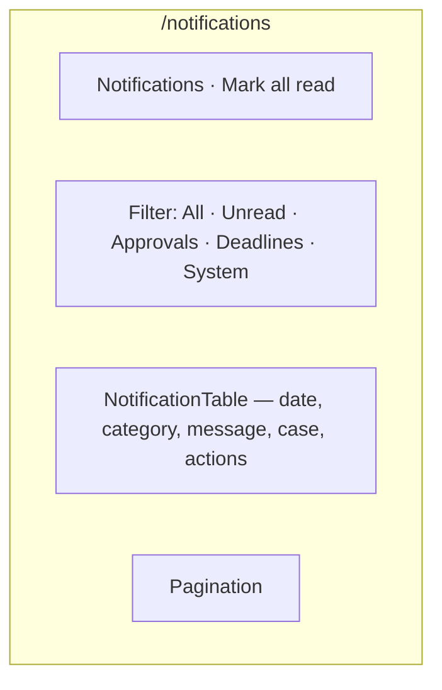

---

## States

### Toast States

| State | Icon | Duration | Dismiss |
|-------|------|----------|---------|
| **Success** | CheckCircle — green | 5s auto | × or swipe |
| **Error** | AlertCircle — red | Persistent until dismissed | × required |
| **Warning** | AlertTriangle — amber | 8s auto | × or swipe |
| **Info** | Info — blue | 5s auto | × or swipe |
| **Loading** | Loader2 — spin | Until resolve | Not dismissible |
| **Action** | Context icon | 8s auto | × or action click |

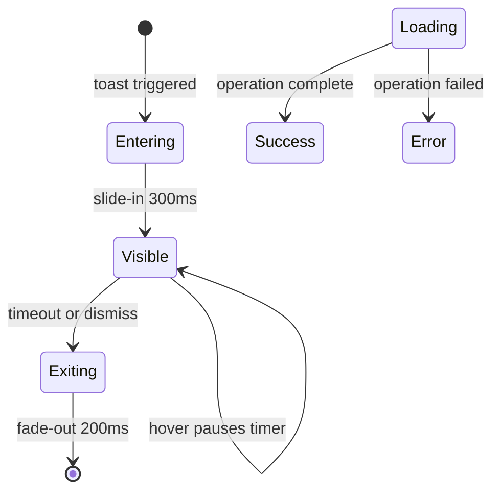

**Rule:** Toasts are for **transient feedback** — never for critical legal confirmations. Use [dialogs.md](./dialogs.md) for approve/reject/delete.

### Notification Item States

| State | Visual | Behavior |
|-------|--------|----------|
| **Unread** | Bold title + blue dot | Click marks read + navigates |
| **Read** | Normal weight + no dot | Click navigates only |
| **Archived** | Hidden from default views | Restorable from settings |
| **Expired** | Removed after 90 days | Configurable firm retention |

### Bell Icon States

| State | Visual |
|-------|--------|
| No unread | Bell icon only |
| Unread (1–9) | Blue dot overlay |
| Unread (10+) | Blue dot + "9+" badge |
| Popover open | `bg-accent` on bell button |
| Real-time update | Dot appears without page refresh (SSE) |

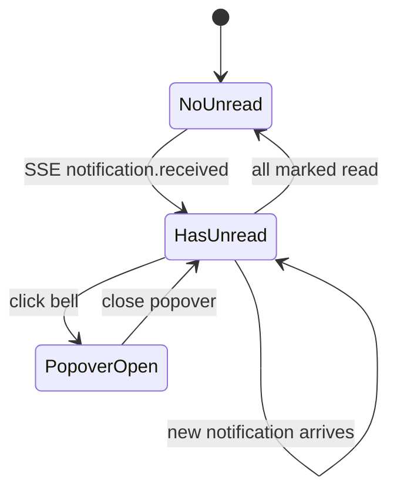

### Teams Integration States

| State | Dot Color | Label | User Action |
|-------|-----------|-------|-------------|
| **Connected** | Green `#047857` | Connected | None |
| **Degraded** | Amber `#B45309` | Degraded — delays detected | View details |
| **Disconnected** | Red `#B91C1C` | Disconnected | Reconnect |
| **Not configured** | Gray `#71717A` | Not configured | Configure |
| **Syncing** | Blue pulse | Syncing… | Wait |
| **Error** | Red | Error — permissions revoked | Re-authorize |

---

## Variants

### Notification Categories

| Category | Icon | Color accent | Typical Events |
|----------|------|--------------|----------------|
| **Approval** | ShieldCheck | Purple `status-approval` | AI summary pending, document approval |
| **Workflow** | GitBranch | Blue `status-info` | Workflow completed, failed, cancelled |
| **Deadline** | Clock | Urgency-scaled | Overdue, due today, reminder |
| **Document** | FileText | Neutral | Upload complete, OCR ready |
| **AI** | Sparkles | Purple | AI job complete, draft ready for review |
| **Mention** | AtSign | Primary | @mention in case notes (Phase 2) |
| **System** | Settings | Neutral | Maintenance, integration status |
| **Client portal** | Users | Green | Client uploaded document |

### Toast vs In-App vs Email Routing

| Event | Toast | In-app | Email | Teams |
|-------|-------|--------|-------|-------|
| AI job complete | Yes | Yes | User pref | No |
| Approval required | No | Yes | Yes — attorney | Yes — if configured |
| Workflow failed | Yes | Yes | Ops pref | Yes |
| Deadline overdue | No | Yes | Yes | Optional |
| Document uploaded | Yes | Yes | No | No |
| Bulk action complete | Yes | Yes | No | No |
| Teams disconnected | No | Yes — system | Admin | — |

### Deadline Notification Urgency Variants

| Urgency | Title prefix | Chip color | Icon |
|---------|--------------|------------|------|
| Overdue | "Overdue:" | Red | AlertTriangle |
| Due today | "Due today:" | Amber | Clock |
| Due tomorrow | "Due tomorrow:" | Neutral | Calendar |
| Reminder (7d) | "Upcoming:" | Muted | Calendar |

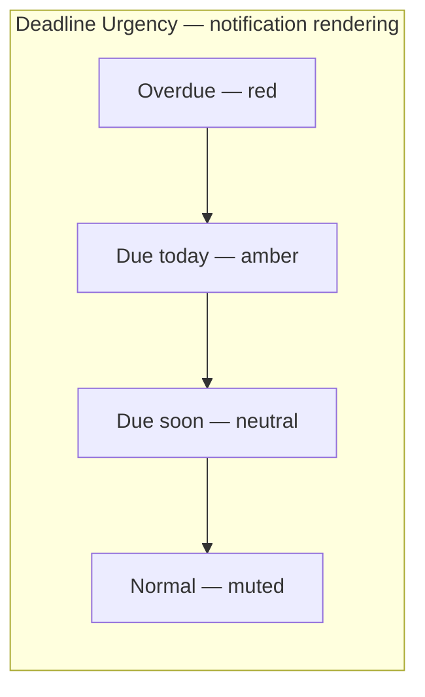

### Approval Notification Variant

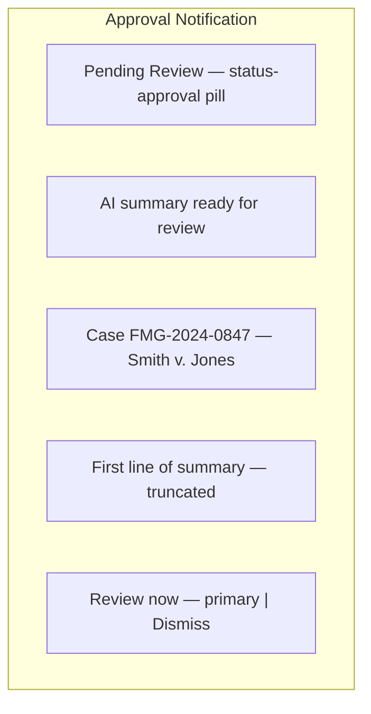

Attorneys see "Review now" → opens approval dialog.  
Paralegals see "View status" → read-only AI draft panel.

---

## Interaction Specs

### Toast Behavior

| Action | Behavior |
|--------|----------|
| Appear | Stack bottom-right; push existing up |
| Max visible | 3; oldest dismissed when 4th arrives |
| Hover | Pause auto-dismiss timer |
| Click action link | Navigate + dismiss toast |
| Click × | Dismiss immediately |
| Swipe right (mobile) | Dismiss |
| Duplicate suppression | Same message within 5s ignored |

### Bell Popover Behavior

| Action | Behavior |
|--------|----------|
| Click bell | Toggle popover |
| Click outside | Close popover |
| Click notification | Mark read + navigate to resource + close |
| Mark all read | PATCH API; dot clears |
| Tab switch | Filter list client-side; no refetch |
| Scroll to bottom | Load more (cursor pagination) |
| Real-time | SSE prepends new item + increment badge |

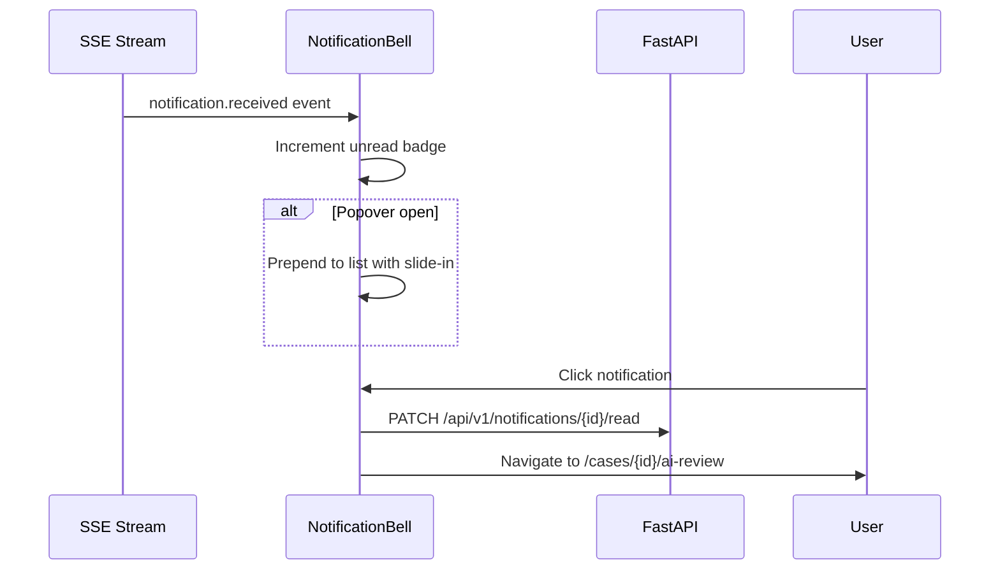

### In-App Notification Actions

| Action | Behavior |
|--------|----------|
| Primary quick action | Context-specific — "Approve", "View", "Retry" |
| Dismiss / archive | Swipe or × ; removes from active list |
| Mark unread | Available on full notifications page |
| Batch mark read | Checkbox selection on notifications page |

### Teams Integration Interaction

| Action | Behavior |
|--------|----------|
| Configure | OAuth flow → Microsoft Entra ID |
| Test | Send test message to default channel; toast result |
| Disconnect | Confirm dialog → revoke tokens |
| Channel picker | Dropdown of Teams channels post-connect |
| Status refresh | Manual refresh + auto every 5 min |
| Degraded detail | Sheet with last 5 delivery failures |

**Teams message format (orchestrated by n8n, displayed status in UI):**

| Field | Source |
|-------|--------|
| Connection status | API health check |
| Last successful delivery | Notification delivery log |
| Failed count (24h) | Metrics endpoint |
| Default channel | Firm settings |

### Real-Time Delivery Architecture

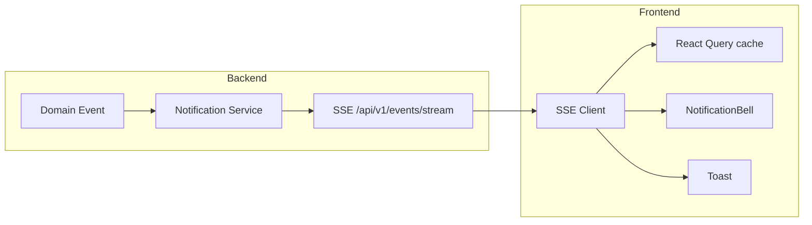

Cross-reference: [../../12-ui/real-time-updates.md](../../12-ui/real-time-updates.md)

---

## Accessibility

| Requirement | Implementation |
|-------------|----------------|
| Toast | `role="status"` for info/success; `role="alert"` for error |
| Toast | Not focus-trapped; action link is focusable |
| Bell | `aria-label="Notifications, 3 unread"` — count updates |
| Popover | `aria-expanded` on bell button |
| List | `role="list"` + `role="listitem"` per notification |
| Unread | `aria-label="Unread"` on dot — not color alone |
| Mark all read | Button with clear label |
| Real-time | `aria-live="polite"` on unread count |
| Teams status | Status text + icon — not dot color alone |
| Keyboard | Arrow keys navigate notification list in popover |

Cross-reference: [../../12-ui/accessibility.md](../../12-ui/accessibility.md)

---

## Do / Don't

| Do | Don't |
|----|-------|
| Use toast for "Saved" and async completion | Use toast for "Delete 50 cases?" confirmation |
| Persist approval notifications until acted | Auto-dismiss approval toasts |
| Update bell badge via SSE | Require page refresh for unread count |
| Show case number in notification metadata | Generic "Something happened" |
| Route attorneys to approval dialog | Show approve button to unauthorized roles |
| Suppress duplicate toasts within 5s | Stack 10 identical "Saved" toasts |
| Use urgency colors for deadline notifications | Same styling for overdue and FYI |
| Show Teams degraded status proactively | Silent message delivery failures |
| Allow mark-all-read | Force individual dismiss only |
| Respect user notification preferences | Email every event to everyone |

---

## References

| Document | Path |
|----------|------|
| Component library | [component-library.md](./component-library.md) |
| Interactions | [component-interactions.md](./component-interactions.md) |
| Dialogs (approval flow) | [dialogs.md](./dialogs.md) |
| Real-time updates | [../../12-ui/real-time-updates.md](../../12-ui/real-time-updates.md) |
| Human-in-the-loop | [../../07-ai/human-in-the-loop.md](../../07-ai/human-in-the-loop.md) |
| Workflow webhooks | [../../06-workflows/webhook-contracts.md](../../06-workflows/webhook-contracts.md) |
| Data tables (notifications page) | [data-tables.md](./data-tables.md) |
| Design tokens | [../../12-ui/design-system.md](../../12-ui/design-system.md) |
