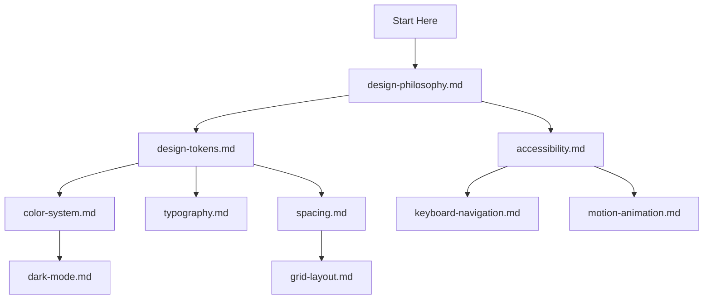

# Design System Foundation

**LexFlow AI** — Design System Foundation Index  
**Version:** 1.0  
**Status:** Draft — Pre-Implementation  
**Last Updated:** 2026-07-06

---

## Purpose

This directory contains **foundational design system documentation** for LexFlow AI — philosophy, tokens, color, typography, spacing, layout, dark mode, accessibility, keyboard navigation, and motion. These documents define the visual language before component implementation.

**Relationship to `12-ui/`:** Foundation docs (`16-design-system/foundation/`) specify *what* and *why*; [../../12-ui/design-system.md](../../12-ui/design-system.md) specifies *how* to implement in Tailwind/ShadCN.

---

## Document Index

| # | Document | Description |
|---|----------|-------------|
| 1 | [design-philosophy.md](./design-philosophy.md) | Trust, clarity, density; M365/Azure/Linear comparison |
| 2 | [design-tokens.md](./design-tokens.md) | Three-tier token architecture, semantic naming |
| 3 | [color-system.md](./color-system.md) | Light/dark palettes, status, confidentiality colors |
| 4 | [typography.md](./typography.md) | Type scale, Inter/Segoe UI, legal document readability |
| 5 | [spacing.md](./spacing.md) | 4px base grid, component spacing, density modes |
| 6 | [grid-layout.md](./grid-layout.md) | 12-column grid, app shell, sidebar widths |
| 7 | [dark-mode.md](./dark-mode.md) | Dark theme tokens, usage, legal context |
| 8 | [accessibility.md](./accessibility.md) | WCAG 2.1 AA, legal industry requirements |
| 9 | [keyboard-navigation.md](./keyboard-navigation.md) | Shortcuts, focus order, command palette |
| 10 | [motion-animation.md](./motion-animation.md) | Duration, easing, reduced motion |

---

## Reading Order

---

## References

| Document | Path |
|----------|------|
| Design system index | [../README.md](../README.md) |
| UI implementation | [../../12-ui/design-system.md](../../12-ui/design-system.md) |
| Product vision | [../../01-product/vision.md](../../01-product/vision.md) |
| User personas | [../../01-product/user-personas.md](../../01-product/user-personas.md) |
