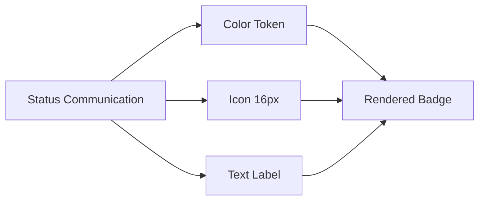
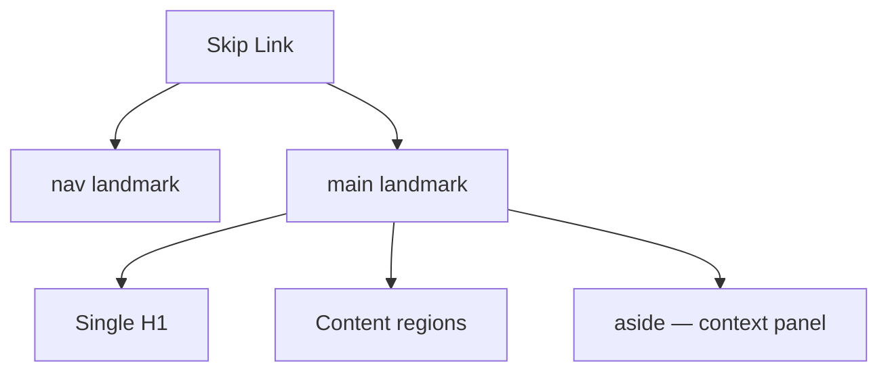

# Accessibility — WCAG 2.1 AA & Legal Industry Requirements

**LexFlow AI** — Design System Foundation  
**Version:** 1.0  
**Status:** Draft — Pre-Implementation  
**Last Updated:** 2026-07-06

---

## Purpose

Define **accessibility requirements** at the design system foundation level for LexFlow AI — WCAG 2.1 Level AA compliance, legal industry-specific constraints, and inclusive design patterns for attorneys, paralegals, and client portal users. Accessibility is a **design constraint**, not an implementation afterthought.

This document complements [../../12-ui/accessibility.md](../../12-ui/accessibility.md) with foundation-level token, layout, and pattern requirements.

---

## Scope

| In Scope | Out of Scope |
|----------|--------------|
| WCAG 2.1 AA success criteria mapping | ADA legal compliance interpretation |
| Design token accessibility requirements | PDF/Word output accessibility |
| Color, typography, motion accessibility floors | Third-party widget audits (Phase 2) |
| Legal industry long-session requirements | VPAT document authoring (Phase 2) |
| Keyboard and screen reader design patterns | Assistive technology certification |

Cross-reference: Keyboard patterns in [keyboard-navigation.md](./keyboard-navigation.md), motion in [motion-animation.md](./motion-animation.md).

---

## Design Principles

1. **Inclusive by default** — Every foundation token and pattern meets AA without special modes.
2. **Never color alone** — Status, confidentiality, and errors always include icon + text.
3. **Keyboard parity** — If a mouse can do it, keyboard must too.
4. **Error prevention for legal actions** — WCAG 3.3.4 confirmations for irreversible operations.
5. **Long-session comfort** — Typography, spacing, and motion reduce fatigue over 8+ hours.
6. **Procurement-ready** — Design decisions documented for future VPAT 2.5 (Phase 2).

---

## WCAG 2.1 AA — Foundation Mapping

### Perceivable

| Criterion | Foundation Requirement | Document |
|-----------|------------------------|----------|
| **1.1.1 Non-text Content** | Icons with meaning require text alternative or `aria-label` | [color-system.md](./color-system.md) |
| **1.3.1 Info and Relationships** | Heading hierarchy in [typography.md](./typography.md); landmark layout in [grid-layout.md](./grid-layout.md) | Both |
| **1.4.1 Use of Color** | Status triad: color + icon + text | [color-system.md](./color-system.md) |
| **1.4.3 Contrast (Minimum)** | 4.5:1 body text; 3:1 large text/UI | [color-system.md](./color-system.md) |
| **1.4.4 Resize Text** | Relative `rem` units in type scale | [typography.md](./typography.md) |
| **1.4.10 Reflow** | 12-col grid collapses at 320px | [grid-layout.md](./grid-layout.md) |
| **1.4.11 Non-text Contrast** | Focus ring, borders ≥ 3:1 | [design-tokens.md](./design-tokens.md) |
| **1.4.12 Text Spacing** | Line height ≥ 1.5 body | [typography.md](./typography.md) |
| **1.4.13 Content on Hover/Focus** | Tooltip dismiss via ESC | [keyboard-navigation.md](./keyboard-navigation.md) |

### Operable

| Criterion | Foundation Requirement | Document |
|-----------|------------------------|----------|
| **2.1.1 Keyboard** | Full keyboard spec | [keyboard-navigation.md](./keyboard-navigation.md) |
| **2.1.2 No Keyboard Trap** | Modal focus trap with ESC exit | [keyboard-navigation.md](./keyboard-navigation.md) |
| **2.1.4 Character Key Shortcuts** | Modifier required for shortcuts | [keyboard-navigation.md](./keyboard-navigation.md) |
| **2.4.1 Bypass Blocks** | Skip to main content link | [grid-layout.md](./grid-layout.md) |
| **2.4.7 Focus Visible** | `ring-2 ring-ring ring-offset-2` | [design-tokens.md](./design-tokens.md) |
| **2.5.5 Target Size** | 44×44px portal; 36×36px firm minimum | [spacing.md](./spacing.md) |

### Understandable

| Criterion | Foundation Requirement |
|-----------|------------------------|
| **3.3.1 Error Identification** | Inline errors + form summary |
| **3.3.4 Error Prevention (Legal)** | Confirmation dialogs for AI approval, delete, workflow cancel |

### Robust

| Criterion | Foundation Requirement |
|-----------|------------------------|
| **4.1.2 Name, Role, Value** | Radix/ShadCN primitives; custom widgets follow WAI-ARIA APG |
| **4.1.3 Status Messages** | `aria-live` for async updates |

---

## Legal Industry Requirements

Cross-reference: [../../01-product/user-personas.md](../../01-product/user-personas.md), [../../01-product/vision.md](../../01-product/vision.md)

### Long-Session Usability (6–10 Hours)

| Requirement | Foundation Spec |
|-------------|-----------------|
| Eye strain reduction | Warm off-white `#FAFAFA` background — [color-system.md](./color-system.md) |
| Readable body text | 14px firm / 16px portal minimum — [typography.md](./typography.md) |
| Motion fatigue | `prefers-reduced-motion` — [motion-animation.md](./motion-animation.md) |
| Density option | Compact mode without breaking contrast — [spacing.md](./spacing.md) |
| Dark mode option | Phase 3 — [dark-mode.md](./dark-mode.md) |

### Professional Responsibility UX

| Scenario | Accessible Pattern |
|----------|-------------------|
| AI-generated content | Region label: "AI generated summary — requires attorney review" |
| Privileged documents | `aria-label="Attorney-client privileged document"` |
| Matter wall denial | Generic 404 page with clear text — no silent redirect |
| Approval actions | Confirmation dialog with logged action description |
| Client vs internal | Badge text readable by screen reader |

### Procurement Expectations (Phase 2)

| Deliverable | Foundation Support |
|-------------|-------------------|
| VPAT 2.5 INT | Token contrast tables documented |
| Accessibility statement | WCAG 2.1 AA target declared |
| Keyboard documentation | [keyboard-navigation.md](./keyboard-navigation.md) |
| High-contrast mode | Phase 3 token extension |

---

## Foundation Token Accessibility Requirements

### Color Contrast Minimums

| Pair Type | Minimum Ratio | Validation |
|-----------|---------------|--------------|
| Body text on background | 4.5:1 | Required before token merge |
| Large text (≥18px / 14px bold) | 3:1 | Required |
| UI component boundaries | 3:1 | Focus ring, input borders |
| Status badge foreground on bg | 4.5:1 | All status tokens |
| Disabled text | No minimum (exempt) but must not convey sole meaning |

### Focus Indicator Spec

| Property | Value |
|----------|-------|
| Width | 2px |
| Color | `color.ring` (`#1E3A5F` light / `#4A9EFF` dark) |
| Offset | 2px (`ring-offset-2`) |
| Style | Solid outline via Tailwind `ring` |
| Visibility | `:focus-visible` only — not on mouse click |

### Typography Accessibility Floors

| Surface | Minimum Size | Maximum Line Length |
|---------|--------------|---------------------|
| Firm body | 14px | 80 characters (prose) |
| Portal body | 16px | 75 characters |
| Metadata | 12px | — |
| Document preview | 14px (zoomable) | 65–75 characters |

---

## Component Pattern Requirements

### Status Indicators



**Never ship:** color-only dot, icon-only badge, or tooltip-only status.

### Forms

| Element | Requirement |
|---------|-------------|
| Labels | Visible, linked via `htmlFor` — never placeholder-only |
| Required | `aria-required="true"` + visual indicator |
| Errors | `aria-describedby` linking to error message |
| Submit failure | Error summary at top with `role="alert"` |

### Data Tables

| Feature | Requirement |
|---------|-------------|
| Structure | Native `<table>`, `<caption>`, `<th scope>` |
| Sort | `aria-sort` on active column header |
| Selection | Checkbox `aria-label="Select case {title}"` |
| Pagination | "Page 2 of 15" visible text |

### Modals

| Feature | Requirement |
|---------|-------------|
| Focus | Trapped while open; ESC closes |
| Return | Focus returns to trigger on close |
| Title | Required `DialogTitle` for screen reader |
| Scroll | Body scroll locked; modal content scrollable |

---

## Assistive Technology Support Matrix

| Technology | Priority | Foundation Concern |
|------------|----------|-------------------|
| NVDA (Windows) | P0 | Table semantics, live regions |
| JAWS (Windows) | P0 | Dialog focus management |
| VoiceOver (macOS) | P0 | Landmark navigation, tabs |
| VoiceOver (iOS) | P1 | Portal touch targets |
| Keyboard only | P0 | All patterns in keyboard doc |
| Windows High Contrast | P1 | Phase 3 high-contrast tokens |
| Zoom 200% | P0 | Grid reflow, relative units |

---

## Wireframes

### Skip Link & Landmark Structure

```
[Skip to main content]  ← first focusable, visually hidden until focused
┌─────────────────────────────────────────────────────────────┐
│  <header> TOP NAV                                           │
├──────────┬──────────────────────────────────────────────────┤
│ <nav>    │  <main id="main-content">                        │
│ SIDEBAR  │    <h1> Page Title                               │
│          │    ... content ...                               │
│          │  </main>                                         │
│          │  <aside> CONTEXT PANEL (optional) </aside>       │
└──────────┴──────────────────────────────────────────────────┘
```



### Focus Visible Pattern

```
Default:     [  Button  ]

Focus-visible:
    ┌─────────────────┐
    │ ╔═══════════════╗ │  ← 2px offset
    │ ║   Button      ║ │  ← 2px ring (primary blue)
    │ ╚═══════════════╝ │
    └─────────────────┘
```

### Legal Confirmation Dialog (WCAG 3.3.4)

```
┌─────────────────────────────────────────────┐
│  Approve AI Summary                      [X]│
│  ───────────────────────────────────────────│
│  You are approving this AI-generated        │
│  content for use on Smith v. Jones.         │
│  This action is logged.                     │
│                                             │
│              [Cancel]  [Approve ✓]          │
└─────────────────────────────────────────────┘
         ↑                        ↑
    focus trap              primary action
    ESC closes              Enter activates
```

---

## Best Practices

1. **Design tokens first** — If it fails contrast in foundation docs, it doesn't ship.
2. **Test with assistive tech** — axe-core catches ~30%; manual SR testing required.
3. **Keyboard walkthrough every release** — Approval workflow, case create, document upload.
4. **Announce async changes** — SSE workflow completion uses `aria-live="polite"`.
5. **Confirm legal actions** — Dialog, not toast, for irreversible operations.
6. **Portal accessibility** — External users may have diverse abilities; 16px base, 44px targets.
7. **Document in PRs** — Note accessibility testing performed.

---

## Accessibility Notes

This document IS the accessibility foundation. Key cross-links:

- **Color** — Never color-alone; all pairs in [color-system.md](./color-system.md) validated
- **Motion** — `prefers-reduced-motion` in [motion-animation.md](./motion-animation.md)
- **Keyboard** — Full spec in [keyboard-navigation.md](./keyboard-navigation.md)
- **Implementation** — Component patterns in [../../12-ui/accessibility.md](../../12-ui/accessibility.md)
- **Security UX** — Matter walls in [../../08-security/matter-walls.md](../../08-security/matter-walls.md)

---

## References

### LexFlow Documentation

| Document | Path |
|----------|------|
| Keyboard navigation | [keyboard-navigation.md](./keyboard-navigation.md) |
| Motion & animation | [motion-animation.md](./motion-animation.md) |
| Color system | [color-system.md](./color-system.md) |
| Typography | [typography.md](./typography.md) |
| UI accessibility | [../../12-ui/accessibility.md](../../12-ui/accessibility.md) |
| UI design system | [../../12-ui/design-system.md](../../12-ui/design-system.md) |
| Matter walls | [../../08-security/matter-walls.md](../../08-security/matter-walls.md) |
| User personas | [../../01-product/user-personas.md](../../01-product/user-personas.md) |
| NFR requirements | [../../03-architecture/nfr-requirements.md](../../03-architecture/nfr-requirements.md) |

### External Standards

- [WCAG 2.1](https://www.w3.org/TR/WCAG21/)
- [WAI-ARIA Authoring Practices 1.2](https://www.w3.org/WAI/ARIA/apg/)
- [Section 508](https://www.section508.gov/)
- [VPAT 2.5 INT](https://www.itic.org/policy/accessibility/vpat)
- [Microsoft Fluent Accessibility](https://fluent2.microsoft.design/accessibility)
